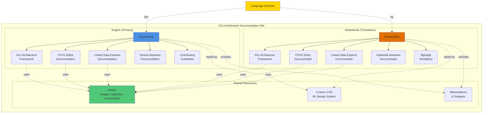
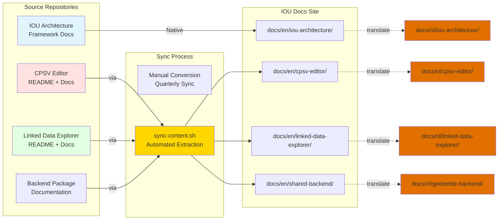
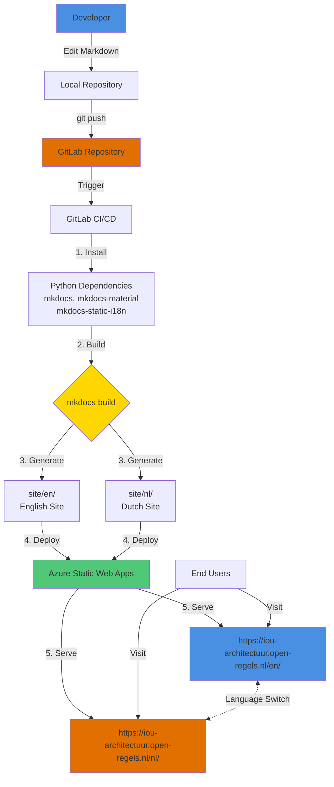
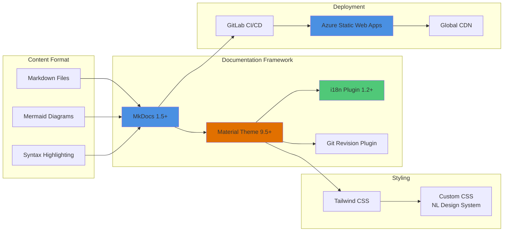
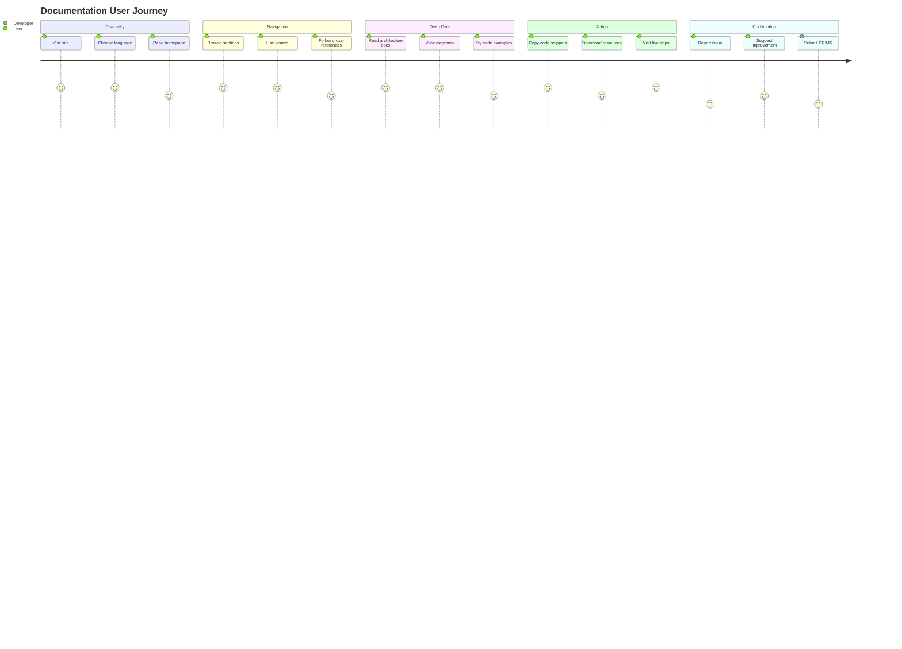

# Documentation Architecture Diagram

## Overview



## Content Sources



## Build & Deploy Pipeline



## Navigation Structure

```
IOU Architecture Docs
│
├── 🇬🇧 English (/en/)
│   ├── 📖 Home
│   ├── 🏗️ IOU Architecture
│   │   ├── Framework Overview
│   │   ├── Ontological Architecture (Part 1)
│   │   ├── Implementation Architecture (Part 2)
│   │   ├── Roadmap & Evaluation (Part 3)
│   │   └── Deployment Guide
│   ├── ✏️ CPSV Editor
│   │   ├── Introduction
│   │   ├── Features
│   │   ├── 👤 User Guide
│   │   │   ├── Getting Started
│   │   │   ├── Service Definition
│   │   │   ├── Rules & Parameters
│   │   │   ├── DMN Integration
│   │   │   └── Import & Export
│   │   └── 🔧 Technical
│   │       ├── Architecture
│   │       ├── Standards Compliance
│   │       ├── Field Mapping
│   │       └── Development
│   ├── 🔍 Linked Data Explorer
│   │   ├── Introduction
│   │   ├── Features
│   │   ├── 👤 User Guide
│   │   │   ├── Getting Started
│   │   │   ├── SPARQL Queries
│   │   │   ├── DMN Orchestration
│   │   │   └── Chain Building
│   │   └── 🔧 Technical
│   │       ├── Architecture
│   │       ├── API Reference
│   │       └── Development
│   ├── 🔗 Shared Backend
│   │   ├── Overview
│   │   ├── API Documentation
│   │   ├── TriplyDB Integration
│   │   ├── Operaton Integration
│   │   └── Deployment
│   └── 🤝 Contributing
│       ├── How to Contribute
│       ├── Documentation Guide
│       └── Code Standards
│
└── 🇳🇱 Nederlands (/nl/)
    └── (Same structure, translated)
```

## Technology Stack



## User Journey



---

**Diagram Version**: 1.0  
**Last Updated**: January 2026
