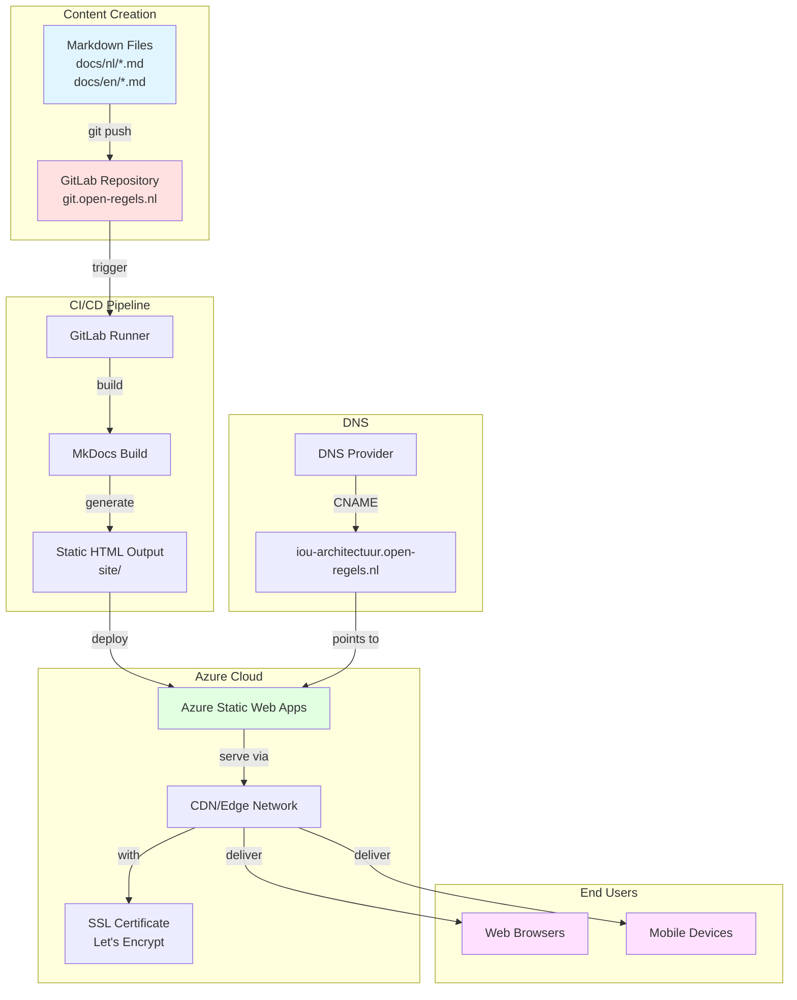
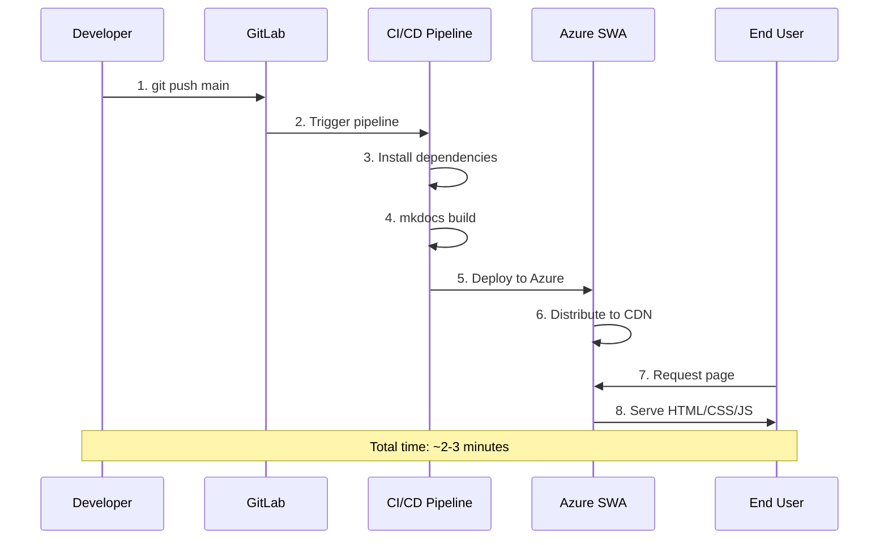
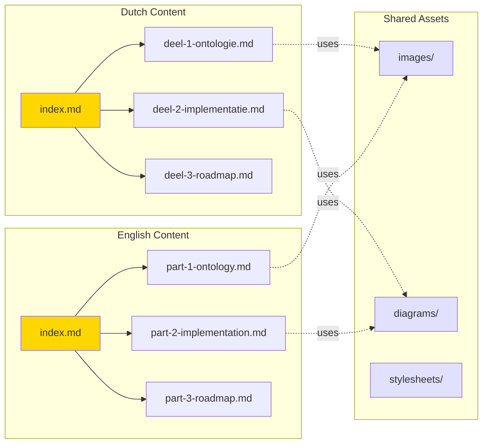
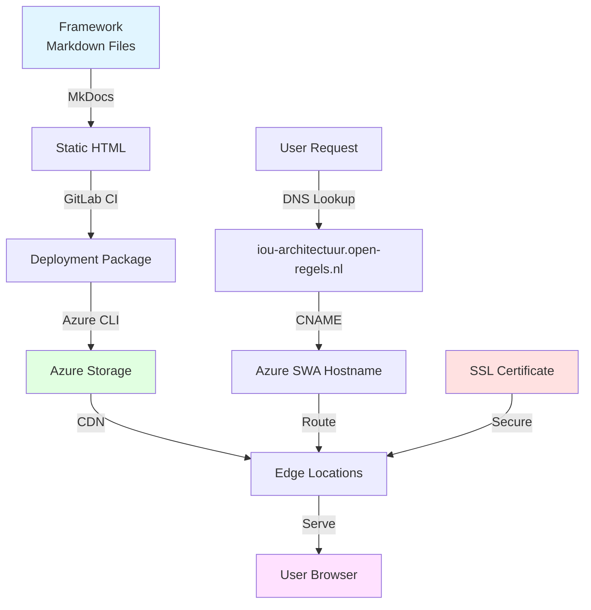
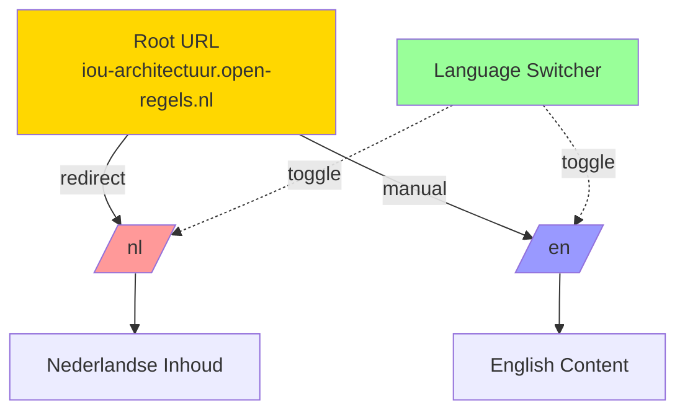
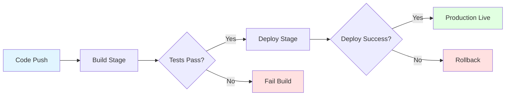
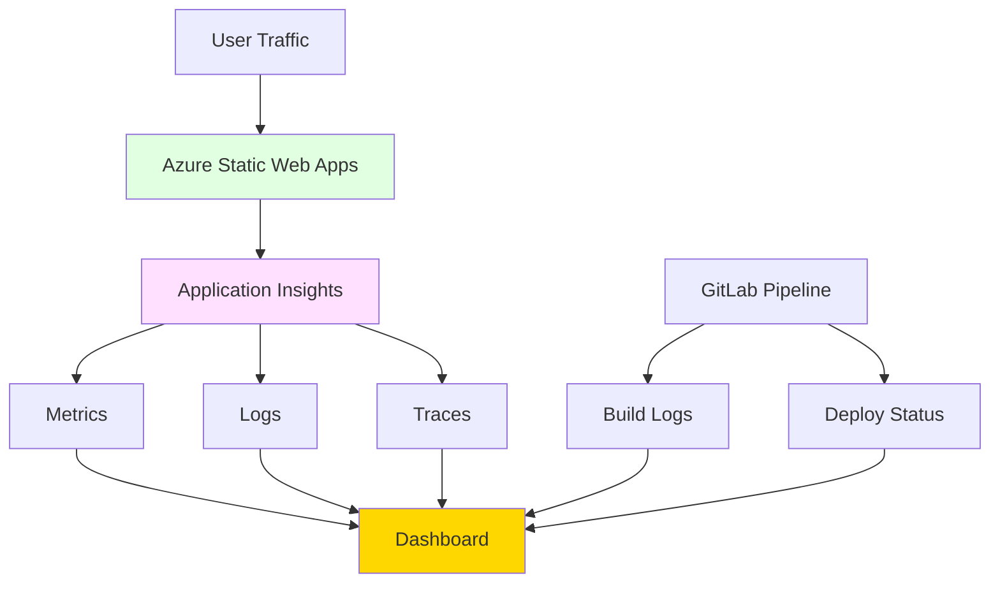

# Architecture Diagram

## System Architecture

## Deployment Flow

## Content Structure

## Data Flow

## Multilingual Structure

## CI/CD Pipeline Stages

## Monitoring & Observability

---

These diagrams show:

1. **System Architecture**: Complete overview of components
2. **Deployment Flow**: Step-by-step deployment process
3. **Content Structure**: How documentation is organized
4. **Data Flow**: Request routing and SSL
5. **Multilingual**: Language switching mechanism
6. **CI/CD Pipeline**: Build and deploy stages
7. **Monitoring**: Observability strategy
