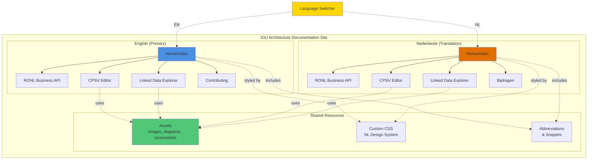
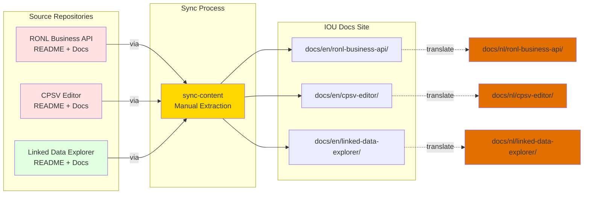

# Overview

This documentation site serves as the central reference for the IOU Architecture Framework and the RONL ecosystem. It is built with MkDocs and published to Azure Static Web Apps, supporting both English and Dutch.

## Site Structure

The site is organised into two language trees sharing a common set of assets, stylesheets, and abbreviations.

## Content Sources

English pages are the primary source of truth. Dutch pages are translations or placeholders that link back to the English version until a translation is available. Component documentation originates in each component's own repository and is synced into this site.

