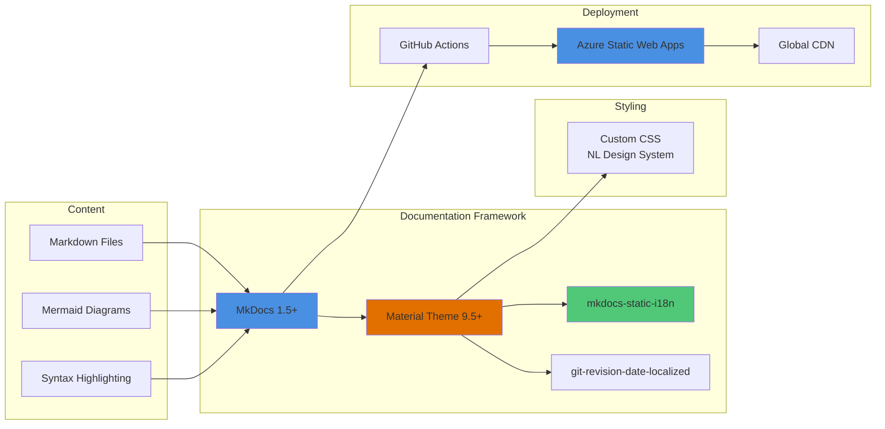
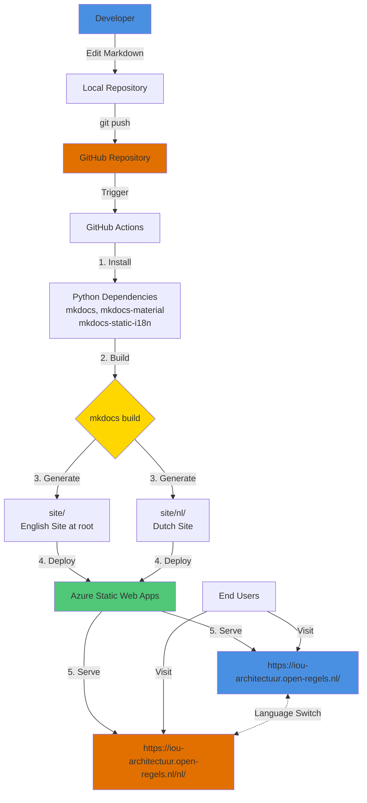

# Technology Stack

## Documentation Framework

The site is built on MkDocs with the Material theme, the mkdocs-static-i18n plugin for dual-language support, and the git-revision-date-localized plugin for showing last-modified timestamps.

| Component | Technology | Version |
|---|---|---|
| Static site generator | MkDocs | 1.5+ |
| Theme | Material for MkDocs | 9.5+ |
| Internationalisation | mkdocs-static-i18n | 1.2+ |
| Revision dates | git-revision-date-localized | 1.2+ |
| Diagram rendering | Mermaid | via Material |
| Hosting | Azure Static Web Apps | — |
| CI/CD | GitHub Actions | — |

## Build & Deploy Pipeline

Every push to `main` triggers a GitHub Actions workflow that builds the site and deploys to Azure Static Web Apps. The `acc` branch deploys to the acceptance environment.

