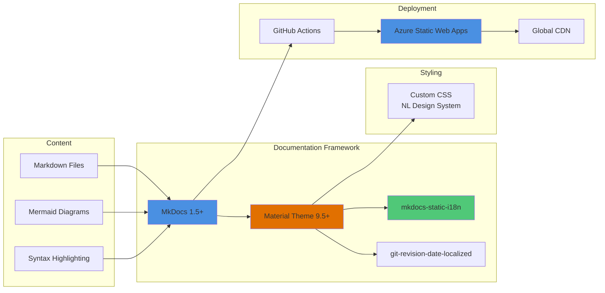
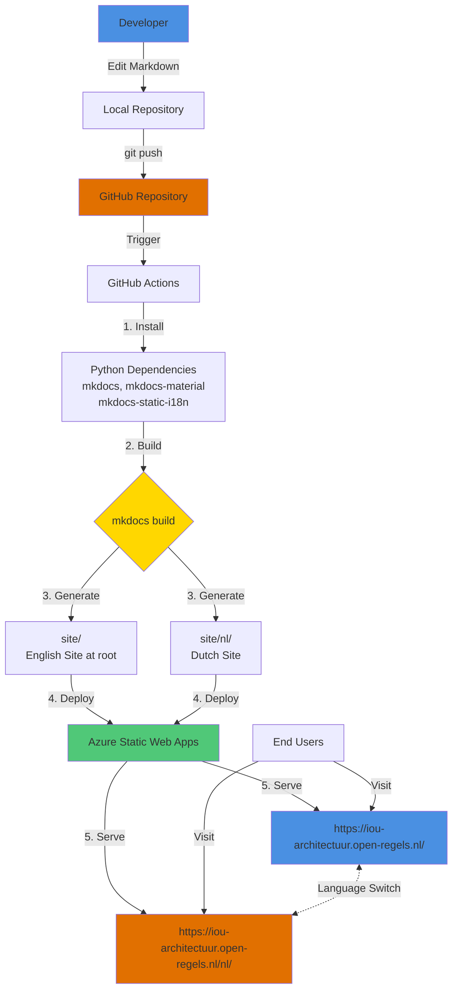

# Technology Stack

---

## Documentation Framework

The site is built on MkDocs with the Material theme, the mkdocs-static-i18n plugin for dual-language support, and the git-revision-date-localized plugin for showing last-modified timestamps.

| Component | Technology | Version |
|---|---|---|
| Static site generator | MkDocs | 1.5+ |
| Theme | Material for MkDocs | 9.5+ |
| Internationalisation | mkdocs-static-i18n | 1.2+ |
| Revision dates | git-revision-date-localized | 1.2+ |
| Diagram rendering | Mermaid | via Material |
| Hosting | Azure Static Web Apps | — |
| CI/CD | GitHub Actions | — |


```mermaid
graph LR
    subgraph "Documentation Framework"
        MKDOCS[MkDocs 1.5+]
        MATERIAL[Material Theme 9.5+]
        I18N[mkdocs-static-i18n]
        GIT_REV[git-revision-date-localized]
    end

    subgraph "Content"
        MD[Markdown Files]
        MERMAID[Mermaid Diagrams]
        CODE[Syntax Highlighting]
    end

    subgraph "Styling"
        CUSTOM[Custom CSS<br/>NL Design System]
    end

    subgraph "Deployment"
        GH_ACTIONS[GitHub Actions]
        AZURE_SWA[Azure Static Web Apps]
        CDN[Global CDN]
    end

    MKDOCS --> MATERIAL
    MATERIAL --> I18N
    MATERIAL --> GIT_REV

    MD --> MKDOCS
    MERMAID --> MKDOCS
    CODE --> MKDOCS

    MATERIAL --> CUSTOM

    MKDOCS --> GH_ACTIONS
    GH_ACTIONS --> AZURE_SWA
    AZURE_SWA --> CDN

    style MKDOCS fill:#4a90e2
    style MATERIAL fill:#e17000
    style I18N fill:#50c878
    style AZURE_SWA fill:#4a90e2
```

---

## The page metadata header

Every page a sync has touched carries a one-line header directly under the
breadcrumbs: its git created and updated dates, then **one fact that says what the
page describes**. Which fact depends on the front-matter key the page declares.

| Front matter | Header reads | Used on |
|---|---|---|
| `component: Linked Data Explorer` | 🔍 Linked Data Explorer `v2026.09.2` PROD · `build 007b350 · #39` | Component pages |
| `scope: cross-cutting` | Applies to all components `docs built 2026-09-09` | `contributing/**` |
| `scope: cross-cutting` + `verified:` | Applies to all components · verified 2026-09-09 against ✏️ `bbda389` 🔍 `007b350` ⚙️ `04e38c8` | Cross-cutting pages whose claims have been re-checked |

The version and build come from `docs/repo-versions.json`, loaded at build time by
`hooks/repo_versions.py`; the stamp comes from the page's own front matter. The
partial is `overrides/partials/doc-meta.html`. Pages under an `archive/` path show
the dates only, because an archived page describes an older release on purpose.

### Two identities, because a release number is not enough

A component's **version** is written by hand at release time, so it names a
release rather than a build of it. Acceptance and production can serve different
builds of the same version, and a new build reaches an environment every time a
deploy workflow runs — with no release bump at all. The header therefore records
the **build** beside the version: the frontend build that was serving the
recorded environment when the docs were synced. A reader can compare it with the
build line the running application prints in its changelog. See
[Build Provenance](../build-provenance.md) for what the two halves of a build id
mean.

### Why cross-cutting pages are stamped with commits, not builds

A contributing page makes claims about repository configuration — workflows,
`SECURITY-PIPELINE.md`, `renovate.json`, runner configs and their thresholds. **Most
changes to those produce no new build.** Every frontend deploy workflow is
path-filtered, as read on 11 September 2026:

| Repository | The frontend build fires on | Does not fire on |
|---|---|---|
| Linked Data Explorer | `packages/frontend/**`, its own workflow file, and the root `package.json` / `package-lock.json` | Other workflows, `SECURITY-PIPELINE.md`, `renovate.json`, backend runner config |
| RONL Business API | `packages/frontend`, `shared` and `pa-cockpit`, and its own workflow file | The same |
| CPSV Editor | Everything except `docs/**`, `.claude/**` and `**/*.md` | `SECURITY-PIPELINE.md` and every other Markdown record |

So a build id is silent about exactly the changes that falsify these pages. The
commit on the branch of record is not: it moves with every change.

### What a stamp promises

```yaml
---
scope: cross-cutting
verified:
  date: 2026-09-09
  against:
    CPSV Editor: "bbda389"
    Linked Data Explorer: "007b350"
    RONL Business API: "04e38c8"
---
```

**A component appears in a stamp only if its claims on that page were re-checked
against that commit, on that date.** Nothing else earns an entry — not editing the
page, not a sync of that component that left the page alone. That is why the
stamp is per page rather than one site-wide list of current builds: a sync
re-verifies only the pages it touches, and a global list would assert
verification that never happened.

Two consequences are deliberate:

- **An old stamp is information.** It tells the reader how long a page has gone
  without being checked, which is more useful than a fresh date that means
  nothing.
- **A partial stamp is honest.** `build-provenance.md` names two components, not
  three, because on 9 September only the CPSV Editor's and the Linked Data
  Explorer's claims on it were re-checked.

**On a stamped page the stamp replaces `docs built`.** The two dates answer
different questions and will usually drift apart — `docs built` moves with every
sync of any component, the stamp only when this page is re-checked — but side by
side the site-wide date is the weaker one: it says a sync happened somewhere, not
that this page was part of it. Unstamped pages keep `docs built`, because there it
is the only date that applies.

SHAs are quoted because YAML reads an unquoted all-digit SHA as a number, and a
leading zero as octal — `0123456` becomes `42798` before the template sees it.

### Staleness is checked by the sync, not the build

The site build is offline and checks nothing about a stamp. The
`/iou-document-patch` skill does, with
`.claude/skills/iou-document-patch/scripts/stamp-staleness.py`. For each stamped
page and component it lists the commits on the branch of record that touched
CI-relevant paths since the stamp:

```
docs/en/contributing/supply-chain.md  — verified 2026-09-09
  ⚠ CPSV Editor            bbda389  →  origin/acc 701d966  —  3 CI-relevant commits since
        deployed by: Deploy PROD (white-sky) #88
        1b2457e ci: refresh the transitive dependency tree, which nothing here ever did
        b1af50b docs: record that scan gates acc, in the three places that claimed otherwise
        2e4c1ac feat(ci): scan dependencies with Semgrep, on a ref rather than a laptop
```

That is its first run, two days after the stamps were written, and the second
subject line shows the point: a component repository recording that *"three
places claimed otherwise"* is a contributing page going stale in the repository's
own words.

The script also fails on a malformed stamp — an unquoted SHA, an unknown
component, a commit that does not resolve — and on a recorded build that
contradicts the Actions run it names.

### Every SHA leads to the run that deployed it

A stamped SHA and a recorded build both link to **GitHub**, where the three
applications' deploy workflows run — not to the GitLab mirror `repo_url` points
at. The mirror carries the same commits under the same SHAs, but it lags behind
and shows none of the runs, so following a SHA there answers neither question a
reader has: *was this deployed, and as which build?*

Each component's `ci_repo` in `repo-versions.json` names the repository where its
deploys run. For the Norm Editor and CPRMV that is GitLab, because their pipelines
are GitLab CI; for the other three it is GitHub. A build additionally records
`run_url`, the exact Actions run that produced it, and the header links the build
id there.

The staleness script asks GitHub for each stamped SHA's deploy runs, and prints
them. On 11 September all stamps matched:

| Stamped SHA | Deploy runs it triggered |
|---|---|
| CPSV Editor `bbda389` | *Deploy PROD (white-sky)* #88 |
| Linked Data Explorer `007b350` | *Deploy Frontend to Production* #39, *Deploy Backend to Production* #15, *Deploy Ropa site to Productuion* #4 (sic — the workflow's own spelling) |
| RONL Business API `04e38c8` | *Deploy Frontend to Azure ACC* #270, *Deploy Public Site to Azure ACC* #71, *Deploy PA Demo to Azure ACC* #102 |

!!! warning "A commit that changes only CI configuration deploys nothing"
    Because deploy workflows are path-filtered, a commit touching only
    `renovate.json`, `SECURITY-PIPELINE.md` or a non-deploy workflow triggers the
    supply-chain audit and no deploy at all — the Linked Data Explorer's `bd52eac`
    is one. A page verified against such a commit has **no build a reader can match
    its stamp to**. The script warns rather than fails: the stamp is still true
    about the repository, it just cannot be followed to a running application. When
    the choice is free, stamp the most recent commit that did deploy, provided no
    CI-relevant commit sits between it and what you read.

---

## Build & Deploy Pipeline

This repository has **two** deployment pipelines, on two different hosts, and they are easy to confuse:

| Pipeline | Host | Trigger | Deploys |
|---|---|---|---|
| `.github/workflows/azure-static-web-apps-*.yml` | GitHub Actions | Push to `main`, and pull requests against it | The production site; PRs build a preview |
| `pipeline/azure_ado_pipeline.yml` | Azure DevOps | **Manual only**, since 21 August 2026 | The acceptance site |

Both build with MkDocs and publish to Azure Static Web Apps.

The Azure DevOps pipeline used to fire on every push to `acc` and on pull requests against it, which is what made `acc` the acceptance branch in practice. It now carries `trigger: none` and `pr: none`, so it runs only when someone starts it by hand. Pushing to `acc` therefore deploys nothing on its own today — but the pipeline is still there, and re-enabling it is a two-line change.

The GitHub remote is not the only one: this repository is also pushed to Azure DevOps (`flevoland`) and to the open-regels GitLab instance. Only the first two run anything.

Both builds run `mkdocs build --verbose`, not `--strict`, so a broken internal link or a page missing from the nav produces a warning rather than failing the deploy. Run `mkdocs build --strict` locally before pushing if you want that caught.


```mermaid
graph TB
    DEV[Developer] -->|Edit Markdown| LOCAL[Local Repository]
    LOCAL -->|git push| GITHUB[GitHub Repository]

    GITHUB -->|Trigger| CI[GitHub Actions]

    CI -->|1. Install| DEPS[Python Dependencies<br/>mkdocs, mkdocs-material<br/>mkdocs-static-i18n]
    DEPS -->|2. Build| BUILD{mkdocs build}

    BUILD -->|3. Generate| EN_SITE[site/<br/>English Site at root]
    BUILD -->|3. Generate| NL_SITE[site/nl/<br/>Dutch Site]

    EN_SITE -->|4. Deploy| AZURE[Azure Static Web Apps]
    NL_SITE -->|4. Deploy| AZURE

    AZURE -->|5. Serve| PROD_EN[https://iou-architectuur.open-regels.nl/]
    AZURE -->|5. Serve| PROD_NL[https://iou-architectuur.open-regels.nl/nl/]

    USER[End Users] -->|Visit| PROD_EN
    USER -->|Visit| PROD_NL

    PROD_EN <-.Language Switch.-> PROD_NL

    style DEV fill:#4a90e2
    style GITHUB fill:#e17000
    style AZURE fill:#50c878
    style PROD_EN fill:#4a90e2
    style PROD_NL fill:#e17000
    style BUILD fill:#ffd700
```
