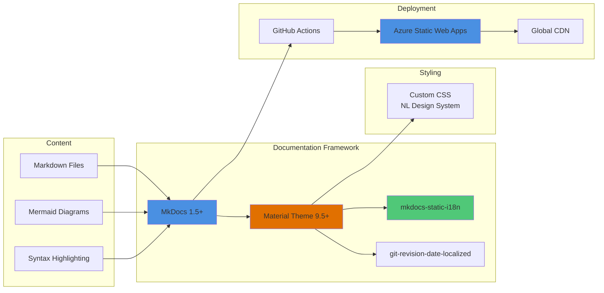
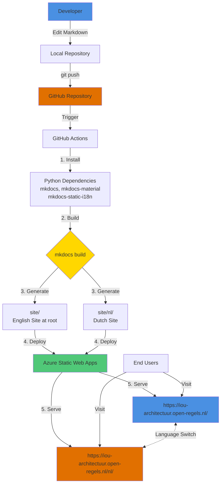

# Technology Stack

---

## Documentation Framework

The site is built on MkDocs with the Material theme, the mkdocs-static-i18n plugin for dual-language support, and the git-revision-date-localized plugin for showing last-modified timestamps.

| Component | Technology | Version |
|---|---|---|
| Static site generator | MkDocs | 1.5+ |
| Theme | Material for MkDocs | 9.5+ |
| Internationalisation | mkdocs-static-i18n | 1.2+ |
| Revision dates | git-revision-date-localized | 1.2+ |
| Diagram rendering | Mermaid | via Material |
| Hosting | Azure Static Web Apps | — |
| CI/CD | GitHub Actions | — |

```mermaid
graph LR
    subgraph "Documentation Framework"
        MKDOCS[MkDocs 1.5+]
        MATERIAL[Material Theme 9.5+]
        I18N[mkdocs-static-i18n]
        GIT_REV[git-revision-date-localized]
    end

    subgraph "Content"
        MD[Markdown Files]
        MERMAID[Mermaid Diagrams]
        CODE[Syntax Highlighting]
    end

    subgraph "Styling"
        CUSTOM[Custom CSS<br/>NL Design System]
    end

    subgraph "Deployment"
        GH_ACTIONS[GitHub Actions]
        AZURE_SWA[Azure Static Web Apps]
        CDN[Global CDN]
    end

    MKDOCS --> MATERIAL
    MATERIAL --> I18N
    MATERIAL --> GIT_REV

    MD --> MKDOCS
    MERMAID --> MKDOCS
    CODE --> MKDOCS

    MATERIAL --> CUSTOM

    MKDOCS --> GH_ACTIONS
    GH_ACTIONS --> AZURE_SWA
    AZURE_SWA --> CDN

    style MKDOCS fill:#4a90e2
    style MATERIAL fill:#e17000
    style I18N fill:#50c878
    style AZURE_SWA fill:#4a90e2
```

---

## Build & Deploy Pipeline

This repository has **two** deployment pipelines, on two different hosts, and they are easy to confuse:

| Pipeline | Host | Trigger | Deploys |
|---|---|---|---|
| `.github/workflows/azure-static-web-apps-*.yml` | GitHub Actions | Push to `main`, and pull requests against it | The production site; PRs build a preview |
| `pipeline/azure_ado_pipeline.yml` | Azure DevOps | **Manual only**, since 21 August 2026 | The acceptance site |

Both build with MkDocs and publish to Azure Static Web Apps.

The Azure DevOps pipeline used to fire on every push to `acc` and on pull requests against it, which is what made `acc` the acceptance branch in practice. It now carries `trigger: none` and `pr: none`, so it runs only when someone starts it by hand. Pushing to `acc` therefore deploys nothing on its own today — but the pipeline is still there, and re-enabling it is a two-line change.

The GitHub remote is not the only one: this repository is also pushed to Azure DevOps (`flevoland`) and to the open-regels GitLab instance. Only the first two run anything.

Both builds run `mkdocs build --verbose`, not `--strict`, so a broken internal link or a page missing from the nav produces a warning rather than failing the deploy. Run `mkdocs build --strict` locally before pushing if you want that caught.

```mermaid
graph TB
    DEV[Developer] -->|Edit Markdown| LOCAL[Local Repository]
    LOCAL -->|git push| GITHUB[GitHub Repository]

    GITHUB -->|Trigger| CI[GitHub Actions]

    CI -->|1. Install| DEPS[Python Dependencies<br/>mkdocs, mkdocs-material<br/>mkdocs-static-i18n]
    DEPS -->|2. Build| BUILD{mkdocs build}

    BUILD -->|3. Generate| EN_SITE[site/<br/>English Site at root]
    BUILD -->|3. Generate| NL_SITE[site/nl/<br/>Dutch Site]

    EN_SITE -->|4. Deploy| AZURE[Azure Static Web Apps]
    NL_SITE -->|4. Deploy| AZURE

    AZURE -->|5. Serve| PROD_EN[https://iou-architectuur.open-regels.nl/]
    AZURE -->|5. Serve| PROD_NL[https://iou-architectuur.open-regels.nl/nl/]

    USER[End Users] -->|Visit| PROD_EN
    USER -->|Visit| PROD_NL

    PROD_EN <-.Language Switch.-> PROD_NL

    style DEV fill:#4a90e2
    style GITHUB fill:#e17000
    style AZURE fill:#50c878
    style PROD_EN fill:#4a90e2
    style PROD_NL fill:#e17000
    style BUILD fill:#ffd700
```
