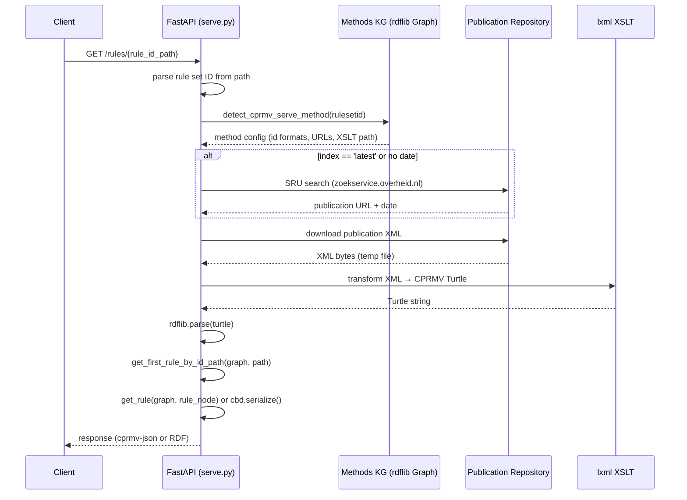

# Architecture

The CPRMV API is a single-process FastAPI application. All logic lives in `serve_api/src/serve.py`; constants and parameter definitions are in `serve_api/src/utils/constants.py`.

---

## Request lifecycle

---

## Startup

On startup, `serve.py` calls `set_CPRMVMETHODSKG` twice:

1. `set_CPRMVMETHODSKG("./data/cprmvmethods.ttl", False)` — loads the methods registry fresh into a new graph.
2. `set_CPRMVMETHODSKG("./data/cprmv.ttl", True)` — merges the CPRMV vocabulary into the same graph.

The resulting merged graph is stored in `app.cprmvsettings["CPRMVMETHODS_KG"]` and used for all method detection at request time.

---

## Method detection

`detect_cprmv_serve_method(cprmvid)` first tries to match the rule set identifier against `cprmvmethods:analysismethods` (the RDF list of BWB, CVDR, CELLAR entries). If no match, it falls back to `cprmvmethods:formalisationmethods` (the DMN 1.3 entry).

`detect_cprmv_serve_acknowledged_method(cprmvid, collection)` walks the RDF list and for each method:

1. Reads `cprmv-serve:normalized-id-format` from the methods KG.
2. Calls `normalize_ruleset_id(cprmvid)` to canonicalise shortened IDs (appends `_now_latest` or `_na_latest` for forms without date/index).
3. Uses `parse(normalized_idformat, cprmvid_normalized)` to attempt structural matching.
4. On match, returns a dict of the method's triples plus a `cprmv-serve:id_parts` entry containing the named parse result fields.

For `_latest` index forms, a subsequent SRU call (`find_publication_version_valid_on_date`) resolves the actual date and index.

---

## Rule graph traversal

`get_first_rule_by_id_path` splits the path by the delimiter and pops the first segment to find root rule nodes via `g.subjects(CPRMV.id, Literal(firstid, lang="nl"))`. It then calls the recursive `get_first_rule_by_Id_path_split_from_rule_as_root`, which:

1. Iterates the `cprmv:hasPart` RDF list of the current rule.
2. Strips non-alphanumeric characters from both the path segment and `g.value(rule, CPRMV.id)`.
3. On match, recurses with the remaining path.
4. If no direct match at this level, still recurses into sub-rules (depth-first skip — intermediate IDs can be omitted).

`get_rule(g, rule)` recursively collects all predicate-object pairs for a rule node. For `cprmv:hasPart`, it walks the RDF list and recurses into each item, building a nested dict keyed by `cprmv:id`.

---

## Static files

The `/respec/` path is served as a static file directory mounted from `serve_api/respec/`. The ReSpec HTML and assets are included in the Docker image at build time.

---

## Locale

The Dockerfile installs `nl_NL.UTF-8` locale, which `serve.py` sets at startup. This is intended to influence the `parse` module's handling of Dutch-formatted strings (e.g. decimal notation), though the practical effect is noted as a TODO in the source.
