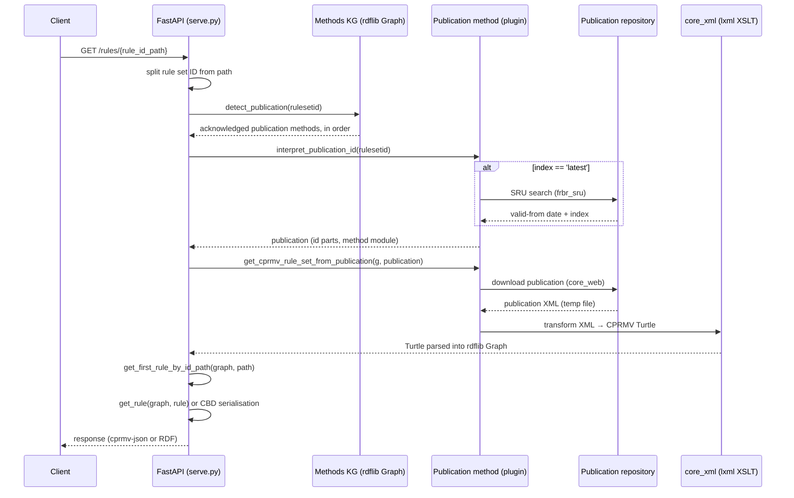

# Architecture

The CPRMV API is a single-process FastAPI application. The application, its endpoints and the rule-path traversal live in `serve_api/src/serve.py`; namespaces and parameter definitions are in `serve_api/src/utils/constants.py`. Everything that is specific to a publication repository, a serialisation or a reference format lives in a method module under `serve_api/methods/`, which `serve.py` loads at startup.

---

## Request lifecycle

```mermaid
sequenceDiagram
    participant Client
    participant FastAPI as FastAPI (serve.py)
    participant KG as Methods KG (rdflib Graph)
    participant Pub as Publication method (plugin)
    participant Repo as Publication repository
    participant XSLT as core_xml (lxml XSLT)

    Client->>FastAPI: GET /rules/{rule_id_path}
    FastAPI->>FastAPI: split rule set ID from path
    FastAPI->>KG: detect_publication(rulesetid)
    KG-->>FastAPI: acknowledged publication methods, in order
    FastAPI->>Pub: interpret_publication_id(rulesetid)

    alt index == 'latest'
        Pub->>Repo: SRU search (frbr_sru)
        Repo-->>Pub: valid-from date + index
    end

    Pub-->>FastAPI: publication (id parts, method module)
    FastAPI->>Pub: get_cprmv_rule_set_from_publication(g, publication)
    Pub->>Repo: download publication (core_web)
    Repo-->>Pub: publication XML (temp file)
    Pub->>XSLT: transform XML → CPRMV Turtle
    XSLT-->>FastAPI: Turtle parsed into rdflib Graph
    FastAPI->>FastAPI: get_first_rule_by_id_path(graph, path)
    FastAPI->>FastAPI: get_rule(graph, rule) or CBD serialisation
    FastAPI-->>Client: response (cprmv-json or RDF)
```

---

## Startup

When `serve.py` is imported it:

1. Builds an SSL context that adds the bundled certSIGN Web CA intermediate (`certs/certsign-webca.crt`) to the default trust store, and stores it as `app.SSL_CONTEXT`. `repository.officiele-overheidspublicaties.nl` leaves this intermediate out of its TLS handshake, so without it every download from that repository fails certificate verification.
2. Sets the Dutch locale (see [Locale](#locale)).
3. Creates the FastAPI `app` (version `0.4.2`) and the MCP wiring (see [MCP](#mcp)).
4. Calls `set_CPRMVMETHODSKG` twice: `./data/cprmvmethods.ttl` into a new graph, then `./data/cprmv.ttl` merged into the same graph. The result is `app.cprmvsettings["CPRMVMETHODS_KG"]`, the methods knowledge graph used at request time.
5. Calls `load_methods()` and stores the instances in `app.cprmvmethods`.

---

## Method plugins

`load_methods()` imports every `*.py` file in the `methods/` directory next to `src/` (skipping `__init__.py`). It adds both `src/` and `methods/` to `sys.path`, so method modules import each other by plain name (`from core_web import core_web`).

In each module it considers every class whose name starts or ends with the module name, and asks `get_method_config(name)` for its configuration. `get_method_config`:

1. Walks the list that `cprmvmethods:rulemethods` holds under `cprmv:acknowledged`.
2. Compares each method's `cprmv:id`, with `.` and `-` replaced by `_`, to the class name — `operaton.open-regels.nl` in RDF becomes `operaton_open_regels_nl` in Python.
3. On a match, copies the predicate-objects of the method's parent RDF types (except `rdf:type` and `cprmv:` predicates) onto the method node, following the type hierarchy upwards (bounded at ten), so a method's code reads its inherited settings from its own node.

A class with an acknowledged configuration is instantiated as `cls(app, config)`, where `config` is the method's node in the knowledge graph. A class without one is skipped silently. If the `methods/` directory is absent, the glob finds nothing and the API starts with no methods at all — `/` still answers, but no publication or reference can be resolved.

The Python classes mirror the RDF method hierarchy:

| Module | Class | Inherits from | Role |
|---|---|---|---|
| `RuleMethod.py` | `RuleMethod` | — | Holds `app` and the method's `config` node |
| `PublicationMethod.py` | `PublicationMethod` | `RuleMethod` | Id normalisation, `interpret_publication_id`, `find_publication_version_valid_on_date`, `get_raw_publication` |
| `ReferenceMethod.py` | `ReferenceMethod` | `RuleMethod` | `parse_reference` (against `cprmv-serve:reference-format`), `transform_reference` |
| `SerialisationMethod.py` | `SerialisationMethod` | `RuleMethod` | `get_cprmv_rule_set_from_raw_publication` |
| `core_web.py` | `core_web` | `PublicationMethod` | Downloads the publication from `cprmv-serve:repository-publication-location-format` |
| `core_xml.py` | `core_xml` | `SerialisationMethod` | Runs the XSLT named in `cprmv-serve:xslt` from `./data/`, with file and network access disabled |
| `frbr_sru.py` | `frbr_sru` | `core_web` | Finds the version in force on a date through an SRU service (`frbr-sru:` settings) |
| `bwb.py`, `cvdr.py`, `fmx4.py`, `dmn13.py` | `bwb`, `cvdr`, `fmx4`, `dmn13` | `core_xml` | One XSLT each |
| `repository_overheid_nl.py` | `repository_overheid_nl_bwb`, `repository_overheid_nl_cvdr` | `frbr_sru` + `bwb` / `cvdr` | BWB and CVDR on repository.overheid.nl |
| `eucellar.py` | `eucellar_fmx4` | `core_web` + `fmx4` | Formex 4 from EU CELLAR |
| `operaton.py` | `operaton` | `core_web` + `dmn13` | Splits the rule set id on `R` into deployment and resource id |
| `open_regels_nl.py` | `operaton_open_regels_nl` | `operaton` | Operaton at operaton.open-regels.nl |
| `cprmvapi.py` | `cprmvapi` | `ReferenceMethod` | The API's own `/rules` URLs |
| `juriconnect.py` | `juriconnect` | `ReferenceMethod` | Juriconnect 1.3 and 1.31 |
| `eli.py` | `elifmx4`, `elinl` | `ReferenceMethod` | ELI to Formex 4 on EU CELLAR; ELI on Dutch publications |

`METHODS.md` in the repository describes how to add a method: an RDF definition in `rdf/0.4.2/methods/<method>/method.ttl`, a Python module in `serve_api/methods/`, and `make methods` to regenerate `serve_api/data/` (see [Local Development](local-development.md#data-files)).

---

## Publication detection

`get_rules` takes the rule set id from the rule id path (everything before the first delimiter) and calls `detect_publication(rulesetid)`. That walks the methods acknowledged under `cprmvmethods:publicationmethods`, in list order, and asks each loaded one to `interpret_publication_id`:

1. **Normalise.** `PublicationMethod.normalize_ruleset_id` appends `_now_latest` to an id without `_`, and turns a two-part id `X_{index}` into `X_na_{index}`.
2. **Match.** The normalised id is parsed against the method's `cprmv-serve:normalized-id-format`. Both that and `cprmv-serve:publication-id-format` must be configured.
3. **Resolve `latest`.** If the index is `latest`, the valid-on date is the id's date when it is an ISO date, otherwise today. The method's `find_publication_version_valid_on_date` returns the date and index of the version in force; `frbr_sru` asks the SRU service for it, the default implementation returns the valid-on date with index 1. The official id is then rebuilt from `publication-id-format`.
4. **Hook.** `interpret_publication` lets a method add id parts — `operaton` adds `deploymentid` and `resourceid`.

The first method that returns a publication wins. `load_rule_set` then calls the method's `get_cprmv_rule_set_from_publication`, which fetches the raw publication into a temporary file, transforms it into the graph and deletes the file. Parse errors mentioning an unbound prefix are logged and ignored. The rule set id in the path is replaced by the resolved official id before traversal.

---

## Reference resolution

`/ref` calls `detect_cprmv_serve_reference_method_and_transform(reference)`, which walks the methods acknowledged under `cprmvmethods:referencemethods` and returns the first non-empty `transform_reference` result as a redirect:

- **`cprmvapi`** uses the default: parse against `{baseuri}/rules/{path}` and return `/rules/` plus the path with `/` replaced by `, `.
- **`juriconnect`** parses `jci1.{subversion}:c:BWB{bwbid}&{locatie-string}`, accepts subversion `3` or `31` and an 8-character id after `BWB`. Each `key=value` pair in the location string is mapped through `cprmv-serve:reference-mapping`: the valid-on key (`g`) sets the date, the seen-on key (`z`) sets the version index, and the remaining keys become path segments. The rule set id is formatted with the `normalized-id-format` of `repository-overheid-nl-bwb`; the date defaults to today and the index to `latest`. So `…&z=2025-07-01&g=2025-07-01` yields `BWBR0015703_2025-07-01_2025-07-01`.
- **`elifmx4`** queries the EU CELLAR SPARQL endpoint for the ELI and returns the first item URL.

---

## Rule graph traversal

`get_first_rule_by_id_path` splits the path by the delimiter and pops the first segment to find root rule nodes via `g.subjects(CPRMV.id, Literal(firstid, lang="nl"))`. It then calls the recursive `get_first_rule_by_Id_path_split_from_rule_as_root`, which:

1. Iterates the `cprmv:hasPart` RDF list of the current rule.
2. Strips non-alphanumeric characters from both the path segment and `g.value(rule, CPRMV.id)`.
3. On match, recurses with the remaining path.
4. If no direct match at this level, still recurses into sub-rules (depth-first skip — intermediate IDs can be omitted).

When the rule found is not the root, the root's `cprmv:hasPart` is replaced by a one-item list holding that rule, so the response is always the rule set with only the matched branch.

For `cprmv-json`, `get_rule(g, rule)` recursively collects all predicate-object pairs for a rule node; for `cprmv:hasPart` it walks the RDF list and builds a nested dict keyed by `cprmv:id`. For RDF formats, the response is the concise bounded description of the root, to which the API adds `rdf:type cprmv:RuleMethod` and the method's type and `cprmv:id` triples from the methods knowledge graph, so the output satisfies the RuleSet and RuleMethod SHACL shapes.

---

## MCP

`serve.py` wires an MCP server through FastMCP: `FastMCP.from_fastapi(app=app, name="CPRMV")`, served by `mcp.http_app(path='/mcp')`, whose routes are merged with the API's into a second application, `combined_app`. The MCP server is created before any route is registered on `app`, and the image serves `app` (`fastapi run src/serve.py`), not `combined_app`.

`/mcp` is not reachable in the current deployment: it answers 404 on all three hosts. This is tracked in [standards/cprmv#31](https://git.open-regels.nl/standards/cprmv/-/work_items/31).

---

## Static files

The `/respec` path is served as a static file directory mounted from `serve_api/respec/`, which holds the ReSpec HTML of the current version and versioned folders (`0.4.0/`, `0.4.1/`, `0.4.2/`). The Docker image includes the folder at build time.

---

## Locale

The Dockerfile installs the `nl_NL.UTF-8` locale and sets `LANG`, `LANGUAGE` and `LC_ALL` to it. `serve.py` sets `nl_NL.UTF-8` at startup, falls back to `nl_NL`, and otherwise prints a warning and keeps the system default. Whether the locale affects the `parse` module at all is an open TODO in the source.
