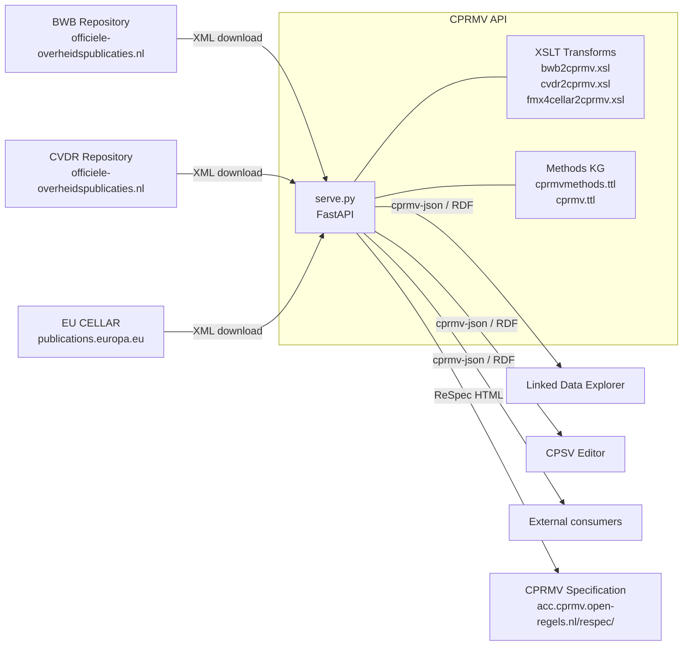

# CPRMV API

The **CPRMV API** is a Python/FastAPI service that makes individual rules from Dutch and European legal publications accessible as structured, machine-readable data in real time. It implements the [Core Public Rule Management Vocabulary (CPRMV)](https://acc.cprmv.open-regels.nl/respec/) — the RONL standard for expressing and managing public rules across analysis, formalisation, and codification methods.

---

## What it does

The API accepts a Rule Set identifier (a BWB, CVDR, or EU CELLAR ID) and an optional path of rule identifiers, then:

1. Resolves the identifier against the appropriate official publication repository.
2. Downloads the publication XML on-the-fly.
3. Transforms it to CPRMV using an XSLT stylesheet.
4. Navigates the resulting rule tree to the requested rule.
5. Returns the rule in the requested format — `cprmv-json`, Turtle, JSON-LD, or other RDF serialisations.

No pre-loading or batch conversion is required. The API resolves "latest version valid on a given date" queries automatically via SRU search of the publication repositories.

---

## Ecosystem position

The CPRMV API is the **rule-access layer** of the RONL ecosystem. It bridges official legal publication repositories and the knowledge-graph-based tooling (CPSV Editor, Linked Data Explorer):



---

## Environments

| Environment | API (interactive docs) | CPRMV Specification |
|---|---|---|
| **Production** | [cprmv.open-regels.nl/docs](https://cprmv.open-regels.nl/docs) | — |
| **Acceptance** | [acc.cprmv.open-regels.nl/docs](https://acc.cprmv.open-regels.nl/docs) | [acc.cprmv.open-regels.nl/respec/](https://acc.cprmv.open-regels.nl/respec/) |

---

## Technology stack

| Component | Technology | Version |
|---|---|---|
| API framework | FastAPI | 0.116.1 |
| RDF library | rdflib | 7.1.4 |
| XML/XSLT processing | lxml | 6.0.0 |
| Pattern matching | parse | 1.20.2 |
| Date parsing | ciso8601 | 2.3.3 |
| Runtime | Python | 3.12 |
| Container | Docker | — |
| Image registry | Docker Hub (`datafluisteraar/cprmv-api`) | — |
| CI/CD | GitLab CI | — |

---

## Repository structure

```
cprmv/
├── serve_api/
│   ├── src/
│   │   ├── serve.py               # FastAPI application — all endpoints and logic
│   │   └── utils/
│   │       └── constants.py       # RDF namespaces, Path/Query parameter definitions
│   ├── data/
│   │   ├── cprmv.ttl              # CPRMV vocabulary (loaded into Methods KG)
│   │   ├── cprmvmethods.ttl       # Supported analysis and publication methods
│   │   ├── bwb2cprmv.xsl          # XSLT: BWB XML → CPRMV Turtle
│   │   ├── cvdr2cprmv.xsl         # XSLT: CVDR XML → CPRMV Turtle
│   │   ├── dmn13operaton2cprmv.xsl# XSLT: DMN 1.3 (Operaton) → CPRMV Turtle
│   │   └── fmx4cellar2cprmv.xsl   # XSLT: EU CELLAR Formex v4 → CPRMV Turtle
│   ├── respec/                    # Static CPRMV specification (served at /respec/)
│   ├── Dockerfile
│   ├── docker-compose.yml
│   ├── requirements.txt
│   └── pyproject.toml
├── rdf/
│   ├── cprmv.ttl                  # CPRMV OWL vocabulary
│   ├── cprmvmethods.ttl           # Methods ontology
│   └── cprmv.shacl.ttl            # SHACL shapes for validation
├── html/                          # ReSpec source for the CPRMV specification
└── tools/
    └── bwb2cprmv/                 # CLI tool for offline BWB→CPRMV conversion
```

---

## Licence

EUPL-1.2
