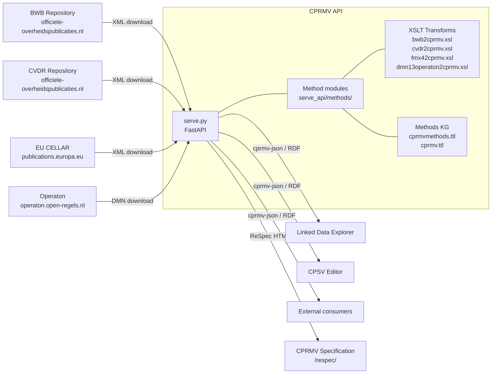

# CPRMV API

The **CPRMV API** is a Python/FastAPI service that makes individual rules from Dutch and European legal publications accessible as structured, machine-readable data in real time. It implements the [Core Public Rule Management Vocabulary (CPRMV)](https://cprmv.open-regels.nl/respec/) — the RONL standard for expressing and managing public rules across analysis, formalisation, and codification methods.

---

## What it does

The API accepts a Rule Set identifier (a BWB, CVDR, EU CELLAR or Operaton DMN ID) and an optional path of rule identifiers, then:

1. Finds the publication method whose identifier format matches the Rule Set ID.
2. Downloads the publication on-the-fly from its repository.
3. Transforms it to CPRMV using the XSLT stylesheet of the method.
4. Navigates the resulting rule tree to the requested rule.
5. Returns the rule in the requested format — `cprmv-json`, Turtle, JSON-LD, or other RDF serialisations.

No pre-loading or batch conversion is required. For BWB and CVDR, the API resolves "latest version valid on a given date" queries via SRU search of the publication repository.

Each publication and reference method is a Python module in `serve_api/methods/`, configured by its RDF method definition. See [Publication Repositories](features/publication-repositories.md).

---

## Ecosystem position

The CPRMV API is the **rule-access layer** of the RONL ecosystem. It bridges official legal publication repositories and the knowledge-graph-based tooling (CPSV Editor, Linked Data Explorer):


```mermaid
graph LR
    BWB["BWB Repository<br/>officiele-overheidspublicaties.nl"] -->|XML download| API
    CVDR["CVDR Repository<br/>officiele-overheidspublicaties.nl"] -->|XML download| API
    CELLAR["EU CELLAR<br/>publications.europa.eu"] -->|XML download| API
    OPERATON["Operaton<br/>operaton.open-regels.nl"] -->|DMN download| API

    subgraph "CPRMV API"
        API["serve.py<br/>FastAPI"]
        METHODS["Method modules<br/>serve_api/methods/"]
        XSLT["XSLT Transforms<br/>bwb2cprmv.xsl<br/>cvdr2cprmv.xsl<br/>fmx42cprmv.xsl<br/>dmn13operaton2cprmv.xsl"]
        KG["Methods KG<br/>cprmvmethods.ttl<br/>cprmv.ttl"]
        API --- METHODS
        METHODS --- XSLT
        METHODS --- KG
    end

    API -->|cprmv-json / RDF| LDE["Linked Data Explorer"]
    API -->|cprmv-json / RDF| CPSV["CPSV Editor"]
    API -->|cprmv-json / RDF| EXT["External consumers"]
    API -->|ReSpec HTML| SPEC["CPRMV Specification<br/>/respec/"]
```

---

## Environments

| Environment | API (interactive docs) | CPRMV Specification |
|---|---|---|
| **Production** | [cprmv.open-regels.nl/docs](https://cprmv.open-regels.nl/docs) | [cprmv.open-regels.nl/respec/](https://cprmv.open-regels.nl/respec/) |
| **Production (alias)** | [cprmv.open-rules.eu/docs](https://cprmv.open-rules.eu/docs) | [cprmv.open-rules.eu/respec/](https://cprmv.open-rules.eu/respec/) |
| **Acceptance** | [acc.cprmv.open-regels.nl/docs](https://acc.cprmv.open-regels.nl/docs) | [acc.cprmv.open-regels.nl/respec/](https://acc.cprmv.open-regels.nl/respec/) |

---

## Technology stack

Versions are those locked in `serve_api/requirements.txt`; `pyproject.toml` lists the direct dependencies without pins.

| Component | Technology | Version |
|---|---|---|
| API framework | FastAPI | 0.142.2 |
| ASGI toolkit / server | Starlette / Uvicorn | 1.7.0 / 0.54.0 |
| MCP integration | FastMCP (MCP SDK 2.2.0) | 4.0.10 |
| RDF library | rdflib | 7.6.0 |
| XML/XSLT processing | lxml | 6.1.3 |
| Pattern matching | parse | 1.22.2 |
| Date parsing | ciso8601 | 2.3.3 |
| Runtime | Python | 3.14 |
| Container | Docker (`python:3.14-bookworm`) | — |
| Image registry | Docker Hub (`datafluisteraar/cprmv-api`) | — |
| CI/CD | GitLab CI | — |

The MCP integration is wired up in `serve.py`, but `/mcp` is not reachable in the current deployment — see [MCP server](features/overview.md#mcp-server).

---

## Repository structure

```
cprmv/
├── serve_api/
│   ├── src/
│   │   ├── serve.py               # FastAPI application — endpoints, method loader, rule-path navigation
│   │   └── utils/
│   │       └── constants.py       # RDF namespaces, Path/Query parameter definitions
│   ├── methods/                   # Method modules: RuleMethod, PublicationMethod, ReferenceMethod,
│   │                              # SerialisationMethod base classes; core_web, core_xml, frbr_sru;
│   │                              # bwb, cvdr, fmx4, dmn13, repository_overheid_nl, eucellar,
│   │                              # operaton, open_regels_nl, cprmvapi, juriconnect, eli
│   ├── data/                      # Written by `make methods`
│   │   ├── cprmv.ttl              # CPRMV vocabulary (loaded into the Methods KG)
│   │   ├── cprmvmethods.ttl       # Method registry + all method definitions (loaded into the Methods KG)
│   │   ├── bwb2cprmv.xsl          # XSLT: BWB XML → CPRMV Turtle
│   │   ├── cvdr2cprmv.xsl         # XSLT: CVDR XML → CPRMV Turtle
│   │   ├── fmx42cprmv.xsl         # XSLT: Formex v4 → CPRMV Turtle
│   │   └── dmn13operaton2cprmv.xsl# XSLT: DMN 1.3 (Operaton) → CPRMV Turtle
│   ├── certs/                     # certSIGN Web CA intermediate for repository.officiele-overheidspublicaties.nl
│   ├── respec/                    # Static CPRMV specification per version (served at /respec/)
│   ├── test/                      # pytest suite
│   ├── Dockerfile
│   ├── docker-compose.yml
│   ├── Makefile                   # install, methods, deps, deps-upgrade, tests
│   ├── pip-compile.sh
│   ├── requirements.txt / requirements-dev.txt
│   └── pyproject.toml
├── rdf/
│   └── 0.4.0/ 0.4.1/ 0.4.2/       # One folder per CPRMV version
│       ├── cprmv.ttl              # CPRMV OWL vocabulary
│       ├── cprmvmethods.ttl       # Method registry (acknowledged method lists)
│       ├── cprmv.shacl.ttl        # SHACL shapes for validation
│       └── methods/<method>/      # 0.4.2: one folder per method — method.ttl, README.md, XSLT
├── html/                          # ReSpec source for the CPRMV specification (shaclgen.py generates chapters)
├── METHODS.md                     # How methods are defined in RDF and implemented in Python
├── ROADMAP.md
└── CHANGELOG.md
```

---

## Licence

EUPL-1.2
