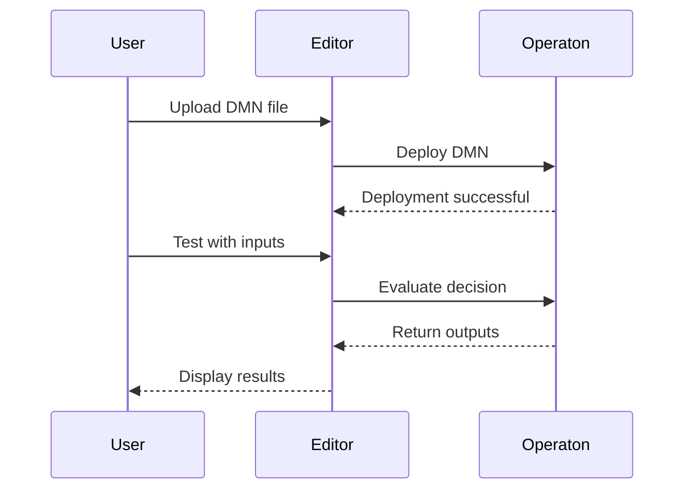

# Features

## Core Functionality

### 📝 Service Definition

Create comprehensive public service metadata:

- **Basic Information**
  - Service title and description (multilingual support)
  - Keywords for discoverability
  - Sector and thematic area classification
  
- **Outputs & Costs**
  - Define service outputs
  - Specify cost structures
  - Document delivery channels

- **Temporal Validity**
  - Service availability periods
  - Version management
  - Lifecycle states

### 🏛️ Organization Management

Define public organizations with complete metadata:

- **Organization Details**
  - Official name and preferred labels
  - Organization classification
  - Homepage and contact information
  
- **Geographic Jurisdiction** (Mandatory)
  - NUTS codes for EU regions
  - Administrative boundaries
  - Multi-level governance

- **Flexible Identifiers**
  - Short IDs (e.g., `org-flevoland`)
  - Full URIs for linked data compatibility

### ⚖️ Legal Resource Integration

Link services to legislation with precision:

- **BWB ID Support**
  - Direct integration with wetten.overheid.nl
  - Automatic BWB format validation
  - Version and consolidation tracking
  
- **Legal Source Metadata**
  - Official titles and citations
  - Publication dates
  - Regulatory authority

**Example:**
```turtle
<http://example.org/service/1> 
    cv:hasLegalResource <https://wetten.overheid.nl/BWBR0005416> .
```

## Rules-Policy-Parameters (RPP) Architecture

### 🔵 Rules (Decision Logic)

Define executable business rules:

- **Temporal Rules**
  - Validity periods (`ronl:validFrom`, `ronl:validUntil`)
  - Rule versioning and inheritance chains
  - Confidence level tracking (high/medium/low)

- **Rule Metadata**
  - Descriptive titles and definitions
  - Rule-to-policy traceability
  - Source attribution

**Example:**
```turtle
<http://example.org/rule/1> a ronl:TemporalRule ;
    ronl:validFrom "2024-01-01"^^xsd:date ;
    ronl:validUntil "2024-12-31"^^xsd:date ;
    ronl:confidenceLevel "high" ;
    ronl:extends <http://example.org/rule/0> ;
    dcterms:description "Eligibility check for benefit X" .
```

### 🟣 Policy (Normative Values)

Capture policy norms from legislation:

- **CPRMV Rules**
  - Full legal text (`cprmv:definition`)
  - Situational context (`cprmv:situatie`)
  - Normative values (`cprmv:norm`)
  - Legal source path (`cprmv:ruleIdPath`)

- **JSON Import**
  - Import from normenbrief format
  - CPRMV Rules API integration
  - Bulk policy loading

**Example:**
```turtle
<http://example.org/policy/1> a cprmv:Rule ;
    cprmv:definition "Het bedrag is €500 per maand" ;
    cprmv:situatie "Voor alleenstaanden" ;
    cprmv:norm "500" ;
    cprmv:ruleIdPath "/BWBR0001/Artikel5/Lid1" .
```

### 🟢 Parameters (Configuration)

Define configurable values:

- **Parameter Types**
  - Currency (EUR)
  - Percentage (PCT)
  - Numeric (NUM)
  - Temporal (DAYS, MONTHS, YEARS)

- **Temporal Validity**
  - Per-parameter validity periods
  - Regional variations
  - Pilot adjustments

**Example:**
```turtle
<http://example.org/param/1> a ronl:ParameterWaarde ;
    ronl:parameterType "EUR" ;
    ronl:parameterValue "750" ;
    ronl:validFrom "2025-01-01"^^xsd:date ;
    dcterms:description "Monthly allowance for region Noord" .
```

### RPP Benefits

| Benefit | Description |
|---------|-------------|
| **Legal Traceability** | Law → Policy → Rule → Parameter → Decision |
| **Agility** | Adjust parameters without changing rules or laws |
| **Governance** | Clear ownership and approval workflows per layer |
| **Testability** | Each layer can be tested independently |

## DMN Integration

### 🎯 Decision Model Support

Full DMN lifecycle management:

- **Upload & Deploy**
  - Upload DMN files (XML format)
  - Deploy to Operaton rule engine
  - Automatic validation

- **Testing & Evaluation**
  - Test decisions with live data
  - View input/output variables
  - Execution timing metrics

- **Rule Extraction**
  - Extract rules with CPRMV attributes
  - Automatic input variable detection
  - Decision table parsing

**Example Workflow:**


## iKnow Integration

### 📊 Legislative Analysis Import

Import structured legislative analysis:

- **XML Parsing**
  - Parse iKnow XML exports
  - Extract legal concepts
  - Map to CPSV-AP properties

- **Configurable Mapping**
  - Field mapping configuration
  - Multiple legal concept types
  - Custom transformation rules

- **Data Preview**
  - Preview mapped data before import
  - Validate completeness
  - Review conflicts

## Import & Export

### 📥 Import Capabilities

Perfect round-trip fidelity:

- **TTL File Import**
  - Parse existing RDF/Turtle files
  - Populate all editor fields
  - Preserve all metadata

- **Format Support**
  - RDF/Turtle (.ttl)
  - JSON-LD (future)
  - XML/RDF (future)

### 📤 Export Options

Multiple export formats:

- **RDF/Turtle**
  - CPSV-AP 3.2.0 compliant
  - Pretty-printed for readability
  - Includes all metadata

- **Download**
  - Direct file download
  - Custom filename support
  - Timestamped exports

- **Publish to TriplyDB**
  - Via backend proxy
  - Automatic namespace management
  - Version control

## User Experience

### 🎨 Live Preview

Real-time TTL generation:

- **Preview Panel**
  - Side-by-side editing and preview
  - Syntax highlighting
  - Auto-update on changes

- **Validation**
  - Real-time error checking
  - Missing required fields
  - Format validation

### 🔍 Validation

Comprehensive data validation:

- **Required Fields**
  - Service title and description
  - Competent authority
  - Legal resource (optional but recommended)

- **Format Validation**
  - BWB ID format checking
  - Date format validation
  - URI syntax checking

### 💾 State Management

Persistent editing sessions:

- **Auto-save** (future)
- **Session recovery** (future)
- **Version history** (future)

## Technical Features

### 🏗️ Modular Architecture

Clean code organization:

- **Component-Based**
  - Reusable React components
  - Tab-based navigation
  - Separation of concerns

- **Hooks & State Management**
  - Custom hooks for business logic
  - Centralized state management
  - DRY principles

### 📱 Responsive Design

Works on all devices:

- **Desktop**: Full-featured interface
- **Tablet**: Optimized layout
- **Mobile**: Touch-friendly (basic support)

### ♿ Accessibility

WCAG 2.1 compliance (partial):

- Semantic HTML
- Keyboard navigation
- Screen reader support (improving)

---

See [User Guide](user-guide/getting-started.md) for detailed usage instructions.
