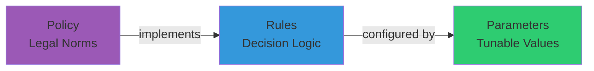
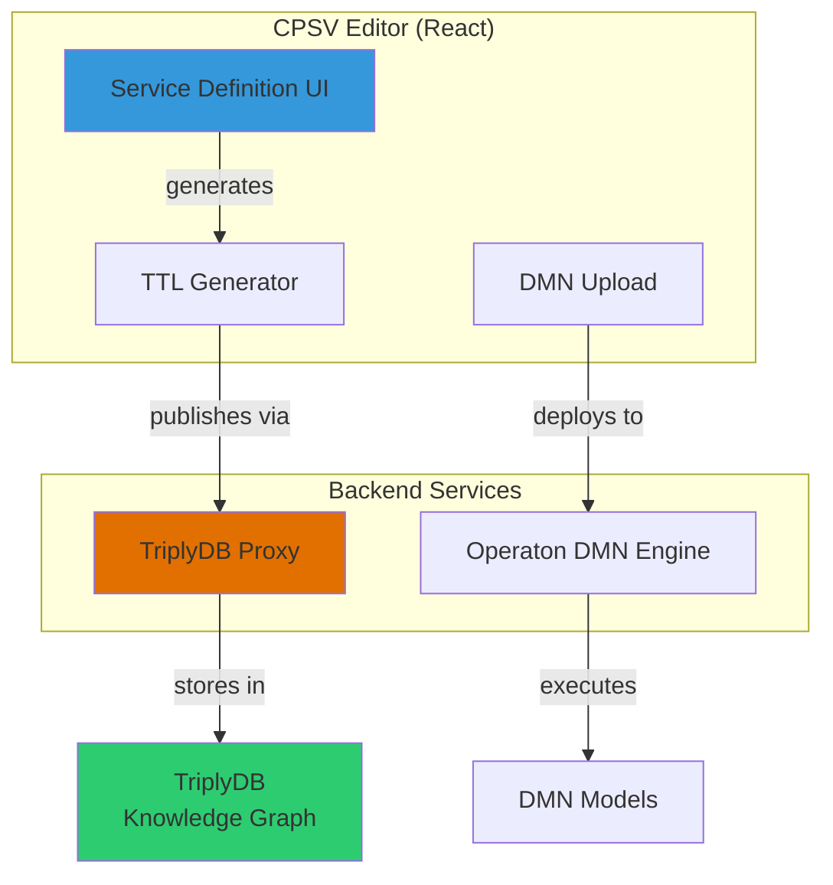

# CPSV Editor

**Generate CPSV-AP 3.2.0 compliant RDF/Turtle files for Dutch government services**

🌐 **Live Application:** [cpsv.open-regels.nl](https://cpsv.open-regels.nl)  
🧪 **Acceptance Environment:** [acc.cpsv.open-regels.nl](https://acc.cpsv.open-regels.nl)

[](https://semiceu.github.io/CPSV-AP/)
[]()

---

## Overview

The **Core Public Service Editor** is a React-based web application that simplifies the creation and management of RDF/Turtle files for government services in the Netherlands. It provides an intuitive interface for creating service definitions that comply with EU CPSV-AP 3.2.0 and Dutch RONL/CPRMV standards.

## Key Features

- ✅ **CPSV-AP 3.2.0 compliant** TTL generation
- ✅ **DMN integration** with Operaton rule engine
- ✅ **RPP Architecture** (Rules-Policy-Parameters separation)
- ✅ **iKnow integration** for legislative analysis import
- ✅ **Import/Export** with perfect round-trip fidelity
- ✅ **Live preview** panel with real-time TTL generation

## Quick Links

| Section | Description |
|---------|-------------|
| [Features](features.md) | Detailed feature overview |
| [Getting Started](user-guide/getting-started.md) | Quick start guide |
| [Service Definition](user-guide/service-definition.md) | Creating service metadata |
| [Rules & Parameters](user-guide/rules-parameters.md) | RPP architecture usage |
| [DMN Integration](user-guide/dmn-integration.md) | Decision model integration |
| [Architecture](technical/architecture.md) | System architecture |
| [Standards Compliance](technical/standards-compliance.md) | CPSV-AP & CPRMV compliance |
| [Development](technical/development.md) | Developer guide |

## Use Cases

### 1. Service Definition
Create comprehensive service metadata including:
- Service titles and descriptions (multilingual)
- Thematic areas and sector classification
- Cost specifications and outputs
- Legal resource linking with BWB IDs

### 2. Legal Resource Linking
Link services to Dutch legislation:
- BWB ID support for wetten.overheid.nl
- Version and consolidation tracking
- Automatic validation of BWB formats
- Direct links to official legal sources

### 3. Rule Management (RPP Architecture)
Define business rules with the Rules-Policy-Parameters pattern:



**Benefits:**
- **Legal Traceability**: Law → Policy → Rule → Parameter → Decision
- **Organizational Agility**: Adjust parameters without changing rules
- **Governance**: Clear ownership per layer

### 4. DMN Orchestration
Upload, deploy, and test Decision Model and Notation files:
- Integration with Operaton rule engine
- Live decision evaluation
- Automatic input variable extraction
- Rule extraction with CPRMV attributes

## Technology Stack

- **Framework**: React 18.3.1
- **Styling**: Tailwind CSS 3
- **Icons**: Lucide React
- **Standards**: CPSV-AP 3.2.0, CPRMV, RONL
- **Deployment**: Azure Static Web Apps

## Architecture Overview



## Getting Started

### Prerequisites
- Modern web browser (Chrome, Firefox, Edge, Safari)
- No installation required for using the web app

### For Developers
```bash
# Clone repository
git clone https://github.com/your-org/cpsv-editor.git
cd cpsv-editor

# Install dependencies
npm install

# Start development server
npm start
```

See [Development Guide](technical/development.md) for details.

## Documentation

- **User Guides**: Step-by-step instructions for common tasks
- **Technical Docs**: Architecture, standards, and development
- **Field Mapping**: Complete CPSV-AP property mapping
- **Namespace Reference**: RDF vocabulary documentation

## Standards Compliance

The editor generates TTL files compliant with:

| Standard | Version | Purpose |
|----------|---------|---------|
| **CPSV-AP** | 3.2.0 | EU Public Service Vocabulary |
| **CPRMV** | Latest | Core Public Rule Management |
| **RONL** | Latest | Dutch Rules Vocabulary |
| **BWB** | - | Dutch Legal Resource IDs |

Full compliance documentation: [Standards Compliance](technical/standards-compliance.md)

## Support

- **Issues**: Create issues in the repository
- **Documentation**: This comprehensive guide
- **Community**: RONL initiative discussion forums

---

**Built with ❤️ for Dutch Government Services**

*Version 1.5.1 - January 2026*
