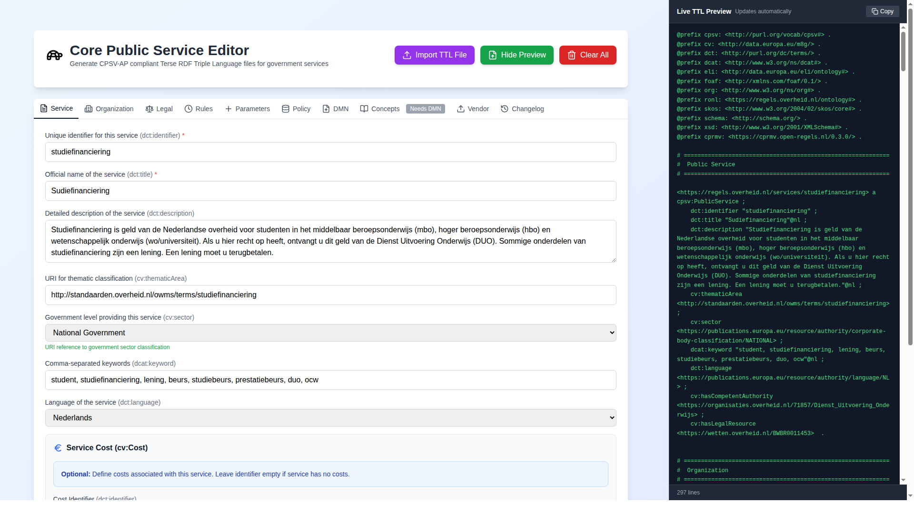

# CPSV Editor

**Generate CPSV-AP 3.2.0 compliant RDF/Turtle files for Dutch government services**

🌐 **Live application:** [cpsv-editor.open-regels.nl](https://cpsv-editor.open-regels.nl)  
🧪 **Acceptance environment:** [acc.cpsv-editor.open-regels.nl](https://acc.cpsv-editor.open-regels.nl)

[](https://ttl.open-regels.nl)
[](https://www.typescriptlang.org/)
[](https://react.dev/)
[](https://create-react-app.dev/)
[](https://tailwindcss.com/)
[](https://nodejs.org/)


---

## What is the CPSV Editor?

The **CPSV Editor** is a React-based web application that simplifies the creation and management of RDF/Turtle files for government services in the Netherlands. It provides a structured form interface for building service definitions that comply with EU CPSV-AP 3.2.0 and Dutch RONL/CPRMV standards, and publishes the result as machine-readable Linked Data.

No RDF knowledge is required to use the editor. Users fill in familiar form fields; the editor generates the correct Turtle syntax, validates it, and can publish it directly to a TriplyDB knowledge graph.



---

## Architecture

### Application layers

```
┌────────────────────────────────────────────────────────────────┐
│                       PRESENTATION LAYER                       │
│  App.js  •  Tab components  •  PreviewPanel                    │
└────────────────────────────┬───────────────────────────────────┘
                             │
┌────────────────────────────▼───────────────────────────────────┐
│                      BUSINESS LOGIC LAYER                      │
│  constants  •  ttlGenerator  •  validators  •  parseTTL        │
└────────────────────────────┬───────────────────────────────────┘
                             │
┌────────────────────────────▼───────────────────────────────────┐
│                         DATA LAYER                             │
│  useEditorState  •  useArrayHandlers  •  vocabularies_config   │
└────────────────────────────────────────────────────────────────┘
```

### Component structure

```
App.js
  ├── ServiceTab         ← Public service metadata
  ├── OrganizationTab    ← Competent authority
  ├── LegalTab           ← Legal resource (BWB)
  ├── RulesTab           ← Temporal rules  [RPP: Rules]
  ├── ParametersTab      ← Configuration values  [RPP: Parameters]
  ├── CPRMVTab           ← Normative rules  [RPP: Policy]
  ├── DMNTab             ← Decision model deployment & testing
  ├── VendorTab          ← Vendor implementation metadata
  ├── IKnowMappingTab    ← iKnow XML import
  ├── ChangelogTab       ← Version history
  └── PreviewPanel       ← Live TTL preview (side panel)
```

### Data flow

**Import:**

```
TTL file uploaded → parseTTL() → extract entities → populate all tabs
```

**Export:**

```
Tab state → generateTTL() → combine sections + namespaces → download .ttl
```

### Deployment pipeline

```
Git push → GitHub Actions → npm run build → Azure Static Web Apps → cpsv-editor.open-regels.nl
```

---

## Standards

The editor generates Turtle files compliant with the following vocabularies:

| Vocabulary | Version | Purpose |
|---|---|---|
| CPSV-AP | 3.2.0 | EU Core Public Service Vocabulary |
| CPRMV | 0.3.0 | Core Public Rule Management Vocabulary (Dutch) |
| RONL | — | Regels Overheid Nederland governance vocabulary |
| ELI | — | European Legislation Identifier |
| Dublin Core | — | Metadata terms (title, description, identifier) |
| SKOS | — | Simple Knowledge Organization System |
| Schema.org | — | Value and unit definitions |
| FOAF | — | Organization homepages |
| ORG | — | Organization ontology |

---

## Positioning

The CPSV Editor is the authoring tool in a broader semantic mediation architecture. Service definitions created here are published to a TriplyDB knowledge graph where they can be queried by the Linked Data Explorer and consumed by downstream systems. The editor implements the semantic mediation principle of separating citizen-facing vocabulary from internal business domain models — decisions expressed as DMN files are linked to their public service descriptions through structured RDF properties.

See [Semantic Mediation Reference Architecture](reference/semantic-mediation-architecture.md) for the full architectural context.