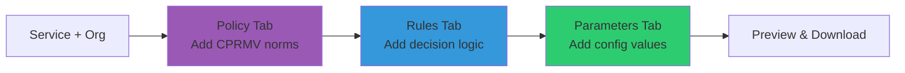

# Getting Started

## Quick Start (5 minutes)

### 1. Access the Application

Open your web browser and navigate to:
- **Production**: [https://cpsv.open-regels.nl](https://cpsv.open-regels.nl)
- **Acceptance**: [https://acc.cpsv.open-regels.nl](https://acc.cpsv.open-regels.nl)

No installation or login required!

### 2. Create Your First Service

Follow these steps to create a basic public service definition:

#### Step 1: Service Tab

Fill in the basic service information:

```markdown
Title: "Aanvraag Omgevingsvergunning"
Description: "Vergunning voor bouwen en verbouwen"
Keywords: "vergunning, bouwen, omgevingsvergunning"
```

#### Step 2: Organization Tab

Define the competent authority:

```markdown
Organization ID: "org-flevoland"
Preferred Label: "Provincie Flevoland"
Geographic Jurisdiction: Select from dropdown
```

!!! tip "Organization IDs"
    Use short, descriptive IDs like `org-flevoland` or full URIs like `https://data.flevoland.nl/id/organization/1`

#### Step 3: Legal Resource Tab (Optional)

Link to relevant legislation:

```markdown
BWB ID: "BWBR0024779"  # Omgevingswet
```

The editor will automatically:
- Validate the BWB format
- Generate the full URI: `https://wetten.overheid.nl/BWBR0024779`
- Link to the official legal text

#### Step 4: Preview

Click the **Preview** tab to see the generated TTL:

```turtle
@prefix cpsv: <http://purl.org/vocab/cpsv#> .
@prefix cv: <http://data.europa.eu/m8g/> .
@prefix dcterms: <http://purl.org/dc/terms/> .

<http://example.org/service/1> a cpsv:PublicService ;
    dcterms:title "Aanvraag Omgevingsvergunning"@nl ;
    dcterms:description "Vergunning voor bouwen en verbouwen"@nl ;
    cv:hasCompetentAuthority <http://example.org/org/org-flevoland> ;
    cv:hasLegalResource <https://wetten.overheid.nl/BWBR0024779> .
```

#### Step 5: Download

Click **Download TTL** to save your file.

## Interface Overview

### Tab Navigation

The editor is organized into tabs:

| Tab | Purpose | Required |
|-----|---------|----------|
| **Service** | Basic service metadata | ✅ Yes |
| **Organization** | Competent authority | ✅ Yes |
| **Legal Resource** | Legislation links | ❌ Optional |
| **Rules** | Business rules (RPP) | ❌ Optional |
| **Parameters** | Configuration values | ❌ Optional |
| **Policy** | CPRMV norms | ❌ Optional |
| **DMN** | Decision models | ❌ Optional |
| **iKnow** | Legislative analysis | ❌ Optional |
| **Preview** | Live TTL preview | - |

### Action Buttons

Located in the top-right corner:

- **Import TTL File**: Load existing RDF/Turtle file
- **Download TTL**: Export current service definition
- **Validate**: Check for errors and missing fields
- **Clear All**: Reset the editor (with confirmation)

## Common Workflows

### Workflow 1: Create New Service


**Time**: 5-10 minutes

### Workflow 2: Edit Existing Service


**Time**: 2-5 minutes

### Workflow 3: Define Rules (Advanced)



**Time**: 15-30 minutes

## Best Practices

### Naming Conventions

**Service IDs**:
- Use descriptive identifiers
- Format: `service-category-name`
- Example: `service-environmental-permit`

**Organization IDs**:
- Include level: `org-`, `municipality-`, `province-`
- Example: `province-flevoland`

**Rule IDs**:
- Include version: `rule-eligibility-v2`
- Example: `rule-income-check-2025`

### Metadata Quality

Always provide:
- ✅ Clear, concise titles
- ✅ Comprehensive descriptions
- ✅ Relevant keywords for search
- ✅ Legal resource links when applicable
- ✅ Geographic jurisdiction

### Validation Before Export

Before downloading, always:

1. Click **Validate** button
2. Review validation messages
3. Fix any errors (red)
4. Consider warnings (yellow)
5. Preview TTL output
6. Verify all data is present

## Keyboard Shortcuts

| Shortcut | Action |
|----------|--------|
| `Ctrl+I` | Import file |
| `Ctrl+S` | Download TTL |
| `Ctrl+V` | Validate |
| `Ctrl+P` | Switch to Preview |
| `Ctrl+R` | Refresh preview |

## Troubleshooting

### Issue: TTL Preview Not Updating

**Solution**: Click the Preview tab again to force refresh

### Issue: BWB ID Not Validating

**Solution**: Check format - should be exactly "BWBR" followed by 7 digits
- ✅ Correct: `BWBR0024779`
- ❌ Wrong: `BWB0024779`, `BWBR24779`

### Issue: Download Button Disabled

**Solution**: Required fields are missing:
1. Service title
2. Service description
3. Organization name
4. Geographic jurisdiction

Check the Validate button for specific errors.

## Next Steps

Now that you know the basics:

- [Service Definition Guide](service-definition.md) - Complete field reference
- [Rules & Parameters](rules-parameters.md) - RPP architecture usage
- [DMN Integration](dmn-integration.md) - Decision model integration
- [Import & Export](import-export.md) - Advanced file handling

## Support

Need help?
- Check the [Features](../features.md) documentation
- Review [Technical Documentation](../technical/architecture.md)
- Create an issue in the repository
- Contact the RONL support team

---

**Estimated learning time**: 30 minutes  
**Proficiency time**: 2-3 hours of practice
