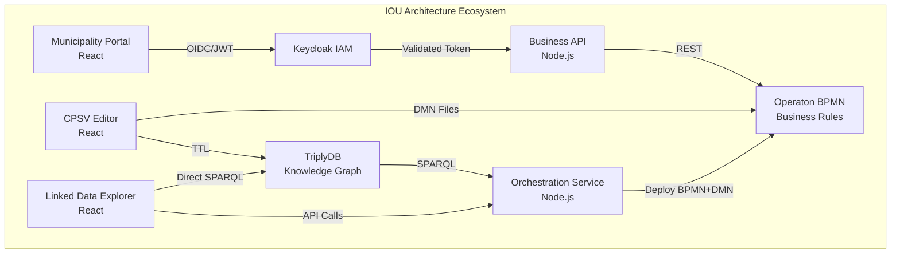

# IOU Architecture Documentation

Welcome to the comprehensive documentation for the IOU Architecture Framework and the RONL ecosystem.

---

## 🆕 What's New

-   **⚙️ RONL Business API — v2.0.0** · *February 21, 2026*

    ---

    **Frontend Redesign & IDP Selection**

    New landing page with identity provider selection (DigiD / eHerkenning / eIDAS), custom Keycloak theme matching MijnOmgeving design, multi-tenant theming with CSS custom properties, and full mobile-responsive layout.

    [:octicons-arrow-right-24: Full changelog](ronl-business-api/developer/changelog-roadmap.md)

-   **✏️ CPSV Editor — v1.9.3** · *February 2026*

    ---

    **DMN Syntactic Validation**

    Inline DMN validation immediately after upload: five-layer syntactic checks with severity-coded results (error / warning / info), element references, and line numbers — directly in the DMN file card.

    [:octicons-arrow-right-24: Full changelog](cpsv-editor/developer/changelog-roadmap.md)

-   **🔍 Linked Data Explorer — v0.9.0** · *February 2026*

    ---

    **DMN Validator Feature**

    Standalone DMN Validator accessible from the sidebar. Drop multiple `.dmn` or `.xml` files for independent side-by-side validation against RONL DMN+ syntactic layers via `POST /v1/dmns/validate`.

    [:octicons-arrow-right-24: Full changelog](linked-data-explorer/developer/changelog-roadmap.md)

---

## What is IOU Architecture?

The Information Architecture Framework for IOU integrates semantic web technologies, decision models, and Dutch government standards into a unified system for managing regulatory compliance and spatial planning.

<iframe src="architecture-diagram.html" 
        width="100%" 
        height="700px" 
        frameborder="0" 
        style="border-radius:12px; display:block;">
</iframe>

## Architecture Overview

## Ecosystem Components

### ⚙️ RONL Business API

The core business API layer that provides secure authentication and process orchestration for Dutch government services.

**Live App**: [mijn.open-regels.nl](https://mijn.open-regels.nl)

[View Documentation →](ronl-business-api/index.md){ .md-button }

### ✏️ CPSV Editor

React-based application for creating CPSV-AP 3.2.0 compliant RDF/Turtle files for Dutch government services.

**Live App**: [cpsv-editor.open-regels.nl](https://cpsv-editor.open-regels.nl)

[View Documentation →](cpsv-editor/index.md){ .md-button }

### 🔍 Linked Data Explorer

Web application for SPARQL queries and BPMN & DMN orchestration with TriplyDB integration.

**Live App**: [linkeddata.open-regels.nl](https://linkeddata.open-regels.nl)

[View Documentation →](linked-data-explorer/index.md){ .md-button }

## Documentation Status

  

    
Loading documentation status…

  

## Quick Links

| Resource                 | Link                                                                           |
| ------------------------ | ------------------------------------------------------------------------------ |
| **CPSV Editor**          | [cpsv-editor.open-regels.nl](https://cpsv-editor.open-regels.nl)               |
| **Linked Data Explorer** | [linkeddata.open-regels.nl](https://linkeddata.open-regels.nl)                 |
| **Backend API**          | [backend.linkeddata.open-regels.nl](https://backend.linkeddata.open-regels.nl) |
| **Keycloak IAM**         | [keycloak.open-regels.nl](https://keycloak.open-regels.nl)                     |
| **Custom Business API**  | [api.open-regels.nl](https://api.open-regels.nl)                               |
| **Operaton**             | [operaton.open-regels.nl](https://operaton.open-regels.nl)                     |

## Technology Stack

The IOU Architecture ecosystem is built entirely on **open source technologies**:

| Component           | Technology        | License            |
| ------------------- | ----------------- | ------------------ |
| **IAM**             | Keycloak          | Apache 2.0         |
| **BPMN Engine**     | Operaton          | Apache 2.0         |
| **Backend**         | Node.js + Express | MIT                |
| **Frontend**        | React             | MIT                |
| **Database**        | PostgreSQL        | PostgreSQL License |
| **Cache**           | Redis             | BSD 3-Clause       |
| **Reverse Proxy**   | Caddy             | Apache 2.0         |
| **Knowledge Graph** | TriplyDB          | -                  |

## Standards Compliance

- **CPSV-AP 3.2.0** - EU Public Service Vocabulary
- **CPRMV** - Core Public Rule Management Vocabulary
- **RONL** - Dutch Rules Vocabulary
- **BIO** - Baseline Informatiebeveiliging Overheid
- **NEN 7510** - Healthcare information security
- **AVG/GDPR** - Data protection

## Contributing

We welcome contributions! See the [Contributing Guide](contributing/index.md) for details.

---

**Documentation Version**: 1.0  
**Last Updated**: February 2026  
**License**: EUPL v1.2
