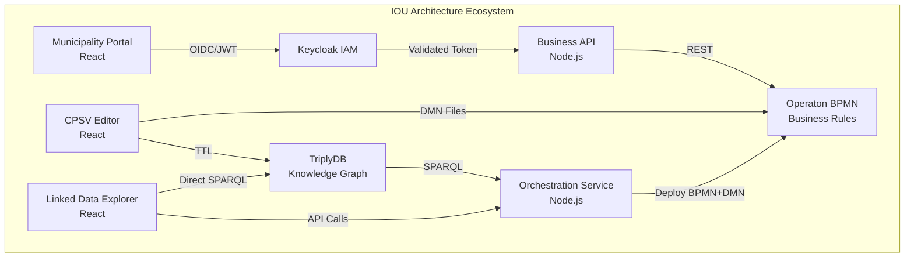

# IOU Architecture Documentation

Welcome to the comprehensive documentation for the IOU Architecture Framework and the RONL ecosystem.

## What is IOU Architecture?

The Information Architecture Framework for IOU integrates semantic web technologies, decision models, and Dutch government standards into a unified system for managing regulatory compliance and spatial planning.

## Ecosystem Components

### RONL Business API

A secure, multi-tenant Business API layer for Dutch municipalities. Handles DigiD/eIDAS/eHerkenning authentication via Keycloak, enforces multi-tenant isolation per municipality, and executes government business rules (BPMN/DMN) through Operaton — with compliance-grade audit logging.

**Live environments:**  
ACC: [acc.mijn.open-regels.nl](https://acc.mijn.open-regels.nl) · [acc.api.open-regels.nl](https://acc.api.open-regels.nl)  
Production: [mijn.open-regels.nl](https://mijn.open-regels.nl) · [api.open-regels.nl](https://api.open-regels.nl)

| | |
|---|---|
| [Features](ronl-business-api/features/overview.md) | Business API Layer pattern, multi-tenancy, authentication, security |
| [User Guides](ronl-business-api/user-guide/login-digid-flow.md) | Login flow, submitting calculations, caseworker workflow, adding a municipality |
| [Developer Docs](ronl-business-api/developer/local-development.md) | Local setup, backend, frontend, deployment (VM + Azure), CI/CD |
| [References](ronl-business-api/references/api-endpoints.md) | API endpoints, environment variables, JWT claims, Keycloak realm, standards |

### ✏️ CPSV Editor
React-based application for creating CPSV-AP 3.2.0 compliant RDF/Turtle files for Dutch government services.

**Live App**: [cpsv.open-regels.nl](https://cpsv.open-regels.nl)

[View Documentation →](cpsv-editor/index.md){ .md-button }

### 🔍 Linked Data Explorer
Web application for SPARQL queries and BPMN & DMN orchestration with TriplyDB integration.

**Live App**: [linkeddata.open-regels.nl](https://linkeddata.open-regels.nl)

[View Documentation →](linked-data-explorer/index.md){ .md-button }

## Architecture Overview

## Quick Links

| Resource | Link |
|----------|------|
| **CPSV Editor** | [cpsv.open-regels.nl](https://cpsv.open-regels.nl) |
| **Linked Data Explorer** | [linkeddata.open-regels.nl](https://linkeddata.open-regels.nl) |
| **Backend API** | [backend.linkeddata.open-regels.nl](https://backend.linkeddata.open-regels.nl) |
| **Operaton** | [operaton.open-regels.nl](https://operaton.open-regels.nl) |
| **Keycloak IAM** | [keycloak.open-regels.nl](https://keycloak.open-regels.nl) |

## Technology Stack

The IOU Architecture ecosystem is built entirely on **open source technologies**:

| Component | Technology | License |
|-----------|-----------|---------|
| **IAM** | Keycloak | Apache 2.0 |
| **BPMN Engine** | Operaton | Apache 2.0 |
| **Backend** | Node.js + Express | MIT |
| **Frontend** | React | MIT |
| **Database** | PostgreSQL | PostgreSQL License |
| **Cache** | Redis | BSD 3-Clause |
| **Reverse Proxy** | Caddy | Apache 2.0 |
| **Knowledge Graph** | TriplyDB | - |

## Standards Compliance

- **CPSV-AP 3.2.0** - EU Public Service Vocabulary
- **CPRMV** - Core Public Rule Management Vocabulary
- **RONL** - Dutch Rules Vocabulary
- **BIO** - Baseline Informatiebeveiliging Overheid
- **NEN 7510** - Healthcare information security
- **AVG/GDPR** - Data protection

## Contributing

We welcome contributions! See the [Contributing Guide](contributing/index.md) for details.

---

**Documentation Version**: 2.0  
**Last Updated**: January 2026  
**License**: EUPL v1.2
