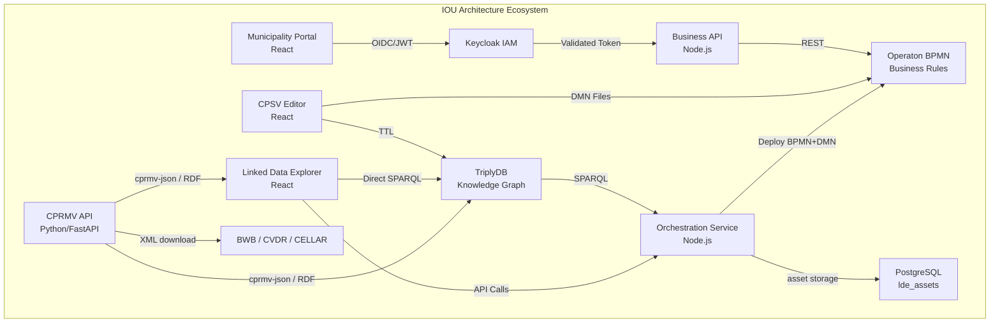

# IOU Architecture Documentation

Welcome to the comprehensive documentation for the IOU Architecture Framework and the RONL ecosystem.

---

## 🆕 What's New

-   **⚙️ RONL Business API — v3.0.7** · *May 2026*

    ---

    **V2 caseworker dashboard live in production**

    The redesigned [V2 caseworker dashboard](ronl-business-api/features/caseworker-dashboard-v2.md) is now the available at `/dashboard/caseworker/v2`; the V1 shell will be retired. A three-mode information architecture (Werk · Zoeken · Beheer) replaces the flat 25-item nav, with a ⌘K command palette and a toggleable AI assistant dock. Production brought to full parity with acceptance.

    [:octicons-arrow-right-24: Full changelog](ronl-business-api/developer/changelog-roadmap.md)

-   **✏️ CPSV Editor — v1.9.5** · *May 2026*

    ---

    **DMN Workflow Polish**

    Starter request bodies now populate from [`<inputValues>` constraints](cpsv-editor/developer/dmn-implementation.md#request-body-generation) on decisionTable input columns — constrained string inputs get a runnable value out of the box instead of an empty string that would fail at evaluate time. Validation backend unreachability surfaces as a distinct amber *"Syntax validation result not available"* state, no more silent failures when the LDE backend can't be reached.

    [:octicons-arrow-right-24: Full changelog](cpsv-editor/developer/changelog-roadmap.md)

-   **🔍 Linked Data Explorer — v1.8.0** · *May 2026*

    ---

    **Concurrent applicable periods and HTTP cache headers on /v1/norms**

    Each BWB ruleset is published as its own `cprmv:Dataset` resource in TriplyDB, and a single ruleset can carry multiple records — different applicable periods of the same law (e.g. the `2025-01-01` and `2026-01-01` editions of the Participatiewet) are concurrent and equally authoritative, not competing versions. The `dataset_versions` envelope field is a per-rulesetid map of lists, sorted with the most-recent applicable version first, so G2G consumers can match each rule's `applicable_date` to the Dataset record that backs it. Ships with an [API stability contract](linked-data-explorer/reference/api-stability.md) documenting the four versioning layers, the immutable primary-key promise, and the 24-month deprecation policy for the eventual `/v2/norms`.

    [:octicons-arrow-right-24: Full changelog](linked-data-explorer/developer/changelog-roadmap.md)

-   **📜 CPRMV API — v0.4.0** · *February 2026*

    ---

    **On-the-fly Rule Retrieval**

    Live retrieval and CPRMV transformation of Dutch and EU legislation from BWB, CVDR, and EU CELLAR repositories. Automatic latest-version resolution, seven output formats, definition extraction with parse patterns, and Juriconnect reference resolution.

    [:octicons-arrow-right-24: Full changelog](cprmv-api/developer/changelog-roadmap.md)

---

## What is IOU Architecture?

The Information Architecture Framework for IOU integrates semantic web technologies, decision models, and Dutch government standards into a unified system for managing regulatory compliance and spatial planning.

<figure style="width:100%; margin:0;">
  <iframe src="architecture-diagram.html"
          width="100%"
          height="700px"
          frameborder="0"
          style="border-radius:12px; display:block;">
  </iframe>
  <figcaption>IOU Architecture — interactive overview of the ecosystem components and their relationships</figcaption>
</figure>

---

## Architecture Overview

```mermaid
graph TB
    subgraph "IOU Architecture Ecosystem"
        A[Municipality Portal<br/>React] -->|OIDC/JWT| B[Keycloak IAM]
        B -->|Validated Token| C[Business API<br/>Node.js]
        C -->|REST| D[Operaton BPMN<br/>Business Rules]

        E[CPSV Editor<br/>React] -->|TTL| F[TriplyDB<br/>Knowledge Graph]
        E -->|DMN Files| D

        F -->|SPARQL| G[Orchestration Service<br/>Node.js]
        G -->|Deploy BPMN+DMN| D
        G -->|asset storage| K[PostgreSQL<br/>lde_assets]

        H[Linked Data Explorer<br/>React] -->|API Calls| G
        H -->|Direct SPARQL| F

        I[CPRMV API<br/>Python/FastAPI] -->|XML download| J[BWB / CVDR / CELLAR]
        I -->|cprmv-json / RDF| F
        I -->|cprmv-json / RDF| H
    end
```

---

## Ecosystem Components

### ⚙️ RONL Business API

The core business API layer that provides secure authentication and process orchestration for Dutch government services.

**Live App**: [mijn.open-regels.nl](https://mijn.open-regels.nl)

[View Documentation →](ronl-business-api/index.md){ .md-button }

### ✏️ CPSV Editor

React-based application for creating CPSV-AP 3.2.0 compliant RDF/Turtle files for Dutch government services.

**Live App**: [cpsv-editor.open-regels.nl](https://cpsv-editor.open-regels.nl)

[View Documentation →](cpsv-editor/index.md){ .md-button }

### 🔍 Linked Data Explorer

Web application for SPARQL queries and BPMN & DMN orchestration with TriplyDB integration.

**Live App**: [linkeddata.open-regels.nl](https://linkeddata.open-regels.nl)

[View Documentation →](linked-data-explorer/index.md){ .md-button }

### 📜 CPRMV API

Python/FastAPI service that fetches individual rules from Dutch and European legal publications on the fly, transforming them to CPRMV-structured RDF. Implements the Core Public Rule Management Vocabulary standard and hosts the CPRMV specification.

**Live App**: [cprmv.open-regels.nl/docs](https://cprmv.open-regels.nl/docs)  

[View Documentation →](cprmv-api/index.md){ .md-button }

---

## Documentation Status

  

    
Loading documentation status…

  

---

## Quick Links

| Resource                 | Link                                                                           |
| ------------------------ | ------------------------------------------------------------------------------ |
| **CPSV Editor**          | [cpsv-editor.open-regels.nl](https://cpsv-editor.open-regels.nl)               |
| **Linked Data Explorer** | [linkeddata.open-regels.nl](https://linkeddata.open-regels.nl)                 |
| **Backend API**          | [backend.linkeddata.open-regels.nl](https://backend.linkeddata.open-regels.nl) |
| **Keycloak IAM**         | [keycloak.open-regels.nl](https://keycloak.open-regels.nl)                     |
| **Custom Business API**  | [api.open-regels.nl](https://api.open-regels.nl)                               |
| **Operaton**             | [operaton.open-regels.nl](https://operaton.open-regels.nl)                     |
| **CPRMV API**            | [cprmv.open-regels.nl/docs](https://cprmv.open-regels.nl/docs)                 |

---

## Technology Stack

The IOU Architecture ecosystem is - apart from TriplyDB and eDOCS - built entirely on **open source technologies**:

| Component           | Technology        | License            |
| ------------------- | ----------------- | ------------------ |
| **IAM**             | Keycloak          | Apache 2.0         |
| **BPMN Engine**     | Operaton          | Apache 2.0         |
| **Backend**         | Node.js + Express | MIT                |
| **Frontend**        | React             | MIT                |
| **Database**        | PostgreSQL        | PostgreSQL License |
| **Cache**           | Redis             | BSD 3-Clause       |
| **Reverse Proxy**   | Caddy             | Apache 2.0         |
| **Knowledge Graph** | TriplyDB          | -                  |
| **Document Mngmnt** | eDOCS             | -                  |
| **Rule API**        | Python / FastAPI  | EUPL-1.2           |

---

## Standards Compliance

- **CPSV-AP 3.2.0** - EU Public Service Vocabulary
- **CPRMV** - Core Public Rule Management Vocabulary
- **RONL** - Dutch Rules Vocabulary
- **BIO** - Baseline Informatiebeveiliging Overheid
- **NEN 7510** - Healthcare information security
- **AVG/GDPR** - Data protection

---

## Contributing

We welcome contributions! See the [Contributing Guide](contributing/index.md) for details.

---

**Documentation Version**: 1.0  
**Last Updated**: February 2026  
**License**: EUPL v1.2
