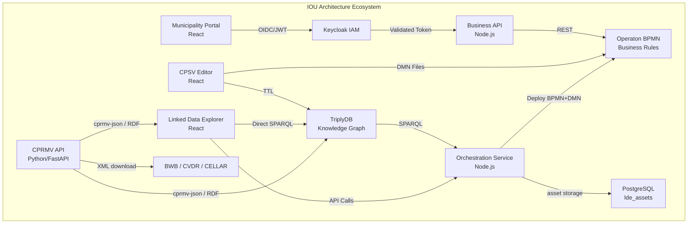

# IOU Architecture Documentation

Welcome to the comprehensive documentation for the IOU Architecture Framework and the RONL ecosystem.

---

## 🆕 What's New

-   **⚙️ RONL Business API — v3.0.7** · *May 2026*

    ---

    **V2 caseworker dashboard live in production**

    The redesigned [V2 caseworker dashboard](ronl-business-api/features/caseworker-dashboard-v2.md) is now the available at `/dashboard/caseworker/v2`; the V1 shell will be retired. A three-mode information architecture (Werk · Zoeken · Beheer) replaces the flat 25-item nav, with a ⌘K command palette and a toggleable AI assistant dock. Production brought to full parity with acceptance.

    [:octicons-arrow-right-24: Full changelog](ronl-business-api/developer/changelog-roadmap.md)

-   **🖍️ Norm Editor — v0.0.1** · *June 2026*

    ---

    **Joins the documentation site**

    The Norm Editor (Regeleditor) is now documented: a guided workflow for interpreting legal sources into FLINT Fact, Act, and Claim-duty frames, with source annotation, AND/OR/NOT preconditions, optional BERTje-based NLP suggestions for act constituents, and a lossless round trip to RDF in TriplyDB. Features, User Guide, Developer Docs, and Reference are all available.

    [:octicons-arrow-right-24: Documentation](norm-editor/index.md)
    
-   **✏️ CPSV Editor — v1.10.2** · *June 2026*

    ---

    **CPRMV 0.4.1 & CPSV-AP 3.2.0 conformance**

    Editor-generated Turtle now validates clean against the [CPRMV 0.4.1](cpsv-editor/reference/namespace-property-reference.md) and CPSV-AP 3.2.0 SHACL shapes — `cprmv:RuleSet`/`cprmv:RuleMethod` grouping, `dct:spatial` organisations, and an [advisory pre-publish SHACL check](cpsv-editor/features/triplydb-publishing.md). Decision models can also be handed off straight from the Linked Data Explorer via the new [DSO → DMN deep-link import](cpsv-editor/features/dso-import.md).

    [:octicons-arrow-right-24: Full changelog](cpsv-editor/developer/changelog-roadmap.md)

-   **🔍 Linked Data Explorer — v1.9.1** · *June 2026*

    ---

    **SHACL validation against CPSV-AP 3.2.0 and RONL shapes before publishing**

    A new SHACL Validator view validates CPSV-AP Turtle against two layers — the canonical CPSV-AP 3.2.0 shapes (vendored verbatim from SEMIC, 32 shapes) and RONL-authored uniqueness shapes — before records are published to TriplyDB. Validate a file on its own, or in **merge-simulated** mode, which first unions it with the already-published graph via a read-only SPARQL `CONSTRUCT` — catching collisions that only emerge at publication time, such as an organisation whose `foaf:homepage` diverges between publications, or several `cpsv:Rule` blocks sharing one subject URI. Backed by `POST /v1/shacl/validate` and `/validate-merged`, with per-layer results and offending-value listing.

    [:octicons-arrow-right-24: SHACL Validator](linked-data-explorer/features/shacl-validator.md)

-   **📜 CPRMV API — v0.4.1** · *June 2026*

    ---

    **CPRMV 0.4.1 conformance & reference resolution**

    RuleSets are now FRBR Works (`frbroo:F1_Work`); `/ref` auto-detects Juriconnect, ELI (to EU CELLAR), and CPRMV-API references; new `/cellar-by-celex` and `/cellar-by-eli` redirects; `unformat` works across all output formats; and the API now exposes a basic [MCP server](cprmv-api/reference/api-endpoints.md) at `/mcp`.

    [:octicons-arrow-right-24: Full changelog](cprmv-api/developer/changelog-roadmap.md)

---

## What is IOU Architecture?

The Information Architecture Framework for IOU integrates semantic web technologies, decision models, and Dutch government standards into a unified system for managing regulatory compliance and spatial planning.

<figure style="width:100%; margin:0;">
  <iframe src="architecture-diagram.html"
          width="100%"
          height="700px"
          frameborder="0"
          style="border-radius:12px; display:block;">
  </iframe>
  <figcaption>IOU Architecture — interactive overview of the ecosystem components and their relationships</figcaption>
</figure>

---

## Architecture Overview

```mermaid
graph TB
    subgraph "IOU Architecture Ecosystem"
        A[Municipality Portal<br/>React] -->|OIDC/JWT| B[Keycloak IAM]
        B -->|Validated Token| C[Business API<br/>Node.js]
        C -->|REST| D[Operaton BPMN<br/>Business Rules]

        E[CPSV Editor<br/>React] -->|TTL| F[TriplyDB<br/>Knowledge Graph]
        E -->|DMN Files| D

        F -->|SPARQL| G[Orchestration Service<br/>Node.js]
        G -->|Deploy BPMN+DMN| D
        G -->|asset storage| K[PostgreSQL<br/>lde_assets]

        H[Linked Data Explorer<br/>React] -->|API Calls| G
        H -->|Direct SPARQL| F

        I[CPRMV API<br/>Python/FastAPI] -->|XML download| J[BWB / CVDR / CELLAR]
        I -->|cprmv-json / RDF| F
        I -->|cprmv-json / RDF| H
    end
```

---

## Ecosystem Components

### ⚙️ RONL Business API

The core business API layer that provides secure authentication and process orchestration for Dutch government services.

**Live App**: [mijn.open-regels.nl](https://mijn.open-regels.nl)

[View Documentation →](ronl-business-api/index.md){ .md-button }

### 🖍️ Norm Editor

Vue/Quasar application for creating FLINT interpretations of legal sources: load a normative text, annotate fragments, and build Fact, Act, and Claim-duty frames that export to RDF in TriplyDB. Backed by NLP, unwrap, and wrap-up services.

[View Documentation →](norm-editor/index.md){ .md-button }

### ✏️ CPSV Editor

React-based application for creating CPSV-AP 3.2.0 compliant RDF/Turtle files for Dutch government services.

**Live App**: [cpsv-editor.open-regels.nl](https://cpsv-editor.open-regels.nl)

[View Documentation →](cpsv-editor/index.md){ .md-button }

### 🔍 Linked Data Explorer

Web application for SPARQL queries and BPMN & DMN orchestration with TriplyDB integration.

**Live App**: [linkeddata.open-regels.nl](https://linkeddata.open-regels.nl)

[View Documentation →](linked-data-explorer/index.md){ .md-button }

### 📜 CPRMV API

Python/FastAPI service that fetches individual rules from Dutch and European legal publications on the fly, transforming them to CPRMV-structured RDF. Implements the Core Public Rule Management Vocabulary standard and hosts the CPRMV specification.

**Live App**: [cprmv.open-regels.nl/docs](https://cprmv.open-regels.nl/docs)  

[View Documentation →](cprmv-api/index.md){ .md-button }

---

## Documentation Status

  

    
Loading documentation status…

  

---

## Quick Links

| Resource                 | Link                                                                           |
| ------------------------ | ------------------------------------------------------------------------------ |
| **CPSV Editor**          | [cpsv-editor.open-regels.nl](https://cpsv-editor.open-regels.nl)               |
| **Linked Data Explorer** | [linkeddata.open-regels.nl](https://linkeddata.open-regels.nl)                 |
| **Backend API**          | [backend.linkeddata.open-regels.nl](https://backend.linkeddata.open-regels.nl) |
| **Keycloak IAM**         | [keycloak.open-regels.nl](https://keycloak.open-regels.nl)                     |
| **Custom Business API**  | [api.open-regels.nl](https://api.open-regels.nl)                               |
| **Operaton**             | [operaton.open-regels.nl](https://operaton.open-regels.nl)                     |
| **CPRMV API**            | [cprmv.open-regels.nl/docs](https://cprmv.open-regels.nl/docs)                 |

---

## Technology Stack

The IOU Architecture ecosystem is - apart from TriplyDB and eDOCS - built entirely on **open source technologies**:

| Component           | Technology        | License            |
| ------------------- | ----------------- | ------------------ |
| **IAM**             | Keycloak          | Apache 2.0         |
| **BPMN Engine**     | Operaton          | Apache 2.0         |
| **Backend**         | Node.js + Express | MIT                |
| **Frontend**        | React             | MIT                |
| **Database**        | PostgreSQL        | PostgreSQL License |
| **Cache**           | Redis             | BSD 3-Clause       |
| **Reverse Proxy**   | Caddy             | Apache 2.0         |
| **Knowledge Graph** | TriplyDB          | -                  |
| **Document Mngmnt** | eDOCS             | -                  |
| **Rule API**        | Python / FastAPI  | EUPL-1.2           |

---

## Standards Compliance

- **CPSV-AP 3.2.0** - EU Public Service Vocabulary
- **CPRMV** - Core Public Rule Management Vocabulary
- **RONL** - Dutch Rules Vocabulary
- **BIO** - Baseline Informatiebeveiliging Overheid
- **NEN 7510** - Healthcare information security
- **AVG/GDPR** - Data protection

---

## Contributing

We welcome contributions! See the [Contributing Guide](contributing/index.md) for details.

---

**Documentation Version**: 1.0  
**Last Updated**: February 2026  
**License**: EUPL v1.2
