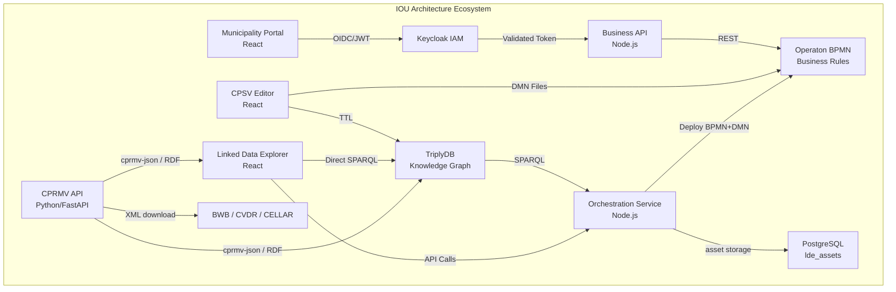

# IOU Architecture Documentation

Welcome to the comprehensive documentation for the IOU Architecture Framework and the RONL ecosystem.

---

## What is this?

### What is IOU Architecture?

The Information Architecture Framework for IOU integrates semantic web technologies, decision models, and Dutch government standards into a unified system for managing regulatory compliance and spatial planning.

<figure style="width:100%; margin:0;">
  <iframe src="architecture-diagram.html"
          width="100%"
          height="700px"
          frameborder="0"
          style="border-radius:12px; display:block;">
  </iframe>
  <figcaption>IOU Architecture — interactive overview of the ecosystem components and their relationships</figcaption>
</figure>

---

### Architecture Overview

```mermaid
graph TB
    subgraph "IOU Architecture Ecosystem"
        A[Municipality Portal<br/>React] -->|OIDC/JWT| B[Keycloak IAM]
        B -->|Validated Token| C[Business API<br/>Node.js]
        C -->|REST| D[Operaton BPMN<br/>Business Rules]

        E[CPSV Editor<br/>React] -->|TTL| F[TriplyDB<br/>Knowledge Graph]
        E -->|DMN Files| D

        F -->|SPARQL| G[Orchestration Service<br/>Node.js]
        G -->|Deploy BPMN+DMN| D
        G -->|asset storage| K[PostgreSQL<br/>lde_assets]

        H[Linked Data Explorer<br/>React] -->|API Calls| G
        H -->|Direct SPARQL| F

        I[CPRMV API<br/>Python/FastAPI] -->|XML download| J[BWB / CVDR / CELLAR]
        I -->|cprmv-json / RDF| F
        I -->|cprmv-json / RDF| H
    end
```

---

### Ecosystem Components

#### ⚙️ RONL Business API

The core business API layer that provides secure authentication and process orchestration for Dutch government services.

**Live App**: [mijn.open-regels.nl](https://mijn.open-regels.nl)

[View Documentation →](ronl-business-api/index.md){ .md-button }

#### 🖍️ Norm Editor

Vue/Quasar application for creating FLINT interpretations of legal sources: load a normative text, annotate fragments, and build Fact, Act, and Claim-duty frames that export to RDF in TriplyDB. Backed by NLP, unwrap, and wrap-up services.

[View Documentation →](norm-editor/index.md){ .md-button }

#### ✏️ CPSV Editor

React-based application for creating CPSV-AP 3.2.0 compliant RDF/Turtle files for Dutch government services.

**Live App**: [cpsv-editor.open-regels.nl](https://cpsv-editor.open-regels.nl)

[View Documentation →](cpsv-editor/index.md){ .md-button }

#### 🔍 Linked Data Explorer

Web application for SPARQL queries and BPMN & DMN orchestration with TriplyDB integration.

**Live App**: [linkeddata.open-regels.nl](https://linkeddata.open-regels.nl)

[View Documentation →](linked-data-explorer/index.md){ .md-button }

#### 📜 CPRMV API

Python/FastAPI service that fetches individual rules from Dutch and European legal publications on the fly, transforming them to CPRMV-structured RDF. Implements the Core Public Rule Management Vocabulary standard and hosts the CPRMV specification.

**Live App**: [cprmv.open-regels.nl/docs](https://cprmv.open-regels.nl/docs)  

[View Documentation →](cprmv-api/index.md){ .md-button }

---

### Technology Stack

The IOU Architecture ecosystem is - apart from TriplyDB and eDOCS - built entirely on **open source technologies**:

| Component           | Technology        | License            |
| ------------------- | ----------------- | ------------------ |
| **IAM**             | Keycloak          | Apache 2.0         |
| **BPMN Engine**     | Operaton          | Apache 2.0         |
| **Backend**         | Node.js + Express | MIT                |
| **Frontend**        | React             | MIT                |
| **Database**        | PostgreSQL        | PostgreSQL License |
| **Cache**           | Redis             | BSD 3-Clause       |
| **Reverse Proxy**   | Caddy             | Apache 2.0         |
| **Knowledge Graph** | TriplyDB          | -                  |
| **Document Mngmnt** | eDOCS             | -                  |
| **Rule API**        | Python / FastAPI  | EUPL-1.2           |

---

### Standards Compliance

- **CPSV-AP 3.2.0** - EU Public Service Vocabulary
- **CPRMV** - Core Public Rule Management Vocabulary
- **RONL** - Dutch Rules Vocabulary
- **BIO** - Baseline Informatiebeveiliging Overheid
- **NEN 7510** - Healthcare information security
- **AVG/GDPR** - Data protection

---

## What is the state of it?

### Documentation Status

  

    
Loading documentation status…

  

---

### 🆕 What's New

-   **⚙️ RONL Business API — v2026.09.11** · *September 2026*

    ---

    **A promotion is one ordered run, and the backend finally deploys itself**

    A push to `main` used to fire four deploy workflows at once with nothing sequencing them, and the frontends reliably won — so a new site could call a backend that did not yet serve its routes, and the public site would prerender that 404 straight into its deployed output. [A single promotion workflow](ronl-business-api/developer/deployment/backend.md#how-a-promotion-reaches-production) now decides what changed, deploys the backend alone, and releases the three sites only once it is serving the promoted commit. The backend [deploys from CI at last](ronl-business-api/developer/cicd.md), over OIDC and installing from the lockfile rather than re-resolving every version range on a developer's machine — and it proves itself afterwards by polling `/v1/health` until the running build is the commit just shipped. Pull-request previews became [opt-in and useful in the same release](ronl-business-api/developer/cicd.md#pull-request-previews): one is created only when someone asks for it, eight that had leaked are now reported by a check, and a preview can reach the acceptance backend instead of only proving that static pages render. On the public site, a rule's concepts [now say which side of the rules they sit on](ronl-business-api/user-guide/public-site.md) — what the rules need, and what they determine.

    [:octicons-arrow-right-24: Full changelog](ronl-business-api/developer/changelog-roadmap.md)

-   **🖍️ Norm Editor — v2026.09.1** · *September 2026*

    ---

    **A choice of NLP model, and a test suite to go with it**

    Role detection is no longer fixed to one model at deploy time: `nlp-api` carries a registry of [selectable models](norm-editor/features/nlp-assistance.md#choosing-a-model) and the Act frame form gained a dropdown to pick one, with the response echoing the model actually used so a caller can tell a fallback from a hit. Model files moved out of the service image onto mounted storage, so adding one no longer means rebuilding. July filled the other gap: [automated tests](norm-editor/developer/testing.md) across all five services and a GitLab CI pipeline that blocks the image build when they fail — this component had none before.

    [:octicons-arrow-right-24: Full changelog](norm-editor/developer/changelog-roadmap.md)
    
-   **✏️ CPSV Editor — v2026.09.7** · *September 2026*

    ---

    **What ships is what was tested, and each release keeps its bill of materials**

    The production bundle is now built on the runner, from the tree `npm ci` installed and on the Node the tests ran on, and uploaded with `skip_app_build` — until now Oryx rebuilt it inside a floating container, so the code that passed the tests and the code that shipped were different builds. Node is one exact version, 24.20.0 from `.nvmrc`, and production moved up from 22.22.0 ([Deployment](cpsv-editor/developer/deployment.md)). Every release now commits a CycloneDX SBOM of its production dependencies, a daily audit reads the lockfiles of both `acc` and `main`, and npm itself observes the 14-day cooldown Renovate already kept. Renovate never offers a major's X.0.0, ubuntu 26.04 is deferred on record, a lockfile out of step with `package.json` fails under its own name, and the build check is now required on `acc`. The editor itself is unchanged; the [suite](cpsv-editor/developer/testing.md) still stands at 763 tests, all passing.

    [:octicons-arrow-right-24: Full changelog](cpsv-editor/developer/changelog-roadmap.md)

-   **🔍 Linked Data Explorer — v2026.09.6** · *September 2026*

    ---

    **An activity's whole chain in one call, and a quality profile that shows its working**

    **On acceptance so far** — production is still serving v2026.09.5. A sixth DSO API joins the viewer, Omgevingsdocumenten Presenteren (Ozon), because an activity's chain runs through it: one call now assembles the legal source, its annotations and both rule sets into a single dossier, and scores how legible that chain is. The [Quality Profile tab](linked-data-explorer/features/dso-integration.md#activity-dossier-and-quality-profile) reports **two axes and no overall grade**, keeps Conclusie and Indieningsvereisten apart, says when a rule set is absent rather than showing zeros, and carries the evidence behind every number — down to each input's own question. A legal source now resolves per bestuurslaag, so national activities stop being refused for lacking a municipality they cannot have. The child-activity fan-out is capped at five in flight and cached for five minutes, the Flevoland Thuisbatterij bundle finally reaches the Modeler, and the deploy modal asks the backend which Operaton it deploys to. Node moved to one `.nvmrc` at 24.21.0 — and a probe now checks the native binding on the **deployed app**, after a green deploy left DMN validation broken for every user.

    [:octicons-arrow-right-24: Full changelog](linked-data-explorer/developer/changelog-roadmap.md)

-   **📜 CPRMV API — v0.4.1** · *June 2026*

    ---

    **CPRMV 0.4.1 conformance & reference resolution**

    RuleSets are now FRBR Works (`frbroo:F1_Work`); `/ref` auto-detects Juriconnect, ELI (to EU CELLAR), and CPRMV-API references; new `/cellar-by-celex` and `/cellar-by-eli` redirects; `unformat` works across all output formats; and the API now exposes a basic [MCP server](cprmv-api/reference/api-endpoints.md) at `/mcp`.

    [:octicons-arrow-right-24: Full changelog](cprmv-api/developer/changelog-roadmap.md)

---

### 🎞️ Slide decks

Four topics also exist as slide decks. Each has a page showing every slide with its
text, next to the prose it summarises, and the PDF to download.

| Deck | Where | Slides | What it covers | As of | PDF |
|---|---|--:|---|---|---|
| [IOU Architecture](iou-architecture-deck.md) | Site-wide | 25 | The whole ecosystem, from quoted legal text to the decision the citizen sees — the four boards and the public knowledge base, then how it is built and safeguarded. Slides in Dutch | 30 Aug 2026 | [1.0 MB](assets/downloads/iou-architecture-deck.pdf) |
| [DMN to Linked Data Workflow](cpsv-editor/user-guide/dmn-workflow.md) | CPSV Editor · User Guide | 9 | From a legal body's DMN export to a tested decision service published as linked data — Amsterdam, SZW and Den Haag — and three questions for a standardisation body | 18 Sep 2026 | [261 KB](assets/downloads/dmn-to-linked-data-workflow.pdf) |
| [DSO Viewer APIs](linked-data-explorer/features/dso-viewer-apis-deck.md) | Linked Data Explorer · Features | 13 | How the DSO Viewer talks to the Digitaal Stelsel Omgevingswet — the proxy, the six upstream APIs, what each tab calls, and how an activity's dossier is assembled | 24 Sep 2026 | [184 KB](assets/downloads/dso-viewer-apis-deck.pdf) |
| [CI Posture Across Repos](contributing/ci-posture-deck.md) | Contributing | 5 | The four CI controls on the CPSV Editor and the Linked Data Explorer, and the delivery decision they lead to | 11 Sep 2026 | [127 KB](assets/downloads/ci-posture-across-repos-deck.pdf) |

A deck is a snapshot of its date, and each page states what it was checked against.

---

## How do I work on it?

### Development Workflow

- **Design** — for features where the UX is substantial, work starts in Claude Design; small changes skip straight to implementation.
- **Handoff** — a finished design leaves as a briefing package for the next stage, not as code.
- **Implementation** — happens in Claude Code, following red/green TDD: a failing test first, then the minimum code needed to pass it.
- **Release** — each of the application repositories cuts its own release with a versioning command tailored to its changelog.
- **Documentation** — once a component ships, these docs are brought back into sync with it.

[Development Workflow →](contributing/development-workflow/overview.md){ .md-button }

Not part of the core team? Start from the [Contributing Guide](contributing/index.md) instead.

---

### Contributing

We welcome contributions! See the [Contributing Guide](contributing/index.md) for details.

---

### Quick Links

| Resource                 | Link                                                                           |
| ------------------------ | ------------------------------------------------------------------------------ |
| **CPSV Editor**          | [cpsv-editor.open-regels.nl](https://cpsv-editor.open-regels.nl)               |
| **Linked Data Explorer** | [linkeddata.open-regels.nl](https://linkeddata.open-regels.nl)                 |
| **Backend API**          | [backend.linkeddata.open-regels.nl](https://backend.linkeddata.open-regels.nl) |
| **Keycloak IAM**         | [keycloak.open-regels.nl](https://keycloak.open-regels.nl)                     |
| **Custom Business API**  | [api.open-regels.nl](https://api.open-regels.nl)                               |
| **Operaton**             | [operaton.open-regels.nl](https://operaton.open-regels.nl)                     |
| **CPRMV API**            | [cprmv.open-regels.nl/docs](https://cprmv.open-regels.nl/docs)                 |

---

**Documentation Version**: 1.0  
**Last Updated**: February 2026  
**License**: EUPL v1.2
