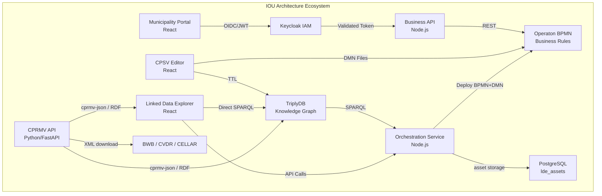

# IOU Architecture Documentation

Welcome to the comprehensive documentation for the IOU Architecture Framework and the RONL ecosystem.

---

## What is this?

### What is IOU Architecture?

The Information Architecture Framework for IOU integrates semantic web technologies, decision models, and Dutch government standards into a unified system for managing regulatory compliance and spatial planning.

<figure style="width:100%; margin:0;">
  <iframe src="architecture-diagram.html"
          width="100%"
          height="700px"
          frameborder="0"
          style="border-radius:12px; display:block;">
  </iframe>
  <figcaption>IOU Architecture — interactive overview of the ecosystem components and their relationships</figcaption>
</figure>

---

### Architecture Overview

```mermaid
graph TB
    subgraph "IOU Architecture Ecosystem"
        A[Municipality Portal<br/>React] -->|OIDC/JWT| B[Keycloak IAM]
        B -->|Validated Token| C[Business API<br/>Node.js]
        C -->|REST| D[Operaton BPMN<br/>Business Rules]

        E[CPSV Editor<br/>React] -->|TTL| F[TriplyDB<br/>Knowledge Graph]
        E -->|DMN Files| D

        F -->|SPARQL| G[Orchestration Service<br/>Node.js]
        G -->|Deploy BPMN+DMN| D
        G -->|asset storage| K[PostgreSQL<br/>lde_assets]

        H[Linked Data Explorer<br/>React] -->|API Calls| G
        H -->|Direct SPARQL| F

        I[CPRMV API<br/>Python/FastAPI] -->|XML download| J[BWB / CVDR / CELLAR]
        I -->|cprmv-json / RDF| F
        I -->|cprmv-json / RDF| H
    end
```

---

### Ecosystem Components

#### ⚙️ RONL Business API

The core business API layer that provides secure authentication and process orchestration for Dutch government services.

**Live App**: [mijn.open-regels.nl](https://mijn.open-regels.nl)

[View Documentation →](ronl-business-api/index.md){ .md-button }

#### 🖍️ Norm Editor

Vue/Quasar application for creating FLINT interpretations of legal sources: load a normative text, annotate fragments, and build Fact, Act, and Claim-duty frames that export to RDF in TriplyDB. Backed by NLP, unwrap, and wrap-up services.

[View Documentation →](norm-editor/index.md){ .md-button }

#### ✏️ CPSV Editor

React-based application for creating CPSV-AP 3.2.0 compliant RDF/Turtle files for Dutch government services.

**Live App**: [cpsv-editor.open-regels.nl](https://cpsv-editor.open-regels.nl)

[View Documentation →](cpsv-editor/index.md){ .md-button }

#### 🔍 Linked Data Explorer

Web application for SPARQL queries and BPMN & DMN orchestration with TriplyDB integration.

**Live App**: [linkeddata.open-regels.nl](https://linkeddata.open-regels.nl)

[View Documentation →](linked-data-explorer/index.md){ .md-button }

#### 📜 CPRMV API

Python/FastAPI service that fetches individual rules from Dutch and European legal publications on the fly, transforming them to CPRMV-structured RDF. Implements the Core Public Rule Management Vocabulary standard and hosts the CPRMV specification.

**Live App**: [cprmv.open-regels.nl/docs](https://cprmv.open-regels.nl/docs)  

[View Documentation →](cprmv-api/index.md){ .md-button }

---

### Technology Stack

The IOU Architecture ecosystem is - apart from TriplyDB and eDOCS - built entirely on **open source technologies**:

| Component           | Technology        | License            |
| ------------------- | ----------------- | ------------------ |
| **IAM**             | Keycloak          | Apache 2.0         |
| **BPMN Engine**     | Operaton          | Apache 2.0         |
| **Backend**         | Node.js + Express | MIT                |
| **Frontend**        | React             | MIT                |
| **Database**        | PostgreSQL        | PostgreSQL License |
| **Cache**           | Redis             | BSD 3-Clause       |
| **Reverse Proxy**   | Caddy             | Apache 2.0         |
| **Knowledge Graph** | TriplyDB          | -                  |
| **Document Mngmnt** | eDOCS             | -                  |
| **Rule API**        | Python / FastAPI  | EUPL-1.2           |

---

### Standards Compliance

- **CPSV-AP 3.2.0** - EU Public Service Vocabulary
- **CPRMV** - Core Public Rule Management Vocabulary
- **RONL** - Dutch Rules Vocabulary
- **BIO** - Baseline Informatiebeveiliging Overheid
- **NEN 7510** - Healthcare information security
- **AVG/GDPR** - Data protection

---

## What is the state of it?

### Documentation Status

  

    
Loading documentation status…

  

---

### 🆕 What's New

-   **⚙️ RONL Business API — v2026.09.9** · *September 2026*

    ---

    **Every deployed process shows, and a red suite now blocks the merge**

    The [public process library](ronl-business-api/features/procesbibliotheek.md) had been filtering on a status value the source database cannot hold, so production showed nothing at all; visibility now follows board ownership, the status is displayed rather than hidden, and the escape hatch that had been standing in for it is gone. In CI, the build and test checks [became required on `acc`](ronl-business-api/developer/cicd.md) — which took a mechanism as well as a ruleset, since a workflow filtered out at its trigger never reports the check it owes. A 14-day package-manager cooldown, every job on `ubuntu-24.04` and `.nvmrc` at 22.23.2 closed three more of [ICTU's recommendations](contributing/ictu-dependency-guideline.md). Before that, v2026.09.8 [accepted ValidSign's callbacks](ronl-business-api/developer/validsign-signing.md) in the form ValidSign actually sends — the first live signing showed every one being rejected — and a new R2.1 project [is now named when it starts](ronl-business-api/user-guide/infra-board.md) instead of appearing as a dash.

    [:octicons-arrow-right-24: Full changelog](ronl-business-api/developer/changelog-roadmap.md)

-   **🖍️ Norm Editor — v2026.09.1** · *September 2026*

    ---

    **A choice of NLP model, and a test suite to go with it**

    Role detection is no longer fixed to one model at deploy time: `nlp-api` carries a registry of [selectable models](norm-editor/features/nlp-assistance.md#choosing-a-model) and the Act frame form gained a dropdown to pick one, with the response echoing the model actually used so a caller can tell a fallback from a hit. Model files moved out of the service image onto mounted storage, so adding one no longer means rebuilding. July filled the other gap: [automated tests](norm-editor/developer/testing.md) across all five services and a GitLab CI pipeline that blocks the image build when they fail — this component had none before.

    [:octicons-arrow-right-24: Full changelog](norm-editor/developer/changelog-roadmap.md)
    
-   **✏️ CPSV Editor — v2026.09.6** · *September 2026*

    ---

    **The error says why again, and previews stop outliving their pull requests**

    The Linked Data Explorer backend now answers every error as RFC 9457 problem details, and the editor [reads them](cpsv-editor/developer/dmn-implementation.md#reading-the-backends-error-messages-v2026096) — so DMN validation, deployment, SHACL validation and the TriplyDB service update show the server's reason again instead of generic text. A DSO import opens the DMN tab with the model in it, where it used to highlight the tab over an empty panel. Preview environments close from a workflow with no path filter, and each release lists any that were orphaned anyway. `npm start` and every push now check the install against the lockfile first, and the last four Semgrep findings are answered in the source rather than the dashboard. The [suite](cpsv-editor/developer/testing.md) stands at 763 tests and three end-to-end journeys, all passing.

    [:octicons-arrow-right-24: Full changelog](cpsv-editor/developer/changelog-roadmap.md)

-   **🔍 Linked Data Explorer — v2026.09.5** · *September 2026*

    ---

    **The API describes itself, and stops fetching whatever it is told**

    `/v1/openapi.json` now serves a complete OpenAPI 3.1 description — 63 paths, linted against the NL API Design Rules in CI, every route response validated against it — and the [API Specification](linked-data-explorer/reference/api-specification.md) renders it live. Every error is RFC 9457 problem details, and a malformed body or a bad field is a `400` instead of a `500`. Before this release the production backend would request any host a caller named; now every caller-supplied endpoint must be public `https:`, processes deploy only to the configured Operaton, and the SPARQL editor goes through the backend instead of a third-party proxy. The frontend gains a report-only Content-Security-Policy and builds Tailwind instead of loading it from a CDN, the DSO Explorer reaches any authority by level, and the SHACL validator no longer passes a file it never checked. The release was [verified on both environments](linked-data-explorer/developer/deployment.md#post-deployment-verification), and the [suites](linked-data-explorer/developer/testing.md) stand at 2821 tests.

    [:octicons-arrow-right-24: Full changelog](linked-data-explorer/developer/changelog-roadmap.md)

-   **📜 CPRMV API — v0.4.1** · *June 2026*

    ---

    **CPRMV 0.4.1 conformance & reference resolution**

    RuleSets are now FRBR Works (`frbroo:F1_Work`); `/ref` auto-detects Juriconnect, ELI (to EU CELLAR), and CPRMV-API references; new `/cellar-by-celex` and `/cellar-by-eli` redirects; `unformat` works across all output formats; and the API now exposes a basic [MCP server](cprmv-api/reference/api-endpoints.md) at `/mcp`.

    [:octicons-arrow-right-24: Full changelog](cprmv-api/developer/changelog-roadmap.md)

---

### 🎞️ Slide decks

Four topics also exist as slide decks. Each has a page showing every slide with its
text, next to the prose it summarises, and the PDF to download.

| Deck | Where | Slides | What it covers | As of | PDF |
|---|---|--:|---|---|---|
| [IOU Architecture](iou-architecture-deck.md) | Site-wide | 25 | The whole ecosystem, from quoted legal text to the decision the citizen sees — the four boards and the public knowledge base, then how it is built and safeguarded. Slides in Dutch | 30 Aug 2026 | [1.0 MB](assets/downloads/iou-architecture-deck.pdf) |
| [DMN to Linked Data Workflow](cpsv-editor/user-guide/dmn-workflow.md) | CPSV Editor · User Guide | 9 | From a legal body's DMN export to a tested decision service published as linked data — Amsterdam, SZW and Den Haag — and three questions for a standardisation body | 18 Sep 2026 | [261 KB](assets/downloads/dmn-to-linked-data-workflow.pdf) |
| [DSO Viewer APIs](linked-data-explorer/features/dso-viewer-apis-deck.md) | Linked Data Explorer · Features | 12 | How the DSO Viewer talks to the Digitaal Stelsel Omgevingswet — the proxy, the five upstream APIs, and what each tab calls | 24 Aug 2026 | [121 KB](assets/downloads/dso-viewer-apis-deck.pdf) |
| [CI Posture Across Repos](contributing/ci-posture-deck.md) | Contributing | 5 | The four CI controls on the CPSV Editor and the Linked Data Explorer, and the delivery decision they lead to | 11 Sep 2026 | [127 KB](assets/downloads/ci-posture-across-repos-deck.pdf) |

A deck is a snapshot of its date, and each page states what it was checked against.

---

## How do I work on it?

### Development Workflow

- **Design** — for features where the UX is substantial, work starts in Claude Design; small changes skip straight to implementation.
- **Handoff** — a finished design leaves as a briefing package for the next stage, not as code.
- **Implementation** — happens in Claude Code, following red/green TDD: a failing test first, then the minimum code needed to pass it.
- **Release** — each of the application repositories cuts its own release with a versioning command tailored to its changelog.
- **Documentation** — once a component ships, these docs are brought back into sync with it.

[Development Workflow →](contributing/development-workflow/overview.md){ .md-button }

Not part of the core team? Start from the [Contributing Guide](contributing/index.md) instead.

---

### Contributing

We welcome contributions! See the [Contributing Guide](contributing/index.md) for details.

---

### Quick Links

| Resource                 | Link                                                                           |
| ------------------------ | ------------------------------------------------------------------------------ |
| **CPSV Editor**          | [cpsv-editor.open-regels.nl](https://cpsv-editor.open-regels.nl)               |
| **Linked Data Explorer** | [linkeddata.open-regels.nl](https://linkeddata.open-regels.nl)                 |
| **Backend API**          | [backend.linkeddata.open-regels.nl](https://backend.linkeddata.open-regels.nl) |
| **Keycloak IAM**         | [keycloak.open-regels.nl](https://keycloak.open-regels.nl)                     |
| **Custom Business API**  | [api.open-regels.nl](https://api.open-regels.nl)                               |
| **Operaton**             | [operaton.open-regels.nl](https://operaton.open-regels.nl)                     |
| **CPRMV API**            | [cprmv.open-regels.nl/docs](https://cprmv.open-regels.nl/docs)                 |

---

**Documentation Version**: 1.0  
**Last Updated**: February 2026  
**License**: EUPL v1.2
