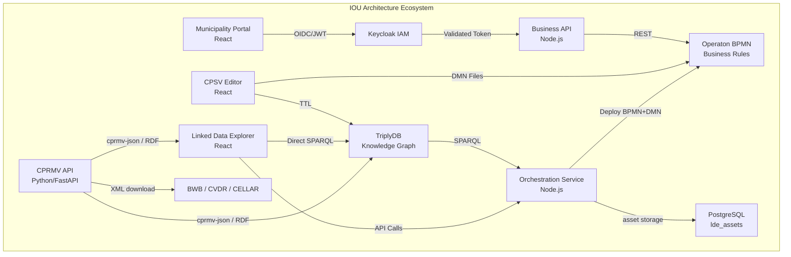

# IOU Architecture Documentation

Welcome to the comprehensive documentation for the IOU Architecture Framework and the RONL ecosystem.

---

## What is this?

### What is IOU Architecture?

The Information Architecture Framework for IOU integrates semantic web technologies, decision models, and Dutch government standards into a unified system for managing regulatory compliance and spatial planning.

<figure style="width:100%; margin:0;">
  <iframe src="architecture-diagram.html"
          width="100%"
          height="700px"
          frameborder="0"
          style="border-radius:12px; display:block;">
  </iframe>
  <figcaption>IOU Architecture — interactive overview of the ecosystem components and their relationships</figcaption>
</figure>

---

### Architecture Overview

```mermaid
graph TB
    subgraph "IOU Architecture Ecosystem"
        A[Municipality Portal<br/>React] -->|OIDC/JWT| B[Keycloak IAM]
        B -->|Validated Token| C[Business API<br/>Node.js]
        C -->|REST| D[Operaton BPMN<br/>Business Rules]

        E[CPSV Editor<br/>React] -->|TTL| F[TriplyDB<br/>Knowledge Graph]
        E -->|DMN Files| D

        F -->|SPARQL| G[Orchestration Service<br/>Node.js]
        G -->|Deploy BPMN+DMN| D
        G -->|asset storage| K[PostgreSQL<br/>lde_assets]

        H[Linked Data Explorer<br/>React] -->|API Calls| G
        H -->|Direct SPARQL| F

        I[CPRMV API<br/>Python/FastAPI] -->|XML download| J[BWB / CVDR / CELLAR]
        I -->|cprmv-json / RDF| F
        I -->|cprmv-json / RDF| H
    end
```

---

### Ecosystem Components

#### ⚙️ RONL Business API

The core business API layer that provides secure authentication and process orchestration for Dutch government services.

**Live App**: [mijn.open-regels.nl](https://mijn.open-regels.nl)

[View Documentation →](ronl-business-api/index.md){ .md-button }

#### 🖍️ Norm Editor

Vue/Quasar application for creating FLINT interpretations of legal sources: load a normative text, annotate fragments, and build Fact, Act, and Claim-duty frames that export to RDF in TriplyDB. Backed by NLP, unwrap, and wrap-up services.

[View Documentation →](norm-editor/index.md){ .md-button }

#### ✏️ CPSV Editor

React-based application for creating CPSV-AP 3.2.0 compliant RDF/Turtle files for Dutch government services.

**Live App**: [cpsv-editor.open-regels.nl](https://cpsv-editor.open-regels.nl)

[View Documentation →](cpsv-editor/index.md){ .md-button }

#### 🔍 Linked Data Explorer

Web application for SPARQL queries and BPMN & DMN orchestration with TriplyDB integration.

**Live App**: [linkeddata.open-regels.nl](https://linkeddata.open-regels.nl)

[View Documentation →](linked-data-explorer/index.md){ .md-button }

#### 📜 CPRMV API

Python/FastAPI service that fetches individual rules from Dutch and European legal publications on the fly, transforming them to CPRMV-structured RDF. Implements the Core Public Rule Management Vocabulary standard and hosts the CPRMV specification.

**Live App**: [cprmv.open-regels.nl/docs](https://cprmv.open-regels.nl/docs)  

[View Documentation →](cprmv-api/index.md){ .md-button }

---

### Technology Stack

The IOU Architecture ecosystem is - apart from TriplyDB and eDOCS - built entirely on **open source technologies**:

| Component           | Technology        | License            |
| ------------------- | ----------------- | ------------------ |
| **IAM**             | Keycloak          | Apache 2.0         |
| **BPMN Engine**     | Operaton          | Apache 2.0         |
| **Backend**         | Node.js + Express | MIT                |
| **Frontend**        | React             | MIT                |
| **Database**        | PostgreSQL        | PostgreSQL License |
| **Cache**           | Redis             | BSD 3-Clause       |
| **Reverse Proxy**   | Caddy             | Apache 2.0         |
| **Knowledge Graph** | TriplyDB          | -                  |
| **Document Mngmnt** | eDOCS             | -                  |
| **Rule API**        | Python / FastAPI  | EUPL-1.2           |

---

### Standards Compliance

- **CPSV-AP 3.2.0** - EU Public Service Vocabulary
- **CPRMV** - Core Public Rule Management Vocabulary
- **RONL** - Dutch Rules Vocabulary
- **BIO** - Baseline Informatiebeveiliging Overheid
- **NEN 7510** - Healthcare information security
- **AVG/GDPR** - Data protection

---

## What is the state of it?

### Documentation Status

  

    
Loading documentation status…

  

---

### 🆕 What's New

-   **⚙️ RONL Business API — v2026.09.7** · *September 2026*

    ---

    **The CI alignment closes, and production says which build it is**

    The last item of the alignment landed: `acc` and `main` now carry [the same ten workflows and the same branch rules](ronl-business-api/developer/cicd.md#required-checks-and-branch-rules), with `audit` the one required check on both and all **eight of its steps blocking**. One `.nvmrc` at 22.22.0 replaced eight workflows that were building the deployed artifact on Node 20 and shipping it to a Node 22 host, and `@ronl/shared` is now [held to declarations only](ronl-business-api/developer/shared-package.md#kept-declarations-only) by a check that asks the TypeScript parser rather than a regex. On the surfaces themselves, the [public site's footer](ronl-business-api/user-guide/public-site.md#which-build-you-are-looking-at) and the caseworker changelog panel now name the build as well as the release — which is how the promotion to production was confirmed by eye. And the [prerendered public pages](ronl-business-api/features/public-publication.md#prerendered-then-revalidated) stopped trusting their build-time snapshot, which had been publishing two retired services and a Diensten count of 14 beside the dashboard's 13.

    [:octicons-arrow-right-24: Full changelog](ronl-business-api/developer/changelog-roadmap.md)

-   **🖍️ Norm Editor — v2026.09.1** · *September 2026*

    ---

    **A choice of NLP model, and a test suite to go with it**

    Role detection is no longer fixed to one model at deploy time: `nlp-api` carries a registry of [selectable models](norm-editor/features/nlp-assistance.md#choosing-a-model) and the Act frame form gained a dropdown to pick one, with the response echoing the model actually used so a caller can tell a fallback from a hit. Model files moved out of the service image onto mounted storage, so adding one no longer means rebuilding. July filled the other gap: [automated tests](norm-editor/developer/testing.md) across all five services and a GitLab CI pipeline that blocks the image build when they fail — this component had none before.

    [:octicons-arrow-right-24: Full changelog](norm-editor/developer/changelog-roadmap.md)
    
-   **✏️ CPSV Editor — v2026.09.4** · *September 2026*

    ---

    **Semgrep in the gate, and the scan reads zero**

    Semgrep Code and Supply Chain now scan every pull request and are a [required check on `acc`](contributing/dependency-scanning.md) — the half of the supply chain `check-supply-chain` could never see. The last seven findings were not waiting on an upstream release, as first thought: each had a fix inside its declared range, and **lock-file maintenance had never been turned on**. It now runs every week, and its first refresh took the scan on `acc` to **0**. Two latent parser defects are fixed where they live — iKnow mapping configs can no longer write to `Object.prototype` or compile a pattern that hangs the browser — the TTL export stops asserting a second `cprmv:id` on rules it already publishes, and two example models arrive with 121- and 65-case suites, and the route they took has [its own guide](cpsv-editor/user-guide/dmn-workflow.md). The [test suite](cpsv-editor/developer/testing.md) stands at 751 tests and three end-to-end journeys.

    [:octicons-arrow-right-24: Full changelog](cpsv-editor/developer/changelog-roadmap.md)

-   **🔍 Linked Data Explorer — v2026.09.4** · *September 2026*

    ---

    **Semgrep gates both branches, and the lockfile finally moves**

    Semgrep Code and Supply Chain now scan every pull request and are [required on `acc` and `main`](contributing/dependency-scanning.md), so the application reaches acceptance and production only through a scan of the exact commit being deployed — covering the npm tree that `check-supply-chain` never could. The first scan also showed that **Renovate maintains dependencies, not the tree**: lock-file maintenance had been enabled for a fortnight and never run, starved behind open pull requests. One forced refresh moved 338 packages and closed 63 of 66 Supply Chain findings; majors now wait for approval so it keeps its slot, and a lockfile-only change is built, tested and deployed like any other. The triage fixed three latent defects on the way, among them [wildcard CORS that a sibling route could have inherited](linked-data-explorer/developer/ropa-records.md#public-route-v1ropapublic).

    [:octicons-arrow-right-24: Full changelog](linked-data-explorer/developer/changelog-roadmap.md)

-   **📜 CPRMV API — v0.4.1** · *June 2026*

    ---

    **CPRMV 0.4.1 conformance & reference resolution**

    RuleSets are now FRBR Works (`frbroo:F1_Work`); `/ref` auto-detects Juriconnect, ELI (to EU CELLAR), and CPRMV-API references; new `/cellar-by-celex` and `/cellar-by-eli` redirects; `unformat` works across all output formats; and the API now exposes a basic [MCP server](cprmv-api/reference/api-endpoints.md) at `/mcp`.

    [:octicons-arrow-right-24: Full changelog](cprmv-api/developer/changelog-roadmap.md)

---

### 🎞️ Slide decks

Four topics also exist as slide decks. Each has a page showing every slide with its
text, next to the prose it summarises, and the PDF to download.

| Deck | Where | Slides | What it covers | As of | PDF |
|---|---|--:|---|---|---|
| [IOU Architecture](iou-architecture-deck.md) | Site-wide | 25 | The whole ecosystem, from quoted legal text to the decision the citizen sees — the four boards and the public knowledge base, then how it is built and safeguarded. Slides in Dutch | 30 Aug 2026 | [1.0 MB](assets/downloads/iou-architecture-deck.pdf) |
| [DMN to Linked Data Workflow](cpsv-editor/user-guide/dmn-workflow.md) | CPSV Editor · User Guide | 8 | From a legal body's DMN export to a tested decision service published as linked data — Amsterdam, SZW and Den Haag | 11 Sep 2026 | [208 KB](assets/downloads/dmn-to-linked-data-workflow.pdf) |
| [DSO Viewer APIs](linked-data-explorer/features/dso-viewer-apis-deck.md) | Linked Data Explorer · Features | 12 | How the DSO Viewer talks to the Digitaal Stelsel Omgevingswet — the proxy, the five upstream APIs, and what each tab calls | 24 Aug 2026 | [121 KB](assets/downloads/dso-viewer-apis-deck.pdf) |
| [CI Posture Across Repos](contributing/ci-posture-deck.md) | Contributing | 5 | The four CI controls on the CPSV Editor and the Linked Data Explorer, and the delivery decision they lead to | 11 Sep 2026 | [127 KB](assets/downloads/ci-posture-across-repos-deck.pdf) |

A deck is a snapshot of its date, and each page states what it was checked against.

---

## How do I work on it?

### Development Workflow

- **Design** — for features where the UX is substantial, work starts in Claude Design; small changes skip straight to implementation.
- **Handoff** — a finished design leaves as a briefing package for the next stage, not as code.
- **Implementation** — happens in Claude Code, following red/green TDD: a failing test first, then the minimum code needed to pass it.
- **Release** — each of the application repositories cuts its own release with a versioning command tailored to its changelog.
- **Documentation** — once a component ships, these docs are brought back into sync with it.

[Development Workflow →](contributing/development-workflow/overview.md){ .md-button }

Not part of the core team? Start from the [Contributing Guide](contributing/index.md) instead.

---

### Contributing

We welcome contributions! See the [Contributing Guide](contributing/index.md) for details.

---

### Quick Links

| Resource                 | Link                                                                           |
| ------------------------ | ------------------------------------------------------------------------------ |
| **CPSV Editor**          | [cpsv-editor.open-regels.nl](https://cpsv-editor.open-regels.nl)               |
| **Linked Data Explorer** | [linkeddata.open-regels.nl](https://linkeddata.open-regels.nl)                 |
| **Backend API**          | [backend.linkeddata.open-regels.nl](https://backend.linkeddata.open-regels.nl) |
| **Keycloak IAM**         | [keycloak.open-regels.nl](https://keycloak.open-regels.nl)                     |
| **Custom Business API**  | [api.open-regels.nl](https://api.open-regels.nl)                               |
| **Operaton**             | [operaton.open-regels.nl](https://operaton.open-regels.nl)                     |
| **CPRMV API**            | [cprmv.open-regels.nl/docs](https://cprmv.open-regels.nl/docs)                 |

---

**Documentation Version**: 1.0  
**Last Updated**: February 2026  
**License**: EUPL v1.2
