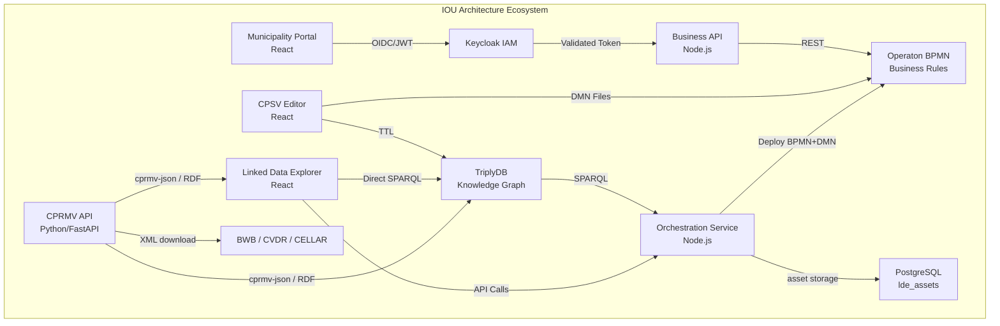

# IOU Architecture Documentation

Welcome to the comprehensive documentation for the IOU Architecture Framework and the RONL ecosystem.

---

## What is this?

### What is IOU Architecture?

The Information Architecture Framework for IOU integrates semantic web technologies, decision models, and Dutch government standards into a unified system for managing regulatory compliance and spatial planning.

<figure style="width:100%; margin:0;">
  <iframe src="architecture-diagram.html"
          width="100%"
          height="700px"
          frameborder="0"
          style="border-radius:12px; display:block;">
  </iframe>
  <figcaption>IOU Architecture — interactive overview of the ecosystem components and their relationships</figcaption>
</figure>

---

### Architecture Overview

```mermaid
graph TB
    subgraph "IOU Architecture Ecosystem"
        A[Municipality Portal<br/>React] -->|OIDC/JWT| B[Keycloak IAM]
        B -->|Validated Token| C[Business API<br/>Node.js]
        C -->|REST| D[Operaton BPMN<br/>Business Rules]

        E[CPSV Editor<br/>React] -->|TTL| F[TriplyDB<br/>Knowledge Graph]
        E -->|DMN Files| D

        F -->|SPARQL| G[Orchestration Service<br/>Node.js]
        G -->|Deploy BPMN+DMN| D
        G -->|asset storage| K[PostgreSQL<br/>lde_assets]

        H[Linked Data Explorer<br/>React] -->|API Calls| G
        H -->|Direct SPARQL| F

        I[CPRMV API<br/>Python/FastAPI] -->|XML download| J[BWB / CVDR / CELLAR]
        I -->|cprmv-json / RDF| F
        I -->|cprmv-json / RDF| H
    end
```

---

### Ecosystem Components

#### ⚙️ RONL Business API

The core business API layer that provides secure authentication and process orchestration for Dutch government services.

**Live App**: [mijn.open-regels.nl](https://mijn.open-regels.nl)

[View Documentation →](ronl-business-api/index.md){ .md-button }

#### 🖍️ Norm Editor

Vue/Quasar application for creating FLINT interpretations of legal sources: load a normative text, annotate fragments, and build Fact, Act, and Claim-duty frames that export to RDF in TriplyDB. Backed by NLP, unwrap, and wrap-up services.

[View Documentation →](norm-editor/index.md){ .md-button }

#### ✏️ CPSV Editor

React-based application for creating CPSV-AP 3.2.0 compliant RDF/Turtle files for Dutch government services.

**Live App**: [cpsv-editor.open-regels.nl](https://cpsv-editor.open-regels.nl)

[View Documentation →](cpsv-editor/index.md){ .md-button }

#### 🔍 Linked Data Explorer

Web application for SPARQL queries and BPMN & DMN orchestration with TriplyDB integration.

**Live App**: [linkeddata.open-regels.nl](https://linkeddata.open-regels.nl)

[View Documentation →](linked-data-explorer/index.md){ .md-button }

#### 📜 CPRMV API

Python/FastAPI service that fetches individual rules from Dutch and European legal publications on the fly, transforming them to CPRMV-structured RDF. Implements the Core Public Rule Management Vocabulary standard and hosts the CPRMV specification.

**Live App**: [cprmv.open-regels.nl/docs](https://cprmv.open-regels.nl/docs)  

[View Documentation →](cprmv-api/index.md){ .md-button }

---

### Technology Stack

The IOU Architecture ecosystem is - apart from TriplyDB and eDOCS - built entirely on **open source technologies**:

| Component           | Technology        | License            |
| ------------------- | ----------------- | ------------------ |
| **IAM**             | Keycloak          | Apache 2.0         |
| **BPMN Engine**     | Operaton          | Apache 2.0         |
| **Backend**         | Node.js + Express | MIT                |
| **Frontend**        | React             | MIT                |
| **Database**        | PostgreSQL        | PostgreSQL License |
| **Cache**           | Redis             | BSD 3-Clause       |
| **Reverse Proxy**   | Caddy             | Apache 2.0         |
| **Knowledge Graph** | TriplyDB          | -                  |
| **Document Mngmnt** | eDOCS             | -                  |
| **Rule API**        | Python / FastAPI  | EUPL-1.2           |

---

### Standards Compliance

- **CPSV-AP 3.2.0** - EU Public Service Vocabulary
- **CPRMV** - Core Public Rule Management Vocabulary
- **RONL** - Dutch Rules Vocabulary
- **BIO** - Baseline Informatiebeveiliging Overheid
- **NEN 7510** - Healthcare information security
- **AVG/GDPR** - Data protection

---

## What is the state of it?

### Documentation Status

  

    
Loading documentation status…

  

---

### 🆕 What's New

-   **⚙️ RONL Business API — v2026.09.5** · *September 2026*

    ---

    **Twelve of twelve phases, and diagrams the engine draws**

    The RIP ladder is complete — every phase from R2.1 to R6.1 is modelled and deployed, the endpoints no longer assume R2.1, and finishing one phase now readies a project for the next. The phase diagram is [parsed from the BPMN Operaton actually has deployed](ronl-business-api/reference/api-endpoints.md#rip-phases) rather than from a hand-kept copy, which is what had gone stale: deleting that copy revealed **38 nodes drawn invisible** across the twelve phases, rework loops rendered as coincident lines, and a finished phase coloured entirely white. R2.1 was the one phase where none of it could happen, which is why it survived every review. Along the way, 113 of the ladder's 201 user tasks turned out to be unreachable because the realm defined six of the 34 candidate groups the models address work to.

    [:octicons-arrow-right-24: Full changelog](ronl-business-api/developer/changelog-roadmap.md)

-   **🖍️ Norm Editor — v2026.09.1** · *September 2026*

    ---

    **A choice of NLP model, and a test suite to go with it**

    Role detection is no longer fixed to one model at deploy time: `nlp-api` carries a registry of [selectable models](norm-editor/features/nlp-assistance.md#choosing-a-model) and the Act frame form gained a dropdown to pick one, with the response echoing the model actually used so a caller can tell a fallback from a hit. Model files moved out of the service image onto mounted storage, so adding one no longer means rebuilding. July filled the other gap: [automated tests](norm-editor/developer/testing.md) across all five services and a GitLab CI pipeline that blocks the image build when they fail — this component had none before.

    [:octicons-arrow-right-24: Full changelog](norm-editor/developer/changelog-roadmap.md)
    
-   **✏️ CPSV Editor — v2026.09.2** · *September 2026*

    ---

    **Create React App is gone, and the branch floor is native**

    The Vite migration landed in four independently revertable phases, taking `npm audit` from 52 vulnerabilities to 10 and production builds from roughly 30 seconds to under two — with two traps the plan missed that would have *deployed green and broken*: Vite only exposes `VITE_`-prefixed variables, and `react-scripts` was where ESLint itself came from. The [P0–P7 testing roadmap is complete](cpsv-editor/developer/testing.md), 257 tests becoming 736 across 60 files plus two Playwright journeys against a live stack, and the [80% per-file branch floor](contributing/coverage-floor.md) is now enforced by the runner rather than a custom script — `DMNTab.jsx`, the largest file in the repository, went from 45.73% to 98.34%.

    [:octicons-arrow-right-24: Full changelog](cpsv-editor/developer/changelog-roadmap.md)

-   **🔍 Linked Data Explorer — v2026.09.2** · *September 2026*

    ---

    **Twelve of twelve, and every gate now blocks**

    R5.3 closes the [RIP phase ladder](linked-data-explorer/features/rip-phase-ladder.md). It was the one phase left unmodelled for want of a design, so **R5.2 and R5.4 were built to step over it** — and the sheet lands exactly where those two said it would. Alongside it, three gates stop being advisory: [`check-supply-chain`](contributing/supply-chain.md) is blocking, the backend's 1140 tests now run **on the pull request** rather than only after the merge, and the [80% per-file branch floor](contributing/coverage-floor.md) is enforced by both runners. The floor then got margin — twelve files raised, branches 90.59% to [92.88%](linked-data-explorer/developer/testing.md), with **every new test mutation-checked**, which caught five of them asserting nothing at all.

    [:octicons-arrow-right-24: Full changelog](linked-data-explorer/developer/changelog-roadmap.md)

-   **📜 CPRMV API — v0.4.1** · *June 2026*

    ---

    **CPRMV 0.4.1 conformance & reference resolution**

    RuleSets are now FRBR Works (`frbroo:F1_Work`); `/ref` auto-detects Juriconnect, ELI (to EU CELLAR), and CPRMV-API references; new `/cellar-by-celex` and `/cellar-by-eli` redirects; `unformat` works across all output formats; and the API now exposes a basic [MCP server](cprmv-api/reference/api-endpoints.md) at `/mcp`.

    [:octicons-arrow-right-24: Full changelog](cprmv-api/developer/changelog-roadmap.md)

---

### 📘 How this documentation is maintained

Components differ in how fast they change, so they are documented to different depths.

| Component | Cadence | User Guides |
|---|---|---|
| **RONL Business API** | Short-cycle, co-designed with users | Landing page and a brief page per board on ACC; full guides when a board reaches PROD |
| **CPSV Editor** | Release-tagged | Full |
| **Linked Data Explorer** | Release-tagged | Full |
| **Norm Editor** | Release-tagged | Full |
| **CPRMV API** | Spec-driven | Full |

Features, Developer Docs and References follow the same pattern for every component.

---

## How do I work on it?

### Development Workflow

- **Design** — for features where the UX is substantial, work starts in Claude Design; small changes skip straight to implementation.
- **Handoff** — a finished design leaves as a briefing package for the next stage, not as code.
- **Implementation** — happens in Claude Code, following red/green TDD: a failing test first, then the minimum code needed to pass it.
- **Release** — each of the application repositories cuts its own release with a versioning command tailored to its changelog.
- **Documentation** — once a component ships, these docs are brought back into sync with it.

[Development Workflow →](contributing/development-workflow/overview.md){ .md-button }

Not part of the core team? Start from the [Contributing Guide](contributing/index.md) instead.

---

### Contributing

We welcome contributions! See the [Contributing Guide](contributing/index.md) for details.

---

### Quick Links

| Resource                 | Link                                                                           |
| ------------------------ | ------------------------------------------------------------------------------ |
| **CPSV Editor**          | [cpsv-editor.open-regels.nl](https://cpsv-editor.open-regels.nl)               |
| **Linked Data Explorer** | [linkeddata.open-regels.nl](https://linkeddata.open-regels.nl)                 |
| **Backend API**          | [backend.linkeddata.open-regels.nl](https://backend.linkeddata.open-regels.nl) |
| **Keycloak IAM**         | [keycloak.open-regels.nl](https://keycloak.open-regels.nl)                     |
| **Custom Business API**  | [api.open-regels.nl](https://api.open-regels.nl)                               |
| **Operaton**             | [operaton.open-regels.nl](https://operaton.open-regels.nl)                     |
| **CPRMV API**            | [cprmv.open-regels.nl/docs](https://cprmv.open-regels.nl/docs)                 |

---

**Documentation Version**: 1.0  
**Last Updated**: February 2026  
**License**: EUPL v1.2
