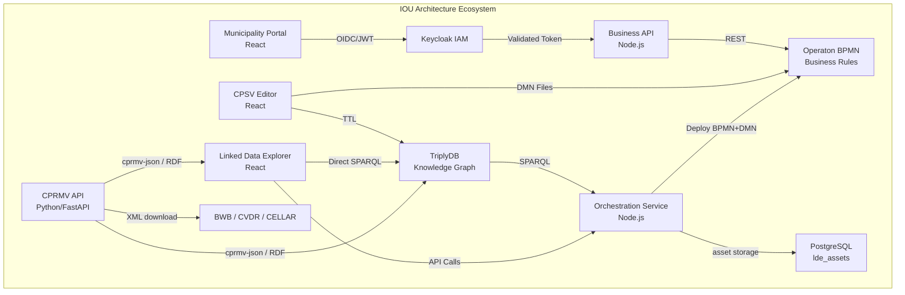

# IOU Architecture Documentation

Welcome to the comprehensive documentation for the IOU Architecture Framework and the RONL ecosystem.

---

## 📘 How this documentation is maintained

Components differ in how fast they change, so they are documented to different depths.

| Component | Cadence | User Guides |
|---|---|---|
| **RONL Business API** | Short-cycle, co-designed with users | Landing page and a brief page per board on ACC; full guides when a board reaches PROD |
| **CPSV Editor** | Release-tagged | Full |
| **Linked Data Explorer** | Release-tagged | Full |
| **Norm Editor** | Release-tagged | Full |
| **CPRMV API** | Spec-driven | Full |

Features, Developer Docs and References follow the same pattern for every component.

---

## Documentation Status

  

    
Loading documentation status…

  

---

## 🆕 What's New

-   **⚙️ RONL Business API — v2026.08.19** · *August 2026*

    ---

    **A public knowledge base, a twelve-phase portfolio ladder, and tenant-scoping closed out**

    A new [public site](ronl-business-api/user-guide/public-site.md) — a separate, auth-free package with federated search, a rule catalogue, a provenance explorer, prerendering, and axe-core accessibility scans — joins a twelve-phase RIP portfolio ladder with live phase-count and deployment-status APIs. Tenant-scoping was closed out across the platform, including a cross-tenant data leak fixed in two endpoints that queried Operaton with no tenant filter at all. A test-coverage campaign completed its final phases (P1–P11) alongside new Playwright E2E suites, and the project switched to CalVer versioning.

    [:octicons-arrow-right-24: Full changelog](ronl-business-api/developer/changelog-roadmap.md)

-   **🖍️ Norm Editor — v2026.07.0** · *July 2026*

    ---

    **First tagged release: SSR removed, SPA routing**

    The Norm Editor now cuts version-tagged releases with a generated changelog. This first tag removes the Quasar SSR server in favour of a plain SPA with client-side routing across six pages, restyles the in-app changelog viewer, and backports graph-processing internals, `wrap-up-api` updates, and UI styling from the TNO mirror.

    [:octicons-arrow-right-24: Full changelog](norm-editor/developer/changelog-roadmap.md)
    
-   **✏️ CPSV Editor — v2026.08.0** · *August 2026*

    ---

    **Cell-level legislative grounding & backend-routed DMN calls**

    Legislation can now be linked at [decision-table cell granularity](cpsv-editor/developer/cell-level-grounding.md) — finer than DMN's decision-level `knowledgeSource` or CPRMV's rule-level `isBasedOn` — published as per-cell `cprmv:Rule` resources that validate clean against the CPRMV shapes. DMN deploy and evaluate now route through the Linked Data Explorer backend instead of the browser calling Operaton directly, and a [phased test suite](cpsv-editor/developer/testing.md) of 257 tests landed alongside the switch to CalVer versioning.

    [:octicons-arrow-right-24: Full changelog](cpsv-editor/developer/changelog-roadmap.md)

-   **🔍 Linked Data Explorer — v2026.08.2** · *August 2026*

    ---

    **DMN deploy/evaluate proxies, and ten validation rules that never ran**

    Two new backend routes — [`POST /v1/dmns/deploy` and `POST /v1/dmns/evaluate/:decisionKey`](linked-data-explorer/reference/api-reference.md#post-v1dmnsdeploy) — let the CPSV Editor reach Operaton without tripping CORS. A coverage campaign took the backend from 17% to 98% statements and uncovered that [`EXEC-002`–`EXEC-010` and `CON-001`–`CON-003` had never fired](linked-data-explorer/reference/dmn-validation-reference.md) for any DMN while reporting clean results. Organization is now mandatory at BPMN deploy, sent as Operaton's native tenant-id, and a [full test suite](linked-data-explorer/developer/testing.md) of 1702 tests landed alongside the switch to CalVer.

    [:octicons-arrow-right-24: Full changelog](linked-data-explorer/developer/changelog-roadmap.md)

-   **📜 CPRMV API — v0.4.1** · *June 2026*

    ---

    **CPRMV 0.4.1 conformance & reference resolution**

    RuleSets are now FRBR Works (`frbroo:F1_Work`); `/ref` auto-detects Juriconnect, ELI (to EU CELLAR), and CPRMV-API references; new `/cellar-by-celex` and `/cellar-by-eli` redirects; `unformat` works across all output formats; and the API now exposes a basic [MCP server](cprmv-api/reference/api-endpoints.md) at `/mcp`.

    [:octicons-arrow-right-24: Full changelog](cprmv-api/developer/changelog-roadmap.md)

---

## What is IOU Architecture?

The Information Architecture Framework for IOU integrates semantic web technologies, decision models, and Dutch government standards into a unified system for managing regulatory compliance and spatial planning.

<figure style="width:100%; margin:0;">
  <iframe src="architecture-diagram.html"
          width="100%"
          height="700px"
          frameborder="0"
          style="border-radius:12px; display:block;">
  </iframe>
  <figcaption>IOU Architecture — interactive overview of the ecosystem components and their relationships</figcaption>
</figure>

---

## Architecture Overview

```mermaid
graph TB
    subgraph "IOU Architecture Ecosystem"
        A[Municipality Portal<br/>React] -->|OIDC/JWT| B[Keycloak IAM]
        B -->|Validated Token| C[Business API<br/>Node.js]
        C -->|REST| D[Operaton BPMN<br/>Business Rules]

        E[CPSV Editor<br/>React] -->|TTL| F[TriplyDB<br/>Knowledge Graph]
        E -->|DMN Files| D

        F -->|SPARQL| G[Orchestration Service<br/>Node.js]
        G -->|Deploy BPMN+DMN| D
        G -->|asset storage| K[PostgreSQL<br/>lde_assets]

        H[Linked Data Explorer<br/>React] -->|API Calls| G
        H -->|Direct SPARQL| F

        I[CPRMV API<br/>Python/FastAPI] -->|XML download| J[BWB / CVDR / CELLAR]
        I -->|cprmv-json / RDF| F
        I -->|cprmv-json / RDF| H
    end
```

---

## Ecosystem Components

### ⚙️ RONL Business API

The core business API layer that provides secure authentication and process orchestration for Dutch government services.

**Live App**: [mijn.open-regels.nl](https://mijn.open-regels.nl)

[View Documentation →](ronl-business-api/index.md){ .md-button }

### 🖍️ Norm Editor

Vue/Quasar application for creating FLINT interpretations of legal sources: load a normative text, annotate fragments, and build Fact, Act, and Claim-duty frames that export to RDF in TriplyDB. Backed by NLP, unwrap, and wrap-up services.

[View Documentation →](norm-editor/index.md){ .md-button }

### ✏️ CPSV Editor

React-based application for creating CPSV-AP 3.2.0 compliant RDF/Turtle files for Dutch government services.

**Live App**: [cpsv-editor.open-regels.nl](https://cpsv-editor.open-regels.nl)

[View Documentation →](cpsv-editor/index.md){ .md-button }

### 🔍 Linked Data Explorer

Web application for SPARQL queries and BPMN & DMN orchestration with TriplyDB integration.

**Live App**: [linkeddata.open-regels.nl](https://linkeddata.open-regels.nl)

[View Documentation →](linked-data-explorer/index.md){ .md-button }

### 📜 CPRMV API

Python/FastAPI service that fetches individual rules from Dutch and European legal publications on the fly, transforming them to CPRMV-structured RDF. Implements the Core Public Rule Management Vocabulary standard and hosts the CPRMV specification.

**Live App**: [cprmv.open-regels.nl/docs](https://cprmv.open-regels.nl/docs)  

[View Documentation →](cprmv-api/index.md){ .md-button }

---

## Quick Links

| Resource                 | Link                                                                           |
| ------------------------ | ------------------------------------------------------------------------------ |
| **CPSV Editor**          | [cpsv-editor.open-regels.nl](https://cpsv-editor.open-regels.nl)               |
| **Linked Data Explorer** | [linkeddata.open-regels.nl](https://linkeddata.open-regels.nl)                 |
| **Backend API**          | [backend.linkeddata.open-regels.nl](https://backend.linkeddata.open-regels.nl) |
| **Keycloak IAM**         | [keycloak.open-regels.nl](https://keycloak.open-regels.nl)                     |
| **Custom Business API**  | [api.open-regels.nl](https://api.open-regels.nl)                               |
| **Operaton**             | [operaton.open-regels.nl](https://operaton.open-regels.nl)                     |
| **CPRMV API**            | [cprmv.open-regels.nl/docs](https://cprmv.open-regels.nl/docs)                 |

---

## Technology Stack

The IOU Architecture ecosystem is - apart from TriplyDB and eDOCS - built entirely on **open source technologies**:

| Component           | Technology        | License            |
| ------------------- | ----------------- | ------------------ |
| **IAM**             | Keycloak          | Apache 2.0         |
| **BPMN Engine**     | Operaton          | Apache 2.0         |
| **Backend**         | Node.js + Express | MIT                |
| **Frontend**        | React             | MIT                |
| **Database**        | PostgreSQL        | PostgreSQL License |
| **Cache**           | Redis             | BSD 3-Clause       |
| **Reverse Proxy**   | Caddy             | Apache 2.0         |
| **Knowledge Graph** | TriplyDB          | -                  |
| **Document Mngmnt** | eDOCS             | -                  |
| **Rule API**        | Python / FastAPI  | EUPL-1.2           |

---

## Standards Compliance

- **CPSV-AP 3.2.0** - EU Public Service Vocabulary
- **CPRMV** - Core Public Rule Management Vocabulary
- **RONL** - Dutch Rules Vocabulary
- **BIO** - Baseline Informatiebeveiliging Overheid
- **NEN 7510** - Healthcare information security
- **AVG/GDPR** - Data protection

---

## Contributing

We welcome contributions! See the [Contributing Guide](contributing/index.md) for details.

---

**Documentation Version**: 1.0  
**Last Updated**: February 2026  
**License**: EUPL v1.2
