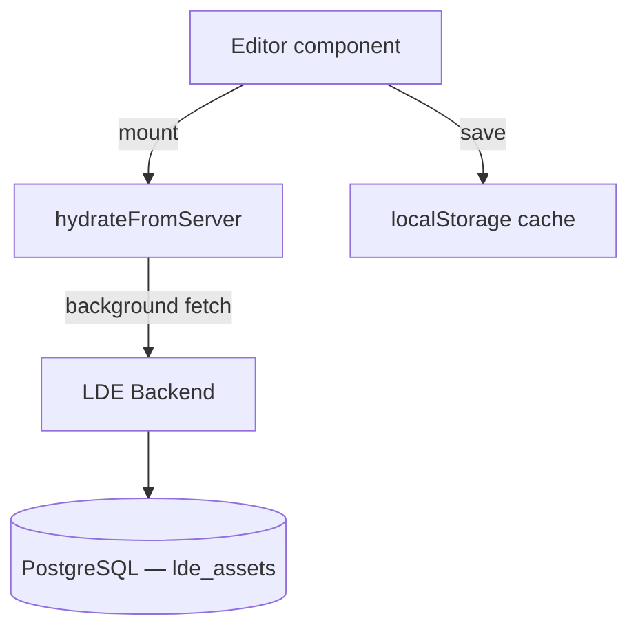

# Asset Storage

From v1.3.0, BPMN processes, form schemas, and document templates are persisted to PostgreSQL via the LDE backend. The frontend uses a **write-through cache with async hydration**: all reads are synchronous from `localStorage` (zero-latency UI), writes update `localStorage` immediately and then POST to the backend in the background, and on editor mount a `GET` hydration call replaces local non-readonly records with the authoritative server state.

---

## Architecture


---

## Write-through cache strategy

On **save**, each service:

1. Writes the updated record to `localStorage` immediately — the UI reflects the change synchronously with zero latency.
2. Fires a background `fetch` to `POST /v1/assets/{type}` — no `await`, no spinner. If the network call fails, a warning is logged to the browser console but the user experience is unaffected.

On **delete**, each service:

1. Removes the record from `localStorage` immediately.
2. Fires a background `DELETE /v1/assets/{type}/:id`.

Example assets (`readonly: true`) are never written to the backend. They are seeded on the frontend from static files in `public/examples/` and `defaultTemplates.ts`.

---

## Hydration on mount

Each editor component runs a second `useEffect` alongside the example seed effect:
```typescript
useEffect(() => {
  BpmnService.hydrateFromServer().then(setProcesses);
}, []);
```

`hydrateFromServer()` calls `GET /v1/assets/bpmn`, merges the server response with the local readonly examples, writes the merged list back to `localStorage`, and returns it. If the request fails for any reason the existing `localStorage` contents are returned unchanged and a warning is logged.

This means the editor always starts from local cache (instant render) and then silently updates with authoritative server data within one network round-trip.

---

## Database schema

### `process_definitions`
```sql
CREATE TABLE process_definitions (
  id                     UUID         PRIMARY KEY DEFAULT gen_random_uuid(),
  lde_id                 VARCHAR(255) UNIQUE NOT NULL,
  bpmn_process_id        VARCHAR(255) NOT NULL,
  name                   VARCHAR(500) NOT NULL,
  description            TEXT,
  xml                    TEXT         NOT NULL,
  process_role           VARCHAR(20)  NOT NULL DEFAULT 'standalone'
                           CHECK (process_role IN ('shell', 'subprocess', 'standalone')),
  called_element         VARCHAR(255),
  linked_dmn_templates   TEXT[]       NOT NULL DEFAULT '{}',
  status                 VARCHAR(20)  NOT NULL DEFAULT 'wip'
                           CHECK (status IN ('example', 'wip')),
  readonly               BOOLEAN      NOT NULL DEFAULT FALSE,
  schema_version         INTEGER      NOT NULL DEFAULT 1,
  deployed_at            TIMESTAMPTZ,
  operaton_url           TEXT,
  operaton_deployment_id TEXT,
  deployed_forms         TEXT[]       NOT NULL DEFAULT '{}',
  deployed_documents     TEXT[]       NOT NULL DEFAULT '{}',
  language               VARCHAR(2),                         -- v1.6.0
  organization           VARCHAR(100),                        -- v1.6.0
  created_at             TIMESTAMPTZ  NOT NULL DEFAULT NOW(),
  updated_at             TIMESTAMPTZ  NOT NULL DEFAULT NOW()
);

CREATE INDEX idx_pd_bpmn_process_id ON process_definitions (bpmn_process_id);
CREATE INDEX idx_pd_called_element  ON process_definitions (called_element)
  WHERE called_element IS NOT NULL;
CREATE INDEX idx_pd_process_role    ON process_definitions (process_role);
CREATE INDEX idx_pd_language        ON process_definitions (language)
  WHERE language IS NOT NULL;
CREATE INDEX idx_pd_organization    ON process_definitions (organization)
  WHERE organization IS NOT NULL;
```

`lde_id` is the internal LDE identifier (e.g. `process_1774384869117`). `bpmn_process_id` is the `<process id="...">` value from the BPMN XML — used for subprocess lookup during bundle assembly.

`language` (ISO 639-1, nullable) and `organization` (open-ended key, nullable) were added in v1.6.0 to drive list-panel grouping and the deploy-time language consistency check; partial indexes skip the common `NULL` case. See [Multilingualism](../features/multilingualism.md). The `deployed_*` columns were added in v1.4.0 for the deployment metadata flowback used by `listPublicBundles()`.

### `form_schemas`
```sql
CREATE TABLE form_schemas (
  id             TEXT        PRIMARY KEY,
  name           TEXT        NOT NULL,
  description    TEXT,
  schema         JSONB       NOT NULL,
  status         TEXT        DEFAULT 'wip',
  schema_version INTEGER     NOT NULL DEFAULT 1,
  language       VARCHAR(2),                  -- v1.6.0
  organization   VARCHAR(100),                 -- v1.6.0
  created_at     TIMESTAMPTZ NOT NULL,
  updated_at     TIMESTAMPTZ NOT NULL
);

CREATE INDEX idx_fs_language     ON form_schemas (language)
  WHERE language IS NOT NULL;
CREATE INDEX idx_fs_organization ON form_schemas (organization)
  WHERE organization IS NOT NULL;
```

### `document_templates`
```sql
CREATE TABLE document_templates (
  id             TEXT        PRIMARY KEY,
  name           TEXT        NOT NULL,
  description    TEXT,
  process_key    TEXT,
  service_id     TEXT,
  schema_version INTEGER     NOT NULL DEFAULT 1,
  zones          JSONB       NOT NULL,
  bindings       JSONB       NOT NULL DEFAULT '[]',
  assets         JSONB       NOT NULL DEFAULT '[]',
  status         TEXT        DEFAULT 'wip',
  language       VARCHAR(2),                  -- v1.6.0
  organization   VARCHAR(100),                 -- v1.6.0
  created_at     TIMESTAMPTZ NOT NULL,
  updated_at     TIMESTAMPTZ NOT NULL
);

CREATE INDEX idx_dt_language     ON document_templates (language)
  WHERE language IS NOT NULL;
CREATE INDEX idx_dt_organization ON document_templates (organization)
  WHERE organization IS NOT NULL;
```

---

## Migrations

Schema migrations run automatically on backend startup via `migrate()` in `src/db/migrate.ts`, called from `startServer()` in `src/index.ts`. The migration uses inline SQL with `CREATE TABLE IF NOT EXISTS` guards, making it idempotent and safe to run on every deploy.
```typescript
// src/index.ts
const startServer = async () => {
  await migrate();  // runs before app.listen()
  // ...
};
```

---

## Frontend service files

| File | Storage key | Backend prefix |
|---|---|---|
| `src/services/bpmnService.ts` | `linkedDataExplorer_bpmnProcesses` | `/v1/assets/bpmn` |
| `src/services/formService.ts` | `linkedDataExplorer_formSchemas` | `/v1/assets/forms` |
| `src/services/documentService.ts` | `linkedDataExplorer_documentTemplates` | `/v1/assets/documents` |

All three services follow the same interface: `getAll()`, `save(record)`, `delete(id)`, `getById(id)`, `hydrateFromServer()`.

---

## `BpmnProcess` type
```typescript
interface BpmnProcess {
  id: string;
  name: string;
  description?: string;
  xml: string;
  createdAt: string;
  updatedAt: string;
  linkedDmnTemplates: string[];
  readonly?: boolean;
  status?: 'example' | 'wip';
  bpmnProcessId?: string;                               // <process id="..."> from XML
  processRole?: 'shell' | 'subprocess' | 'standalone'; // hierarchy role
  calledElement?: string;                               // parent shell's bpmnProcessId
}
```

---

## Type safety — DB row types and mappers

The `assets.service.ts` functions use the three-layer DB type pattern to safely bridge PostgreSQL row data and service-layer domain objects. `pool.query<T>()` is typed with a row type from `src/db/types.ts`, and results are transformed to camelCase domain objects via pure mapper functions in `src/db/mappers.ts`. This eliminates implicit `any` casts that TypeScript strict mode rejects on some platforms, and keeps all snake_case → camelCase and `null` → `undefined` conversion in one place.

See [DB Type Layer](db-type-layer.md) for the full pattern description and guidance on adding new entities.

---

## Related pages

- [Backend Architecture](backend.md) — route and service overview
- [Local Development](local-development.md) — PostgreSQL setup for local dev
- [DB Type Layer](db-type-layer.md) — DB row types, domain types, and mapper pattern
- [Deployment](deployment.md) — Azure provisioning and App Settings
- [API Reference — Asset Storage](../reference/api-reference.md#asset-storage)