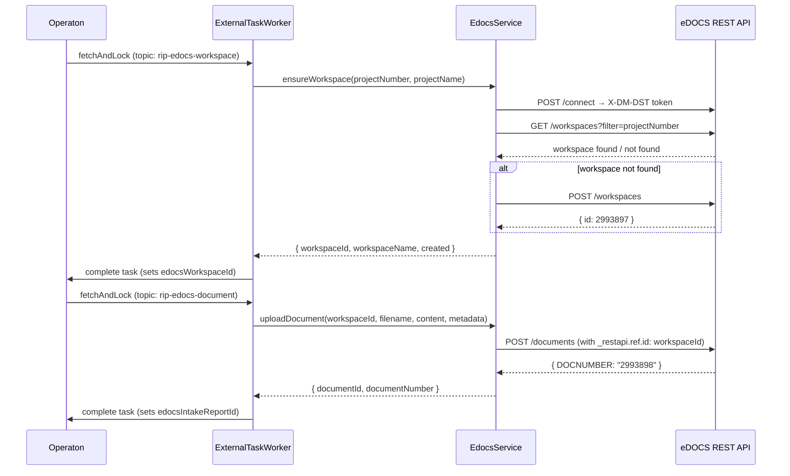

# eDOCS Integration

The LDE backend integrates with **OpenText eDOCS** — the document management system used by Province of Flevoland — to automatically file process documents into project workspaces as part of the RIP Phase 1 workflow.

The integration uses the **external task pattern**: Operaton polls the LDE backend worker via `fetchAndLock` rather than the backend calling Operaton. This keeps the coupling loose and makes the integration resilient to temporary eDOCS unavailability.

---

## Architecture



---

## EdocsService

`packages/backend/src/services/edocs.service.ts`

Wraps the eDOCS REST API with session token caching and automatic re-authentication.

### Authentication

The service authenticates once via `POST /connect`, which returns an `X-DM-DST` session token. The token is cached in memory and attached to every subsequent request via an Axios request interceptor. On a `401` or `403` response the service re-authenticates once and retries the original request automatically.

### Methods

| Method | Description |
|--------|-------------|
| `ensureWorkspace(projectNumber, projectName)` | Searches for an existing workspace by `projectNumber`. Creates one if not found. Returns `{ workspaceId, workspaceName, created }`. |
| `uploadDocument(workspaceId, filename, contentBase64, metadata)` | Uploads a base64-encoded document to the workspace. Returns `{ documentId, documentNumber }`. |
| `getWorkspaceDocuments(workspaceId)` | Lists all documents in a workspace. Used for audit and verification. |
| `healthCheck()` | Returns `{ status: 'up' | 'down' | 'stub', latencyMs? }`. |

### Workspace naming convention

Workspaces are named `<projectNumber> — <projectName>`, e.g. `123456789 — N308 Reconstructie`. The project number is used as the search key so that re-deploying or restarting the process does not create duplicate workspaces.

### Document IDs

eDOCS workspace and document IDs are plain integers (e.g. `2993896`). The `_restapi.ref.id` field in upload requests is passed as an integer — `parseInt(workspaceId, 10)`.

---

## External task worker

`packages/backend/src/services/externalTaskWorker.service.ts`

Polls Operaton using long-polling (`asyncResponseTimeout: 20 000 ms`). Two topics are subscribed:

### `rip-edocs-workspace`

Called once per process instance, immediately after the intake form is submitted.

**Variables read from Operaton:** `projectNumber`, `projectName`

**Variables written back:** `edocsWorkspaceId` (String), `edocsWorkspaceName` (String), `edocsWorkspaceCreated` (Boolean)

### `rip-edocs-document`

Called three times per process instance — once for the intake report, once for the PSU report, and once for the preliminary design principles.

The `documentTemplateId` and `edocsDocumentVariableName` are set as `camunda:inputParameter` elements on each ServiceTask in the BPMN, making this single topic handler reusable across all three document upload steps.

**Variables read from Operaton:** `edocsWorkspaceId`, `documentTemplateId`, `edocsDocumentVariableName`, plus all template-specific process variables.

**Variables written back:** `<edocsDocumentVariableName>` (String) — the eDOCS document number, e.g. `edocsIntakeReportId`.

### Worker lifecycle

The worker is started inside the `app.listen()` callback in `packages/backend/src/index.ts` and stopped cleanly in both `SIGTERM` and `SIGINT` handlers. It will not start polling until the HTTP server is fully bound.

---

## Stub mode

When `EDOCS_STUB_MODE=true` (the default), all `EdocsService` methods return realistic fake responses and log what they would have done. The worker, routes, and BPMN process behave identically — the stub is fully transparent to callers.

This allows the complete RIP Phase 1 process to run end-to-end in development and acceptance environments before a live eDOCS server is available.

To switch to a live server, set `EDOCS_STUB_MODE=false` and provide real credentials. No code changes are required.

---

## Configuration
 
Add the following to `packages/backend/.env` (see `.env.example`):
 
```env
EDOCS_BASE_URL=https://your-edocs-server.nl:port/edocsapi/v1.0
EDOCS_LIBRARY=DOCUVITP
EDOCS_USER_ID=your-user-id
EDOCS_PASSWORD=your-password
EDOCS_STUB_MODE=true
```
 
| Variable | Required | Description |
|---|---|---|
| `EDOCS_BASE_URL` | Yes (live mode) | eDOCS REST API base URL |
| `EDOCS_LIBRARY` | Yes (live mode) | eDOCS library name — `DOCUVITP` for Flevoland |
| `EDOCS_USER_ID` | Yes (live mode) | eDOCS user ID |
| `EDOCS_PASSWORD` | Yes (live mode) | eDOCS password |
| `EDOCS_STUB_MODE` | No | Defaults to `true`. Set to `false` to enable live calls. |
 
!!! warning
    Never commit real eDOCS credentials to the repository. Use Azure Key Vault references or environment-specific App Service configuration in production.
 
---
 
## Document file format (.DRF)
 
When eDOCS saves a document it produces a `.DRF` (Document Reference File) with the format:
 
```
Document;<library>;<document_number>;<version>
```
 
For example: `Document;DOCUVITP;2993896;R`
 
The document number matches the `documentNumber` field returned by `POST /v1/edocs/documents` and stored as the process variable (e.g. `edocsIntakeReportId`).
 
---
 
## REST endpoints
 
See [API Reference — eDOCS](../reference/api-reference.md#edocs) for full request and response documentation of all four `/v1/edocs` endpoints.