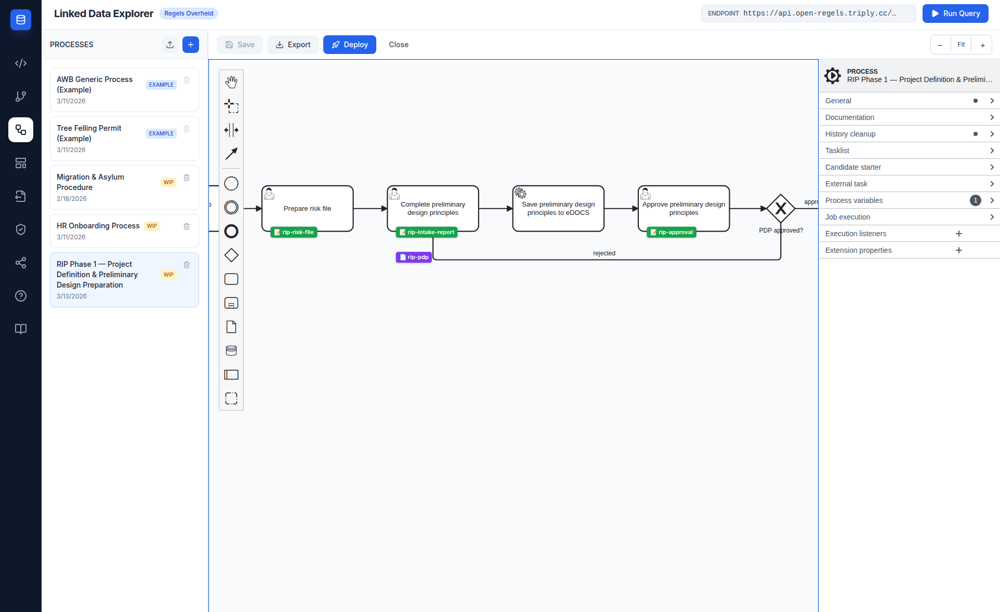
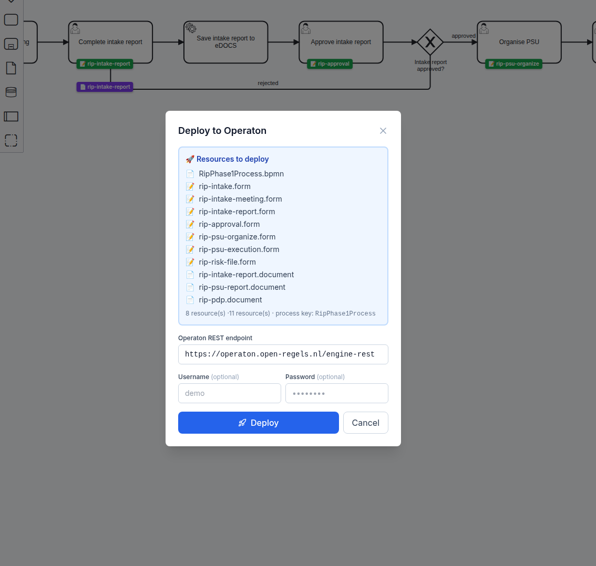
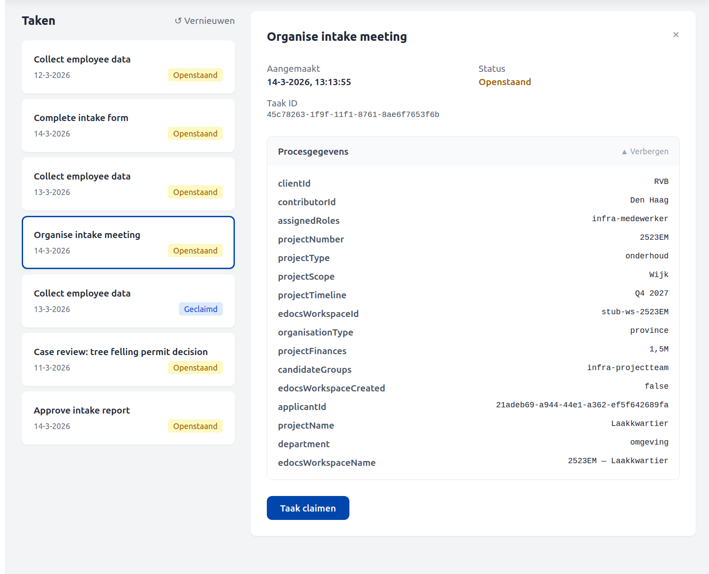

# RIP R2.1 Bundle

The **R2.1 bundle** is the first government process bundle shipped with the Linked Data Explorer for the Province of Flevoland. It automates the project-definition phase of the Regular Infrastructure Projects (RIP) workflow — *Projectplan planvoorbereiding* — from intake through to approved preliminary-design principles, and ends by handing off to the [R2.2 bundle](rip-r22-bundle.md).

It lives at `examples/organizations/flevoland/rip-phase-21/` and deploys to Operaton in a single multipart request from the BPMN Modeler's Deploy modal.

!!! info "Renamed in v2026.08.5"
    This bundle was previously `rip-phase1-swimlanes/`, and its process was
    briefly documented as `RipPhase1Process`. The `-swimlanes` suffix
    distinguished it from a competing `rip-phase1/` draft that has since been
    deleted, so it distinguished nothing. The directory is now `rip-phase-21/`
    and the process is **`RipR21Process`**, which makes `rip-phase-22/` an
    obvious sibling. If you have an older checkout or bookmark pointing at
    `rip-phase1/`, it no longer resolves.

<figure markdown style="width:100%; margin:0;">
  
  <figcaption>LDE BPMN Canvas showing part of RipR21Process with its PDP steps and the Relatics ServiceTask</figcaption>
</figure>

---

## Process flow

`RipR21Process` has **thirteen user tasks**, one service task and three approval gateways, laid out in swimlanes. Task names are in Dutch, matching the source specification and what a caseworker sees in the task list.

| # | Type | Name |
|---|---|---|
| 1 | StartEvent | Start RIP fase 1 |
| 2 | UserTask | Aanleveren Projectplan 1. Intake-formulier |
| 3 | ExclusiveGateway | Projectplan 1. Intake-formulier akkoord? |
| 4 | UserTask | Verbeteren kwaliteit 1. Intake-formulier ↺ |
| 5 | ServiceTask | Laten aanmaken workspace Relatics |
| 6 | UserTask | Organiseren intake-overleg |
| 7 | UserTask | Uitvoeren intake-overleg |
| 8 | UserTask | Aanvullen Projectplan 2. Intake-verslag |
| 9 | UserTask | Accorderen Projectplan 2. Intake-verslag |
| 10 | ExclusiveGateway | Akkoord? |
| 11 | UserTask | Opstellen risicodossier en versturen aan PL |
| 12 | UserTask | Opstellen planning en informeren PL en ondersteuner |
| 13 | UserTask | Initiëren / organiseren PSU |
| 14 | UserTask | Uitvoeren PSU en aanvullen Projectplan 3. PSU-verslag |
| 15 | UserTask | Houden overleg uitgangspunten VO-fase |
| 16 | UserTask | Aanvullen Projectplan 4. Uitgangspunten VO-fase |
| 17 | UserTask | Accorderen Projectplan 4. Uitgangspunten VO-fase |
| 18 | ExclusiveGateway | Akkoord? |
| 19 | EndEvent | Fase 1 voltooid → R2.2 |

### The phase-exit approval is signed

`Task_AccorderenProjectplan4` — *"Accorderen Projectplan 4. Uitgangspunten VO-fase"*, the task that closes the phase — carries **`ronl:signatureRef="rip-pdp"`**.

That single attribute is the switch for the whole signing feature. The RONL Business API resolves `ronl:signatureRef` on a user task and, where present, replaces that task's plain approval form with a **ValidSign signing ceremony**: the phase document is rendered from its deployed template, a signature package is created, and the Operaton task completes only once the signature lands.

---

## Bundle contents

Sixteen files deploy together: one BPMN, twelve forms and three document templates.

### BPMN

`RipR21Process.bpmn` — the executable process. Its one ServiceTask uses `camunda:type="external"` with topic **`rip-relatics-workspace`**, polled by the LDE backend external task worker.

### Forms

| File | Purpose |
|---|---|
| `rip-intake.form` | Project number, name, type, department, contributor, client, scope, budget, timeline |
| `rip-kwaliteit-verbetering.form` | Rework of a rejected intake form |
| `rip-intake-meeting.form` | Meeting date/time, location, participants, invitation sent |
| `rip-uitvoer-intake.form` | Conducting the intake meeting |
| `rip-intake-report.form` | Intake decisions, agreements, confirmed scope, budget and timeline |
| `rip-risk-file.form` | Relatics risk-dossier reference, date, preparer |
| `rip-planning.form` | Planning, and informing the project lead and supporter |
| `rip-psu-organize.form` | PSU participants, location, date, presentation prepared |
| `rip-psu-execution.form` | PSU outcomes, action points, risks, project-team roles |
| `rip-overleg-vo.form` | The VO-phase principles meeting |
| `rip-pdp-aanvullen.form` | Completing the preliminary-design principles |
| `rip-approval.form` | Reusable approval form — `approvalStatus` plus remarks, used at each gateway |

### Document templates

Three templates, each bound to the task that produces it with `ronl:documentRef`.

| File | Attached to | Key bindings |
|---|---|---|
| `rip-intake-report.document` | Aanvullen Projectplan 2. Intake-verslag | `projectNumber`, `projectName`, `confirmedScope`, `confirmedBudget`, `confirmedTimeline`, `intakeDecisions`, `intakeAgreements` |
| `rip-psu-report.document` | Uitvoeren PSU | `psDate`, `psLocation`, `psOutcomes`, `psActionPoints`, `projectManager`, `projectSupporter` |
| `rip-pdp.document` | Aanvullen Projectplan 4. | `confirmedScope`, `confirmedBudget`, `confirmedTimeline`, `riskFileReference`, `pdpNotes` |

!!! warning "Their signature blocks did not render until v2026.08.4"
    All three templates used `signoff` and `contactInfo` where `DocumentZones`
    declares `signOff` and `contactInformation`. `DocumentCanvas` iterates
    `ZONE_ORDER` and calls `getZoneBlocks('signOff')`, so the lowercase key meant
    the Signatures block was dropped **silently** — the signature lines in these
    templates had never rendered in any deployment. The same commit corrected a
    `processKey` of `RipPhase1Process`, which no longer matched the BPMN.

---

## Deploying the bundle

<figure markdown>
  
  <figcaption>The Deploy modal resolves every <code>camunda:formRef</code> and <code>ronl:documentRef</code> and posts the bundle to Operaton in one request.</figcaption>
</figure>

Open `RipR21Process.bpmn` in the BPMN Modeler and click **Deploy**. The modal resolves all `camunda:formRef` and `ronl:documentRef` attributes automatically and lists the resources it will send. Click **Deploy to Operaton**.

!!! tip
    Set a Business Key equal to the project number when starting the process
    from the Operaton Cockpit. It makes process instances easy to find later.

---

## The mirrored copy

This bundle exists twice on disk — authored under `examples/organizations/flevoland/rip-phase-21/`, imported and deployed from `e2e-fixtures/flevoland/`. A parity test asserts the two are byte-identical, and the pair opts in through `MIRRORED_BUNDLES`.

That test earns its place: the ValidSign attribute in v2026.08.6 was added to the mirror only, and the parity test failed from that commit until the copies were reconciled. See [RIP R2.2 Bundle → The mirrored copy](rip-r22-bundle.md#the-mirrored-copy) for why a break surfaces on `acc` rather than on the pull request.

---

## Starting the process

The process is designed to be started from the Human Tasks interface in MijnOmgeving, or the Operaton Tasklist — not directly from the Cockpit. Starting from the Cockpit's generic start dialog works for testing: click **Start** and the first user task appears in the task list immediately.

As of v1.9.9 a `leadRole` process variable is derived from the intake `projectType` (`contractbeheer` → `manager-pb`, otherwise `projectleider`). `leadRole` is distinct from a task's `candidateGroups`: it names who owns the project in the portfolio, not who can claim its tasks.

<figure markdown>
  
  <figcaption>The MijnOmgeving task panel showing an intake task and the process data panel.</figcaption>
</figure>

---

## Related

- [RIP R2.2 Bundle](rip-r22-bundle.md) — the phase this one hands off to
- [BPMN Modeler](bpmn-modeler.md) — the Deploy modal and the `ronl:*` attributes
- [Document Composer](document-composer.md) — templates, zones and bindings
