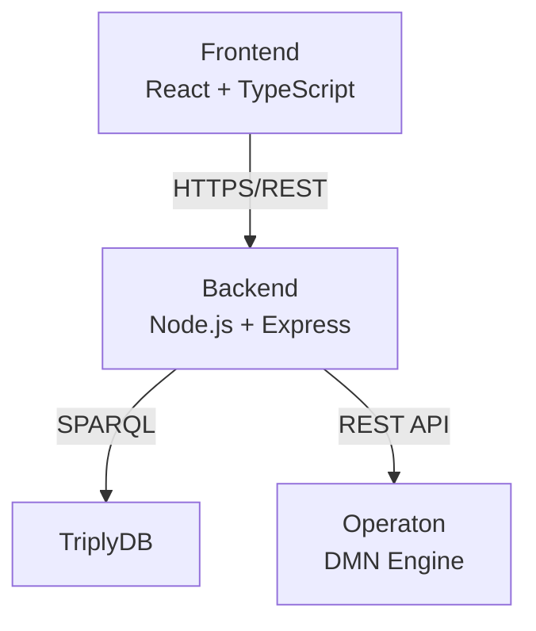

# Linked Data Explorer

## Introduction

A React-based SPARQL visualization and query tool for exploring Dutch Government Data (Regels Overheid), with specialized support for DMN (Decision Model and Notation) orchestration.

**Live Application**: [linkeddata.open-regels.nl](https://linkeddata.open-regels.nl)

## Key Features

### SPARQL Query Editor
- Syntax highlighting and query execution
- Sample query library
- Multiple endpoint support
- Interactive graph visualization

### DMN Discovery
- Automatic discovery from TriplyDB
- Search and filter capabilities
- Variable inspection (inputs/outputs)
- Chain detection based on variable matching

### Chain Building
- Drag-and-drop interface
- Smart validation
- Variable orchestration
- Template system
- Export as JSON or BPMN 2.0

## Quick Links

- [Features Overview](features.md)
- [Getting Started Guide](user-guide/getting-started.md)
- [API Reference](technical/api-reference.md)

## Architecture

---

!!! info "Backend Integration"
    The Linked Data Explorer shares a backend with CPSV Editor. See [Shared Backend documentation](../shared-backend/index.md).
