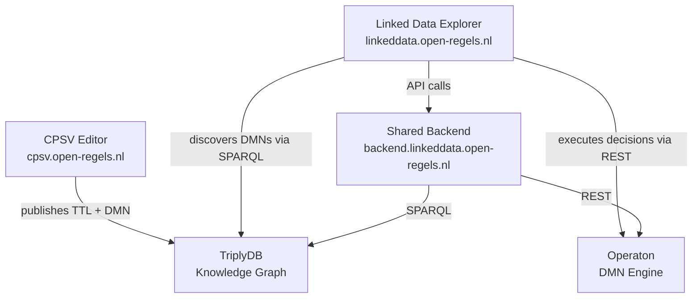

# Linked Data Explorer

**Linked Data Explorer** is a web application for discovering, composing, and executing DMN decision model chains from Dutch government knowledge graphs. It is built as part of the **Regels Overheid Nederland (RONL)** initiative and connects directly to TriplyDB knowledge graphs and the Operaton DMN execution engine.

**Live application:** [linkeddata.open-regels.nl](https://linkeddata.open-regels.nl)
**Acceptance environment:** [acc.linkeddata.open-regels.nl](https://acc.linkeddata.open-regels.nl)


---

## What it does

The Linked Data Explorer lets you work with government decision models end-to-end — from discovery to execution:

- **Discover** available DMN decision models published to TriplyDB by government agencies
- **Build chains** by drag-and-drop, connecting DMN outputs to DMN inputs across agency boundaries
- **Execute chains** sequentially or as unified DRDs, with automatic variable orchestration
- **Query** any SPARQL endpoint with syntax highlighting and interactive graph visualisation
- **Model processes** with a BPMN 2.0 editor that links directly to DMN decision models
- **Track governance** status: see which DMNs have been validated by competent authorities
- **Discover vendor implementations** of reference decision models

---

## Ecosystem position

The Linked Data Explorer is one of three components in the RONL ecosystem. Understanding how they relate helps clarify why certain things work the way they do.



The **CPSV Editor** produces the data — government service definitions and DMN decision models published as Linked Data to TriplyDB. The **Linked Data Explorer** consumes that data — discovering, chaining, and executing those decisions. The **Shared Backend** handles orchestration logic that both applications depend on.

See also: [CPSV Editor documentation](../cpsv-editor/index.md).

---

## Environments and deployment

| | Frontend | Backend |
|---|---|---|
| **Production** | [linkeddata.open-regels.nl](https://linkeddata.open-regels.nl) | [backend.linkeddata.open-regels.nl](https://backend.linkeddata.open-regels.nl) |
| **Acceptance** | [acc.linkeddata.open-regels.nl](https://acc.linkeddata.open-regels.nl) | [acc.backend.linkeddata.open-regels.nl](https://acc.backend.linkeddata.open-regels.nl) |
| **Branch** | `main` / `acc` | `main` / `acc` |
| **Platform** | Azure Static Web Apps | Azure App Service (Linux, Node.js 22) |

---

## Technology stack

| Layer | Technology | Version |
|---|---|---|
| Frontend framework | React | 19.2.3 |
| Language | TypeScript | 5.8.x |
| Build tool | Vite | 6.2.x |
| Graph visualisation | D3.js | 7.9.x |
| BPMN editor | bpmn-js | 18.12.0 |
| Drag-and-drop | dnd-kit | 6.x / 10.x |
| Backend framework | Node.js + Express | 22 / 4.18.x |
| DMN engine | Operaton | — |
| Knowledge graph | TriplyDB | — |
| Package structure | npm workspaces | monorepo |

---

## Repository structure

```
linked-data-explorer/
├── packages/
│   ├── frontend/                   # React TypeScript SPA
│   │   ├── src/
│   │   │   ├── components/
│   │   │   │   ├── ChainBuilder/   # DMN chain builder (main feature)
│   │   │   │   ├── BpmnModeler/    # BPMN 2.0 process editor
│   │   │   │   ├── GraphView.tsx   # D3.js SPARQL graph visualisation
│   │   │   │   ├── ResultsTable.tsx
│   │   │   │   └── Changelog.tsx
│   │   │   ├── services/
│   │   │   │   ├── sparqlService.ts
│   │   │   │   └── templateService.ts
│   │   │   ├── utils/
│   │   │   │   └── exportService.ts
│   │   │   ├── types/
│   │   │   ├── changelog.json
│   │   │   └── tutorial.json
│   │   ├── .env.development
│   │   ├── .env.acceptance
│   │   └── .env.production
│   │
│   └── backend/                    # Node.js/Express orchestration API
│       ├── src/
│       │   ├── routes/             # /v1/dmns, /v1/chains, /v1/health
│       │   ├── services/           # SPARQL, Operaton, orchestration
│       │   ├── middleware/
│       │   └── utils/
│       └── .env.example
│
├── examples/ttl/                   # Test DMN data (6 models)
├── .github/workflows/              # CI/CD pipelines (acc + production)
└── package.json                    # Workspace root
```

---

## Licence

EUPL-1.2
