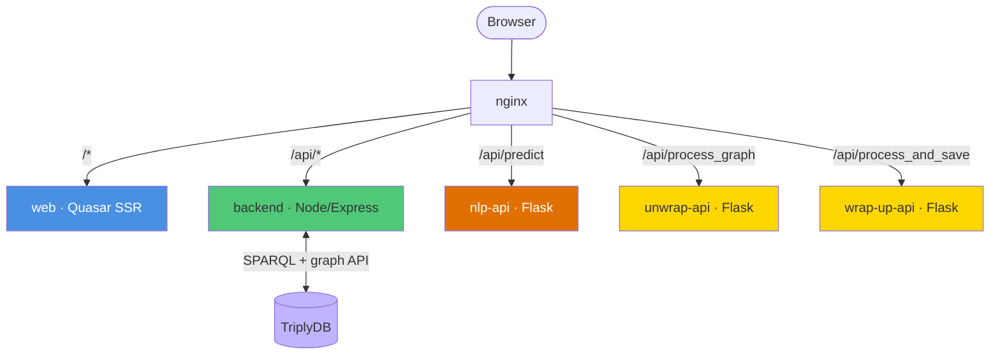

# Architecture

The Norm Editor is a multi-service application. This page describes the services, how they
communicate, and the request routing that ties them together. For the production topology see
[Deployment](deployment.md).

---

## Services

| Service | Stack | Role |
|---|---|---|
| `nginx` | nginx | Single entry point; all routing lives here |
| `web` | Vue 3 + Quasar (SSR), Pinia, D3 | The editor UI |
| `backend` | Node.js, Express, `@triply/triplydb`, N3, SuperAgent | TriplyDB gateway: list/read/write sources and tasks |
| `nlp-api` | Python, Flask, HuggingFace Transformers, PyTorch | BERTje token classification for act frames |
| `unwrap-api` | Python, Flask, RDFLib | FLINT RDF → editor JSON |
| `wrap-up-api` | Python, Flask, RDFLib | editor JSON → FLINT RDF |

---

## Why two conversion services

The editor's in-memory model and the FLINT RDF model are different shapes. Rather than embed
RDF logic in the frontend, the project isolates it in two Python services built on RDFLib:

- **wrap-up-api** serialises an interpretation (as editor JSON) into FLINT RDF for storage.
- **unwrap-api** parses FLINT RDF back into editor JSON for loading.

They are tested as a pair: each has a suite of fixtures (`.json` ↔ expected `.ttl`) checked
with graph isomorphism, so a JSON interpretation that is wrapped and then unwrapped returns to
the same structure. See [Backend & API services](backend-and-apis.md).

---

## Request routing

nginx is the only component exposed to the browser. It routes by path prefix:

| Path | Upstream |
|---|---|
| `/api/process_graph` | unwrap-api |
| `/api/predict` | nlp-api |
| `/api/process_and_save` | wrap-up-api |
| `/api/*` | backend |
| `/*` | web (Quasar SSR) |

Routing is defined in two files that must be kept in sync:

| File | Used by | Upstream format |
|---|---|---|
| `nginx/default.conf` | Docker Compose (volume-mounted) | `service-name:port` |
| `nginx/aca.conf` | Azure (baked into the nginx image) | `service-name.{ACA_DOMAIN}` (full FQDN) |

In Azure, `nginx/docker-entrypoint.sh` substitutes the runtime nameserver and domain into
`aca.conf` at container start, and every `proxy_pass` resolves its upstream through a variable
so DNS is looked up at request time — required because ACA's internal DNS is only available
then. **Adding a new API route means editing both files**, rebuilding the nginx image, and
redeploying.

---

## Configuration surface

Service endpoints (Triply, backend, and the three Python services) are provided through
environment variables and a generated `config.json`. The canonical values for local Docker
Compose are in `docker-compose.yml`; see the
[Environment Variables reference](../reference/environment-variables.md) for the full list.

---

## Repositories

The component is assembled from several repositories on the
[open-regels.nl GitLab instance](https://git.open-regels.nl), corresponding to the `gui/`,
`backend/`, `nlp_api/`, `unwrap_api/`, and `wrap_up_api/` directories, plus the `nginx/` and
`infra/` deployment assets.
