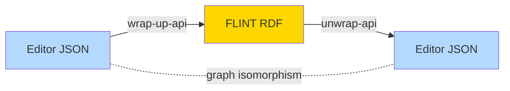

# Backend & API Services

Behind the frontend sit four services: a Node.js **backend** that brokers TriplyDB, and three
Python services for **NLP** and **RDF conversion**. This page describes each one.

---

## backend (Node.js / Express)

The backend is the editor's gateway to **TriplyDB**. It is a small Express app using the
`@triply/triplydb` client, `N3` for RDF serialisation, and `SuperAgent` for SPARQL queries. It
reads its Triply credentials and endpoints from environment variables.

### Endpoints

| Method & path | Purpose |
|---|---|
| `GET /` | Health/welcome message |
| `GET /api/getSources` | SPARQL query listing `src:Source` graphs (iri, title, date, editor), newest first |
| `POST /api/getSource` | Export one source graph as Turtle |
| `POST /api/getTasksFromTriply` | SPARQL query listing `calc:Task` graphs (iri, title, date, editor) |
| `POST /api/getTask` | Export a task graph **plus every graph it `calc:involves`** (its interpretation and sources) as TriG |
| `POST /api/saveTaskAtTriply` | Parse incoming TriG and upload to TriplyDB, **skipping graphs that already exist** |

The save path is deliberately conservative: it loads the existing graph names, removes any
already-present graphs from the local store, and only imports what is new — so re-saving never
duplicates graphs. Requests accept large bodies (a 1 GB JSON limit) to accommodate big
interpretations.

See [API Endpoints](../reference/api-endpoints.md#backend) for full request/response shapes.

---

## nlp-api (Python / Flask)

The NLP service wraps a fine-tuned **BERTje** model for **token classification**, exposing it
over HTTP. It uses Flask with CORS enabled and serves a Swagger UI at `/swagger`.

- **Endpoint**: `POST /api/predict` with `{ "text": "..." }`.
- **Response**: `{ text, predicted_entities: [[word, label], ...] }` where each label is
  `Action`, `Actor`, `Object`, `Recipient`, or `None`.
- The model's raw labels (`O`, `V`, `ACTOR`, `OBJ`, `REC`) are mapped to those friendly names,
  and word-piece tokens (`##`) are merged back into whole words.

The model lives under `bertje_2022_e4/`. It is trained on Dutch text and is intended for
sentence- or fragment-sized inputs because of the transformer token limit. See
[NLP Assistance](../features/nlp-assistance.md).

---

## wrap-up-api (Python / Flask, RDFLib)

Converts an **editor JSON interpretation into FLINT RDF** for storage. It serialises facts,
acts, claim-duties, and boolean constructs (`ComplexFact` with `hasFunction`/`hasOperands`),
together with their source text fragments and character ranges, into the FLINT/`src:`/`editor:`
vocabularies, and stores the result in TriplyDB.

It ships an automated test suite, `test_wrap_up.py`, built on `unittest` and the
`parameterized` library: for each `.json` fixture in `Tests/` it generates a test that
converts the JSON and compares the output to the expected `.ttl` using **RDFLib graph
isomorphism**, printing the graph difference when a test fails. A development notebook
(`Tests/Functions_Definitions.ipynb`) documents how the conversion functions were built.

---

## unwrap-api (Python / Flask, RDFLib)

The mirror image of wrap-up: it converts **FLINT RDF into editor JSON**. It walks the graph,
identifies frames by their FLINT classes (`Act`, `Agent`, `Action`, `Object`, `Fact`,
`ComplexFact`, `Duty`, `BooleanFact`, …), rebuilds act roles, claim-duty relations, and
nested boolean operands, and reconstructs the source document structure.

### Endpoints

| Method & path | Purpose |
|---|---|
| `GET /` | Renders `index.html`, a small page for picking and downloading graphs |
| `GET /get_graph_names` | Lists graph names from the connected Triply dataset |
| `GET /download_graph/<graph_iri>` | Downloads a graph as Turtle (handles gzip) |
| `POST /process_graph` | Converts posted Turtle into editor JSON (this is what the editor calls via `/api/process_graph`) |
| `GET /process_and_download_graph/<graph_iri>` | Downloads a graph and returns the converted JSON |

Like wrap-up, it includes fixture `.ttl` files and a development notebook
(`Tests/Unwrap_Functions.ipynb`).

---

## The conversion round trip

Because the two services are tested against each other with graph isomorphism, an
interpretation survives a wrap → unwrap cycle unchanged. This is what lets the editor treat
local JSON and TriplyDB RDF as interchangeable. The shared vocabulary is documented in the
[FLINT Ontology reference](../reference/flint-ontology.md).

!!! warning "Licensing differs per service"
    The frontend and NLP API are licensed Apache-2.0; the wrap-up and unwrap services are
    licensed EUPL-1.2. Check each repository's `LICENSE` before reuse.
