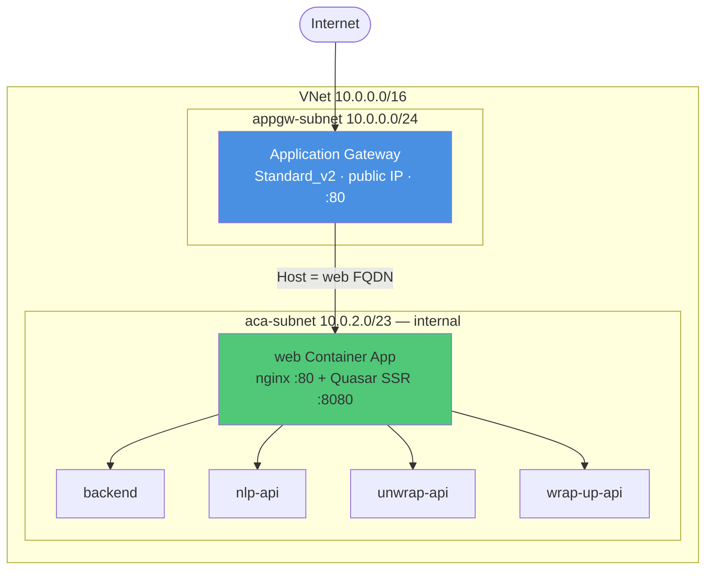

# Deployment

The Norm Editor runs locally with Docker Compose and in production on **Azure Container Apps**
behind an **Azure Application Gateway**, provisioned with **Bicep** infrastructure-as-code.

---

## Local: Docker Compose

`docker compose up --build` brings up nginx, the web frontend, the backend, and the three
Python services on a single host, reachable at `http://localhost`. nginx (using
`nginx/default.conf`) is the only port published to the host; the others are exposed only for
debugging. This is the setup described in [Local Development](local-development.md).

---

## Production: Azure Container Apps



Key properties of the production topology:

- The **Container Apps Environment is internal-only**. None of the services are reachable from
  the internet directly.
- The **only** app with external ACA ingress is `web`, which runs an **nginx sidecar** in
  front of the Quasar SSR server. The backend, nlp-api, unwrap-api, and wrap-up-api are
  internal only.
- The **Application Gateway** holds the public IP, listens on port 80, and forwards to the
  ACA internal load balancer, setting the `Host` header to the `web` app's FQDN.
- In Azure, nginx uses `nginx/aca.conf`. At container start, `nginx/docker-entrypoint.sh`
  reads the runtime nameserver and the `ACA_DOMAIN` environment variable and substitutes them
  into the config; upstreams are resolved at request time via a variable, because ACA internal
  DNS is only available then.

---

## Resources created by `deploy.sh`

Running `./deploy.sh` provisions or updates, via Bicep (`infra/main.bicep` →
`infra/resources.bicep`):

| Resource | Purpose |
|---|---|
| Resource Group | Container for everything |
| Virtual Network | Isolates the ACA environment; required by App Gateway |
| NSG (App Gateway subnet) | Allows gateway management traffic and inbound HTTP |
| Application Gateway (Standard_v2) | Public entry point |
| Public IP | Static IP on the gateway |
| Container Apps Environment | Internal-only |
| Container App `web` | nginx + Quasar SSR — the only externally-reachable app |
| Container Apps `backend`, `nlp-api`, `unwrap-api`, `wrap-up-api` | Internal only |
| Azure Container Registry | Stores all images |
| Key Vault | Registry credentials |
| Log Analytics Workspace | Centralised logs |
| Managed Identity | Pulls images from ACR |

### Prerequisites

- Azure CLI (`az`), logged in, with `Contributor` + `User Access Administrator`.
- Environment variables: `TRIPLY_KEY_R`, `REGISTRY_PASSWORD`, `REGISTRY_NAME`.

Non-secret parameters (`location`, `name`, `resourceGroupName`) live in
`infra/main.parameters.json`. `deploy.sh` also honours optional overrides such as `IMAGE_TAG`
(defaults to the current git commit hash), `APP_NAME`, `RESOURCE_GROUP`, `LOCATION`,
`TEMPLATE_FILE`, and `PARAMETERS_FILE`.

### Deploy

```bash
export TRIPLY_KEY_R=...
export REGISTRY_PASSWORD=...
export REGISTRY_NAME=...

./deploy.sh                 # deploy current commit
IMAGE_TAG=a3f9c21 ./deploy.sh   # a specific commit
IMAGE_TAG=v1.2.0 ./deploy.sh    # a release tag (images must already be pushed)
```

The script prints the Application Gateway's public IP on completion; the app is served at
`http://<public-ip>`.

---

## The custom nginx image

Because production uses `aca.conf` and the entrypoint substitution, the nginx image must be
rebuilt and pushed whenever `nginx/aca.conf` or `nginx/docker-entrypoint.sh` changes:

```bash
docker build -t <registry>/interpretation-editor-nginx:<tag> ./nginx
docker push <registry>/interpretation-editor-nginx:<tag>
```

!!! warning "Keep the two nginx configs in sync"
    `nginx/default.conf` (local) and `nginx/aca.conf` (Azure) define the same routes in
    different upstream formats. Adding or changing a route means editing **both**, then
    rebuilding the nginx image and redeploying.
