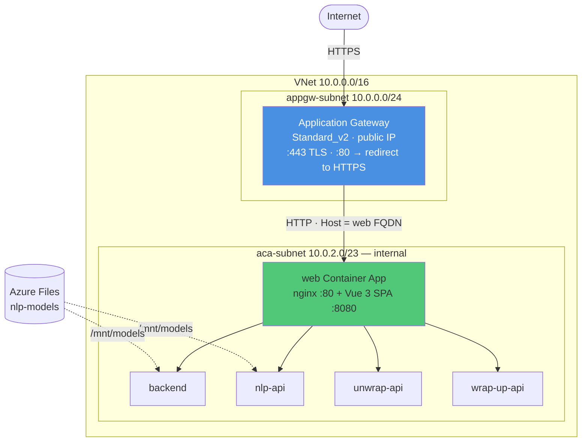

# Deployment

The Norm Editor runs locally with Docker Compose and in Azure on **Azure Container Apps**
behind an **Azure Application Gateway**, provisioned with **Bicep** infrastructure-as-code
through `deploy.sh`.

---

## Local: Docker Compose

`docker compose up --build` brings up nginx, the web frontend, the backend, and the three
Python services on a single host, reachable at `http://localhost`. nginx (using
`nginx/default.conf`) on port 80 is the entry point; the backend and the Python services also
publish their ports for debugging. Compose mounts `./nlp_api/API_NLP/models` at `/mnt/models`
into `nlp-api` and `backend` — the model files are not in the repository. This is the setup
described in [Local Development](local-development.md).

---

## Production: Azure Container Apps


```mermaid
graph TB
    Internet([Internet])
    APPGW[Application Gateway<br/>Standard_v2 · public IP<br/>:443 TLS · :80 → redirect to HTTPS]

    subgraph VNet["VNet 10.0.0.0/16"]
        subgraph appgw["appgw-subnet 10.0.0.0/24"]
            APPGW
        end
        subgraph aca["aca-subnet 10.0.2.0/23 — internal"]
            WEBAPP["web Container App<br/>nginx :80 + Vue 3 SPA :8080"]
            BACKEND[backend]
            NLP[nlp-api]
            UNWRAP[unwrap-api]
            WRAPUP[wrap-up-api]
        end
    end

    SHARE[(Azure Files<br/>nlp-models)]

    Internet -->|HTTPS| APPGW
    APPGW -->|HTTP · Host = web FQDN| WEBAPP
    WEBAPP --> BACKEND
    WEBAPP --> NLP
    WEBAPP --> UNWRAP
    WEBAPP --> WRAPUP
    SHARE -.->|/mnt/models| NLP
    SHARE -.->|/mnt/models| BACKEND

    style APPGW fill:#4a90e2,color:#fff
    style WEBAPP fill:#50c878
```

Key properties of the production topology:

- The **Container Apps Environment is internal-only**. None of the services are reachable from
  the internet directly.
- The **only** app with external ACA ingress is `web`, which runs an **nginx sidecar** in
  front of the static SPA build. The backend, nlp-api, unwrap-api, and wrap-up-api are
  internal only.
- The **Application Gateway** holds the public IP. Its port 443 listener terminates TLS with
  the certificate you supply; its port 80 listener answers with a permanent redirect to HTTPS,
  keeping path and query string. Traffic to the ACA internal load balancer travels over HTTP,
  with the `Host` header set to the `web` app's FQDN.
- In Azure, nginx uses `nginx/aca.conf`. At container start, `nginx/docker-entrypoint.sh`
  reads the runtime nameserver and the `ACA_DOMAIN` environment variable and substitutes them
  into the config; upstreams are resolved at request time via a variable, because ACA internal
  DNS is only available then.
- Every app runs one to three replicas.

---

## Resources created by `deploy.sh`

`deploy.sh` runs a **subscription-scope** deployment (`az deployment sub create`) of
`infra/main.bicep`. That template creates two resource groups and deploys three modules into
them:

| Resource group | Name | Module |
|---|---|---|
| Environment | `{name}-{environment}-rg` (default `regels-acceptance-rg`) | `resources.bicep` — the application |
| General | `{name}-general-rg` (default `regels-general-rg`) | `container.bicep` — registry access; `dns.bicep` — the DNS zone |

`{name}` is `APP_NAME` and `{environment}` is `ENVIRONMENT` (see
[Environment Variables](../reference/environment-variables.md#deployment-deploysh-variables)).
Several environments share the general group, and with it the DNS zone.

| Resource | Group | Purpose |
|---|---|---|
| Virtual Network `{name}-vnet` | Environment | `appgw-subnet` (/24) and `aca-subnet` (/23, delegated to Container Apps) |
| NSG `{name}-nsg-appgw` | Environment | Allows gateway management, the Azure load balancer, and inbound HTTP (80) and HTTPS (443) |
| Public IP `{name}-appgw-pip` | Environment | Static Standard IP on the gateway |
| Application Gateway `{name}-appgw` (Standard_v2, capacity 2) | Environment | Public entry point; TLS termination and the HTTP → HTTPS redirect |
| Container Apps Environment `{name}-private-env` | Environment | Internal-only |
| Container App `web` | Environment | nginx + Vue 3 SPA — the only externally-reachable app |
| Container Apps `backend`, `nlp-api`, `unwrap-api`, `wrap-up-api` | Environment | Internal only |
| Storage account with file share `nlp-models` (5 GiB) | Environment | The NLP models; see [The NLP model share](#the-nlp-model-share) |
| Key Vault | Environment | Registry username and password |
| Log Analytics Workspace `{name}-logs` | Environment | Container logs, 30 days' retention |
| Managed Identity `regelc-acr-pull` | General | Assigned `AcrPull` on the registry and attached to every Container App |
| DNS zone `DNS_ZONE_NAME` with its records | General | See [DNS](#dns) |

The **container registry** is not created: `container.bicep` is called with
`newOrExisting: 'existing'` and refers to the registry named by `REGISTRY_NAME`. The Container
Apps pull from it with the registry's username (`REGISTRY_NAME`) and password
(`REGISTRY_PASSWORD`).

Container sizes:

| Container App | CPU | Memory |
|---|---|---|
| `nlp-api` | 4 | 8 Gi |
| `backend` | 2 | 4 Gi |
| `unwrap-api`, `wrap-up-api` | 1 | 2 Gi |
| `web` | 1 + 1 | 2 Gi + 2 Gi (nginx and SPA containers) |

The `web` app also receives a `config.json` (built from the deployment's endpoints and the
Triply key) as a secret volume at `/data/config.json`.

### DNS

`dns.bicep` creates a public DNS zone named `DNS_ZONE_NAME` in the general resource group, with a
`www` CNAME to the apex. Where the gateway's IP goes depends on the environment:

| `ENVIRONMENT` | Record | Web URL |
|---|---|---|
| `production` | A record on the apex (`@`) | `https://<zone>` |
| anything else | A record `acc` | `https://acc.<zone>` |

### Prerequisites

- Azure CLI (`az`), logged in, with rights to create resource groups and role assignments in
  the subscription (for example `Contributor` + `User Access Administrator`).
- `jq`, which `deploy.sh` uses to print the outputs.
- An existing Azure Container Registry holding the `interpretation-editor-*` images.
- Environment variables: `TRIPLY_KEY_R`, `REGISTRY_PASSWORD`, `REGISTRY_NAME`,
  `SSL_CERTIFICATE_DATA`, `SSL_CERTIFICATE_PASSWORD`, and `DNS_ZONE_NAME`. `deploy.sh` stops
  if any of the first five is missing; `main.bicep` has no default for `dnsZoneName`, and
  `deploy.sh` passes it only when `DNS_ZONE_NAME` is set.

---

## First deployment

The first deployment to a new domain takes four steps, in this order.

**1. Create the DNS zone.** `scripts/bootstrap-dns.sh` creates the resource group if it does not
exist, creates the zone in it, and prints the zone's nameservers. Use the general resource
group, where `dns.bicep` later manages the same zone:

```bash
RESOURCE_GROUP=regels-general-rg DNS_ZONE_NAME=example.com ./scripts/bootstrap-dns.sh
```

**2. Delegate the domain.** Set the four printed nameservers as NS records at your registrar,
and wait until `dig NS example.com +short` returns them.

**3. Issue the certificate.** `scripts/issue-cert.sh` obtains a Let's Encrypt certificate with a
DNS-01 challenge against the Azure zone and exports it as a PFX:

```bash
DOMAIN=example.com EMAIL=you@example.com RESOURCE_GROUP=regels-general-rg \
  ./scripts/issue-cert.sh
```

On its first run it creates a service principal `certbot-<domain>`, grants it
`DNS Zone Contributor` on the zone, and caches its credentials in `certs/.certbot-sp.env`.
It then builds the image in `docker/certbot` (certbot with the `certbot-dns-azure` plugin)
and runs it, which requests a certificate for `DOMAIN` and `www.DOMAIN` and writes
`certs/cert.pfx`, protected by `PFX_PASSWORD` (a random one when unset). The container prints
the `export SSL_CERTIFICATE_DATA=…` and `export SSL_CERTIFICATE_PASSWORD=…` lines to set
before deploying. `DNS_ZONE_NAME` defaults to `DOMAIN`; an acceptance environment serves at
`acc.<zone>`, so for it pass `DOMAIN=acc.<zone>` and `DNS_ZONE_NAME=<zone>`. The script needs
Docker, `az`, `jq` and `openssl`.

To renew, re-run the same command — certbot skips issuance while the certificate has more than
30 days left — and deploy again with the new PFX.

**4. Deploy.**

```bash
export TRIPLY_KEY_R=...
export REGISTRY_PASSWORD=...
export REGISTRY_NAME=...
export SSL_CERTIFICATE_DATA=...
export SSL_CERTIFICATE_PASSWORD=...
export DNS_ZONE_NAME=example.com

./deploy.sh                                   # acceptance (the default)
ENVIRONMENT=production ./deploy.sh            # production
IMAGE_TAG=<commit-sha> ./deploy.sh            # a specific image tag
```

On completion the script prints the Application Gateway's public IP, the web URL, and the DNS
zone's nameservers.

`IMAGE_TAG` defaults to `git rev-parse --short HEAD`. The GitLab pipeline pushes each image
tagged with the full commit SHA (`CI_COMMIT_SHA`) and with `latest`, on `main`, `develop` and
tags, so pass a tag that exists in the registry.

`deploy.sh` reads `PARAMETERS_FILE` but no longer passes it to the deployment; every parameter
goes on the command line. `infra/main.json` is an older compiled template that does not match
`main.bicep`; `deploy.sh` deploys `main.bicep` (`TEMPLATE_FILE`).

---

## Forcing a new revision

Azure Container Apps only pulls an image again when the container template changes. Every
deployment therefore sets a new **revision suffix**: `main.bicep` defaults `revisionSuffix` to
the deployment's UTC timestamp, and `REVISION_SUFFIX` overrides it (for example with a build id).
The suffix is lowercased and prefixed with `r`, because an ACA revision suffix must start with a
letter.

To roll a new revision without a full Bicep deployment, use `scripts/update-revision.sh`:

```bash
scripts/update-revision.sh backend                 # one app
scripts/update-revision.sh gui nlp-api             # gui, nginx and web all mean the web app
scripts/update-revision.sh all                     # every app
scripts/update-revision.sh --dry-run all           # print the az commands only
APP_NAME=regels-production scripts/update-revision.sh all
```

It runs `az containerapp update --revision-suffix` per app. `APP_NAME` defaults to
`regels-acceptance` and `RESOURCE_GROUP` to `{APP_NAME}-rg` — the environment resource group
`deploy.sh` creates. `REVISION_SUFFIX` defaults to the current UTC timestamp. The `--build`
option calls `./build_for_amd64.sh`, which is not in the repository.

---

## The NLP model share

The models are not baked into the `nlp-api` image. `resources.bicep` creates a storage account
with an Azure Files share `nlp-models` (SMB, 5 GiB), registers it in the Container Apps
Environment as storage `nlp-models` (read-write), and mounts it at `/mnt/models` in both
`nlp-api` and `backend`. `nlp-api` gets `MODEL_PATH=/mnt/models` and loads each model from a
directory of that name on the share — `bertje_2022_e4` (the default) and
`legal-bert-dutch-english`. A model directory missing from the share makes `/api/predict`
answer `500` with `Model does not exist on filesystem.` Upload the model directories to the
share before using the NLP assistance.

---

## The custom nginx image

Because production uses `aca.conf` and the entrypoint substitution, the nginx image must be
rebuilt and pushed whenever `nginx/aca.conf` or `nginx/docker-entrypoint.sh` changes:

```bash
docker build -t <registry>/interpretation-editor-nginx:<tag> ./nginx
docker push <registry>/interpretation-editor-nginx:<tag>
```

The GitLab pipeline's `build_nginx` job does the same for every push to `main`, `develop` or a
tag.

!!! warning "Keep the two nginx configs in sync"
    `nginx/default.conf` (local) and `nginx/aca.conf` (Azure) define the same routes in
    different upstream formats. Adding or changing a route means editing **both**, then
    rebuilding the nginx image and redeploying.
