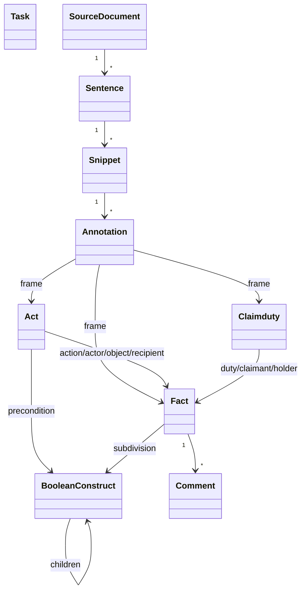

# Frontend

The frontend (`regel-gui`) is a **Vue 3** application built with the **Quasar** framework in
**SSR** mode. State is held in a single **Pinia** store, the domain is modelled as plain
JavaScript classes, and the network view is drawn with **D3**.

---

## Directory layout

```
gui/src/
├── pages/IndexPage.vue          # The stepper — entry point
├── views/                       # One per workflow step + the two interpretation panes
│   ├── TaskDefinitionView.vue
│   ├── SourceCollectionView.vue
│   ├── InterpretationView.vue
│   ├── SourceView.vue
│   └── FramesView.vue
├── components/                  # Editor panels, forms, lists, network, dialogs
├── model/                       # Domain classes (see below)
├── stores/regel.js              # The single Pinia store
├── services/ApiServices.js      # All calls to the backend / Python services
├── helpers/                     # annotating, underlining, importExport, config, ...
└── src-ssr/                     # SSR server and (no-op) API middleware
```

`src-ssr/middlewares/api.js` is intentionally a no-op: **all API routing is handled by
nginx**, not by the SSR server.

---

## The domain model

The `model/` classes are the source of truth for what an interpretation *is*. They are plain
classes (not Vue reactive objects) with `toFlatObject()` / `fromFlatObject()` methods for
serialisation.



| Class | Responsibility |
|---|---|
| `Task` | Task and interpretation IRIs, editor, label, description |
| `SourceDocument` | Parses Choppr JSON-LD into a sentence tree; owns annotation lookup/cleanup helpers |
| `Sentence` | A node in the document tree: text, children, selected/collapsed/visible flags, snippets |
| `Snippet` | A character range within a sentence; holds the annotations covering it |
| `Annotation` | Links one or more snippets to one frame |
| `Fact` | A fact frame: short/full name, subtypes, subdivision, comments |
| `Act` | An act relation: action, actor, object, recipient, precondition, creates, terminates |
| `Claimduty` | A claim-duty relation: duty, claimant, holder |
| `BooleanConstruct` | AND/OR/NOT tree used for preconditions and fact subdivisions |
| `Comment` | A note on a frame: content, author, created/edited timestamps |
| `frame.js` | `frameTypes` — the catalogue of frame types and fact subtypes |

!!! note "Refactoring note in the code"
    `Fact`, `Act`, and `Claimduty` share several methods (`deleteReferencesToFrame`, role
    handling, `toFlatObject`/`fromFlatObject`). The code contains a `Frame` base class stub
    and TODOs to unify them; today each frame type implements these independently.

---

## State management

A single Pinia store, `useRegelStore` (in `stores/regel.js`), holds the entire editor state:
the current step, the list of frames, which frame and boolean-construct node are being edited,
the loaded source documents, the current annotation, and the available sources/tasks from
TriplyDB.

Its actions cover the full lifecycle:

- **Frame management** — `addNewFrame`, `setFrameBeingEdited`, `removeFrame` (which also strips
  every reference to the deleted frame and its annotations), `createNewFrameViaNlp`.
- **Sources** — `addSource`, `addSourceFromTriply`, `createSourceDocFromJsonLD`,
  `readAvailableSourcesInTripleStore`.
- **Tasks** — `addTaskFromTriply`, `readAvailableTasksInTripleStore`,
  `saveInterpretationTriply`.
- **Import/export** — `saveInterpretationAsJson`, `saveInterpretationAsTrig`,
  `loadInterpretation`, `loadInterpretationFromRDF`.

When saving, the store merges the persisted frames with those still open in the editor, dedupes
by id, and hands the result to `convertInterpretationToJson`.

---

## Annotation internals

Two helpers carry the annotation logic:

- `helpers/annotating.js` turns a raw browser `Selection` (or a character range) into the set
  of snippets it covers, handling right-to-left selections and cross-sentence spans, and
  splits snippets so a highlight becomes its own snippet (`splitAndReturnSelectedSnippets`).
- `helpers/underlining.js` computes the vertical position of each annotation's underline so
  overlapping annotations stack without colliding.

`helpers/importExport.js` holds `convertInterpretationToJson` and
`parseJsonToInterpretation`, which translate between the model classes and the on-disk JSON,
re-linking frame references by id and reconstructing snippets and comments on load.

---

## Calling the services

`services/ApiServices.js` is the only place the frontend talks to the network. Its functions
map one-to-one onto the routed endpoints:

| Function | Endpoint | Purpose |
|---|---|---|
| `fetchNlpPrediction` | `POST /api/predict` | NLP suggestions |
| `convertToRDF` | `POST /api/process_and_save` | JSON → RDF (wrap-up) |
| `convertRDFToJSON` | `POST /api/process_graph` | RDF → JSON (unwrap) |
| `getSourceList` | `GET /api/getSources` | List sources |
| `getSourceFromTriply` | `POST /api/getSource` | Fetch one source |
| `getTasksFromTriply` | `POST /api/getTasksFromTriply` | List tasks |
| `getTaskFromTriply` | `POST /api/getTask` | Fetch one task |
| `saveTask` | `POST /api/saveTaskAtTriply` | Save a task |

See [API Endpoints](../reference/api-endpoints.md) for request/response details.
