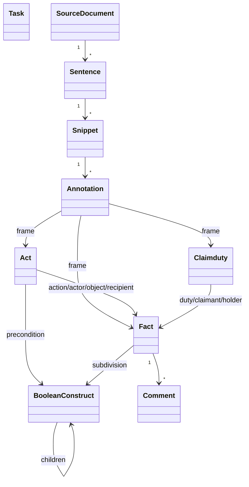

# Frontend

The frontend (`regel-gui`) is a **Vue 3** application built with the **Quasar** framework as a
plain **SPA** — `src-ssr/` was removed in v2026.07.0 (see
[Changelog & Roadmap](changelog-roadmap.md)). State is held mainly in a **Pinia** `regel`
store (plus a small `layout` store for UI-only state), the domain is modelled as plain
JavaScript classes, and both network views are drawn with **D3**.

---

## Directory layout

```
gui/
├── index.html                   # Favicon links, web manifest, theme-color
├── public/
│   ├── favicon.ico, icons/      # Favicon set (SVG, PNG 16–512, apple-touch, maskable)
│   ├── site.webmanifest         # Name, icons, theme colour
│   └── changelog.json           # Generated by scripts/generate-changelog.mjs
└── src/
    ├── boot/                    # fonts.js, i18n.js, axios.js (in that order)
    ├── css/                     # quasar.variables.scss (IOU tokens), app.scss (--iou-* classes)
    ├── router/routes.js         # task, sources, interpretation, visualization,
    │                            # executable, execute — client-side routes
    ├── pages/                   # Thin <q-page> wrappers, one per route, each
    │   ├── TaskDefinitionPage.vue   # rendering the matching view below
    │   ├── SourceCollectionPage.vue
    │   ├── InterpretationPage.vue
    │   ├── VisualizationPage.vue
    │   ├── ExecutablePage.vue   # "Coming soon" — see Roadmap
    │   ├── ExecutePage.vue      # "Coming soon" — see Roadmap
    │   └── ErrorNotFound.vue
    ├── views/                   # The step UIs the pages render
    │   ├── TaskDefinitionView.vue
    │   ├── SourceCollectionView.vue
    │   ├── InterpretationView.vue   # with InterpretationStatusBar
    │   ├── SourceView.vue       # interpretation pane
    │   ├── FramesView.vue       # interpretation pane, holds the frame network
    │   ├── interpretation/FrameListView.vue  # frame list used by the visualization view
    │   └── visualization/       # VisualizationView.vue, VisualizationPanel.vue
    ├── components/              # Editor panels, forms, lists, networks, dialogs —
    │                            # including FrameDetailsPanel.vue and
    │                            # InterpretationStatusBar.vue
    ├── model/                   # Domain classes (see below); model/viz/ for the diagram
    ├── stores/                  # regel.js (domain state), layout.js (UI state)
    ├── services/ApiServices.js  # All calls to the backend / Python services
    ├── helpers/                 # annotating, underlining, importExport, config,
    │                            # frameRelations, forceSimulation, ...
    └── i18n/                    # vue-i18n message catalogue (en-US)
```

`helpers/frameRelations.js` describes how frames refer to each other: `roleDefinitions` (the
roles of acts and claim-duties, in display order), `framesIn` (a frame plus every frame in its
subdivision), `rolesOf`, `usesOf` and `usagesOf` (the acts and claim-duties that use a frame).
The visualization view, `FrameDetailsPanel`, `NodePanel` and `model/viz/network.js` build on
it. `helpers/config.js` holds the icons and colours per frame type, and `getFrameColor(frame)`
picks the Quasar colour for a frame — a fact takes the colour of its subtype when it has
exactly one.

---

## Network views

The editor draws two different networks:

| Component | Where | What it shows |
|---|---|---|
| `Network.vue` → `ForceDirectedGraph.vue` | Interpretation (`FramesView`) | Every frame, built by `model/network.js`, filterable by frame type through `NetworkMenu` |
| `NodeLinkDiagram.vue` | Visualization (`VisualizationPanel`) | Acts and claim-duties only, built by `model/viz/network.js`, with d3-zoom pan and zoom |

In the visualization view, `VisualizationView` pairs the diagram with `FrameListView` and
`FrameDetailsPanel`, which lists a selected frame's roles and where it is used.

---

## The domain model

The `model/` classes are the source of truth for what an interpretation *is*. They are plain
classes (not Vue reactive objects) with `toFlatObject()` / `fromFlatObject()` methods for
serialisation.


```mermaid
classDiagram
    class Task
    class SourceDocument
    class Sentence
    class Snippet
    class Annotation
    class Fact
    class Act
    class Claimduty
    class BooleanConstruct
    class Comment

    SourceDocument "1" --> "*" Sentence
    Sentence "1" --> "*" Snippet
    Snippet "1" --> "*" Annotation
    Annotation --> Fact : frame
    Annotation --> Act : frame
    Annotation --> Claimduty : frame
    Act --> Fact : action/actor/object/recipient
    Act --> BooleanConstruct : precondition
    Claimduty --> Fact : duty/claimant/holder
    Fact --> BooleanConstruct : subdivision
    BooleanConstruct --> BooleanConstruct : children
    Fact "1" --> "*" Comment
```

| Class | Responsibility |
|---|---|
| `Task` | Task and interpretation IRIs, editor, label, description |
| `SourceDocument` | Parses Choppr JSON-LD into a sentence tree; owns annotation lookup/cleanup helpers |
| `Sentence` | A node in the document tree: text, children, selected/collapsed/visible flags, snippets |
| `Snippet` | A character range within a sentence; holds the annotations covering it |
| `Annotation` | Links one or more snippets to one frame |
| `Fact` | A fact frame: short/full name, subtypes, subdivision, comments |
| `Act` | An act relation: action, actor, object, recipient, precondition, creates, terminates |
| `Claimduty` | A claim-duty relation: duty, claimant, holder |
| `BooleanConstruct` | AND/OR/NOT tree used for preconditions and fact subdivisions; `isEmpty` is true when no level of the tree holds a frame |
| `Comment` | A note on a frame: content, author, created/edited timestamps |
| `frame.js` | `frameTypes` — the catalogue of frame types and fact subtypes |

!!! note "Refactoring note in the code"
    `Fact`, `Act`, and `Claimduty` share several methods (`deleteReferencesToFrame`, role
    handling, `toFlatObject`/`fromFlatObject`). The code contains a `Frame` base class stub
    and TODOs to unify them; today each frame type implements these independently.

---

## State management

A single Pinia store, `useRegelStore` (in `stores/regel.js`), holds the entire editor state:
the list of frames, which frame and boolean-construct node are being edited, the loaded source
documents, the current annotation, the available sources/tasks from TriplyDB, and the state of
the visualization — `network` (the diagram's model), `networkZoomTransform`, and
`selectedNode`, which is `null` until a node is selected (for a fact, an object `{ frame }`).
The current step is not in the store: it is the route.

Its actions cover the full lifecycle:

- **Frame management** — `addNewFrame`, `setFrameBeingEdited`, `removeFrame` (which also strips
  every reference to the deleted frame and its annotations), `createNewFrameViaNlp`.
- **Sources** — `addSource`, `addSourceFromTriply`, `createSourceDocFromJsonLD`,
  `readAvailableSourcesInTripleStore`.
- **Tasks** — `addTaskFromTriply`, `readAvailableTasksInTripleStore`,
  `saveInterpretationTriply`.
- **Import/export** — `saveInterpretationAsJson`, `saveInterpretationAsTrig`,
  `loadInterpretation`, `loadInterpretationFromRDF`.

When saving, the store merges the persisted frames with those still open in the editor, dedupes
by id, and hands the result to `convertInterpretationToJson`.

---

## Annotation internals

Two helpers carry the annotation logic:

- `helpers/annotating.js` turns a raw browser `Selection` (or a character range) into the set
  of snippets it covers, handling right-to-left selections and cross-sentence spans, and
  splits snippets so a highlight becomes its own snippet (`splitAndReturnSelectedSnippets`).
- `helpers/underlining.js` computes the vertical position of each annotation's underline so
  overlapping annotations stack without colliding.

`helpers/importExport.js` holds `convertInterpretationToJson` and
`parseJsonToInterpretation`, which translate between the model classes and the on-disk JSON,
re-linking frame references by id and reconstructing snippets and comments on load.

---

## Calling the services

`services/ApiServices.js` is the only place the frontend talks to the network. Its functions
map one-to-one onto the routed endpoints:

| Function | Endpoint | Purpose |
|---|---|---|
| `fetchNlpPrediction` | `POST /api/predict` | NLP suggestions |
| `convertToRDF` | `POST /api/process_and_save` | JSON → RDF (wrap-up) |
| `convertRDFToJSON` | `POST /api/process_graph` | RDF → JSON (unwrap) |
| `getSourceList` | `GET /api/getSources` | List sources |
| `getSourceFromTriply` | `POST /api/getSource` | Fetch one source |
| `getTasksFromTriply` | `POST /api/getTasksFromTriply` | List tasks |
| `getTaskFromTriply` | `POST /api/getTask` | Fetch one task |
| `saveTask` | `POST /api/saveTaskAtTriply` | Save a task |

See [API Endpoints](../reference/api-endpoints.md) for request/response details.

---

## Styling

The look follows the IOU house style. `css/quasar.variables.scss` defines the IOU tokens and maps
Quasar's brand colours onto them:

| Quasar colour | IOU token | Value |
|---|---|---|
| `primary` | `$iou-primary` | `#154273` |
| `secondary` | `$iou-primary-light` | `#2a5a8a` |
| `dark` | `$iou-primary-dark` | `#0d2f4f` |
| `accent` | `$iou-accent` | `#e17000` (light `#f58220`, dark `#b35900`) |
| `positive` | `$iou-compliant` | `#007a3d` |
| `negative` | `$iou-non-compliant` | `#cc0000` |
| `info` | `$iou-in-progress` | `#275fa0` |
| `warning` | `$iou-acc` | `#f59e0b` |

The same file sets the typography family, border radii, button weight and shadows, the
separator colour, and dark-blue tooltips.

`css/app.scss` re-exposes the tokens as CSS custom properties (`--iou-primary`,
`--iou-accent`, `--iou-mono`, ...) and defines the shared classes the views use: `.iou-header`,
`.iou-tabs`/`.iou-tab`, `.iou-pane` with `__head`, `__toolbar` and `__body`, `.iou-card`,
`.iou-eyebrow`, `.iou-badge--acc`/`.iou-badge--prod`, `.iou-admonition`, `.iou-table`, the
`.frame-form__*` layout of the frame forms, and `.q-tooltip.iou-tip`.

**Fonts.** Roboto comes from Quasar's `roboto-font` extra (`quasar.config.js`). Roboto Mono,
used for hashes and versions, is self-hosted: `boot/fonts.js` imports weights 400 and 700 from
`@fontsource/roboto-mono`, so the app makes no Google Fonts request. `fonts` is the first boot
file, before `i18n` and `axios`.

**Branding.** `package.json` sets `productName` to `Norm Editor - RONL`, which becomes the page
title. `index.html` links the favicon set in `public/` (`favicon.ico`, `icons/favicon.svg`,
PNGs from 16 to 192 px, an apple-touch icon) and `public/site.webmanifest` (short name
`Norm Editor`, 192 and 512 px icons plus a maskable one, theme colour `#154273`, standalone
display), and sets the `theme-color` meta tag to `#154273`.
