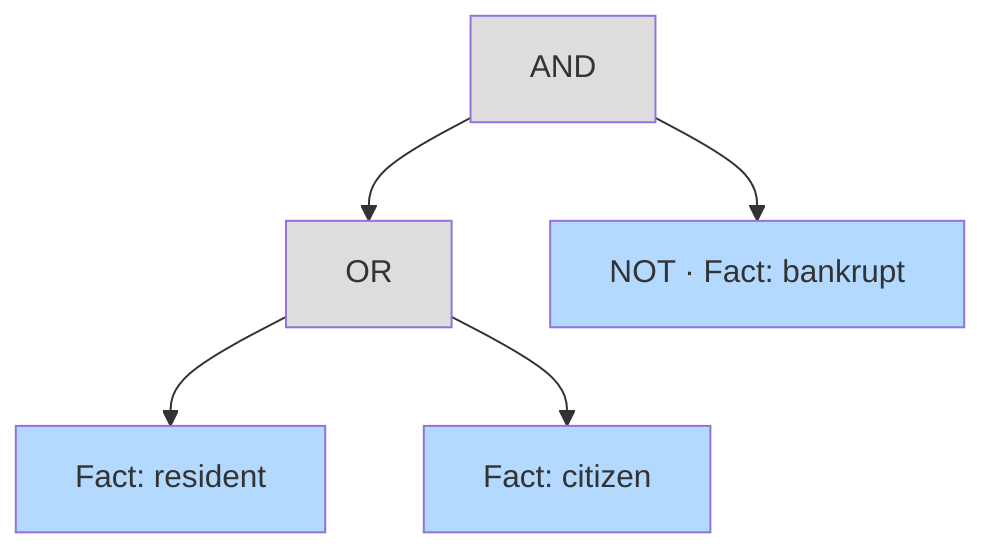

# Boolean Constructs

Real norms are rarely flat. A right may apply *if condition A and (condition B or condition
C)*, and a fact may be defined as a combination of sub-facts. The Norm Editor models this with
**boolean constructs** — small trees of AND / OR / NOT over frames.

Boolean constructs appear in two places:

- the **precondition** of an **Act**, and
- the **subdivision** of a **Fact** (a fact defined in terms of other facts).

---

## Anatomy of a boolean construct

A boolean construct is a recursive tree. Each node is one of two kinds:

- **Atomic** — the node points to a single frame. It is a leaf.
- **Composite** — the node has no frame of its own but joins its children with an operator
  (`and` or `or`).

Any node can additionally be **negated**, expressing *NOT*.

The tree above reads: **(resident OR citizen) AND NOT bankrupt**.

---

## Building a construct

The editor exposes a set of operations that mirror how an interpreter thinks about a
condition:

| Operation | Effect |
|---|---|
| Add a frame to an empty node | Makes the node atomic, pointing at that frame |
| **Subdivide** a node | Pushes the node's current content down into a new child and turns the node into a composite, defaulting to `and` |
| **Add child** | Adds another operand under a composite node |
| **Add parent** | Wraps the current node in a new composite parent, so it can be combined with siblings |
| Toggle **negate** | Flips the NOT flag on a node |
| Switch operator | Changes a composite node between `and` and `or` |
| **Remove frame** / delete | Removes a frame from the tree, tidying up empty parents and dropping a now-redundant operator |

Frames are added to a construct in exactly the same way as roles are filled: with a node
selected, highlight text in the source to create a new fact, or click an existing fact chip to
reuse it. The editor tracks which node is currently being edited so the next selected frame
lands in the right place.

---

## Editing a construct visually

Preconditions and subdivisions are edited through a tree view that shows the nested
structure, with controls to negate, subdivide, change the operator, and remove operands. As
the tree changes, the same structure can be inspected in the
[network visualisation](visualisation.md), where composite nodes appear as small anonymous
join-points connecting their operands.

---

## How it is stored

When an interpretation is serialised, a boolean construct becomes a FLINT `ComplexFact`:

- the operator becomes `flint:hasFunction` (`flint:and` / `flint:or`),
- the children become an ordered `flint:hasOperands` list,
- atomic nodes are replaced by a reference to their frame, and
- negation is represented in the function applied to the node.

Empty nodes (no frame and no children) are pruned during export, so only meaningful structure
is stored. See the [FLINT Ontology reference](../reference/flint-ontology.md) for the exact
RDF shape, including a worked `(A or B) and (C and D)` example.
