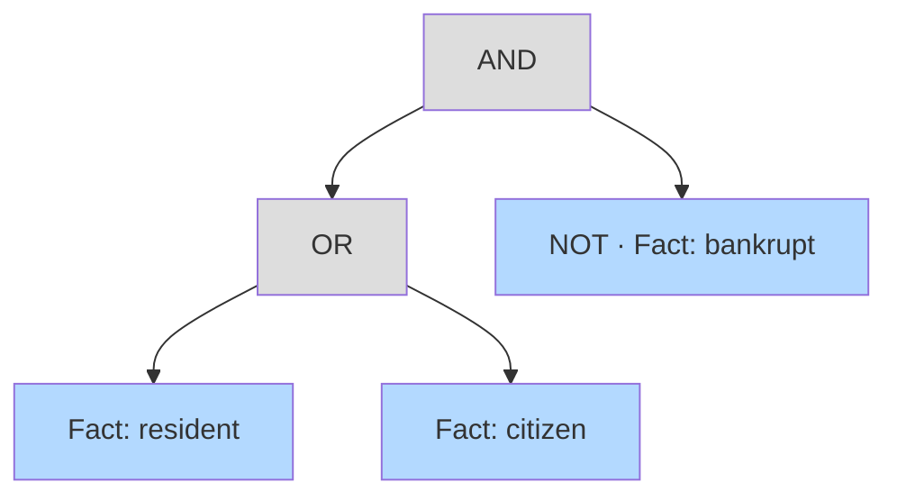

# Boolean Constructs

Real norms are rarely flat. A right may apply *if condition A and (condition B or condition
C)*, and a fact may be defined as a combination of sub-facts. The Norm Editor models this with
**boolean constructs** — small trees of AND / OR / NOT over frames.

Boolean constructs appear in two places:

- the **precondition** of an **Act**, and
- the **subdivision** of a **Fact** (a fact defined in terms of other facts).

---

## Anatomy of a boolean construct

A boolean construct is a recursive tree. Each node is one of two kinds:

- **Atomic** — the node points to a single frame. It is a leaf.
- **Composite** — the node has no frame of its own but joins its children with an operator
  (`and` or `or`).

Any node can additionally be **negated**, expressing *NOT*.

```mermaid
graph TB
    ROOT["AND"]
    OR["OR"]
    A["Fact: resident"]
    B["Fact: citizen"]
    C["NOT · Fact: bankrupt"]

    ROOT --> OR
    ROOT --> C
    OR --> A
    OR --> B

    style ROOT fill:#dddddd
    style OR fill:#dddddd
    style A fill:#b3d9ff
    style B fill:#b3d9ff
    style C fill:#b3d9ff
```

The tree above reads: **(resident OR citizen) AND NOT bankrupt**.

---

## Building a construct

The construct model offers a set of operations that mirror how an interpreter thinks about a
condition. The tree view in the frame editor exposes all of them except *Add parent*:

| Operation | Effect |
|---|---|
| Add a frame to an empty node | Makes the node atomic, pointing at that frame |
| **Subdivide** a node | Pushes the node's current content down into a new child and turns the node into a composite, defaulting to `and` |
| **Add child** | Adds another operand under a composite node |
| **Add parent** | Wraps the current node in a new composite parent, so it can be combined with siblings (model only) |
| Negate | Sets the NOT flag on a node; in the tree view, by picking NOT as the node's function |
| Switch operator | Changes a composite node between `and` and `or`, via *Pick a function* |
| **Remove frame** / delete | Removes a frame from the tree, tidying up empty parents and dropping a now-redundant operator |

Frames are added to a construct much as roles are filled: click an empty node to select it
(the status bar reads *Choosing a condition*), then highlight text in the source and pick a
frame type in the panel that appears, or click an existing fact in the Frames list to reuse
it. The editor tracks which node is currently being edited so the next selected frame lands
in the right place.

---

## Editing a construct visually

Preconditions and subdivisions are edited through a tree view that shows the nested
structure. A node that joins others has a *Pick a function* list (AND and OR join the
children; NOT marks the node as negated), an **Add child** button, and a button to subdivide;
a leaf node shows its frame with a button to remove it, a button to subdivide, and a button
to remove the node. As the tree changes, the same structure can be inspected in the network
view of the [Frames pane](visualisation.md#frames-in-the-interpret-sources-tab), where composite nodes appear as small
anonymous join-points connecting their operands. In the **View interpretation** tab, the
Details pane draws an act's precondition as a tree.

---

## How it is stored

When an interpretation is serialised, a boolean construct becomes a FLINT `ComplexFact`:

- the operator becomes `flint:hasFunction` (`flint:and` / `flint:or`),
- the children become an ordered `flint:hasOperands` list,
- atomic nodes are replaced by a reference to their frame, and
- negation is represented in the function applied to the node.

Empty nodes (no frame and no children) are pruned during export, so only meaningful structure
is stored. See the [FLINT Ontology reference](../reference/flint-ontology.md) for the exact
RDF shape, including a worked `(A or B) and (C and D)` example.
