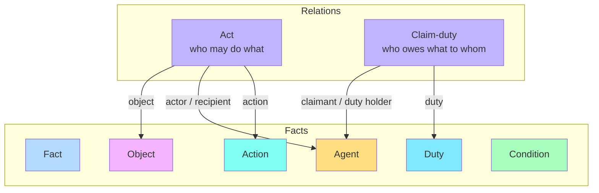

# The FLINT Frame Model

Everything the Norm Editor produces is built from **frames**. A frame is a structured
interpretation of a piece of text. The editor supports three frame types, mirroring the FLINT
ontology: **Fact**, **Act**, and **Claim-duty**.

---

## Frame types

```mermaid
graph TB
    subgraph "Relations"
        ACT[Act<br/>who may do what]
        CD[Claim-duty<br/>who owes what to whom]
    end
    subgraph "Facts"
        FACT[Fact]
        AGENT[Agent]
        ACTION[Action]
        OBJECT[Object]
        DUTY[Duty]
        COND[Condition]
    end

    ACT -->|action| ACTION
    ACT -->|actor / recipient| AGENT
    ACT -->|object| OBJECT
    CD -->|duty| DUTY
    CD -->|claimant / duty holder| AGENT

    style ACT fill:#c0b3ff
    style CD fill:#c0b3ff
    style FACT fill:#b3d9ff
    style AGENT fill:#ffdd80
    style ACTION fill:#80fff3
    style OBJECT fill:#f4b3ff
    style DUTY fill:#80e9ff
    style COND fill:#a8ffbd
```

### Fact

A **Fact** is the basic building block — a concept extracted from the text, such as *personal
data* or *free movement*. A fact has:

- a **short name** (the label shown on its chip),
- an optional **full name / description**,
- zero or more **subtypes**, and
- an optional **subdivision** — a [boolean construct](boolean-constructs.md) that defines the
  fact in terms of other facts.

A fact can carry **more than one subtype** at the same time (for example a fragment that is
both an *Agent* and a *Duty*). The available subtypes are:

| Subtype | Typical meaning |
|---|---|
| Agent | An actor — a person, body, or organisation |
| Action | A verb / activity |
| Object | The thing an action is performed on |
| Duty | An obligation |
| Condition | A circumstance that must hold |

### Act

An **Act** is a relation describing *who may (or must) do what, under which conditions, with
which effect*. It has the following named roles:

| Role | Holds | Cardinality |
|---|---|---|
| Action | a fact (subtype *action*) | one |
| Actor | a fact (subtype *agent*) | one |
| Object | a fact (subtype *object*) | one |
| Recipient | a fact (subtype *agent*) | one |
| Precondition | a [boolean construct](boolean-constructs.md) over facts | one tree |
| Creates | facts (subtype *agent*, *action*, or *object*) | many |
| Terminates | facts (subtype *agent*, *action*, or *object*) | many |

An act's short name is generated automatically in the form
`[action] [object] [actor] [recipient]`, with placeholders such as `<actor>` shown for roles
that are not yet filled. Typing a name of one's own stops the generation; clearing the field
starts it again.

### Claim-duty

A **Claim-duty** is a relation expressing an obligation between parties:

| Role | Holds |
|---|---|
| Duty | a fact (subtype *duty*) |
| Claimant | a fact (subtype *agent*) — the party that can claim |
| Duty holder | a fact (subtype *agent*) — the party that bears the duty |

A claim-duty's short name is not generated; the interpreter types it.

---

## How roles are filled

A role is filled by attaching a fact to it. After clicking **Select** next to the role, the
editor offers two ways to do this:

1. **From the source** — highlight a fragment in the text. A fact is created automatically
   and slotted into the role.
2. **From an existing frame** — click an existing fact in the Frames list to reuse it in the
   role. Only facts can be picked.

When a role expects exactly one subtype (for example the *action* role only accepts *action*
facts), the editor assigns that subtype to the new fact for you.

---

## Frame identity and reuse

Each frame has a stable unique identifier, shown at the bottom of its form with a button to
copy it. Because roles reference facts **by identity**, the same fact can appear in several
frames, and deleting a fact automatically removes the references to it from the roles of acts
and claim-duties, from acts' *Creates* lists, and from boolean constructs. A fact listed under
an act's *Terminates* is the exception: it stays listed there until the interpreter removes
it.

---

## Comments

Any frame can carry **comments** — free-text notes recording why an interpretation choice was
made. Comments are stored with the frame (as `rdfs:comment` in the RDF output) and are visible
to reviewers.

See the [Frame Types & Roles reference](../reference/frame-types-and-roles.md) for the exact
icon, colour, and allowed-subtype matrix used throughout the interface.
