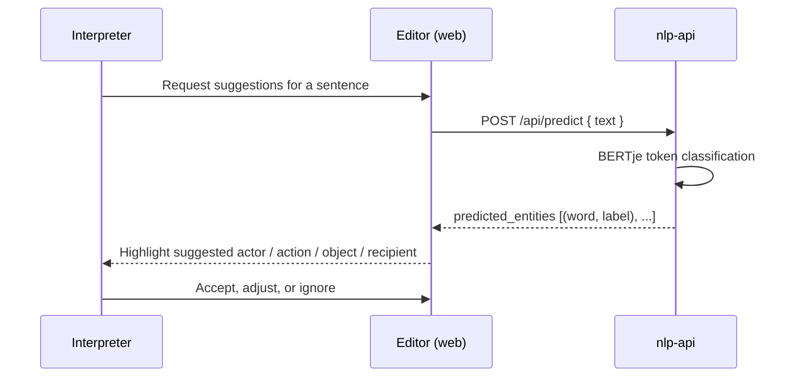

# NLP Assistance

Interpreting an act frame means deciding which words are the **action**, which are the
**actor**, the **object**, and the **recipient**. The Norm Editor can do a first pass of this
automatically, using a machine-learning model trained on Dutch normative text.

---

## What it does

The **nlp-api** service wraps a fine-tuned **BERTje** model (a Dutch BERT) configured for
**token classification**. Given a piece of Dutch text, it labels each token as one of:

| Model label | Meaning in the editor |
|---|---|
| `ACTION` | Action |
| `ACTOR` | Actor |
| `OBJECT` | Object |
| `RECIPIENT` | Recipient |
| `O` | Not part of an act frame |

Word-piece tokens (those continuing a previous word) are merged back into whole words, so the
suggestions are returned as readable word/label pairs rather than sub-word fragments.

!!! note "Scope of the model"
    The model is trained specifically to recognise the constituents of an **Act** frame in
    Dutch text. It does not predict claim-duty roles or fact subdivisions. The model and its
    training are described in the [FlintFillers](https://gitlab.com/normativesystems/flintfillers)
    project.

---

## How it fits the workflow

The interpreter stays in control. The model's output is a **suggestion**: the editor surfaces
the predicted entities so they can be turned into facts and slotted into an act's roles, but
the interpreter is free to correct or discard them. When the editor creates an *agent* fact
from a model suggestion, it records the model's recommended role as a comment on the fact, so
the provenance of the suggestion is preserved.

---

## Practical considerations

- **Language** — the model expects **Dutch** text. Running it over text in another language
  will produce unreliable labels.
- **Length** — transformer models have a maximum token limit. The service is intended to be
  used on **selected sentences or fragments**, not on an entire source document at once; very
  long inputs can exceed the model's limit.
- **Availability** — NLP assistance is optional. The editor is fully usable without it; the
  feature simply removes the manual first step of identifying act constituents.

For the request and response shapes, see the
[API Endpoints reference](../reference/api-endpoints.md#nlp-api). For how to run the service,
see [Backend & API services](../developer/backend-and-apis.md#nlp-api).
