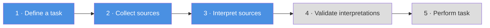

# Features Overview

The Norm Editor turns the open-ended task of "reading a law and writing down what it means"
into a guided, structured workflow. This section describes the capabilities the editor offers
at each stage.

---

## At a glance

| Feature | What it does |
|---|---|
| [Guided interpretation workflow](#guided-interpretation-workflow) | A five-step stepper that walks the interpreter from task definition to a finished interpretation |
| [The FLINT frame model](flint-frame-model.md) | Fact, Act, and Claim-duty frames with typed roles and subtypes |
| [Source annotation](source-annotation.md) | Select sentences from a structured document and highlight fragments to create frames |
| [Boolean constructs](boolean-constructs.md) | Compose preconditions and fact subdivisions with AND / OR / NOT |
| [NLP assistance](nlp-assistance.md) | Machine-learning suggestions for the constituents of an act frame |
| [Frame visualisation](visualisation.md) | View an interpretation as a filterable list or as an interactive network graph |
| [TriplyDB integration & formats](triplydb-and-formats.md) | Load and save sources and interpretations as RDF, TriG, or JSON |

---

## Guided interpretation workflow

The editor is organised as a stepper with five stages. The first three are fully functional;
the last two are placeholders for future work.

1. **Define a task** — record who is doing the interpretation (the *editor*), a label, and a
   description. Each task receives its own stable identifier and is linked to exactly one
   interpretation.
2. **Collect sources** — load one or more normative documents and select the sentences that
   are in scope. Sources can come from a server file, from TriplyDB, or from the local file
   system.
3. **Interpret sources** — the main working area, with the source text on the left and the
   frames on the right. Here the interpreter highlights fragments, creates and edits frames,
   assigns roles, and builds boolean preconditions.
4. **Validate interpretations** *(planned)* — reserved for checking the interpretation.
5. **Perform task** *(planned)* — reserved for executing the interpretation.

A persistent banner across the stepper header keeps **load** and **save** actions available
at every step, so an interpretation can be saved or reopened at any time.

---

## Designed for interpreters, not RDF authors

Every feature is built around the idea that the person doing the work is a legal or policy
expert, not a knowledge engineer:

- Frames are created by **highlighting text**, never by typing IRIs.
- Labels for act and claim-duty frames are **generated automatically** from their roles.
- The complex RDF serialisation is handled entirely by the conversion services.
- Comments can be attached to any frame to record interpretation decisions for reviewers.

The pages in this section describe each capability in more depth. For step-by-step
instructions, see the [User Guide](../user-guide/getting-started.md).
