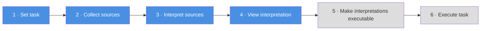

# Features Overview

The Norm Editor turns the open-ended task of "reading a law and writing down what it means"
into a guided, structured workflow. This section describes the capabilities the editor offers
at each stage.

---

## At a glance

| Feature | What it does |
|---|---|
| [Guided interpretation workflow](#guided-interpretation-workflow) | Six tabs that walk the interpreter from task definition to a finished interpretation |
| [The FLINT frame model](flint-frame-model.md) | Fact, Act, and Claim-duty frames with typed roles and subtypes |
| [Source annotation](source-annotation.md) | Select sentences from a structured document and highlight fragments to create frames |
| [Boolean constructs](boolean-constructs.md) | Compose preconditions and fact subdivisions with AND / OR / NOT |
| [NLP assistance](nlp-assistance.md) | Machine-learning suggestions for the constituents of an act frame |
| [Frame visualisation](visualisation.md) | A network of the dependencies between acts, with the details of any frame; a filterable list or network while interpreting |
| [TriplyDB integration & formats](triplydb-and-formats.md) | Load and save sources and interpretations as RDF, TriG, or JSON |

---

## Guided interpretation workflow

The editor is organised as six tabs in its header. The first four are functional; the last
two show a "Coming soon" page.

```mermaid
graph LR
    S1[1 · Set task] --> S2[2 · Collect sources]
    S2 --> S3[3 · Interpret sources]
    S3 --> S4[4 · View interpretation]
    S4 --> S5[5 · Make interpretations executable]
    S5 --> S6[6 · Execute task]

    style S1 fill:#4a90e2,color:#fff
    style S2 fill:#4a90e2,color:#fff
    style S3 fill:#4a90e2,color:#fff
    style S4 fill:#4a90e2,color:#fff
    style S5 fill:#dddddd
    style S6 fill:#dddddd
```

1. **Set task** — record who is doing the interpretation (the *editor*), a label, and a
   description. Each task receives its own stable identifier and is linked to exactly one
   interpretation.
2. **Collect sources** — load one or more normative documents and select the sentences that
   are in scope. Sources can come from a server file, from TriplyDB, or from the local file
   system.
3. **Interpret sources** — the main working area, with the source text, the frames, and the
   frame editor side by side. Here the interpreter highlights fragments, creates and edits
   frames, assigns roles, and builds boolean preconditions.
4. **View interpretation** — a network of the acts and claim-duties and how they depend on
   each other, with the details of any frame the interpreter clicks.
5. **Make interpretations executable** *(coming soon)* — not available yet.
6. **Execute task** *(coming soon)* — not available yet.

The **load** and **save** buttons sit in the header above the tabs, so an interpretation can
be saved or reopened from every tab at any time.

---

## Designed for interpreters, not RDF authors

Every feature is built around the idea that the person doing the work is a legal or policy
expert, not a knowledge engineer:

- Frames are created by **highlighting text**, never by typing IRIs.
- The short name of an act is **generated automatically** from its roles until the
  interpreter types one.
- The complex RDF serialisation is handled entirely by the conversion services.
- Comments can be attached to any frame to record interpretation decisions for reviewers.

The pages in this section describe each capability in more depth. For step-by-step
instructions, see the [User Guide](../user-guide/getting-started.md).
