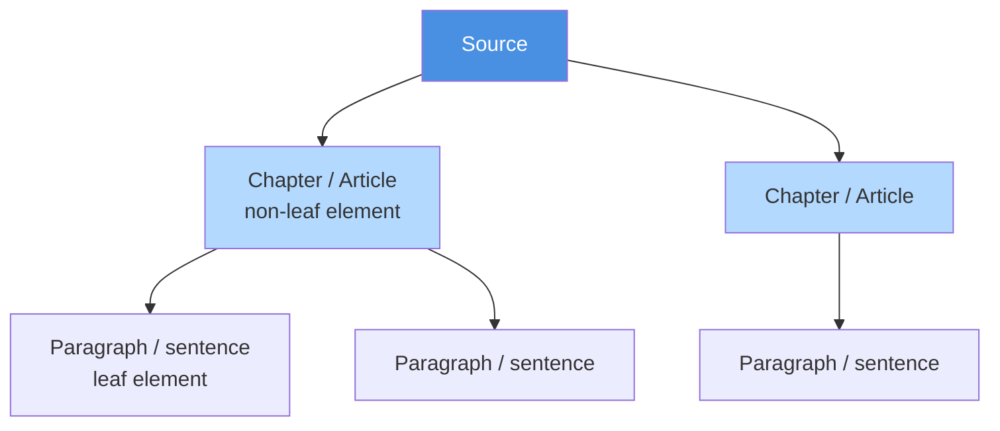

# Source Annotation

The heart of the editor is the link between **text** and **frames**. An interpretation is not
just a set of frames; it is a set of frames anchored to the exact fragments of source text
they were derived from. This page explains how the editor represents documents and how
highlighting creates those anchors.

---

## How a document is represented

A source document arrives as a **JSON-LD** structure produced by the *Choppr* document
chopper. The editor parses it into a **tree of sentences**:



- A **non-leaf element** becomes a collapsible heading node. If the source marks one child as
  a header (`containsAsHeader`), that child supplies the node's text; otherwise a label is
  built from the element's type and numbering.
- A **leaf element** becomes a sentence carrying the actual content.

Each sentence can be **collapsed** to hide its children and **selected** to include it in the
interpretation. Selection cascades: selecting a heading selects everything beneath it.

---

## Selecting sentences

In **Step 2 – Collect sources**, the document tree is shown with checkboxes. The interpreter
chooses which sentences are in scope, using *Select all* / *Deselect all* shortcuts per
document. Only selected sentences are carried into the interpretation view, keeping the
working area focused on the relevant text.

---

## Snippets: the unit of annotation

Internally, each sentence is divided into **snippets** — contiguous character ranges. When a
sentence is first created it has a single snippet spanning the whole sentence. As the
interpreter highlights text, snippets are split so that each distinct highlighted region
becomes its own snippet.

```
Sentence:   "the processing of personal data is lawful"
Highlight:               └─ personal data ─┘
Result:     [the processing of ][personal data][ is lawful]
              snippet 1           snippet 2       snippet 3
```

This snippet model is what makes **overlapping and nested annotations** possible: a single
snippet can belong to several annotations at once, so the same words can take part in more
than one frame.

---

## Annotations: linking text to a frame

An **annotation** ties one or more snippets to one frame. Highlighting text and choosing a
frame type creates an annotation whose frame is the new frame; the snippets under the
selection are attached to it.

The editor supports selection in either direction (left-to-right or right-to-left) and across
sentence boundaries — the selection logic normalises the anchor and focus points and collects
every snippet in between.

### Three ways to annotate

| Situation | Result |
|---|---|
| A **role is active** in an act or claim-duty (e.g. *actor*) and you highlight text | A fact of the correct subtype is created and dropped straight into the role — no panel appears |
| **No role is active** and you highlight text | A small panel appears offering to create a Fact, Act, or Claim-duty frame, or to add the selection to an existing frame |
| You click an **existing annotation** in the text | A list of the annotations covering that fragment opens, so you can jump to or edit their frames |

---

## Underlining

Every annotation is drawn as a coloured underline beneath its text, in the colour of its
frame type. When fragments overlap, the editor stacks the underlines on separate vertical
lines — longer annotations sit closest to the text, shorter ones further below — so that
several overlapping interpretations of the same passage remain readable. The vertical
positions are recalculated whenever annotations change or an interpretation is loaded.

---

## Scroll-to-source

From a frame's editor, *scroll to source* brings the relevant sentence into view in the
source panel and smoothly scrolls to it, so the interpreter can always see the text a frame
came from. The source panel itself can be collapsed to give the frames more room.

For the on-disk shape of annotations and snippets, see the
[Interpretation JSON Format reference](../reference/interpretation-json-format.md).
