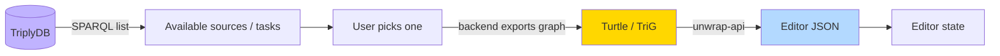
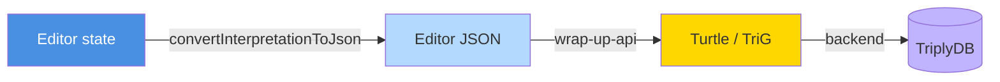

# TriplyDB Integration & Formats

An interpretation only becomes useful to the rest of the ecosystem once it is stored as
shared, queryable Linked Data. The Norm Editor reads its inputs from and writes its outputs to
a **TriplyDB** knowledge graph, and also supports plain file import and export.

---

## Sources, tasks, and interpretations

The editor works with three kinds of artefact, all stored as named graphs in TriplyDB:

| Artefact | Description |
|---|---|
| **Source** | A normative document, chopped into a sentence tree (`src:Source`) |
| **Task** | An interpretation assignment: an editor, a label, a description, and the graphs it involves (`calc:Task`) |
| **Interpretation** | The set of frames produced for a task |

A task links to exactly one interpretation and to the source graphs it draws on, so loading a
task pulls in everything needed to reopen the work.

---

## Loading

- **Sources** can be added from a server file list, from **TriplyDB**, or by **uploading a
  local JSON-LD file**. Sources retrieved from TriplyDB are exported by the backend as Turtle
  and converted to editor JSON by the unwrap-api.
- **Tasks** are listed from TriplyDB via SPARQL. Selecting one exports the task graph plus the
  graphs it involves as TriG, which the unwrap-api converts into a full interpretation that
  reopens in the editor.

---

## Saving

When saving to TriplyDB, the backend only uploads graphs that do not already exist online,
avoiding duplicate writes when re-saving an interpretation.

---

## Export and import formats

The editor supports three formats, available from the load/save banner:

| Format | Extension | Use |
|---|---|---|
| **Editor JSON** | `.json` | Native format; fastest round trip, no conversion service needed. Saved with a timestamped filename. |
| **TriG** | `.trig` | RDF serialisation of the interpretation (via wrap-up-api), suitable for sharing or storing as Linked Data |
| **Turtle** | `.ttl` | RDF form used when exchanging single graphs (e.g. sources) |

Because the JSON and RDF representations are interconvertible through the wrap-up and unwrap
services, an interpretation can move freely between a quick local file and the shared triple
store without loss. The JSON format is also **backwards compatible** — older interpretations
that used a single fact subtype, or stored comments as plain strings, are read correctly by
the current editor.

For the precise JSON structure see the
[Interpretation JSON Format reference](../reference/interpretation-json-format.md); for the
backend endpoints involved, see [API Endpoints](../reference/api-endpoints.md).
