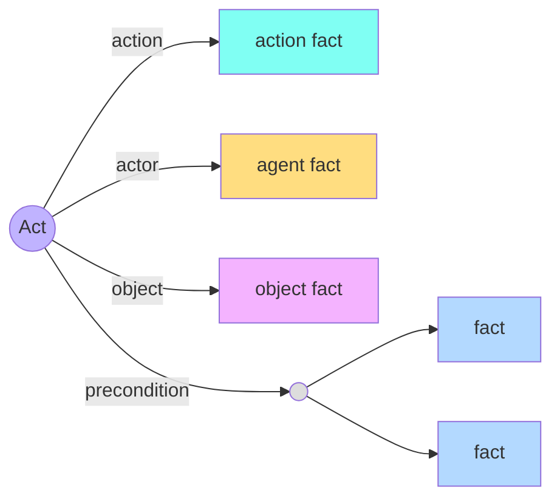

# Frame Visualisation

An interpretation of a substantial norm can contain dozens of frames with many cross
references. The Norm Editor offers two complementary views of the same data: a **list** for
finding and editing, and a **network** for understanding structure.

---

## List view

The list view groups frames by **type** and, where applicable, **subtype**. Each frame is
shown as a coloured chip. A search box filters frames by label as you type, which is the
quickest way to locate a specific fact in a large interpretation. Clicking a chip opens that
frame in the editor panel.

The list view is the default and is best suited to the day-to-day work of creating and
refining frames.

---

## Network view

The network view renders the interpretation as an interactive **force-directed graph**. Nodes
are frames; edges are the role relationships between them.

Visual encoding follows the same colour scheme as the rest of the editor:

- **Node colour** reflects the frame type or subtype; facts with several subtypes use a
  distinct "multiple" colour.
- **Node size** distinguishes relations (acts and claim-duties are larger) from facts, with
  the small join-points of boolean constructs shown smallest of all.
- **Boolean constructs** appear as anonymous nodes that connect their operands, making the
  AND / OR structure of a precondition visible at a glance.

### Filtering

A filter lets you show or hide frames by type and subtype, so you can isolate (for example)
only the acts and their actors. An additional toggle reveals **dependency relations between
acts** — the *before* ordering implied when one act creates a fact that another act's
precondition depends on — which is useful for seeing how a procedure flows from one act to the
next.

---

## Switching views

A radio control in the Frames panel header switches between *List* and *Network* at any time;
both operate on the same underlying interpretation, so edits in one are immediately reflected
in the other.
