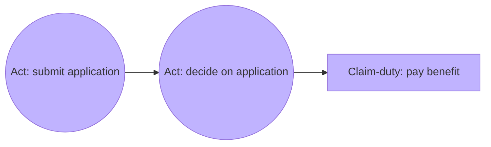
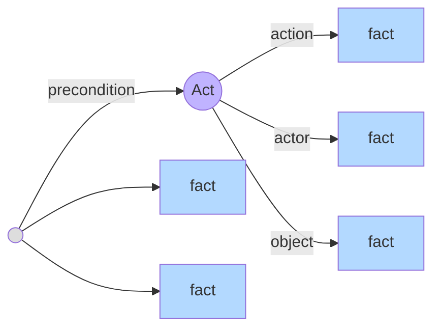

# Frame Visualisation

An interpretation of a substantial norm can contain dozens of frames with many cross
references. The Norm Editor shows the same data in two places:

- the **View interpretation** tab, which draws the acts and claim-duties as a network of
  dependencies and shows the details of any frame you click, and
- the **Frames** pane of the **Interpret sources** tab, which shows every frame as a list or as
  a network while you are editing.

Both operate on the same interpretation, so a change made while interpreting is reflected the
next time you open either view.

---

## The View interpretation tab

The tab has three panes side by side: **Frames**, **Network**, and **Details**. Clicking a
frame in the list or a node in the network selects it in all three.

### Frames

The same list as in the interpretation tab — frames grouped by type and fact subtype, with a
**Filter on name** box — but clicking a frame here selects it instead of opening it in the
editor.

### Network

The network shows the **acts and claim-duties** of the interpretation and how they depend on
each other. The pane heading summarises what is drawn, for example *3 acts · 1 claim-duty ·
2 dependencies*.

```mermaid
graph LR
    A1(("Act: submit application")) --> A2(("Act: decide on application"))
    A2 --> CD["Claim-duty: pay benefit"]

    style A1 fill:#c0b3ff
    style A2 fill:#c0b3ff
    style CD fill:#c0b3ff
```

- **Acts are circles, claim-duties are squares.** A legend in the pane says so.
- **An arrow from one act to another** means the first *creates something the next act
  needs*: a fact in its *Creates* list (or in that fact's subdivision) turns up in the other
  frame's precondition, roles, or *Terminates* list. Only acts create facts, so arrows always
  start at an act.
- **Labels** show the frame's short name, cut off after 40 characters. An orange sub-label such
  as *2 of 4 roles not set* flags a frame with empty roles.
- **Selecting a node** gives it an orange ring and dims every node outside its direct
  neighbourhood. Clicking the selected node again clears the selection. Selecting a fact in the
  list highlights the acts and claim-duties that use it and dims the rest.

A hint at the bottom reads *Click a node for details · drag to move · scroll to zoom*. The
pane's tools are:

| Tool | Effect |
|---|---|
| Zoom out / Zoom in | Zoom the network one step |
| **Fit to view** | Zoom and pan so every node and its label is in view |
| **Rearrange** | Forget the nodes you moved by hand and lay the network out again |
| **Show N hidden** | Bring back the frames you hid from the network |

The network fits itself to the pane until you zoom, and keeps its layout when you return to
the tab without having changed the interpretation. When there are no acts or claim-duties yet,
the pane offers an **Interpret sources** button instead.

### Details

The Details pane shows the selected frame read-only: its type, its short name and full name,
and two buttons — **Open in editor**, which opens the frame in the interpretation tab, and
**Hide from network**, which takes an act or claim-duty out of the drawing until you click
*Show N hidden*. Below that it lists:

| Frame | Details shown |
|---|---|
| Act | **Roles** (*Not set* when empty); **Precondition** (*None: the act can always be performed*, or the condition drawn as a tree); **Postcondition** with *Creates* and *Terminates* (*Nothing* when empty); **Dependencies** — *Enabled by* the acts that create something this act needs, and *Enables* the acts that need something it creates |
| Claim-duty | **Roles**; **Used by** — the acts and claim-duties that use it |
| Fact | **Subtypes**; **Used by** — each act or claim-duty that uses the fact, with the roles or conditions it appears in |

Every frame named in the Details pane can be clicked to select it in turn. With nothing
selected, the pane explains that you can click an act or claim-duty in the network, or any
frame in the list.

---

## Frames in the Interpret sources tab

Two icon buttons in the Frames pane heading — *Show as list* and *Show as network* — switch
the pane between two views.

### List

The list groups frames by **type** and, for facts, by **subtype**, with a count per group.
Each frame is a full-width row in its colour; a fact with more than one subtype has a colour
of its own. Typing two or more characters in **Filter on name** narrows the list as you type,
which is the quickest way to find a specific fact in a large interpretation. Clicking a frame
opens it in the frame editor.

The list is the default and suits the day-to-day work of creating and refining frames.

### Network

The network view draws the interpretation as an interactive **force-directed graph**. Nodes
are frames — facts as well as acts and claim-duties — and edges are the role relationships
between them. When a frame is open in the editor, the graph starts from that frame; clicking a
node adds the frames directly linked to it.

```mermaid
graph LR
    ACT(("Act")) -->|action| AC["fact"]
    ACT -->|actor| AG["fact"]
    ACT -->|object| OB["fact"]
    BC(( )) -->|precondition| ACT
    BC --> F1["fact"]
    BC --> F2["fact"]

    style ACT fill:#c0b3ff
    style AC fill:#b3d9ff
    style AG fill:#b3d9ff
    style OB fill:#b3d9ff
    style BC fill:#dddddd
    style F1 fill:#b3d9ff
    style F2 fill:#b3d9ff
```

- **Node size** distinguishes relations (acts and claim-duties are larger) from facts, with the
  small join-points of boolean constructs and of multi-fact *Creates* and *Terminates* lists
  shown smallest of all.
- **Boolean constructs** appear as anonymous nodes that connect their operands, making the
  AND / OR structure of a precondition or subdivision visible.
- A row of checkboxes, **Show frames of type**, shows or hides frames by type, so you can
  isolate (for example) only the acts and claim-duties.

To see how acts depend on each other, use the network in the **View interpretation** tab.
