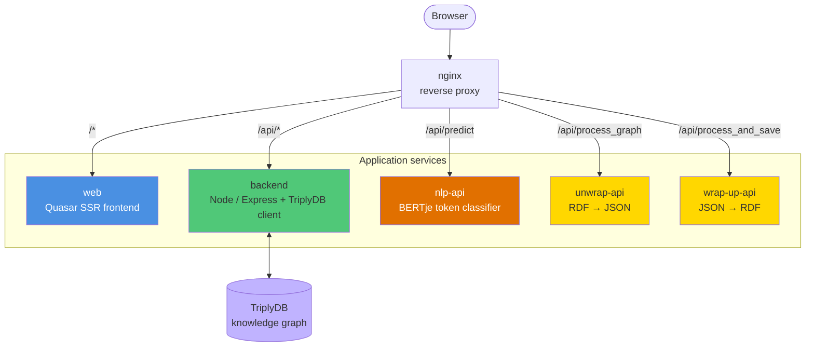

# Norm Editor

The **Norm Editor** (also known as the *Regeleditor*) is a web application for creating
**interpretations of legal sources** in the [FLINT](reference/flint-ontology.md) frame
language. It lets a domain expert load a normative text, select the relevant sentences,
highlight fragments, and turn those fragments into structured **Fact**, **Act**, and
**Claim-duty** frames. The result is exported as machine-readable RDF that can be stored in
a TriplyDB knowledge graph and reused by the rest of the RONL ecosystem.

No RDF knowledge is required to interpret a source. The user works with highlighted text and
form fields; the editor builds the FLINT graph behind the scenes and serialises it to Turtle
through a dedicated conversion service.

!!! info "Names you will encounter"
    The product is titled **Norm Editor** in its README, the frontend package is named
    `regel-gui`, and the running Quasar application identifies itself as the **Regel Editor**.
    These all refer to the same component. This documentation uses *Norm Editor*.

---

## What is the Norm Editor?

Legal and policy texts are written for humans. To make them executable — for example by the
[RONL Business API](../ronl-business-api/index.md) or the
[Linked Data Explorer](../linked-data-explorer/index.md) — the meaning of a norm has to be
captured in a formal model. FLINT (Frame-based Legal Interpretation) is such a model: it
expresses norms as **acts** (who may do what, under which preconditions, with which effects),
**facts** (the concepts the acts refer to), and **claim-duty relations** (who owes what to
whom).

The Norm Editor is the **authoring tool** for that model. It guides an interpreter through a
five-stage process — define a task, collect sources, interpret the sources, validate, and
perform — of which the first three are fully implemented. Along the way it offers an optional
machine-learning assistant that suggests the actor, action, object, and recipient of an act
directly from the Dutch source text.

---

## Architecture

The Norm Editor is not a single application but a small **stack of cooperating services**,
fronted by an nginx reverse proxy. The browser only ever talks to nginx; nginx routes each
request to the correct upstream.



### Services

| Service | Technology | Responsibility | Local port |
|---|---|---|---|
| `nginx` | nginx | Reverse proxy / single entry point | 80 |
| `web` | Vue 3 + Quasar (SSR) | The editor user interface | 8080 (internal) |
| `backend` | Node.js + Express + `@triply/triplydb` | Reads and writes sources and tasks in TriplyDB | 3000 |
| `nlp-api` | Python + Flask + Transformers | Predicts act-frame entities from Dutch text | 8081 |
| `unwrap-api` | Python + Flask + RDFLib | Converts FLINT RDF into editor JSON | 5001 |
| `wrap-up-api` | Python + Flask + RDFLib | Converts editor JSON into FLINT RDF | 5002 |

The two "wrapping" services are mirror images of each other: `wrap-up-api` serialises an
interpretation into RDF for storage, and `unwrap-api` parses RDF back into the JSON the
editor understands. Together they give the editor a lossless round trip to and from the
triple store.

### Data flow

**Authoring a new interpretation**

```
Load source (JSON-LD)  →  select sentences  →  annotate fragments
        →  build Fact / Act / Claim-duty frames  →  export
```

**Saving to TriplyDB**

```
Editor state  →  convertInterpretationToJson()  →  wrap-up-api  →  Turtle/TriG  →  backend  →  TriplyDB
```

**Loading from TriplyDB**

```
backend (SPARQL + graph export)  →  TriG  →  unwrap-api  →  editor JSON  →  parseJsonToInterpretation()  →  editor state
```

### Deployment pipeline

```
docker compose up        →  full stack on http://localhost
./deploy.sh              →  Azure Container Apps behind an Application Gateway (Bicep IaC)
```

See [Deployment](developer/deployment.md) for the production topology.

---

## Standards and vocabularies

The Norm Editor produces RDF built on the TNO Norm Engineering ontologies.

| Vocabulary | Prefix | Purpose |
|---|---|---|
| FLINT | `flint:` | Frame model: acts, facts, agents, duties, boolean facts |
| Norm Engineering Source | `src:` | Source documents, sentences, text fragments, character ranges |
| Editor | `editor:` | Editor-specific metadata (frame identity, on-screen position) |
| Calculemus | `calc:` | Tasks and the graphs a task involves |
| Choppr | `choppr:` | Document-chopping structure used by source documents |
| Collections Ontology | `co:` | Ordered collections |
| Web Annotation | `oa:` | Annotation vocabulary |
| PROV-O | `prov:` | Provenance |

Full IRIs and the predicates used for each frame type are listed in the
[FLINT Ontology reference](reference/flint-ontology.md).

---

## Positioning in the RONL ecosystem

The Norm Editor sits at the **interpretation** stage of the rules lifecycle. Where the
[CPSV Editor](../cpsv-editor/index.md) describes *which* public services and rules exist, the
Norm Editor captures *what a specific norm means* as an executable FLINT interpretation. Its
output — interpretations stored as named graphs in TriplyDB — becomes input for downstream
execution and visualisation tools.

---

**Documentation Version**: 1.0
**Last Updated**: June 2026
**License**: Apache License 2.0 (frontend & NLP API), EUPL-1.2 (conversion services) — see each repository
