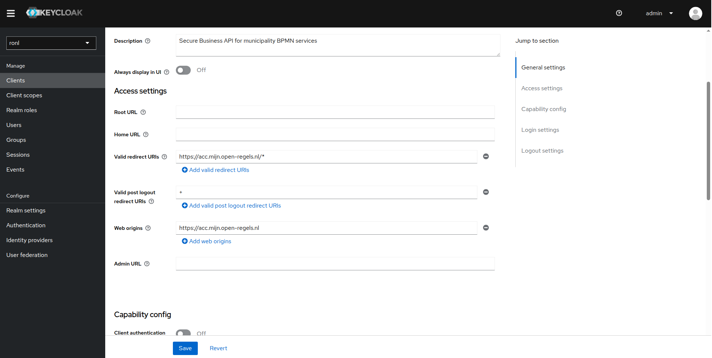

# Frontend (Azure Static Web Apps)

The frontend is deployed to Azure Static Web Apps via GitHub Actions. Separate instances run for ACC and PROD environments.

## Architecture

```
┌──────────────────────────────────────────┐
│   GitHub Repository (ronl-business-api)  │
│                                          │
│  ┌─────────────────────────────────────┐ │
│  │  packages/frontend/                 │ │
│  │  ├── src/                           │ │
│  │  ├── public/                        │ │
│  │  │   ├── tenants.json               │ │
│  │  │   └── staticwebapp.config.json   │ │ ← SPA routing config
│  │  ├── vite.config.ts                 │ │
│  │  └── package.json                   │ │
│  └─────────────────────────────────────┘ │
│                 │                        │
│                 │ Push to 'acc' branch   │
│                 ▼                        │
│  ┌─────────────────────────────────────┐ │
│  │  .github/workflows/                 │ │
│  │  ├── azure-frontend-acc.yml         │ │
│  │  └── azure-frontend-prod.yml        │ │
│  └─────────────────────────────────────┘ │
└──────────────────────────────────────────┘
                 │
                 │ GitHub Actions
                 ▼
┌─────────────────────────────────────────┐
│      Azure Static Web Apps              │
│                                         │
│  ACC:  acc.mijn.open-regels.nl          │
│  PROD: mijn.open-regels.nl              │
│                                         │
│  ✅ Global CDN                          │
│  ✅ Automatic SSL                       │
│  ✅ Custom domains                      │
│  ✅ SPA fallback routing                │
└─────────────────────────────────────────┘
```

## GitHub Actions Workflows

### ACC Workflow

**File:** `.github/workflows/azure-frontend-acc.yml`

```yaml
name: Deploy Frontend to ACC

on:
  push:
    branches:
      - acc
    paths:
      - 'packages/frontend/**'
      - '.github/workflows/azure-frontend-acc.yml'

jobs:
  build_and_deploy:
    runs-on: ubuntu-latest
    name: Build and Deploy to ACC
    steps:
      - uses: actions/checkout@v3
        with:
          submodules: true

      - name: Setup Node.js
        uses: actions/setup-node@v3
        with:
          node-version: '20'
          cache: 'npm'

      - name: Install dependencies
        run: |
          npm ci
          npm ci --workspace=packages/frontend

      - name: Build frontend
        run: npm run build --workspace=packages/frontend
        env:
          VITE_KEYCLOAK_URL: ${{ secrets.ACC_KEYCLOAK_URL }}
          VITE_API_URL: ${{ secrets.ACC_API_URL }}

      - name: Deploy to Azure Static Web Apps
        uses: Azure/static-web-apps-deploy@v1
        with:
          azure_static_web_apps_api_token: ${{ secrets.ACC_AZURE_SWA_TOKEN }}
          repo_token: ${{ secrets.GITHUB_TOKEN }}
          action: 'upload'
          app_location: 'packages/frontend'
          output_location: 'dist'
          skip_app_build: true
```

**Triggers:**
- Push to `acc` branch
- Changes in `packages/frontend/**`
- Changes to workflow file itself

### PROD Workflow

**File:** `.github/workflows/azure-frontend-prod.yml`

Same structure as ACC but with:

- Branch: `main` or `prod`
- PROD secrets (`PROD_KEYCLOAK_URL`, `PROD_API_URL`, `PROD_AZURE_SWA_TOKEN`)
- Additional approval gate (manual approval before deployment)

## SPA Routing Configuration

**Critical for React Router:** Azure Static Web Apps needs `staticwebapp.config.json` to handle client-side routing.

**File:** `packages/frontend/public/staticwebapp.config.json`

```json
{
  "navigationFallback": {
    "rewrite": "/index.html",
    "exclude": ["/assets/*", "/*.js", "/*.css", "/*.json", "/*.png", "/*.jpg", "/*.svg"]
  },
  "globalHeaders": {
    "cache-control": "no-cache, no-store, must-revalidate"
  },
  "mimeTypes": {
    ".json": "application/json",
    ".css": "text/css",
    ".js": "application/javascript"
  }
}
```

**What it does:**

- ✅ All routes (`/`, `/auth`, `/dashboard`) → served by `index.html`
- ✅ React Router handles routing client-side
- ✅ Static assets excluded from fallback
- ✅ Proper cache headers
- ✅ Correct MIME types

**Without this file:** Routes like `/auth` and `/dashboard` return 404 errors after Keycloak redirect.

## Build and Deployment Steps

### Step 1 — Trigger

Push changes to `acc` branch:

```bash
cd ~/Development/ronl-business-api

# Make frontend changes
nano packages/frontend/src/pages/Dashboard.tsx

# Commit and push
git add packages/frontend/
git commit -m "feat: update dashboard styling"
git push origin acc
```

### Step 2 — GitHub Actions Build

The workflow automatically:

1. Checks out code
2. Sets up Node.js 20
3. Installs dependencies (monorepo aware)
4. Builds frontend with environment variables
5. Outputs to `packages/frontend/dist/`

**Build artifacts:**
```
dist/
├── index.html                 # Entry point
├── assets/
│   ├── index-[hash].js        # Main bundle
│   ├── index-[hash].css       # Styles
│   └── [other assets]
├── tenants.json               # Municipality config (copied from public/)
└── staticwebapp.config.json   # SPA routing (copied from public/)
```

### Step 3 — Azure Deployment

The `Azure/static-web-apps-deploy@v1` action:

1. Authenticates with Azure using API token
2. Uploads `dist/` folder to Azure Storage
3. Invalidates CDN cache
4. Updates routing rules from `staticwebapp.config.json`
5. Makes new version live

**Deployment time:** ~2-3 minutes

### Step 4 — Verification

```bash
# Check deployment status
# GitHub Actions → Workflows → Deploy Frontend to ACC

# Test URLs
curl -I https://acc.mijn.open-regels.nl
# Should return: 200 OK

curl -I https://acc.mijn.open-regels.nl/auth
# Should return: 200 OK (not 404!)

# Test in browser
# Visit: https://acc.mijn.open-regels.nl
# Click "Inloggen met DigiD"
# After Keycloak auth, /auth route should work
# Dashboard should load at /dashboard
```

## Environment Files

Environment variables are configured as GitHub Secrets:

### ACC Secrets

```
ACC_KEYCLOAK_URL=https://acc.keycloak.open-regels.nl
ACC_API_URL=https://acc.api.open-regels.nl/v1
ACC_AZURE_SWA_TOKEN=<deployment-token>
```

### PROD Secrets

```
PROD_KEYCLOAK_URL=https://keycloak.open-regels.nl
PROD_API_URL=https://api.open-regels.nl/v1
PROD_AZURE_SWA_TOKEN=<deployment-token>
```

### Adding/Updating Secrets

1. **GitHub Repository** → Settings → Secrets and variables → Actions
2. Click **New repository secret**
3. Name: `ACC_KEYCLOAK_URL`
4. Value: `https://acc.keycloak.open-regels.nl`
5. Click **Add secret**

## Azure Static Web App Configuration

### Resource Details

**ACC:**

- **Name:** `ronl-frontend-acc`
- **Resource Group:** `rg-ronl-acc`
- **Region:** West Europe
- **Custom Domain:** `acc.mijn.open-regels.nl`
- **Pricing:** Free tier (sufficient for this application)

**PROD:**

- **Name:** `ronl-frontend-prod`
- **Resource Group:** `rg-ronl-prod`
- **Region:** West Europe
- **Custom Domain:** `mijn.open-regels.nl`
- **Pricing:** Standard tier (for production SLA)

### Deployment Token

**Retrieve token from Azure Portal:**

1. Navigate to Static Web App resource
2. Left menu → **Deployment tokens**
3. Copy **Deployment token**
4. Store in GitHub Secrets as `ACC_AZURE_SWA_TOKEN`

**Token permissions:**

- Upload build artifacts
- Update routing configuration
- Invalidate CDN cache

### Custom Domain Setup

**ACC domain (`acc.mijn.open-regels.nl`):**

1. Azure Portal → Static Web App → Custom domains
2. Click **Add**
3. Enter: `acc.mijn.open-regels.nl`
4. Choose: **Other DNS**
5. Add DNS records:
   ```
   Type: CNAME
   Name: acc.mijn
   Value: <generated-url>.azurestaticapps.net
   ```
6. Verify and add

**SSL certificate:** Automatically provisioned by Azure (Let's Encrypt)

## Post-Deployment Verification

### Automated Tests (Future)

```yaml
# Add to workflow after deployment
- name: Test deployed app
  run: |
    # Test root route
    curl -f https://acc.mijn.open-regels.nl

    # Test SPA routes
    curl -f https://acc.mijn.open-regels.nl/auth
    curl -f https://acc.mijn.open-regels.nl/dashboard

    # Test static assets
    curl -f https://acc.mijn.open-regels.nl/tenants.json
```

### Manual Testing Checklist

- [ ] Landing page loads (https://acc.mijn.open-regels.nl)
- [ ] Three IDP buttons visible and styled correctly
- [ ] Changelog panel opens/closes
- [ ] DigiD button → redirects to Keycloak
- [ ] After auth → `/auth` route works (no 404)
- [ ] Dashboard loads at `/dashboard`
- [ ] Municipality theme applied correctly
- [ ] Calculator form submits
- [ ] Mobile responsive (test on phone)
- [ ] No console errors in browser DevTools

## Manual Deployment

If GitHub Actions fails or for emergency hotfix:

### Step 1 — Build locally

```bash
cd ~/Development/ronl-business-api/packages/frontend

# Set environment variables
export VITE_KEYCLOAK_URL=https://acc.keycloak.open-regels.nl
export VITE_API_URL=https://acc.api.open-regels.nl/v1

# Build
npm run build

# Output: dist/ directory
ls -la dist/
```

### Step 2 — Deploy via Azure CLI

```bash
# Install Azure CLI (if not installed)
curl -sL https://aka.ms/InstallAzureCLIDeb | sudo bash

# Login to Azure
az login

# Deploy to ACC
az staticwebapp deploy \
  --name ronl-frontend-acc \
  --resource-group rg-ronl-acc \
  --source ./dist \
  --no-use-keychain

# Wait for deployment (~2-3 minutes)
```

### Step 3 — Verify

```bash
# Test deployment
curl -I https://acc.mijn.open-regels.nl
# Should return: 200 OK

# Open in browser
# Visit: https://acc.mijn.open-regels.nl
```

## Keycloak Redirect URIs

**Critical:** Keycloak client must allow redirects from deployed URLs.

### ACC Configuration

Keycloak Admin Console:

1. Realm: `ronl`
2. Clients → `ronl-business-api`
3. **Valid Redirect URIs:** `https://acc.mijn.open-regels.nl/*`
4. **Valid Post Logout Redirect URIs:** `+` (inherits from redirect URIs)
5. **Web Origins:** `https://acc.mijn.open-regels.nl`



### PROD Configuration

Same as ACC but with:

- **Valid Redirect URIs:** `https://mijn.open-regels.nl/*`
- **Web Origins:** `https://mijn.open-regels.nl`

## Rollback Procedure

If deployment causes issues:

### Option 1 — Revert via GitHub

```bash
# Find last working commit
git log --oneline packages/frontend/

# Revert to that commit
git revert <commit-hash>

# Push to trigger new deployment
git push origin acc
```

### Option 2 — Rollback in Azure Portal

1. Azure Portal → Static Web App
2. Left menu → **Environments**
3. Select previous deployment
4. Click **Promote**

## Troubleshooting

### 404 on routes after deployment

**Symptoms:** Landing page works, but `/auth` and `/dashboard` return 404.

**Cause:** `staticwebapp.config.json` missing or not deployed.

**Solution:**

```bash
# Verify file exists in source
ls -la packages/frontend/public/staticwebapp.config.json

# File must be in public/ to be copied to dist/ during build

# If missing, create it:
cat > packages/frontend/public/staticwebapp.config.json << 'EOF'
{
  "navigationFallback": {
    "rewrite": "/index.html",
    "exclude": ["/assets/*", "/*.js", "/*.css", "/*.json"]
  }
}
EOF

# Commit and redeploy
git add packages/frontend/public/staticwebapp.config.json
git commit -m "fix: add SPA routing configuration"
git push origin acc
```

### Environment variables not applied

**Symptoms:** App loads but can't connect to Keycloak or API.

**Cause:** Build-time environment variables not set.

**Solution:**

```bash
# Check GitHub Secrets are configured
# Repository → Settings → Secrets and variables → Actions

# Required secrets:
# - ACC_KEYCLOAK_URL
# - ACC_API_URL

# Verify workflow uses them:
# .github/workflows/azure-frontend-acc.yml
env:
  VITE_KEYCLOAK_URL: ${{ secrets.ACC_KEYCLOAK_URL }}
  VITE_API_URL: ${{ secrets.ACC_API_URL }}

# Re-run workflow after fixing
```

### CORS errors in browser console

**Symptoms:** Browser shows CORS policy errors when calling API.

**Cause:** Keycloak or API not configured for frontend origin.

**Solution:**

```bash
# Keycloak: Web Origins should be '+'
# This inherits all Valid Redirect URIs as allowed origins

# API: Backend must allow frontend origin in CORS config
# packages/backend/src/index.ts
app.use(cors({
  origin: [
    'https://acc.mijn.open-regels.nl',
    'https://mijn.open-regels.nl'
  ],
  credentials: true
}));
```

### Deployment takes too long or fails

**Symptoms:** GitHub Actions workflow runs for 10+ minutes or fails.

**Cause:** Azure Static Web Apps service issues or incorrect token.

**Solution:**

```bash
# Check Azure service status
# Visit: https://status.azure.com/

# Verify deployment token is valid
# Azure Portal → Static Web App → Deployment tokens
# Regenerate if needed and update GitHub Secret

# Check workflow logs for specific error
# GitHub Actions → Failed workflow → View logs

# Common errors:
# - "401 Unauthorized" → Token invalid, regenerate
# - "429 Too Many Requests" → Wait and retry later
```

### Build succeeds but app doesn't update

**Symptoms:** Deployment completes successfully but changes not visible.

**Cause:** Browser cache or CDN cache.

**Solution:**

```bash
# Hard refresh browser
# Chrome: Ctrl+Shift+R (Windows/Linux) or Cmd+Shift+R (Mac)
# Firefox: Ctrl+F5 (Windows/Linux) or Cmd+Shift+R (Mac)

# Check deployed version
# View source: https://acc.mijn.open-regels.nl
# Look for timestamp or version comments

# CDN cache usually invalidates within 5 minutes
# Wait and try again if issue persists
```

## Performance Optimization

### Bundle Size

Current build stats (~production):

- **Total bundle:** ~250 KB gzipped
- **index.js:** ~200 KB (React, React Router, Keycloak, Axios)
- **index.css:** ~50 KB (Tailwind CSS)

**Optimization opportunities:**

- ✅ Vite code splitting (already enabled)
- ✅ Tree shaking (already enabled)
- ⚠️ Consider lazy loading routes for larger apps
- ⚠️ Consider removing unused Tailwind classes

### CDN Performance

Azure Static Web Apps provides:

- ✅ Global CDN distribution
- ✅ Automatic gzip/brotli compression
- ✅ HTTP/2 support
- ✅ Edge caching (configured via `staticwebapp.config.json`)

**Cache headers:**
```json
{
  "globalHeaders": {
    "cache-control": "no-cache, no-store, must-revalidate"
  }
}
```

Currently set to no-cache for development. For production, consider:
```json
{
  "routes": [
    {
      "route": "/assets/*",
      "headers": {
        "cache-control": "public, max-age=31536000, immutable"
      }
    }
  ]
}
```

---

## Related Documentation

- [Frontend Development](../frontend-development.md) — Local development setup
- [Keycloak Deployment](keycloak.md) — Redirect URI configuration
- [Backend Deployment](backend.md) — API CORS configuration
- [Deployment Overview](overview.md) — Full architecture
- [CI/CD Guide](../cicd.md) — GitHub Actions workflows

---

**Questions or issues?** See [Troubleshooting](../troubleshooting.md) or contact the DevOps team.