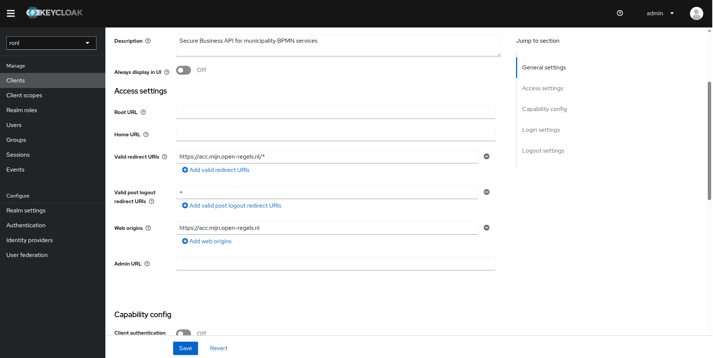

# Frontend (Azure Static Web Apps)

The frontend is deployed to Azure Static Web Apps via GitHub Actions. Separate instances run for ACC and PROD environments.

---

## Architecture

```
┌──────────────────────────────────────────┐
│   GitHub Repository (ronl-business-api)  │
│                                          │
│  ┌─────────────────────────────────────┐ │
│  │  packages/frontend/                 │ │
│  │  ├── src/                           │ │
│  │  ├── public/                        │ │
│  │  │   ├── tenants.json               │ │
│  │  │   └── staticwebapp.config.json   │ │ ← SPA routing config
│  │  ├── vite.config.ts                 │ │
│  │  └── package.json                   │ │
│  └─────────────────────────────────────┘ │
│                 │                        │
│                 │ Push to 'acc' branch   │
│                 ▼                        │
│  ┌─────────────────────────────────────┐ │
│  │  .github/workflows/                 │ │
│  │  ├── azure-frontend-acc.yml         │ │
│  │  └── azure-frontend-prod.yml        │ │
│  └─────────────────────────────────────┘ │
└──────────────────────────────────────────┘
                 │
                 │ GitHub Actions
                 ▼
┌─────────────────────────────────────────┐
│      Azure Static Web Apps              │
│                                         │
│  ACC:  acc.mijn.open-regels.nl          │
│  PROD: mijn.open-regels.nl              │
│                                         │
│  ✅ Global CDN                          │
│  ✅ Automatic SSL                       │
│  ✅ Custom domains                      │
│  ✅ SPA fallback routing                │
└─────────────────────────────────────────┘
```

---

## GitHub Actions Workflows

### ACC Workflow

**File:** `.github/workflows/azure-frontend-acc.yml` — abridged: comments
removed, and the `changes` and `close_pull_request_job` jobs shortened to their
outline.

```yaml
name: Deploy Frontend to Azure ACC

on:
  push:
    branches:
      - acc
    paths:
      - 'packages/frontend/**'
      - 'packages/shared/**'
      - 'packages/pa-cockpit/**'
      - '.github/workflows/azure-frontend-acc.yml'
      - 'package-lock.json'
      - 'package.json'
      - '.nvmrc'
  pull_request:
    types: [opened, synchronize, reopened, closed, labeled]
    branches:
      - acc
  workflow_dispatch:

concurrency:
  group: ${{ github.workflow }}-${{ github.event.pull_request.number || github.ref }}
  cancel-in-progress: true

permissions:
  contents: read

jobs:
  changes:            # outputs `relevant` (build?) and `preview` (deploy a preview?)
    ...

  build_and_deploy_job:
    needs: changes
    permissions:
      contents: read
      pull-requests: write
    if: ${{ !cancelled() && (github.event_name == 'push' || github.event_name == 'workflow_dispatch' || (github.event_name == 'pull_request' && github.event.action != 'closed')) && (needs.changes.result != 'success' || needs.changes.outputs.relevant == 'true') }}
    runs-on: ubuntu-24.04
    name: Build and Deploy ACC Frontend
    environment:
      name: acc
      url: https://acc.mijn.open-regels.nl

    steps:
      - uses: actions/checkout@3d3c42e5aac5ba805825da76410c181273ba90b1 # v7.0.1
        with:
          submodules: true
          lfs: false
          persist-credentials: false

      - name: Setup Node.js
        uses: actions/setup-node@820762786026740c76f36085b0efc47a31fe5020 # v7.0.0
        with:
          node-version-file: .nvmrc

      - name: Install dependencies
        run: npm ci

      - name: Build shared package
        run: npm run build --workspace=@ronl/shared

      - name: Run linter
        working-directory: packages/frontend
        run: npm run lint

      - name: Unit tests (pa-cockpit)
        working-directory: packages/pa-cockpit
        run: npm test

      - name: Unit tests
        working-directory: packages/frontend
        run: npm test

      - name: Performance budget
        working-directory: packages/frontend
        run: npm run test:perf

      - name: Build frontend for ACC
        working-directory: packages/frontend
        env:
          VITE_BUILD_SHA: ${{ github.sha }}
          VITE_BUILD_RUN: ${{ github.run_number }}
        run: |
          npm run build:acc

          echo "Build output:"
          ls -la dist/
          test -f dist/index.html || (echo "ERROR: index.html not found!" && exit 1)
          node scripts/check-og.mjs acceptance
          echo "✅ Build completed successfully"

      - name: Deploy to Azure Static Web Apps
        if: ${{ github.event_name != 'pull_request' || needs.changes.outputs.preview == 'true' }}
        id: builddeploy
        uses: Azure/static-web-apps-deploy@4d27395796ac319302594769cfe812bd207490b1 # v1
        with:
          azure_static_web_apps_api_token: ${{ secrets.AZURE_STATIC_WEB_APPS_API_TOKEN_ACC }}
          repo_token: ${{ secrets.GITHUB_TOKEN }}
          action: 'upload'
          app_location: '/packages/frontend/dist'
          api_location: ''
          output_location: ''
          skip_app_build: true

      - name: Wait for deployment
        if: ${{ github.event_name != 'pull_request' || needs.changes.outputs.preview == 'true' }}
        run: sleep 15

      - name: Verify deployment
        if: ${{ github.event_name != 'pull_request' || needs.changes.outputs.preview == 'true' }}
        run: |
          response=$(curl -s -o /dev/null -w "%{http_code}" https://acc.mijn.open-regels.nl)
          if [ "$response" = "200" ]; then
            echo "✅ Frontend is accessible!"
          else
            echo "⚠️  Frontend returned HTTP $response"
          fi

  close_pull_request_job:   # tears the preview down when the pull request closes
    ...
```

**Triggers:**

- A push to `acc` that changes `packages/frontend/**`, `packages/shared/**`,
  `packages/pa-cockpit/**`, the root `package-lock.json` or `package.json`,
  `.nvmrc` or the workflow file itself. The root lockfile and manifest are
  there because every workspace resolves through them: a lockfile-only change
  moves this app's dependencies too.
- Every pull request to `acc`, with no path filter on the trigger: the
  `changes` job applies the same paths, so the required check **Build and
  Deploy ACC Frontend** reports on every pull request. A pull request is
  linted, tested and built; it is deployed to a preview environment only when
  it carries the `preview` label and changed more than a manifest — see
  [Pull-request previews](../cicd.md#pull-request-previews).
- `workflow_dispatch`.

The API, Keycloak and LDE URLs are not injected by the workflow: `npm run
build:acc` runs `tsc && vite build --mode acceptance`, and Vite reads them from
the committed `packages/frontend/.env.acceptance` — see [Environment
Files](#environment-files).

### PROD Workflow

**File:** `.github/workflows/azure-frontend-prod.yml`

Same build structure as ACC, but it is **not triggered by a branch at all**:

- Triggers: `workflow_call` and `workflow_dispatch` only. A push to `main`
  starts `promote-to-production.yml`, which calls this workflow once the backend
  deploy has succeeded or been skipped — see [How a promotion reaches
  production](backend.md#how-a-promotion-reaches-production).
- Secrets: `AZURE_STATIC_WEB_APPS_API_TOKEN_PROD`, passed explicitly by the
  promotion (never `secrets: inherit`), plus `GITHUB_TOKEN`.
- Build provenance: `VITE_BUILD_SHA` and `VITE_BUILD_RUN` are injected on the
  build step, which is what the running application prints as
  `build <sha> · #<run>`. A called workflow inherits the **caller's** run
  number, so that `#` is the promotion's run number, not a per-app one.
- **No approval gate.** The `production` environment carries no protection rule;
  nothing pauses waiting for a reviewer.

---

## SPA Routing Configuration

**Critical for React Router:** Azure Static Web Apps needs `staticwebapp.config.json` to handle client-side routing.

**File:** `packages/frontend/public/staticwebapp.config.json`

```json
{
  "navigationFallback": {
    "rewrite": "/index.html",
    "exclude": ["/assets/*", "/*.{css,scss,js,png,gif,ico,jpg,svg}"]
  },
  "routes": [
    {
      "route": "/*",
      "allowedRoles": ["anonymous"]
    }
  ],
  "responseOverrides": {
    "404": {
      "rewrite": "/index.html",
      "statusCode": 200
    }
  },
  "mimeTypes": {
    ".json": "application/json",
    ".js": "text/javascript",
    ".css": "text/css"
  },
  "globalHeaders": {
    "Cache-Control": "no-cache, no-store, must-revalidate"
  }
}
```

This is the source file. The build adds one rewrite per single-board tenant
ahead of these routes — `{ "route": "/amsterdam", "rewrite": "/amsterdam/index.html" }`
and likewise for `heusden`, `toeslagen` and `unive` — so the shipped
`dist/staticwebapp.config.json` serves each tenant's own page; see [Step 2](#step-2-github-actions-build).

**What it does:**

- ✅ All app routes (`/`, `/auth`, `/dashboard/...`) → served by `index.html`
- ✅ A tenant path (`/amsterdam`, `/heusden`, `/toeslagen`, `/unive`) → served by that tenant's `<id>/index.html`, with its own link preview
- ✅ React Router handles routing client-side
- ✅ Static assets excluded from fallback
- ✅ Proper cache headers
- ✅ Correct MIME types

**Without this file:** Routes like `/auth` and `/dashboard` return 404 errors after Keycloak redirect.

---

## Build and Deployment Steps

### Step 1 — Trigger

Push changes to `acc` branch:

```bash
cd ~/Development/ronl-business-api

# Make frontend changes
nano packages/frontend/src/pages/Dashboard.tsx

# Commit and push
git add packages/frontend/
git commit -m "feat: update dashboard styling"
git push origin acc
```

### Step 2 — GitHub Actions Build

The workflow automatically:

1. Checks out code
2. Sets up Node.js from `.nvmrc` (22.23.3)
3. Installs dependencies with `npm ci` and builds `@ronl/shared`
4. Lints, then runs the PA cockpit tests, the frontend tests and the
   performance budget
5. Builds with `npm run build:acc` (or `build:prod`), reading the committed
   `.env.acceptance` (or `.env.production`), into `packages/frontend/dist/`.
   After Vite's own build, `vite-plugin-tenant-pages.ts` copies
   `dist/index.html` once per single-board tenant into `dist/<id>/index.html`
   with that tenant's title, description, canonical URL and Open Graph tags
   (from its `share` entry in `tenants.json`, and the card
   `og-image-<id>-<acc|prod>.png`), and adds one rewrite per tenant to the
   shipped `staticwebapp.config.json`
6. Runs `node scripts/check-og.mjs acceptance` (or `production`) against the
   built `dist/`

**Build artifacts:**
```
dist/
├── index.html                 # Entry point, link-preview tags filled per mode
├── assets/
│   ├── index-[hash].js        # Main bundle
│   ├── index-[hash].css       # Styles
│   └── [other assets]
├── og-image-acc.png           # Link-preview images (copied from public/)
├── og-image-prod.png
├── og-image-<id>-{acc,prod}.png  # One pair per tenant page: amsterdam, heusden, toeslagen, unive
├── amsterdam/index.html       # A tenant page per single-board tenant (also heusden/, toeslagen/, unive/)
├── tenants/                   # Tenant logos (copied from public/)
├── tenants.json               # Municipality config (copied from public/)
└── staticwebapp.config.json   # SPA routing, plus one rewrite per tenant page
```

`check-og.mjs` fails the build step unless `dist/index.html` carries this
environment's link preview: `og:url`, `og:image`, `og:title` (prefixed `[ACC] `
on acceptance), `robots` (`noindex, nofollow` on acceptance, `index, follow` on
production) and the canonical link, with no `%VITE_…%` placeholder left
unfilled and the named image present in `dist/`. `src/indexHtml.test.ts` proves
the template and the `.env` files agree; this step proves the file actually
shipped is the one for its environment, because an acceptance card that
reaches Teams or LinkedIn is cached there for days.

The same check covers every tenant page: `dist/<id>/index.html` must exist with
`og:url` and canonical `<site>/<id>`, the card `og-image-<id>-<acc|prod>.png`
(present in `dist/`), the environment's title prefix and `robots` value, and a
rewrite for `/<id>` in the shipped `staticwebapp.config.json`. It also fails
when two routes there differ only by a trailing slash: Static Web Apps treats
them as one route and refuses the whole configuration at upload, after a check
that looked only at the HTML would have passed.

### Step 3 — Azure Deployment

The `Azure/static-web-apps-deploy@v1` action:

1. Authenticates with Azure using API token
2. Uploads `dist/` folder to Azure Storage
3. Invalidates CDN cache
4. Updates routing rules from `staticwebapp.config.json`
5. Makes new version live

**Deployment time:** ~2-3 minutes

### Step 4 — Verification

```bash
# Check deployment status
# GitHub Actions → Workflows → Deploy Frontend to Azure ACC

# Test URLs
curl -I https://acc.mijn.open-regels.nl
# Should return: 200 OK

curl -I https://acc.mijn.open-regels.nl/auth
# Should return: 200 OK (not 404!)

# Test in browser
# Visit: https://acc.mijn.open-regels.nl
# Click "Inloggen met DigiD"
# After Keycloak auth, /auth route should work
# Dashboard should load at /dashboard
```

---

## Environment Files

The build-time configuration is **committed**, not stored as GitHub Secrets.
Each build script names a Vite mode — `build:acc` is `vite build --mode
acceptance`, `build:prod` is `vite build --mode production` — and Vite reads
`packages/frontend/.env.<mode>`. None of these values is secret: they end up in
the public bundle and in `index.html`.

| Variable | `.env.development` | `.env.acceptance` | `.env.production` |
|---|---|---|---|
| `VITE_API_URL` | `http://localhost:3002/v1` | `https://acc.api.open-regels.nl/v1` | `https://api.open-regels.nl/v1` |
| `VITE_KEYCLOAK_URL` | `http://localhost:8080` | `https://acc.keycloak.open-regels.nl` | `https://keycloak.open-regels.nl` |
| `VITE_LDE_API_URL` | `http://localhost:3001/v1` | `https://acc.backend.linkeddata.open-regels.nl/v1` | `https://backend.linkeddata.open-regels.nl/v1` |
| `VITE_SITE_URL` | `http://localhost:5173` | `https://acc.mijn.open-regels.nl` | `https://mijn.open-regels.nl` |
| `VITE_OG_IMAGE` | `og-image-acc.png` | `og-image-acc.png` | `og-image-prod.png` |
| `VITE_OG_TITLE_PREFIX` | `"[DEV] "` | `"[ACC] "` | `""` |
| `VITE_ROBOTS` | `noindex, nofollow` | `noindex, nofollow` | `index, follow` |

The three `VITE_PA_*_MOCK` flags are `false` in all three files. The four
link-preview variables fill the `%VITE_…%` placeholders in `index.html` — the
Open Graph and Twitter tags, the `robots` meta tag and the canonical link — and
`VITE_OG_TITLE_PREFIX` is quoted so its trailing space survives.

The workflows add only two variables of their own, on the build step:
`VITE_BUILD_SHA` (`github.sha`) and `VITE_BUILD_RUN` (`github.run_number`). Vite
merges `VITE_`-prefixed process environment over the mode file, so they reach
`import.meta.env` without touching it; without them the app prints `local
build`.

### Secrets the workflows use

| Secret | Used by |
|---|---|
| `AZURE_STATIC_WEB_APPS_API_TOKEN_ACC` | `azure-frontend-acc.yml` — upload, and closing a preview |
| `AZURE_STATIC_WEB_APPS_API_TOKEN_PROD` | `azure-frontend-prod.yml`, passed by name from `promote-to-production.yml` |
| `GITHUB_TOKEN` | `repo_token` on the deploy step |

### Adding or updating a deployment token

Store a token with `scripts/set-secret.sh`, never by piping it straight into
`gh secret set`, which stores a trailing newline — see [Storing a token without
breaking the deploy](../cicd.md#storing-a-token-without-breaking-the-deploy).
To change a URL, edit the `.env.<mode>` file in a pull request; it takes effect
on the next build.

---

## Azure Static Web App Configuration

### Resource Details

**ACC:**

- **Name:** `ronl-frontend-acc`
- **Resource Group:** `rg-ronl-acc`
- **Region:** West Europe
- **Custom Domain:** `acc.mijn.open-regels.nl`
- **Pricing:** Free tier (sufficient for this application)

**PROD:**

- **Name:** `ronl-frontend-prod`
- **Resource Group:** `rg-ronl-prod`
- **Region:** West Europe
- **Custom Domain:** `mijn.open-regels.nl`
- **Pricing:** Standard tier (for production SLA)

### Deployment Token

**Retrieve token from Azure Portal:**

1. Navigate to Static Web App resource
2. Left menu → **Deployment tokens**
3. Copy **Deployment token**
4. Store it as `AZURE_STATIC_WEB_APPS_API_TOKEN_ACC` (or `_PROD`) with
   `scripts/set-secret.sh`

**Token permissions:**

- Upload build artifacts
- Update routing configuration
- Invalidate CDN cache

### Custom Domain Setup

**ACC domain (`acc.mijn.open-regels.nl`):**

1. Azure Portal → Static Web App → Custom domains
2. Click **Add**
3. Enter: `acc.mijn.open-regels.nl`
4. Choose: **Other DNS**
5. Add DNS records:
   ```
   Type: CNAME
   Name: acc.mijn
   Value: <generated-url>.azurestaticapps.net
   ```
6. Verify and add

**SSL certificate:** Automatically provisioned by Azure (Let's Encrypt)

---

## Post-Deployment Verification

### Automated checks in the workflow

Both frontend workflows gate the deploy on tests that run **before** the build,
each as its own step, so a failure stops the run before anything is uploaded:

| Step | Command | What it covers |
|---|---|---|
| Run linter | `npm run lint` (in `packages/frontend`) | ESLint |
| Unit tests (pa-cockpit) | `npm test` (in `packages/pa-cockpit`) | The PA cockpit library the frontend consumes, ahead of the frontend's own suite |
| Unit tests | `npm test` (in `packages/frontend`) | `vitest run --coverage` |
| Performance budget | `npm run test:perf` | The `*.perf.test.ts` wall-clock budgets, run alone under `vitest.perf.config.ts` |

After the build, still inside the build step, `node scripts/check-og.mjs
acceptance` (or `production`) checks the built `dist/index.html` — see [Step 2 —
GitHub Actions Build](#step-2-github-actions-build).

After the deploy, the workflow waits 15 seconds and requests the root URL.
That check **reports but does not fail**: a status other than 200 prints a
warning and the job still succeeds. It requests `/` only, not the SPA routes or
static files.

The frontend's Playwright suite (`packages/frontend/e2e/`, `npm run test:e2e`)
does **not** run in either workflow; it needs a running backend, Keycloak and
engine. The only end-to-end suite in CI is the PA demo's, in
`azure-pa-demo-acc.yml` — see [CI/CD → What each pipeline
runs](../cicd.md#what-each-pipeline-runs).

### Manual Testing Checklist

- [ ] Landing page loads (https://acc.mijn.open-regels.nl)
- [ ] Three IDP buttons visible and styled correctly
- [ ] Changelog panel opens/closes
- [ ] DigiD button → redirects to Keycloak
- [ ] After auth → `/auth` route works (no 404)
- [ ] Dashboard loads at `/dashboard`
- [ ] Municipality theme applied correctly
- [ ] Calculator form submits
- [ ] Mobile responsive (test on phone)
- [ ] No console errors in browser DevTools

---

## Manual Deployment

If GitHub Actions fails or for emergency hotfix:

### Step 1 — Build locally

```bash
cd ~/Development/ronl-business-api/packages/frontend

# Set environment variables
export VITE_KEYCLOAK_URL=https://acc.keycloak.open-regels.nl
export VITE_API_URL=https://acc.api.open-regels.nl/v1

# Build
npm run build

# Output: dist/ directory
ls -la dist/
```

### Step 2 — Deploy via Azure CLI

```bash
# Install Azure CLI (if not installed)
curl -sL https://aka.ms/InstallAzureCLIDeb | sudo bash

# Login to Azure
az login

# Deploy to ACC
az staticwebapp deploy \
  --name ronl-frontend-acc \
  --resource-group rg-ronl-acc \
  --source ./dist \
  --no-use-keychain

# Wait for deployment (~2-3 minutes)
```

### Step 3 — Verify

```bash
# Test deployment
curl -I https://acc.mijn.open-regels.nl
# Should return: 200 OK

# Open in browser
# Visit: https://acc.mijn.open-regels.nl
```

---

## Keycloak Redirect URIs

**Critical:** Keycloak client must allow redirects from deployed URLs.

### ACC Configuration

Keycloak Admin Console:

1. Realm: `ronl`
2. Clients → `ronl-business-api`
3. **Valid Redirect URIs:** `https://acc.mijn.open-regels.nl/*`
4. **Valid Post Logout Redirect URIs:** `+` (inherits from redirect URIs)
5. **Web Origins:** `https://acc.mijn.open-regels.nl`

<figure markdown style="width:100%; margin:0;">
  
  <figcaption>Kecloak Admin Console showing redirects</figcaption>
</figure>

### PROD Configuration

Same as ACC but with:

- **Valid Redirect URIs:** `https://mijn.open-regels.nl/*`
- **Web Origins:** `https://mijn.open-regels.nl`

---

## Rollback Procedure

If deployment causes issues:

### Option 1 — Revert via GitHub

```bash
# Find last working commit
git log --oneline packages/frontend/

# Revert to that commit
git revert <commit-hash>

# Push to trigger new deployment
git push origin acc
```

### Option 2 — Rollback in Azure Portal

1. Azure Portal → Static Web App
2. Left menu → **Environments**
3. Select previous deployment
4. Click **Promote**

---

## Troubleshooting

### 404 on routes after deployment

**Symptoms:** Landing page works, but `/auth` and `/dashboard` return 404.

**Cause:** `staticwebapp.config.json` missing or not deployed.

**Solution:**

```bash
# Verify file exists in source
ls -la packages/frontend/public/staticwebapp.config.json

# File must be in public/ to be copied to dist/ during build

# If missing, create it:
cat > packages/frontend/public/staticwebapp.config.json << 'EOF'
{
  "navigationFallback": {
    "rewrite": "/index.html",
    "exclude": ["/assets/*", "/*.js", "/*.css", "/*.json"]
  }
}
EOF

# Commit and redeploy
git add packages/frontend/public/staticwebapp.config.json
git commit -m "fix: add SPA routing configuration"
git push origin acc
```

### Environment variables not applied

**Symptoms:** App loads but can't connect to Keycloak or API.

**Cause:** The bundle was built in the wrong Vite mode, or the mode file holds
the wrong URL. The values come from the committed `.env.<mode>` files, not from
GitHub Secrets.

**Solution:**

```bash
# Which mode does the build script use?
grep '"build:' packages/frontend/package.json
#   build:acc  → vite build --mode acceptance → .env.acceptance
#   build:prod → vite build --mode production → .env.production

# What does that mode file say?
cat packages/frontend/.env.acceptance

# Fix the file in a pull request; the next build picks it up
```

### CORS errors in browser console

**Symptoms:** Browser shows CORS policy errors when calling API.

**Cause:** Keycloak or API not configured for frontend origin.

**Solution:**

```bash
# Keycloak: Web Origins should be '+'
# This inherits all Valid Redirect URIs as allowed origins

# API: Backend must allow frontend origin in CORS config
# packages/backend/src/index.ts
app.use(cors({
  origin: [
    'https://acc.mijn.open-regels.nl',
    'https://mijn.open-regels.nl'
  ],
  credentials: true
}));
```

### Deployment takes too long or fails

**Symptoms:** GitHub Actions workflow runs for 10+ minutes or fails.

**Cause:** Azure Static Web Apps service issues or incorrect token.

**Solution:**

```bash
# Check Azure service status
# Visit: https://status.azure.com/

# Verify deployment token is valid
# Azure Portal → Static Web App → Deployment tokens
# Regenerate if needed and update GitHub Secret

# Check workflow logs for specific error
# GitHub Actions → Failed workflow → View logs

# Common errors:
# - "401 Unauthorized" → Token invalid, regenerate
# - "429 Too Many Requests" → Wait and retry later
```

### Build succeeds but app doesn't update

**Symptoms:** Deployment completes successfully but changes not visible.

**Cause:** Browser cache or CDN cache.

**Solution:**

```bash
# Hard refresh browser
# Chrome: Ctrl+Shift+R (Windows/Linux) or Cmd+Shift+R (Mac)
# Firefox: Ctrl+F5 (Windows/Linux) or Cmd+Shift+R (Mac)

# Check deployed version
# View source: https://acc.mijn.open-regels.nl
# Look for timestamp or version comments

# CDN cache usually invalidates within 5 minutes
# Wait and try again if issue persists
```

---

## Performance Optimization

### Bundle Size

Current build stats (~production):

- **Total bundle:** ~250 KB gzipped
- **index.js:** ~200 KB (React, React Router, Keycloak, Axios)
- **index.css:** ~50 KB (Tailwind CSS)

**Optimization opportunities:**

- ✅ Vite code splitting (already enabled)
- ✅ Tree shaking (already enabled)
- ⚠️ Consider lazy loading routes for larger apps
- ⚠️ Consider removing unused Tailwind classes

### CDN Performance

Azure Static Web Apps provides:

- ✅ Global CDN distribution
- ✅ Automatic gzip/brotli compression
- ✅ HTTP/2 support
- ✅ Edge caching (configured via `staticwebapp.config.json`)

**Cache headers:**
```json
{
  "globalHeaders": {
    "cache-control": "no-cache, no-store, must-revalidate"
  }
}
```

Currently set to no-cache for development. For production, consider:
```json
{
  "routes": [
    {
      "route": "/assets/*",
      "headers": {
        "cache-control": "public, max-age=31536000, immutable"
      }
    }
  ]
}
```

---

## Related Documentation

- [Frontend Development](../frontend-development.md) — Local development setup
- [Keycloak Deployment](keycloak.md) — Redirect URI configuration
- [Backend Deployment](backend.md) — API CORS configuration
- [Deployment Overview](overview.md) — Full architecture
- [CI/CD Guide](../cicd.md) — GitHub Actions workflows

---

**Questions or issues?** See [Troubleshooting](../troubleshooting.md) or contact the DevOps team.