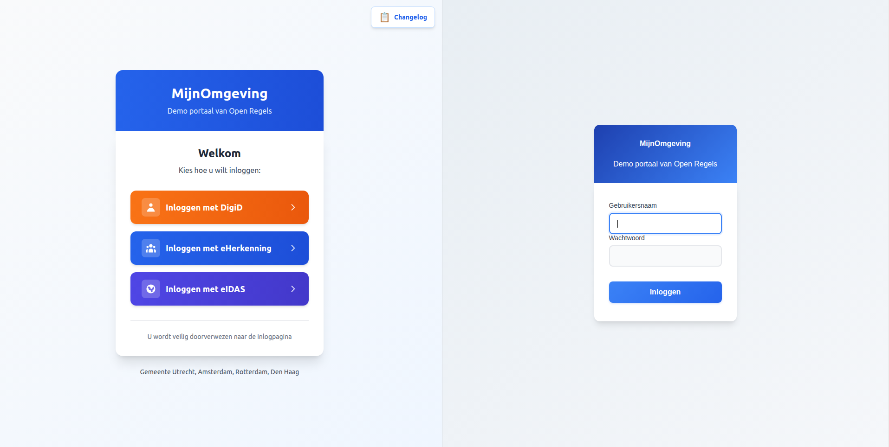
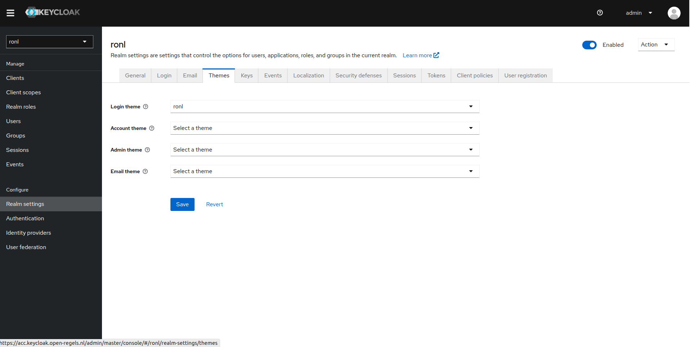

# Keycloak Deployment (VM)

Keycloak runs in Docker on the VM (`open-regels.nl`). Two fully isolated instances run in parallel: ACC and PROD. Each has its own PostgreSQL database container and custom RONL theme.


*Custom RONL theme matching MijnOmgeving design with blue gradient header*

## Repository structure

```
ronl-business-api/
├── deployment/vm/keycloak/
│   ├── acc/
│   │   ├── docker-compose.yml      # ACC configuration
│   │   ├── README.md               # ACC setup guide
│   │   └── .env.example            # ACC environment template
│   ├── prod/
│   │   ├── docker-compose.yml      # PROD configuration
│   │   ├── README.md               # PROD setup guide
│   │   └── .env.example            # PROD environment template
│   └── themes/
│       └── ronl/                   # Custom RONL theme
│           └── login/
│               ├── login.ftl       # FreeMarker template
│               ├── theme.properties
│               ├── resources/css/
│               │   └── login.css   # Custom styles
│               └── messages/
│                   └── messages_nl.properties
└── config/keycloak/
    └── ronl-realm.json             # Realm configuration (users, clients, mappers)
```

## Prerequisites

On the VM (Ubuntu 24.04 LTS):

- Docker Engine 24+
- Docker Compose 2.x
- Domain `open-regels.nl` with DNS configured
- Ports 80 and 443 open
- Caddy running (see [Caddy Deployment](caddy.md))
- SSH access restricted to authorized IPs

## Custom RONL Theme

The RONL theme provides a consistent visual experience from the MijnOmgeving landing page through the authentication flow.


*Visual consistency from landing page to Keycloak login*

### Theme Features

**Visual Design:**

- ✅ Blue gradient header (`from-blue-600 to-blue-700`)
- ✅ Modern rounded input fields with focus states
- ✅ Custom styled buttons with hover animations
- ✅ Responsive mobile-first design
- ✅ Dutch language throughout
- ✅ Identity provider button styling (DigiD/eHerkenning/eIDAS)

**Technical:**

**Technical:**

- ✅ FreeMarker templates for login flow
- ✅ Custom CSS with government colour schemes
- ✅ Dutch translations (messages_nl.properties)
- ✅ Optimised for accessibility (WCAG 2.1 AA)
- ✅ Caseworker context banner via `loginHint` sentinel detection
- ✅ "← Terug naar inlogkeuze" cancel link using `history.go(-2)`

### Theme Structure

```
ronl/login/
├── login.ftl                          # Main login template
├── theme.properties                   # Theme configuration
├── resources/
│   └── css/
│       └── login.css                  # Custom styles (~500 lines)
└── messages/
    └── messages_nl.properties         # Dutch translations (40+ strings)
```

**Key CSS Components:**

```css
/* Blue gradient header */
#kc-header {
  background: linear-gradient(to right, #2563eb, #1d4ed8);
  color: white;
  padding: 2rem;
  text-align: center;
}

/* Rounded modern inputs */
.pf-c-form-control {
  border-radius: 0.5rem;
  border: 1px solid #e5e7eb;
  padding: 0.75rem 1rem;
}

/* Styled login button */
#kc-login {
  background: linear-gradient(to right, #3b82f6, #2563eb);
  border-radius: 0.75rem;
  padding: 0.875rem;
  font-weight: 600;
  transition: all 0.2s;
}
```

### Caseworker context banner

The `login.ftl` template distinguishes citizen and caseworker login using a sentinel value passed via Keycloak's `login_hint` parameter. When `AuthCallback.tsx` calls `keycloak.login({ loginHint: '__medewerker__' })`, Keycloak populates `login.username` with this sentinel before rendering `login.ftl`.

The template detects the sentinel at the top of the file:

```freemarker
<#assign isMedewerker = (login.username!'') == '__medewerker__'>
```

When `isMedewerker` is true:

- The page `<header>` section renders **"Medewerker portaal"** instead of the default "Inloggen" title
- An indigo context banner is rendered above the form:

```freemarker
<#if isMedewerker>
<div id="kc-context-banner" class="kc-context-medewerker">
    <!-- briefcase SVG icon -->
    Inloggen als gemeentemedewerker
</div>
</#if>
```

- The username `<input>` suppresses the sentinel so the caseworker sees an empty field:

```freemarker
<input ... value="<#if !isMedewerker>${(login.username!'')}</#if>" ... />
```

The corresponding CSS in `login.css`:

```css
#kc-context-banner {
  display: flex;
  align-items: center;
  gap: 0.5rem;
  padding: 0.625rem 1rem;
  margin-bottom: 1.5rem;
  background: #f0f4ff;
  border: 1px solid #c7d7fd;
  border-radius: 8px;
  color: #3730a3;
  font-size: 0.875rem;
  font-weight: 500;
}
```

No JavaScript is involved — all detection and suppression happens server-side in FreeMarker before the HTML reaches the browser.

### Cancel link

Both citizen (test/fallback) and caseworker login forms include a "← Terug naar inlogkeuze" link below the submit button. It uses `history.go(-2)` to skip over the `/auth` intermediate route:

```freemarker
<div id="kc-cancel-container">
    <a id="kc-cancel" href="${client.baseUrl!'/'}"
       onclick="history.go(-2); return false;" tabindex="7">
        <!-- left-arrow SVG -->
        Terug naar inlogkeuze
    </a>
</div>
```

The `href` fallback (`client.baseUrl`) points to the frontend root URL configured in Keycloak Admin → Clients → `ronl-business-api` → Root URL. This is only used if JavaScript is disabled. The `history.go(-2)` skip is necessary because the browser history stack at this point is: `/ → /auth → [Keycloak]`, and `history.back()` would land on `/auth`, which immediately redirects back to Keycloak.

!!! note "Container restart required after theme changes"
    Keycloak caches theme templates at startup. Any change to `.ftl` or `.css` files requires a container restart to take effect — regardless of whether Keycloak is running in development or production mode. Theme changes do not require an image rebuild.

## Deploying to ACC

### Step 1 — Prepare theme files

On your local machine:

```bash
cd ~/Development/ronl-business-api

# Create theme tarball
cd deployment/vm/keycloak/themes
tar -czf ronl-theme.tar.gz ronl/

# Upload to VM
scp ronl-theme.tar.gz user@your-vm:/tmp/
```

### Step 2 — Deploy theme on VM

SSH into the VM:

```bash
ssh user@your-vm

# Create themes directory (one-time setup)
sudo mkdir -p /opt/keycloak/themes
sudo chown 1000:1000 /opt/keycloak/themes
sudo chmod 755 /opt/keycloak/themes

# Extract theme
cd /tmp
tar -xzf ronl-theme.tar.gz

# Install theme
sudo rm -rf /opt/keycloak/themes/ronl
sudo mv ronl /opt/keycloak/themes/

# Set permissions (Keycloak runs as UID 1000)
sudo chown -R 1000:1000 /opt/keycloak/themes/ronl
sudo chmod -R 755 /opt/keycloak/themes/ronl
sudo find /opt/keycloak/themes/ronl -type f -exec chmod 644 {} \;

# Verify
ls -la /opt/keycloak/themes/ronl/login/

# Cleanup
rm /tmp/ronl-theme.tar.gz
```

### Step 3 — Update docker-compose.yml

The docker-compose.yml must mount the themes directory:

```yaml
services:
  keycloak-acc:
    image: quay.io/keycloak/keycloak:23.0
    container_name: keycloak-acc
    volumes:
      - ./ronl-realm.json:/opt/keycloak/data/import/ronl-realm.json:ro
      - keycloak-acc-data:/opt/keycloak/data
      - /opt/keycloak/themes:/opt/keycloak/themes:ro  # Theme volume mount
```

**Update on VM:**

```bash
cd /home/steven/keycloak/acc

# Backup current config
cp docker-compose.yml docker-compose.yml.backup

# Edit to add theme volume
nano docker-compose.yml
# Add: - /opt/keycloak/themes:/opt/keycloak/themes:ro

# Recreate container to apply volume mount
docker compose down
docker compose up -d

# Wait for startup
sleep 30

# Check logs
docker compose logs keycloak-acc --tail 50
```

### Step 4 — Copy configuration files to VM

```bash
# On local machine
cd ~/Development/ronl-business-api

# Copy docker-compose.yml
scp deployment/vm/keycloak/acc/docker-compose.yml user@your-vm:~/keycloak/acc/

# Copy realm file
scp config/keycloak/ronl-realm.json user@your-vm:~/keycloak/acc/
```

### Step 5 — Create environment file

```bash
# On VM
cd ~/keycloak/acc

# Generate secure password
ADMIN_PW=$(openssl rand -base64 32)

# Create .env file
cat > .env << EOF
KEYCLOAK_ADMIN_PASSWORD=$ADMIN_PW
EOF

chmod 600 .env

# Save password securely
echo "ACC Admin: $ADMIN_PW" >> ~/keycloak-passwords-acc.txt
chmod 600 ~/keycloak-passwords-acc.txt
```

### Step 6 — Start Keycloak

```bash
cd ~/keycloak/acc

# Start services
docker compose up -d

# Watch logs
docker compose logs -f keycloak-acc

# Wait for: "Keycloak started" and "Realm 'ronl' imported"
```

### Step 7 — Configure theme in Admin Console

1. **Open Admin Console:** https://acc.keycloak.open-regels.nl/admin
2. **Login** with admin credentials (from `~/keycloak-passwords-acc.txt`)
3. **Select realm:** Switch to `ronl` realm (top-left dropdown)
4. **Configure theme:**
   - Left menu → **Realm Settings**
   - Tab → **Themes**
   - **Login Theme:** Select `ronl` from dropdown
   - Click **Save**
5. **Configure localization:**
   - Tab → **Localization**
   - **Internationalization:** Toggle ON
   - **Supported Locales:** Ensure `nl` and `en` are checked
   - **Default Locale:** Select `nl`
   - Click **Save**


*Keycloak Admin Console showing theme selection*

### Step 8 — Verify deployment

```bash
# Check container status
docker ps | grep keycloak-acc
# Should show: (healthy)

# Test health endpoint
curl https://acc.keycloak.open-regels.nl/health/ready
# Should return: {"status":"UP"}

# Verify theme is mounted
docker exec keycloak-acc ls -la /opt/keycloak/themes/ronl/login/
# Should show: login.ftl, theme.properties, resources/, messages/

# Test in browser (incognito to skip cache)
# Visit: https://acc.mijn.open-regels.nl
# Click "Inloggen met DigiD"
# Should see themed login page with blue gradient header
```

## Deploying to PROD

Follow the same steps using `deployment/vm/keycloak/prod/` and hostname `keycloak.open-regels.nl`.

**Important differences for PROD:**

- Use separate admin password (stored in `~/keycloak-passwords-prod.txt`)
- Update `KC_HOSTNAME` to `keycloak.open-regels.nl`
- Use `KC_LOG_LEVEL: warn` instead of `info`
- Test thoroughly in ACC before deploying to PROD
- Deploy during maintenance window
- Notify users of planned downtime

## Realm import

The `ronl-realm.json` is imported on the first container start via the `--import-realm` flag in `docker-compose.yml`. It configures:

- **Realm `ronl`** with brute-force protection
- **Client `ronl-business-api`** with PKCE and CORS settings
- **Protocol mappers:**
  - `municipality` (user attribute)
  - `roles` (realm roles)
  - `loa` (assurance level - user attribute)
- **Test users** with per-municipality attributes
- **Token lifespans:**
  - Access token: 15 minutes
  - SSO session: 30 minutes
  - Refresh token: 30 minutes

### Re-importing after changes

```bash
# On VM
docker exec keycloak-acc /opt/keycloak/bin/kc.sh import \
  --file /opt/keycloak/data/import/ronl-realm.json \
  --override true
```

## Updating the Theme

When theme files change (CSS updates, translations, etc.):

### Step 1 — Update in repository

```bash
cd ~/Development/ronl-business-api

# Make changes to theme files
nano deployment/vm/keycloak/themes/ronl/login/resources/css/login.css

# Commit changes
git add deployment/vm/keycloak/themes/
git commit -m "style: update Keycloak theme styling [no ci]"
git push origin acc
```

### Step 2 — Deploy to VM

```bash
# Create new tarball
cd deployment/vm/keycloak/themes
tar -czf ronl-theme.tar.gz ronl/

# Upload to VM
scp ronl-theme.tar.gz user@your-vm:/tmp/

# SSH into VM
ssh user@your-vm

# Extract and replace
cd /tmp
tar -xzf ronl-theme.tar.gz
sudo rm -rf /opt/keycloak/themes/ronl
sudo mv ronl /opt/keycloak/themes/
sudo chown -R 1000:1000 /opt/keycloak/themes/ronl
sudo chmod -R 755 /opt/keycloak/themes/ronl

# Restart Keycloak
cd /home/steven/keycloak/acc
docker compose restart keycloak-acc

# Wait 30 seconds
sleep 30

# Test in browser (incognito mode)
```

**Note:** Keycloak caches themes. Always test in incognito/private browsing mode or clear browser cache.

## Backup

### Database Backup

```bash
# Daily backup of ACC Keycloak database
docker exec keycloak-postgres-acc pg_dump -U keycloak keycloak \
  > /backup/keycloak-acc-$(date +%Y%m%d).sql

# Daily backup of PROD Keycloak database
docker exec keycloak-postgres-prod pg_dump -U keycloak keycloak \
  > /backup/keycloak-prod-$(date +%Y%m%d).sql
```

Store backups off-VM (e.g., Azure Blob Storage with a 30-day retention policy).

### Theme Backup

Theme files are version-controlled in the Git repository:
- `deployment/vm/keycloak/themes/ronl/`

No separate backup needed—restore from Git if needed.

### Volume Backup

For complete binary backup of the PostgreSQL data volume:

```bash
# Weekly volume backup
docker run --rm \
  -v keycloak-acc-db-data:/data \
  -v /backup:/backup \
  alpine tar czf /backup/keycloak-acc-$(date +%Y%m%d).tar.gz /data
```

## Monitoring

### Health Checks

```bash
# ACC health
curl https://acc.keycloak.open-regels.nl/health/ready
curl https://acc.keycloak.open-regels.nl/realms/ronl/.well-known/openid-configuration

# PROD health
curl https://keycloak.open-regels.nl/health/ready
curl https://keycloak.open-regels.nl/realms/ronl/.well-known/openid-configuration
```

### Container Status

```bash
# On VM
docker ps | grep keycloak
# Should show: (healthy) status

# Check resource usage
docker stats keycloak-acc --no-stream
docker stats keycloak-prod --no-stream
```

### Log Monitoring

```bash
# View recent logs
docker compose logs keycloak-acc --tail 100

# Follow logs in real-time
docker compose logs keycloak-acc -f

# Check for errors
docker compose logs keycloak-acc | grep -i error
docker compose logs keycloak-acc | grep -i exception
```

## Troubleshooting

### Theme not appearing in dropdown

**Symptoms:** Theme `ronl` not visible in Keycloak Admin Console theme dropdown.

**Cause:** Theme files not properly mounted or container not recreated.

**Solution:**

```bash
# Verify theme exists in container
docker exec keycloak-acc ls -la /opt/keycloak/themes/ronl/login/

# Should show: login.ftl, theme.properties, resources/, messages/

# If empty, check docker-compose.yml has volume mount
# Then recreate container
docker compose down
docker compose up -d
```

### Theme selected but not applied

**Symptoms:** Theme selected in Admin Console but still seeing default Keycloak theme.

**Cause:** Browser cache or theme not properly configured.

**Solution:**

```bash
# 1. Clear browser cache or use incognito mode
# 2. Verify theme is actually selected
# Admin Console → Realm Settings → Themes → Login Theme = ronl

# 3. Check theme files are valid
docker exec keycloak-acc cat /opt/keycloak/themes/ronl/login/theme.properties

# Should contain:
# parent=base
# import=common/keycloak
# locales=nl,en

# 4. Check logs for theme errors
docker compose logs keycloak-acc | grep -i theme
```

### CSS not loading

**Symptoms:** Login page shows but styling is broken.

**Cause:** CSS file permissions or path incorrect.

**Solution:**

```bash
# Check CSS file exists
docker exec keycloak-acc ls -la /opt/keycloak/themes/ronl/login/resources/css/login.css

# Check permissions (should be 644)
docker exec keycloak-acc stat /opt/keycloak/themes/ronl/login/resources/css/login.css

# If wrong, fix on VM:
sudo find /opt/keycloak/themes/ronl -type f -exec chmod 644 {} \;
docker compose restart keycloak-acc
```

### Caseworker banner not appearing

**Symptoms:** Caseworker login shows generic Keycloak form without the indigo banner or "Medewerker portaal" title.

**Cause 1:** Outdated `login.ftl` on the server — the sentinel detection code is missing.

**Solution:** Verify the installed template:
```bash
docker exec keycloak-acc grep -n 'isMedewerker' \
  /opt/keycloak/themes/ronl/login/login.ftl
# Should return line numbers for the assign and if blocks
```
If nothing is returned, redeploy the theme files and restart the container.

**Cause 2:** `sessionStorage` is not carrying `selected_idp = medewerker` to `/auth`.

**Solution:** Open DevTools → Application → Session Storage → `http://localhost:5173` (or the ACC URL). Confirm `selected_idp` equals `medewerker` before the `/auth` route is hit. If it is missing or a different value, the `handleIDPSelection` call in `LoginChoice.tsx` is not firing correctly.

### Username field pre-filled with `__medewerker__`

**Symptoms:** The caseworker login form shows `__medewerker__` in the username field.

**Cause:** The `login.ftl` on the server does not include the sentinel suppression condition on the `value` attribute.

**Solution:** The input must use:
```freemarker
value="<#if !isMedewerker>${(login.username!'')}</#if>"
```
Ensure the deployed `login.ftl` matches the version in the repository and restart the container.

### Dutch translations not working

**Symptoms:** Theme applied but text still in English.

**Cause:** Locale not configured or messages file missing.

**Solution:**

```bash
# 1. Check messages file exists
docker exec keycloak-acc ls -la /opt/keycloak/themes/ronl/login/messages/messages_nl.properties

# 2. Verify realm localization settings
# Admin Console → Realm Settings → Localization
# - Internationalization: ON
# - Default Locale: nl
# - Supported Locales: nl, en (both checked)

# 3. Check user's browser language preference
# Browser should be set to Dutch (nl-NL) or accept Dutch as preferred language
```

### Container unhealthy after restart

**Symptoms:** Container starts but health check fails.

**Cause:** Database connection issues or Keycloak startup timeout.

**Solution:**

```bash
# Check database is running
docker ps | grep postgres-acc

# Check database logs
docker compose logs keycloak-postgres-acc --tail 50

# Check Keycloak logs for database connection errors
docker compose logs keycloak-acc | grep -i "database\|connection\|jdbc"

# If database is healthy, increase health check timeout
# In docker-compose.yml:
healthcheck:
  start_period: 90s  # Increase from 60s
```

### Realm not imported on first start

**Symptoms:** Keycloak starts but realm `ronl` doesn't exist.

**Cause:** Realm file not mounted or import flag missing.

**Solution:**

```bash
# Check realm file is mounted
docker exec keycloak-acc ls -la /opt/keycloak/data/import/

# Should show: ronl-realm.json

# Check command includes import flag
# In docker-compose.yml command section:
command:
  - start-dev
  - --import-realm  # Must be present

# Manually import if needed
docker exec keycloak-acc /opt/keycloak/bin/kc.sh import \
  --file /opt/keycloak/data/import/ronl-realm.json
```

## Security Considerations

### Production Hardening

For PROD deployment:

1. **Use production mode:** Change `start-dev` to `start` in docker-compose.yml
2. **Enable HTTPS:** Keycloak should be behind Caddy with SSL
3. **Strong passwords:** Use 32+ character random passwords for admin
4. **Restrict admin access:** Limit admin console access to specific IPs
5. **Enable MFA:** Configure TOTP for admin accounts
6. **Regular updates:** Keep Keycloak and PostgreSQL updated
7. **Audit logging:** Enable and monitor Keycloak admin events

### Network Security

- ✅ Keycloak not directly exposed (behind Caddy reverse proxy)
- ✅ PostgreSQL only accessible within Docker network
- ✅ No unnecessary ports exposed
- ✅ VM firewall configured (ports 22, 80, 443 only)
- ✅ SSH restricted to authorized IPs

### Secrets Management

- ❌ Never commit `.env` files to Git
- ❌ Never commit admin passwords to Git
- ✅ Store passwords in password manager (1Password, Bitwarden)
- ✅ Keep separate passwords for ACC and PROD
- ✅ Rotate passwords regularly (quarterly recommended)

## URLs

**ACC Environment:**

- **Admin Console:** https://acc.keycloak.open-regels.nl/admin
- **Health Check:** https://acc.keycloak.open-regels.nl/health/ready
- **Realm:** https://acc.keycloak.open-regels.nl/realms/ronl
- **OIDC Config:** https://acc.keycloak.open-regels.nl/realms/ronl/.well-known/openid-configuration
- **Test Login:** https://acc.mijn.open-regels.nl

**PROD Environment:**

- **Admin Console:** https://keycloak.open-regels.nl/admin
- **Health Check:** https://keycloak.open-regels.nl/health/ready
- **Realm:** https://keycloak.open-regels.nl/realms/ronl
- **OIDC Config:** https://keycloak.open-regels.nl/realms/ronl/.well-known/openid-configuration
- **Production Portal:** https://mijn.open-regels.nl

---

## Related Documentation

- [Authentication & IAM Features](../../features/authentication-iam.md) — Keycloak integration overview
- [Login Flow User Guide](../../user-guide/login-flow.md) — End-user authentication experience
- [Frontend Development](../frontend-development.md) — Keycloak JS adapter integration
- [Deployment Overview](overview.md) — Full deployment architecture
- [Caddy Reverse Proxy](caddy.md) — SSL termination and routing

---

**Questions or issues?** See [Troubleshooting](../troubleshooting.md) or contact the infrastructure team.