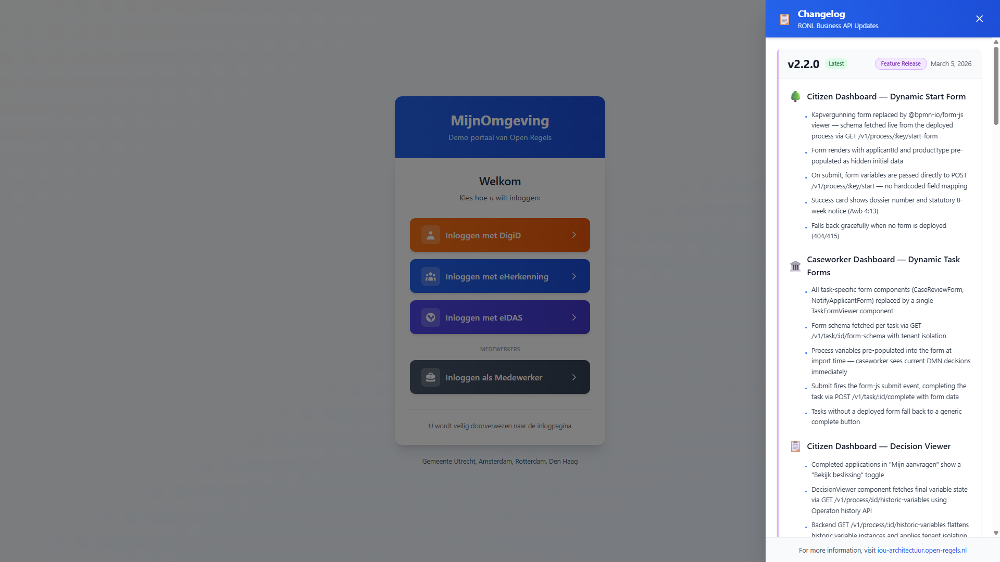

# Frontend Development

The frontend is `packages/frontend` (`@ronl/frontend`) — a React 18 + TypeScript SPA built with Vite.

## Project structure

```
packages/frontend/src/
├── App.tsx                     # React Router wrapper
├── main.tsx                    # React entry point, StrictMode
├── index.css                   # Global CSS (Tailwind base + custom properties)
├── pages/
│   ├── LoginChoice.tsx         # Landing page with IDP selection
│   ├── AuthCallback.tsx        # Keycloak initialization handler
│   ├── Dashboard.tsx           # Main application (zorgtoeslag calculator)
│   ├── ChangelogPanel.tsx      # Sliding changelog panel
│   └── changelog-data.ts       # Changelog content
├── components/                 # Reusable UI components
├── contexts/                   # React contexts (auth, tenant)
├── hooks/                      # Custom React hooks
├── services/
│   ├── keycloak.ts             # Keycloak JS adapter initialization
│   ├── api.ts                  # Business API HTTP client (Axios)
│   └── tenant.ts               # Tenant config loading and theme application
└── themes/                     # Per-municipality theme tokens
packages/frontend/public/
├── tenants.json                # Municipality configurations (loaded at runtime)
└── staticwebapp.config.json    # Azure SWA routing configuration
```

## Landing page architecture

The frontend uses a three-route flow: landing page → auth callback → dashboard. The authentication callback behaves differently depending on whether the user selected a citizen IdP or the caseworker option.

**1. Landing Page (`/` — `LoginChoice.tsx`)**

Identity provider selection page with four buttons. Three are for citizens (orange DigiD, blue eHerkenning, indigo eIDAS); one is for caseworkers (slate "Inloggen als Medewerker"), visually separated by a "MEDEWERKERS" section divider.

```typescript
const handleIDPSelection = (
  idp: "digid" | "eherkenning" | "eidas" | "medewerker",
) => {
  sessionStorage.setItem("selected_idp", idp);
  navigate("/auth");
};
```

The selected value is stored in `sessionStorage` under the key `selected_idp` and read by `AuthCallback.tsx`.

**2. Authentication Callback (`/auth` — `AuthCallback.tsx`)**

The callback reads `selected_idp` and branches on whether the user is a caseworker.

**Citizen path (digid / eherkenning / eidas):**

```typescript
const initOptions = {
  onLoad: "login-required",
  checkLoginIframe: false,
  idpHint: selectedIdp, // 'digid' | 'eherkenning' | 'eidas'
};
const authenticated = await keycloak.init(initOptions);
```

`onLoad: 'login-required'` triggers an immediate OIDC redirect. The `idpHint` tells Keycloak to skip its native login form and redirect straight to the chosen external identity provider (DigiD, eHerkenning, or eIDAS). In the test environment where real IdPs are not configured, Keycloak falls back to its native form without a context banner.

**Caseworker path (medewerker):**

```typescript
// Step 1: silent SSO check — no redirect triggered
const authenticated = await keycloak.init({
  onLoad: "check-sso",
  checkLoginIframe: false,
});

if (authenticated) {
  // Existing SSO session found — go straight to dashboard
  navigate("/dashboard", { replace: true });
} else {
  // No session — redirect to Keycloak with sentinel
  await keycloak.login({ loginHint: "__medewerker__" });
}
```

`onLoad: 'check-sso'` returns `true` if a Keycloak SSO session cookie already exists in the browser, allowing the caseworker to skip the login screen entirely on subsequent visits within the session window. If no session exists, `keycloak.login({ loginHint: '__medewerker__' })` redirects to Keycloak and passes `__medewerker__` as the `login_hint` parameter. The `login.ftl` template detects this sentinel and renders the caseworker context banner (see [Keycloak Deployment — Caseworker banner](./deployment/keycloak.md#caseworker-context-banner)).

**3. Dashboard (`/dashboard` — `Dashboard.tsx`)**

Main application after successful authentication. The JWT `roles` claim determines which view is displayed: the citizen calculator or the caseworker queue.

## Changelog Panel Component

A sliding panel that displays platform updates matching the format from CPSV Editor and Linked Data Explorer.

*MijnOmgeving landing page showing Changelog panel*

**Features:**

- Slides in from right (450px wide desktop, full-screen mobile)
- Blue gradient header matching MijnOmgeving theme
- Version-based organization with status badges
- Color-coded sections with icons
- Sticky footer with documentation link
- Closes via: click outside, ESC key, or X button

**Usage in LoginChoice.tsx:**

```typescript
import { useState } from 'react';
import ChangelogPanel from './ChangelogPanel';

export default function LoginChoice() {
  const [changelogOpen, setChangelogOpen] = useState(false);

  return (
    <div>
      {/* Toggle Button */}
      <button onClick={() => setChangelogOpen(true)}>
        📋 Updates
      </button>

      {/* Changelog Panel */}
      <ChangelogPanel
        isOpen={changelogOpen}
        onClose={() => setChangelogOpen(false)}
      />
    </div>
  );
}
```

**Updating changelog content:**

Edit `changelog-data.ts`:

```typescript
export const changelog: Changelog = {
  versions: [
    {
      version: "2.0.0",
      status: "Major Release",
      statusColor: "blue",
      borderColor: "blue",
      date: "February 21, 2026",
      sections: [
        {
          title: "Frontend Redesign",
          icon: "🎨",
          iconColor: "blue",
          items: [
            "New landing page with identity provider selection",
            "Custom Keycloak theme matching MijnOmgeving design",
          ],
        },
      ],
    },
  ],
};
```

## Authentication with Keycloak JS

`services/keycloak.ts` exports the Keycloak instance. Initialisation is done manually in `AuthCallback.tsx` (not on import) so the IDP selection and caseworker sentinel can be applied before the first Keycloak call.

```typescript
// services/keycloak.ts
const keycloak = new Keycloak({
  url: KEYCLOAK_URL, // resolved from hostname
  realm: "ronl",
  clientId: "ronl-business-api",
});

export default keycloak;
```

`AuthCallback.tsx` is the only place `keycloak.init()` is called. The two init strategies are:

| Strategy   | `onLoad` value     | When used                 | Triggers redirect?     |
| ---------- | ------------------ | ------------------------- | ---------------------- |
| Citizen    | `'login-required'` | digid, eherkenning, eidas | Yes — immediately      |
| Caseworker | `'check-sso'`      | medewerker                | No — silent check only |

After `check-sso` returns `false`, `keycloak.login({ loginHint: '__medewerker__' })` performs the redirect with the sentinel. After any successful authentication, `sessionStorage.removeItem('selected_idp')` is called before navigating to `/dashboard`.

Token refresh is handled automatically by the Keycloak JS adapter. The adapter refreshes the access token before the 15-minute expiry as long as the SSO session remains active.

**Token refresh** is still handled automatically by the adapter before the 15-minute expiry.

## Multi-tenant theming

On successful login, `services/tenant.ts` reads the `municipality` claim from the decoded JWT and applies the corresponding theme:

```typescript
await initializeTenantTheme(keycloak.tokenParsed.municipality);
```

`initializeTenantTheme` loads `public/tenants.json`, finds the matching entry, and calls `applyTenantTheme`, which sets CSS custom properties on `document.documentElement`:

```typescript
root.style.setProperty("--color-primary", theme.primary);
root.style.setProperty("--color-primary-dark", theme.primaryDark);
// ...
```

All Tailwind utility classes and component styles reference these custom properties, so the entire UI re-themes without a page reload.

## API client

`services/api.ts` wraps Axios and adds the JWT bearer token to every request:

```typescript
const client = axios.create({
  baseURL: import.meta.env.VITE_API_URL,
});

client.interceptors.request.use((config) => {
  config.headers.Authorization = `Bearer ${keycloak.token}`;
  return config;
});
```

If a request returns HTTP 401 (token expired between refresh cycles), the interceptor triggers a silent Keycloak refresh and retries.

## Environment variables

Required in `.env` files:

```bash
# Keycloak IAM
VITE_KEYCLOAK_URL=https://acc.keycloak.open-regels.nl

# Business API
VITE_API_URL=https://acc.api.open-regels.nl/v1
```

**Environment detection:**

The application automatically detects the environment based on hostname:

```typescript
const hostname = window.location.hostname;

let env: "local" | "acc" | "prod" = "local";
if (hostname.includes("acc.mijn.open-regels.nl")) {
  env = "acc";
} else if (hostname === "mijn.open-regels.nl") {
  env = "prod";
}
```

This is used in the Architecture footer to show environment-specific URLs.

## Development commands

```bash
# Install dependencies
npm install

# Start dev server (http://localhost:5173)
npm run dev

# Build for production
npm run build

# Preview production build
npm run preview

# Type check
npm run type-check

# Lint
npm run lint

# Format
npm run format
```

## Calling the Business API from a component

Example: Evaluating a DMN decision

```typescript
import { businessApi } from "../services/api";
import type { OperatonVariable } from "@ronl/shared";

const handleEvaluate = async () => {
  try {
    const variables: Record<string, OperatonVariable> = {
      inkomen: {
        value: 24000,
        type: "Double",
      },
      leeftijd_requirement: {
        value: true,
        type: "Boolean",
      },
    };

    const response = await businessApi.evaluateDecision(
      "berekenrechtenhoogtezorg",
      variables,
    );

    if (response.success) {
      console.log("Result:", response.data.result);
    }
  } catch (error) {
    console.error("Evaluation failed:", error);
  }
};
```

## Adding a new page

1. **Create the component:**

```bash
# Create new page
touch packages/frontend/src/pages/NewPage.tsx
```

```typescript
// packages/frontend/src/pages/NewPage.tsx
export default function NewPage() {
  return (
    <div className="min-h-screen bg-gray-50">
      <h1>New Page</h1>
    </div>
  );
}
```

2. **Add route in App.tsx:**

```typescript
import NewPage from './pages/NewPage';

// In Routes
<Route path="/new-page" element={<NewPage />} />
```

3. **Add navigation link:**

```typescript
<Link to="/new-page">Go to New Page</Link>
```

## Adding a feature flag check

Feature flags are configured per municipality in `public/tenants.json`:

```json
{
  "utrecht": {
    "name": "Gemeente Utrecht",
    "features": {
      "zorgtoeslag": true,
      "newFeature": false
    }
  }
}
```

Check the flag in your component:

```typescript
import { useTenant } from '../contexts/TenantContext';

function MyComponent() {
  const { tenant } = useTenant();

  if (!tenant?.features?.newFeature) {
    return null; // Feature disabled for this municipality
  }

  return <div>New Feature Content</div>;
}
```

## Styling guidelines

**Use Tailwind utility classes:**

```typescript
<div className="bg-white rounded-lg shadow-md p-6">
  <h2 className="text-xl font-bold text-gray-900 mb-4">Title</h2>
</div>
```

**Use CSS custom properties for themeable colors:**

```typescript
<button
  style={{ backgroundColor: 'var(--color-primary)' }}
  className="px-6 py-3 text-white rounded-lg"
>
  Themed Button
</button>
```

**Responsive design:**

```typescript
<div className="w-full sm:w-96 md:w-[500px] lg:w-[600px]">
  {/* Responsive width */}
</div>
```

## Testing

### Component Testing

```bash
# Run tests
npm test

# Watch mode
npm test -- --watch
```

### Manual Testing Checklist

**Landing page:**

- [ ] All four login buttons render correctly
- [ ] Citizen buttons (DigiD, eHerkenning, eIDAS) are visually grouped
- [ ] Caseworker button appears below "MEDEWERKERS" divider
- [ ] Changelog panel opens and closes correctly
- [ ] Mobile responsive (< 640px)

**Citizen flow:**

- [ ] DigiD button stores `selected_idp = digid` in sessionStorage
- [ ] `AuthCallback` redirects to Keycloak with `idpHint=digid`
- [ ] Login succeeds and JWT contains `roles: ["citizen"]`
- [ ] Dashboard loads with correct municipality theme
- [ ] Zorgtoeslag calculator submits and displays results

**Caseworker flow:**

- [ ] Caseworker button stores `selected_idp = medewerker` in sessionStorage
- [ ] `AuthCallback` calls `check-sso`, not `login-required`
- [ ] Keycloak login shows indigo "Inloggen als gemeentemedewerker" banner
- [ ] Username field is empty (sentinel `__medewerker__` suppressed)
- [ ] Login succeeds and JWT contains `roles: ["caseworker"]`
- [ ] SSO session reuse: second visit within session window goes straight to dashboard

**Common:**

- [ ] Token refresh works (keep page open > 15 min)
- [ ] "← Terug naar inlogkeuze" returns to `/` in a single click
- [ ] Logout redirects to landing page and clears SSO session

### Browser Compatibility

Test in:

- Chrome 90+
- Firefox 88+
- Safari 14+
- Edge 90+
- Mobile Safari (iOS 14+)
- Chrome Mobile (Android)

## Common Tasks

### Update municipality themes

Edit `public/tenants.json`:

```json
{
  "newmunicipality": {
    "name": "Gemeente NewCity",
    "theme": {
      "primary": "#1e3a8a",
      "primaryDark": "#1e40af"
    },
    "features": {
      "zorgtoeslag": true
    }
  }
}
```

### Add a new IDP button

Edit `LoginChoice.tsx`:

```typescript
{/* New IDP Button */}
<button
  onClick={() => handleIDPSelection('new-idp')}
  className="w-full flex items-center justify-between px-6 py-4 bg-gradient-to-r from-green-600 to-green-700 text-white rounded-xl"
>
  <div className="flex items-center gap-3">
    <div className="w-10 h-10 bg-white bg-opacity-20 rounded-lg">
      {/* Icon */}
    </div>
    <span className="font-semibold text-lg">Inloggen met New IDP</span>
  </div>
</button>
```

### Debug Keycloak issues

Enable debug logging in `services/keycloak.ts`:

```typescript
keycloak.onAuthSuccess = () => console.log("Auth success!");
keycloak.onAuthError = (error) => console.error("Auth error:", error);
keycloak.onAuthRefreshSuccess = () => console.log("Token refreshed");
keycloak.onAuthRefreshError = () => console.error("Token refresh failed");
keycloak.onTokenExpired = () => console.log("Token expired");
```

---

## Related Documentation

- [Local Development Setup](local-development.md) — Prerequisites and getting started
- [Frontend Deployment](deployment/frontend.md) — Azure Static Web Apps deployment
- [Keycloak Deployment](deployment/keycloak.md) — Custom theme setup
- [Multi-Tenant Portal Features](../features/multi-tenant-portal.md) — Theming and tenant isolation

---

**Questions?** See [Troubleshooting](troubleshooting.md) or check the [Gitlab repository](https://git.open-regels.nl/hosting/ronl-business-api).
