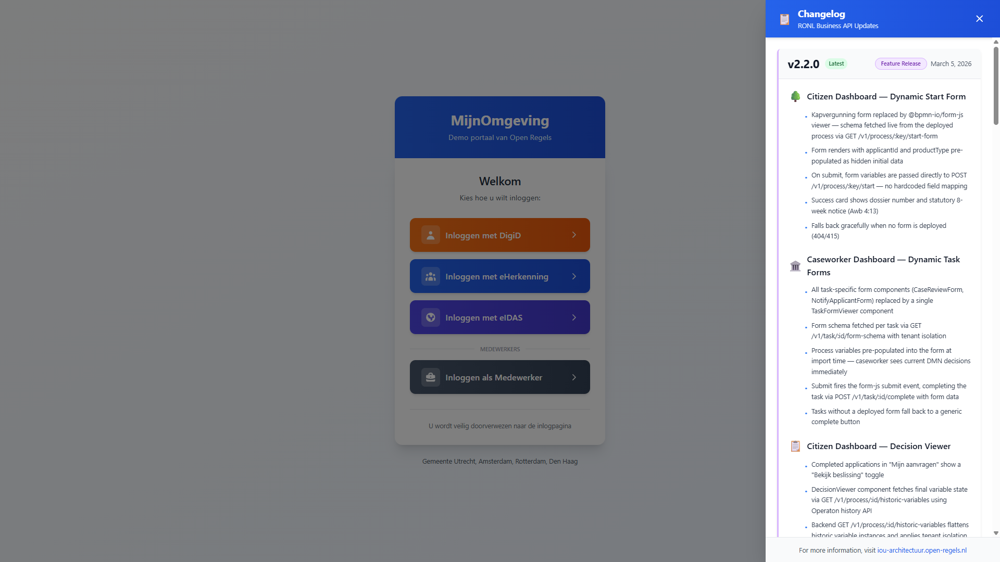

# Frontend Development

The frontend is `packages/frontend` (`@ronl/frontend`) — a React 18 + TypeScript SPA built with Vite.

---

## Project structure

!!! info "The Public Affairs cockpit is not in this package"
    Since v2026.08.27 the PA cockpit lives in
    [`@ronl/pa-cockpit`](pa-cockpit-package.md), which the frontend imports and
    configures through a host adapter (`pages/pa-cockpit-host.tsx`,
    `pages/PaCockpitRoute.tsx`, `components/PADashboardV2/`). Everything else —
    the landing page, the citizen portal and the Caseworker, Infra-board and Woo
    boards — is in the tree below. Test files (`*.test.ts[x]`) sit beside the
    code they test and are left out, except `indexHtml.test.ts`, which tests
    no module.

```
packages/frontend/src/
├── App.tsx                        # React Router routes
├── main.tsx                       # React entry point, StrictMode
├── index.css                      # Global CSS (Tailwind base + custom properties)
├── vite-env.d.ts
├── pages/
│   ├── LoginChoice.tsx            # Landing page for / and /:tenantId: board grid or single-board page
│   ├── login-choice/              # boards.config.ts, landing-login.ts (useLandingLogin),
│   │                              #   single-board.copy.ts, login-portal.css
│   ├── AuthCallback.tsx           # Keycloak check-sso, then login() with a hint
│   ├── Dashboard.tsx              # Citizen portal (Diensten, Mijn aanvragen, Tijdlijn)
│   ├── citizen/                   # citizenServiceUi.ts (a card per citizen service),
│   │                              #   heusdenpasTestCases.ts
│   ├── CaseworkerDashboardV2.tsx  # Caseworker shell: auth, tenant, nav state, layout
│   ├── caseworker-v2/             # modes.config.ts, dashboard-v2.css, regelsimulatie.css
│   ├── InfraBoardDashboard.tsx    # Infra-board shell
│   ├── infra-board/               # RIP phase catalog and model, data, modes, dashboard-infra.css
│   ├── WooDashboard.tsx           # Woo dashboard shell
│   ├── woo/                       # modes.config.ts, woo.data.ts, dashboard-woo.css
│   ├── PaCockpitRoute.tsx         # Route into @ronl/pa-cockpit
│   ├── pa-cockpit-host.tsx        # Host adapter for @ronl/pa-cockpit
│   ├── ChangelogPanel.tsx         # Sliding changelog panel
│   ├── ChangelogPanelContent.tsx
│   └── changelog-data.ts          # Changelog content
├── components/
│   ├── process/                   # The process view, shared by the Infra-board and the Taken inbox
│   │   ├── PhaseStepper.tsx       # Phase stepper (RIP phases, or a process's phase set)
│   │   ├── PhaseSwimlane.tsx      # SVG BPMN swimlane
│   │   ├── ProcessWhere.tsx       # "Waar sta ik": compact phase stepper under the task header
│   │   ├── ProcessLaneSteps.tsx   # "Processtappen per rol"
│   │   ├── ProcessOverlay.tsx     # Modal: full stepper, breadcrumb, legend, swimlane
│   │   ├── useTaskProcessContext.ts  # Loads a task's call chain, histories and models
│   │   ├── processContext.ts      # buildProcessContext: pure assembly, engine-ordered history
│   │   ├── laneSteps.ts           # Derivations behind "Processtappen per rol"
│   │   ├── phaseSet.ts            # A model's phase set as stepper phases; phaseRef, captions
│   │   ├── swimlaneText.ts        # Condition expressions as readable flow labels
│   │   ├── process-view.css       # Stepper and swimlane styles, scoped under .pbd
│   │   └── caseworker-process.css # Caseworker additions (one-line rules; not prettier-formatted)
│   ├── CaseworkerDashboardV2/     # V2 shell parts: SectionRouter, TakenInbox, CommandPalette,
│   │   │                          #   PaletteActions, paletteActionsContext, AssistantDock,
│   │   │                          #   RegelSimulatie, GegevenswoordenboekV2, NoAccessPanel,
│   │   │                          #   SectionErrorBoundary
│   │   └── regelsimulatie/        # Simulation engine, chart and panels
│   ├── CaseworkerDashboard/       # Sections the V2 shell routes to (Nieuws, Berichten,
│   │                              #   RegelCatalogus, ProcesBibliotheek, HR onboarding,
│   │                              #   capacity claim, IOU, Audit, Gereedschap, McpChat,
│   │                              #   Profiel, Rollen, …) and TaskFormViewer.tsx
│   ├── InfraBoardDashboard/       # Infra-board sections: Portfolio, ProjectDetail, PhaseDetail,
│   │                              #   MijnDag, FaseladderOverview, router, dock
│   ├── signing/                   # ValidSign signing, shared by every task view: SigningPanel,
│   │                              #   useTaskSignature, resolveSigningUrl, signing-panel.css
│   ├── WooDashboard/              # Woo sections: Overzicht, Verzoeken, Proces, Publicatie,
│   │                              #   Register, Bezwaar, Tijdigheid, router, dock, charts
│   ├── PADashboardV2/             # PA dock and section router for the host
│   ├── LoginChoice/               # BoardCard, BoardPreview, SingleBoardLanding,
│   │                              #   AccessDeniedDialog (with their CSS)
│   ├── ProcessStartFormViewer.tsx # Citizen start form (@bpmn-io/form-js)
│   ├── StartFailureNotice.tsx     # The notice under a failed citizen start (#171)
│   ├── DecisionViewer.tsx         # Final decision of a completed citizen process
│   ├── AltchaWidget.tsx
│   ├── PersonalDataPanel.tsx
│   ├── SessionExpiryWarning.tsx
│   └── TimeLine.tsx
├── hooks/
│   └── useProfielData.ts          # Shared hook for Profiel and Rollen sections
├── services/
│   ├── api.ts                     # Business API client (Axios) — businessApi
│   ├── keycloak.ts                # Keycloak JS adapter, initializeKeycloak()
│   ├── identity-providers.ts      # FLEVOLAND_IDP, the Entra alias sent as idpHint
│   ├── tenant.ts                  # Tenant config loading, landing resolution, theme application
│   ├── landing.ts                 # landingUrl(): the logout redirect to the tenant's own page
│   ├── board-request.ts           # The board chosen on a landing page, carried through login
│   ├── infra.api.ts               # Infra-board live-data hooks over businessApi
│   └── brp.api.ts, brp.timeline.ts, bsn.mapping.ts
├── types/
│   └── brp.types.ts
├── utils/
│   ├── buildInfo.ts               # "build <sha> · #<run>", or "local build"
│   ├── formatDate.ts              # Shared date formatter
│   └── problem.ts                 # RFC 9457 problem details → the ApiResponse error shape
├── test/                          # Vitest setup and fixtures
└── indexHtml.test.ts              # index.html and the .env.<mode> files agree
packages/frontend/public/
├── tenants.json                   # Municipality configurations (loaded at runtime)
├── timeline-config.json
├── og-image-acc.png, og-image-prod.png  # Link-preview images, one per environment
├── og-image-<id>-{acc,prod}.png   # Per single-board tenant: amsterdam, heusden, toeslagen, unive
├── tenants/                       # Tenant logos: amsterdam/, heusden/, toeslagen/
├── pa/                            # PA cockpit assets
└── staticwebapp.config.json       # Azure SWA routing configuration
packages/frontend/scripts/
└── check-og.mjs                   # CI gate: every built page carries this environment's link preview
packages/frontend/
└── vite-plugin-tenant-pages.ts    # Build step: dist/<id>/index.html and an SWA rewrite per single-board tenant
```

---

## Landing page architecture

The frontend uses a three-route flow: landing page → auth callback → dashboard. Every flow now starts the same way at the callback — a passive `check-sso` — and differs only in the `keycloak.login()` call it makes when that comes back unauthenticated.

**1. Landing Page (`/` and `/:tenantId` — `LoginChoice.tsx`)**

Both routes render `LoginChoice`, which waits for `tenants.json` and asks `resolveLandingTenant(pathname, search)` in `services/tenant.ts` what the URL shows:

| URL | Shows |
|---|---|
| `/` | The default tenant's (`"default": "flevoland"`) board grid |
| `/<id>` for an enabled tenant with exactly one board | That tenant's single-board page (`SingleBoardLanding`), in its theme |
| `/<id>` for anything else — unknown, disabled, several boards, or a reserved id (`auth`, `dashboard`, `assets`, `tenants`, `api`, `t`, `pa`) | A redirect to `/`; a mixed-case id redirects to its lower-case path |
| `/?tenant=<id>` (the URL before tenants had paths) | A redirect to `/<id>` |

The single-board tenants today are Gemeente Amsterdam, Gemeente Heusden, Dienst Toeslagen and Univé Verzekeringen, each with `boards: ["caseworker"]`. Both layouts start their logins through the same hook, `useLandingLogin()` in `pages/login-choice/landing-login.ts`.

**The board grid (`/`)** offers these ways in:

| Control | Handler | Effect |
|---|---|---|
| Hero primary button, **Inloggen met uw Flevoland-account** | `startIdpLogin(FLEVOLAND_IDP)` | Hints Provincie Flevoland's Entra ID, brokered by Keycloak |
| **Inwoner? Log in met DigiD** (`citizen-link`) | `startIdpLogin('digid', 'test-citizen-flevoland')` | Hints DigiD, with a test-user login hint |
| Top-bar **Inloggen** (`login-link`) | `startMedewerkerLogin(undefined, 'test-caseworker-flevoland')` | Keycloak's own form with the test user pre-filled; no board target |
| A board card's **Openen** | `startMedewerkerLogin(route, testUser)` | As above with the board's test user, plus a stored redirect to that board |
| A board card's **Flevoland-account** (Caseworker, PA-Cockpit, Infra-board — every board with an `entraRole` in `boards.config.ts`; not Woo) | `startEntraBoardLogin(route)` | Entra ID, plus a stored redirect to that board |

All four cards show before sign-in; the grid does not filter by role. `FLEVOLAND_IDP` is `'entra-flevoland'`, exported from `services/identity-providers.ts` so the landing page can name the provider without importing `keycloak-js`. The alias must match the provider `scripts/keycloak-add-entra-idp.sh` creates and the redirect URI registered in Flevoland's Entra app registration — renaming it means changing all three. **Bekijk de borden** beside the hero button is a secondary anchor to `#boards`; it starts no login.

**The single-board page (`/<id>`)** is tenant-first: the tenant's logo (or its name, when `logo` is absent), its colours, copy chosen by `organisationType` from `pages/login-choice/single-board.copy.ts` (a province falls back to the municipality copy), an illustrative Caseworker preview, and the ronl. mark only in the footer. Its controls are **Inloggen als medewerker** (`startMedewerkerLogin(board.route, 'test-caseworker-<id>')`), the top-bar **Inloggen** (the same hint, no board target) and **Inwoner? Log in met DigiD** (`startIdpLogin('digid', 'test-citizen-<id>')`). It has no Entra button: Entra ID exists only for Flevoland.

```typescript
function startIdpLogin(idp: LandingIdp, usernameHint?: string) {
  try {
    // A board click stores a redirect and a test-user hint before the user
    // may come back and choose an identity provider instead. Neither belongs
    // to this login: the landing page follows the role Entra/DigiD grants.
    // A hint passed here is this login's own, e.g. a tenant's test citizen.
    chooseBoard(undefined);
    if (usernameHint) sessionStorage.setItem('username_hint', usernameHint);
    else sessionStorage.removeItem('username_hint');
    sessionStorage.setItem('selected_idp', idp);
  } catch {
    /* non-fatal */
  }
  navigate('/auth');
}
```

The selected value is stored in `sessionStorage` under the key `selected_idp` and read by `AuthCallback.tsx`. `'eherkenning'` and `'eidas'` remain in the `LandingIdp` union but no control emits them today: the realm export defines `digid` and `eidas` as disabled SAML providers and no eHerkenning provider at all.

**A board chosen on a landing page** is remembered twice: `post_login_redirect` says where to go, and `login_board_request` (`services/board-request.ts`) records that the person picked that board on this landing page. When the login grants the board's role, `navigateAfterLogin()` opens the board. When it does not, a redirect stored by a dashboard just falls back to the role's own dashboard, but a board picked on a landing page sends the person back to that page with an `AccessDeniedState` in router state, and `AccessDeniedDialog` explains the refusal: **Geen toegang tot &lt;bord&gt;**, the signed-in name, the missing role, for boards with an Entra role the app role to ask for (`IOU_USERS`, `IOU_PA`, `IOU_INFRA`), and the buttons **Naar mijn dashboard** (only when the account has a staff dashboard) and **Uitloggen**. Closing it drops the router state, so a refresh or Back does not bring it back.

**Logging out** of the Caseworker and citizen dashboards, or from the session-expiry warning, returns to the person's own landing page: they pass `landingUrl(user.municipality)` from `services/landing.ts` as Keycloak's `redirectUri`, so an Amsterdam caseworker lands on `/amsterdam`. A tenant without a page of its own, such as Flevoland, is sent on to `/`. The PA-Cockpit, Infra-board and Woo boards log out to `/`; **Uitloggen** in the no-access dialog returns to the landing page it was shown on.

**2. Authentication Callback (`/auth` — `AuthCallback.tsx`)**

The callback reads `selected_idp` and branches on whether the user is a caseworker. Both branches call `initializeKeycloak()` first — a shared, memoised `check-sso` that never redirects by itself — and only then call `keycloak.login(...)`.

**External-IdP path (`entra-flevoland` / `digid`):**

```typescript
const authenticated = await initializeKeycloak();
if (authenticated) {
  sessionStorage.removeItem('selected_idp');
  navigateAfterLogin(navigate);
} else {
  const loginHint = sessionStorage.getItem('username_hint') ?? undefined;
  sessionStorage.removeItem('username_hint');
  await keycloak.login(
    selectedIdp ? { idpHint: selectedIdp, ...(loginHint && { loginHint }) } : undefined
  );
}
```

The `idpHint` tells Keycloak to skip its native login form and redirect straight to the hinted provider. For `entra-flevoland` that is Provincie Flevoland's Entra ID; on a Flevoland-managed laptop Entra usually signs the employee in without a prompt. Where the hinted provider is not configured, Keycloak falls back to its native form without a context banner — with the DigiD links' `test-citizen-<id>` hint pre-filled, which is how a tenant page signs in its own test citizen.

!!! warning "`keycloak.init({ onLoad: 'login-required', idpHint })` is not how this works any more"
    An earlier version of the citizen flow called `.init()` directly with
    `onLoad: 'login-required'`. It broke the moment anything else in the app —
    `ProtectedRoute` on a protected route visited while logged out, for
    instance — had already called the shared, memoised init with different
    options. `.init()` can only ever run once; `.login()` has no such
    restriction, which is why it is the only safe way to trigger a real
    redirect from more than one call site.

**Caseworker path (medewerker):**

```typescript
const authenticated = await initializeKeycloak();
if (authenticated) {
  sessionStorage.removeItem('selected_idp');
  sessionStorage.removeItem('username_hint');
  navigateAfterLogin(navigate);
} else {
  const usernameHint = sessionStorage.getItem('username_hint') ?? undefined;
  sessionStorage.removeItem('username_hint');
  await keycloak.login({ loginHint: usernameHint ?? '__medewerker__' });
}
```

`check-sso` returns `true` if a Keycloak SSO session cookie already exists in the browser, allowing the caseworker to skip the login screen entirely on subsequent visits within the session window. If no session exists, `keycloak.login()` redirects to Keycloak with a `login_hint`: the stored test-user hint when the landing page set one, which Keycloak pre-fills in the username field, otherwise the `__medewerker__` sentinel. The dashboards' own login buttons store no hint, so they send the sentinel; the `login.ftl` template detects it and renders the caseworker context banner (see [Keycloak Deployment — Caseworker banner](./deployment/keycloak.md#caseworker-context-banner)).

**3. Caseworker dashboard (`/dashboard/caseworker` — V2 shell)**

The caseworker portal, rendered by the V2 shell (`pages/CaseworkerDashboardV2.tsx`) inside `ProtectedRoute requiredRole="caseworker"`: a visitor without a session goes to `/`, a signed-in user without the `caseworker` role to `/dashboard/citizen`. The shell owns auth state, tenant theme, navigation state, and layout only; `SectionRouter` dispatches every section. See [Caseworker Dashboard (V2)](../features/archive/caseworker-dashboard-v2.md).

The shell groups the sections into four modes — `werk | zoeken | simulatie | beheer` (`pages/caseworker-v2/modes.config.ts`) — each with its own rail of sections, gated per item by authentication, realm roles and organisation type. The tenant's `leftPanelSections` in `tenants.json` add the tenant-scoped section ids. The tenant config is the signed-in user's (from the `municipality` claim); without one it falls back to the default tenant (`flevoland`). The ⌘K command palette reaches any section, and the assistant dock sits on the right.

**4. Citizen dashboard (`/dashboard/citizen` — `Dashboard.tsx`)**

The citizen portal, protected by `ProtectedRoute requiredRole="citizen"`: a signed-in caseworker is sent to `/dashboard/caseworker`. It has three tabs — **Diensten**, **Mijn aanvragen** and **Tijdlijn**. **Diensten** shows a card for each service `GET /v1/process/available` returns, with its label, icon and form from `CITIZEN_SERVICE_UI` (`pages/citizen/citizenServiceUi.ts`); see [Adding a citizen service](#adding-a-citizen-service). **Mijn aanvragen** lists the citizen's applications, one per case. **Tijdlijn** shows the BRP timeline.

---

## Changelog Panel Component

A sliding panel that displays platform updates matching the format from CPSV Editor and Linked Data Explorer.

<figure markdown style="width:100%; margin:0;">
  
  <figcaption>MijnOmgeving landing page showing Changelog panel</figcaption>
</figure>

**Features:**

- Slides in from right (450px wide desktop, full-screen mobile)
- Blue gradient header matching MijnOmgeving theme
- Version-based organization with status badges
- Color-coded sections with icons
- Sticky footer with documentation link
- Closes via: click outside, ESC key, or X button

**Usage in LoginChoice.tsx:**

```typescript
import { useState } from 'react';
import ChangelogPanel from './ChangelogPanel';

export default function LoginChoice() {
  const [changelogOpen, setChangelogOpen] = useState(false);

  return (
    <div>
      {/* Toggle Button */}
      <button onClick={() => setChangelogOpen(true)}>
        📋 Updates
      </button>

      {/* Changelog Panel */}
      <ChangelogPanel
        isOpen={changelogOpen}
        onClose={() => setChangelogOpen(false)}
      />
    </div>
  );
}
```

**Updating changelog content:**

Edit `changelog-data.ts`:

```typescript
export const changelog: Changelog = {
  versions: [
    {
      version: "2.0.0",
      status: "Major Release",
      statusColor: "blue",
      borderColor: "blue",
      date: "February 21, 2026",
      sections: [
        {
          title: "Frontend Redesign",
          icon: "🎨",
          iconColor: "blue",
          items: [
            "New landing page with identity provider selection",
            "Custom Keycloak theme matching MijnOmgeving design",
          ],
        },
      ],
    },
  ],
};
```

---

## Authentication with Keycloak JS

`services/keycloak.ts` exports the Keycloak instance. Initialisation is done manually in `AuthCallback.tsx` (not on import) so the IDP selection and caseworker sentinel can be applied before the first Keycloak call.

```typescript
// services/keycloak.ts
const keycloak = new Keycloak({
  url: KEYCLOAK_URL, // resolved from hostname
  realm: "ronl",
  clientId: "ronl-business-api",
});

export default keycloak;
```

`AuthCallback.tsx` is the only place `keycloak.init()` is called, through the shared `initializeKeycloak()`. There is now **one** init strategy, and the branch is in the `login()` call that follows it:

| Flow | Init | Redirect, when `check-sso` returns `false` |
| --- | --- | --- |
| External IdP | `'check-sso'` | `keycloak.login({ idpHint })` — `entra-flevoland` or `digid` |
| Medewerker | `'check-sso'` | `keycloak.login({ loginHint })` — the stored username hint, else the `__medewerker__` sentinel |

After any successful authentication, `sessionStorage.removeItem('selected_idp')` is called before `navigateAfterLogin()` chooses where to go: a stored `post_login_redirect` the caller's roles allow, otherwise the default board — Woo, then Infra-board, then PA-Cockpit, then Caseworker, falling through to `/dashboard/citizen`.

**Token refresh** is done by the frontend, not by the adapter on a timer, and only while the SSO session remains active. Two places call `keycloak.updateToken()`: the API client before every request (see [API client](#api-client)), and `SessionExpiryWarning` on real interaction — typing, clicking, scrolling or moving the mouse, at most once per 30 seconds — once fewer than 180 seconds remain, so filling in a long form without any API call does not let the token run out. Below 120 seconds the warning modal appears; **Sessie verlengen** forces a refresh and falls back to `keycloak.login()` when the session is gone.

---

## Multi-tenant theming

On successful login, each dashboard reads the `municipality` claim from the decoded JWT and applies the corresponding theme:

```typescript
await initializeTenantTheme(currentUser.municipality);
```

Before login, the landing page applies the theme of the tenant its URL resolves to — the default tenant on `/`, the single-board tenant on `/<id>` — by calling `applyTenantTheme(resolution.tenant.theme)` directly.

`initializeTenantTheme` loads `public/tenants.json`, finds the matching entry, and calls `applyTenantTheme`, which sets CSS custom properties on `document.documentElement`:

```typescript
root.style.setProperty("--color-primary", theme.primary);
root.style.setProperty("--color-primary-dark", theme.primaryDark);
// ...
// Removed when absent, so a tenant without one does not keep the previous
// tenant's background.
if (theme.background) root.style.setProperty("--color-background", theme.background);
else root.style.removeProperty("--color-background");
```

All Tailwind utility classes and component styles reference these custom properties, so the entire UI re-themes without a page reload.

---

## API client

`services/api.ts` wraps Axios in two interceptors. The request interceptor refreshes the token when fewer than 120 seconds remain and adds it as the bearer token:

```typescript
const api = axios.create({
  baseURL: API_BASE_URL, // import.meta.env.VITE_API_URL
});

api.interceptors.request.use(async (config) => {
  if (keycloak.authenticated) {
    try {
      await keycloak.updateToken(120);
    } catch {
      keycloak.login();
      return Promise.reject(new Error('Session expired'));
    }
  }
  if (keycloak.token) {
    config.headers.Authorization = `Bearer ${keycloak.token}`;
  }
  return config;
});
```

When the refresh fails — the SSO session is gone — the request is not sent and the browser goes to `keycloak.login()`. **A `401` is not retried**: there is no response-side refresh, so a request that comes back `401` fails like any other error.

The response interceptor normalises error bodies. The backend answers every 4xx and 5xx with RFC 9457 problem details (`application/problem+json`); `toApiResponse` in `utils/problem.ts` rewrites such a body, once, into the `ApiResponse` error shape the components read:

```typescript
api.interceptors.response.use(undefined, (error: unknown) => {
  if (axios.isAxiosError(error) && error.response) {
    error.response.data = toApiResponse(error.response.data);
  }
  return Promise.reject(error);
});
```

| Problem member | Becomes |
|---|---|
| `code` | `error.code` (`ERROR` when absent) |
| `detail` | `error.message` |
| `details` (extension) | `error.details` |
| `engine` (extension, the Operaton base URL on a failed process start) | `error.instance` |

The problem's own members are kept beside `success: false` and `error`, so an extension survives — the health call reads the report from `data` on a `503`. A body that is not a problem passes through unchanged, and success responses keep `{ success: true, data }`. Call sites that use `fetch` rather than Axios — the MCP chat stream among them — read the message with `problemMessage(body, fallback)`: the problem's `detail`, else a legacy envelope's `error.message`, else the fallback.

---

## Environment variables

The frontend reads its settings from committed per-mode files in
`packages/frontend/`. Vite picks the file from the mode, so there is no `.env`
to create for local development:

| Variable | `.env.development` (`vite`, local) | `.env.acceptance` (`build:acc`) | `.env.production` (`build`, `build:prod`) |
|---|---|---|---|
| `VITE_KEYCLOAK_URL` | `http://localhost:8080` | `https://acc.keycloak.open-regels.nl` | `https://keycloak.open-regels.nl` |
| `VITE_API_URL` | `http://localhost:3002/v1` | `https://acc.api.open-regels.nl/v1` | `https://api.open-regels.nl/v1` |
| `VITE_LDE_API_URL` (Procesbibliotheek) | `http://localhost:3001/v1` | `https://acc.backend.linkeddata.open-regels.nl/v1` | `https://backend.linkeddata.open-regels.nl/v1` |
| `VITE_PA_SIGNALS_MOCK`, `VITE_PA_DOSSIERS_MOCK`, `VITE_PA_AGENDA_MOCK` | `false` | `false` | `false` |
| `VITE_SITE_URL` | `http://localhost:5173` | `https://acc.mijn.open-regels.nl` | `https://mijn.open-regels.nl` |
| `VITE_OG_IMAGE` | `og-image-acc.png` | `og-image-acc.png` | `og-image-prod.png` |
| `VITE_OG_TITLE_PREFIX` | `"[DEV] "` | `"[ACC] "` | `""` |
| `VITE_ROBOTS` | `noindex, nofollow` | `noindex, nofollow` | `index, follow` |

The last four fill the link-preview tags in `index.html` at build time —
`%VITE_…%` placeholders in the canonical link, the `robots` meta tag and the
Open Graph and Twitter tags, since crawlers do not run JavaScript. The prefix
is quoted so its trailing space survives. `src/indexHtml.test.ts` checks the
template against each mode's file, and every deploy build checks the built
`dist/index.html` with `scripts/check-og.mjs` — see [CI/CD → Static-site deploy
shape](cicd.md#static-site-deploy-shape).

To override a value on your own machine, use `.env.development.local`, which is
gitignored. See [Local Development Setup](local-development.md#front-end-configuration).

**Environment detection:**

The application automatically detects the environment based on hostname:

```typescript
const hostname = window.location.hostname;

let env: "local" | "acc" | "prod" = "local";
if (hostname.includes("acc.mijn.open-regels.nl")) {
  env = "acc";
} else if (hostname === "mijn.open-regels.nl") {
  env = "prod";
}
```

This is used in the Architecture footer to show environment-specific URLs.

---

## Development commands

Install once from the repository root with `npm ci`; see
[Local Development Setup](local-development.md#clone-and-install). The
commands below are `@ronl/frontend` workspace scripts, run from the root:

```bash
# Dev server only (http://localhost:5173), without the dependency and Docker checks
npm run dev:frontend

# Build: production mode, or acceptance mode
npm run build --workspace=@ronl/frontend
npm run build:acc --workspace=@ronl/frontend

# Preview the last build
npm run preview --workspace=@ronl/frontend

# Type check, lint
npm run type-check --workspace=@ronl/frontend
npm run lint --workspace=@ronl/frontend

# Unit tests (Vitest), E2E (Playwright)
npm run test --workspace=@ronl/frontend
npm run test:e2e --workspace=@ronl/frontend
```

`npm run dev` at the root starts the frontend together with the backend, the
public site and PA-demo. Formatting is a root script only, covering the whole
repository: `npm run format` writes, `npm run check-format` checks. For the test
suites, see [Testing](testing/overview.md).

---

## Calling the Business API from a component

Example: Evaluating a DMN decision

```typescript
import { businessApi } from "../services/api";
import type { OperatonVariable } from "@ronl/shared";

const handleEvaluate = async () => {
  try {
    const variables: Record<string, OperatonVariable> = {
      inkomen: {
        value: 24000,
        type: "Double",
      },
      leeftijd_requirement: {
        value: true,
        type: "Boolean",
      },
    };

    const response = await businessApi.evaluateDecision(
      "berekenrechtenhoogtezorg",
      variables,
    );

    if (response.success) {
      console.log("Result:", response.data.result);
    }
  } catch (error) {
    console.error("Evaluation failed:", error);
  }
};
```

---

## Camunda Forms — `@bpmn-io/form-js`

Form rendering in both dashboards is handled by `@bpmn-io/form-js` v1.20.x (MIT-compatible). Forms are JSON schemas authored in the [LDE Form Editor](../../../linked-data-explorer/features/form-editor.md), deployed alongside BPMN in Operaton, and fetched at runtime by the backend form schema endpoints.

The package is already in `packages/frontend/package.json`. Import in any component that renders a form:

```tsx
import { Form } from '@bpmn-io/form-js';
import '@bpmn-io/form-js/dist/assets/form-js.css';
```

The CSS import is required — without it the form renders completely unstyled.

### Callback stability pattern

All three form components store callbacks (`onCompleted`, `onStarted`, `onError`) in refs rather than including them in the `useEffect` dependency array. Without this, inline arrow functions passed from a parent cause the effect to re-fire on every render, instantiating a new `Form` object and looping indefinitely.

```tsx
const onStartedRef = useRef(onStarted);
const onErrorRef = useRef(onError);

useEffect(() => { onStartedRef.current = onStarted; }, [onStarted]);
useEffect(() => { onErrorRef.current = onError; }, [onError]);

// Main init effect — callbacks intentionally NOT in the dependency array:
useEffect(() => { /* importSchema, attach listeners */ }, [processKey]);
```

### Container div must always be in the DOM

The `<div ref={containerRef} />` must be present in the DOM **before** `form.importSchema` is called. Conditional rendering (`status === 'loading' && <div ref={...} />`) means `containerRef.current` is `null` when the effect fires. Always render the container div and toggle visibility via a CSS class:

```tsx
<div ref={containerRef} className={status === 'ready' ? 'fjs-container' : 'hidden'} />
```

### `ProcessStartFormViewer`

**`packages/frontend/src/components/ProcessStartFormViewer.tsx`**

Renders the start form for a BPMN process in the citizen dashboard.

| Prop | Type | Description |
|---|---|---|
| `processKey` | `string` | BPMN process definition key |
| `initialData` | `Record<string, unknown>` | Hidden pre-populated variables (e.g. `applicantId`, `productType`) |
| `onStarted` | `(dossier: string) => void` | Called with `businessKey` on successful process start |
| `onError` | `(failure: StartFailure) => void` | Called when the start fails, with `{ cause?, instance? }` |

On mount: calls `businessApi.process.startForm(processKey)` to fetch the schema. On submit: calls `businessApi.process.start(processKey, formData)`. Extracts `businessKey` from the response (falls back to `processInstanceId`).

When the start fails, `StartFailure` carries what came back: `cause` is the backend's own explanation (`error.details`, else `error.message` — Operaton's message when the engine refused) or a thrown error's message, and `instance` is the engine base URL the backend targeted. Both come from the problem body through the [response interceptor](#api-client): `error.details` is the problem's `details` extension and `error.instance` its `engine` extension — not the problem's own `instance`, which is the request path. Either may be absent. The viewer logs `Process start failed` with the process key and both fields to the browser console **on every tier, production included**, and then calls `onError`; whether the detail reaches the screen is the caller's decision.

The citizen dashboard (`Dashboard.tsx`) renders it with `StartFailureNotice` under each of its three start forms. The headline is the same on every tier — *De aanvraag kon niet worden ingediend. Probeer het opnieuw.* — and below it the notice shows **Oorzaak** and **Operaton** unless the Vite build mode is `production` (#171). `build:prod` builds with `--mode production`, `build:acc` — acceptance and its pull-request previews — with `--mode acceptance`, and the dev server runs as `development`, so only the production build hides the cause.

### `TaskFormViewer`

**`packages/frontend/src/components/CaseworkerDashboard/TaskFormViewer.tsx`**

Renders the form for a claimed task in the caseworker dashboard.

| Prop | Type | Description |
|---|---|---|
| `taskId` | `string` | Operaton task ID |
| `variables` | `Record<string, unknown> \| null` | Process variables for pre-population |
| `onCompleted` | `() => void` | Called after successful task completion |
| `onError` | `() => void` | Called on API or form error |

On mount: calls `businessApi.task.formSchema(taskId)` to fetch the task's form and imports it with `variables` as its data. On submit: calls `businessApi.task.complete(taskId, data)`, then `onCompleted` or `onError`. When the task has no form — an unsuccessful answer, or a 404 or 415 from the API — it sets `status = 'no-form'` and renders a plain **Taak voltooien** button that completes the task with no variables. On unmount, calls `form.destroy()` to release the `@bpmn-io/form-js` instance.

A task view asks `useTaskSignature(taskId)` (`components/signing/`) first, and renders `TaskFormViewer` only when the task needs no signature. While the answer is out it shows *Ondertekening controleren…* rather than either, because the form would let a signature task be approved without signing; a task whose BPMN carries `ronl:signatureRef` gets `SigningPanel` instead, and a failed lookup falls back to the form. The Taken inbox and the Infra-board's `ProjectDetail` both work this way — see [ValidSign signing](validsign-signing.md).

### `DecisionViewer`

**`packages/frontend/src/components/DecisionViewer.tsx`**

Displays the final decision for a completed process instance in the citizen dashboard (Mijn aanvragen). Readonly — no submit handler.

| Prop | Type | Description |
|---|---|---|
| `processInstanceId` | `string` | Operaton process instance ID |

On mount, fires two requests in parallel via `Promise.allSettled`:

1. `businessApi.process.historicVariables(processInstanceId)` — resolves to the flattened final variable state.
2. `businessApi.process.decisionDocument(processInstanceId)` — resolves to `{ success: true, template: DocumentTemplate }` if a document template is bundled in the Operaton deployment; rejects or returns `success: false` for pre-v2.3.0 deployments.

**Document template rendering (`status === 'ready'`):** `renderTipTapNode` recursively walks the ProseMirror JSON tree, substituting `{{variableKey}}` text placeholders with the resolved historic variables and applying `bold`, `italic`, and `underline` marks. `renderBlock` dispatches on `block.type`: `text` → `renderTipTapNode`; `variable` → direct variable lookup; `separator` → `<hr>`; `spacer` → empty div; `image` → ``. Zones are rendered in order — `letterhead` and `contactInformation` side-by-side in a CSS grid, then `reference`, `body`, `closing`, `signOff`, `annex` stacked vertically.

**Form-js fallback (`status === 'fallback'`):** When the decision-document fetch returns 404 or fails, a hardcoded `FALLBACK_SCHEMA` (five fields: `status`, `permitDecision`, `finalMessage`, `replacementInfo`, `dossierReference`) is mounted into a `<div ref={containerRef}>` via `form.importSchema`. The container div is always present in the DOM (toggled via CSS class) so that `containerRef.current` is non-null when the fallback `useEffect` fires.

Caseworker-only fields are excluded from both rendering paths.

See [Dynamic Forms — Document templates](../features/dynamic-forms.md#document-templates) for the feature description.

---

## The process view

`components/process/` holds the process view: the phase stepper and BPMN
swimlane the Infra-board has always drawn, and the caseworker's view of where a
task stands in its process, which the Taken inbox (`CaseworkerDashboardV2/TakenInbox.tsx`)
renders for the selected task. What a caseworker sees is described in the
[Caseworker guide](../user-guide/caseworker.md); this section is how it is put
together.

### Which parts render

| Part | Component | Renders when |
|---|---|---|
| **Waar sta ik** — compact phase stepper under the task header | `ProcessWhere` | The task's process has lanes **and** the task has a phase |
| **Processtappen per rol** — history and what comes next, grouped by lane | `ProcessLaneSteps` | The task's process has lanes |
| The overlay — full stepper, `Hoofdproces › Deelproces` breadcrumb, legend, swimlane | `ProcessOverlay` | Opened from either part above, or from ⌘K |

Without lanes, or when the context failed to load, the inbox shows the
flat list of activity-history steps it has always shown. The phase comes from
the swimlane model: its `phaseSet` is either the built-in Awb table, selected by
`ronl:awbPhase` markers, or the phases the process declares itself in
`ronl:phases`, selected by `ronl:phase` markers, and each node carries the
`phase` code it belongs to. A task in a subprocess without markers takes the
phase — and the phase set — of the call activity that started it, walking up
the chain. With no phase at all, `ProcessWhere` renders nothing. Its eyebrow
reads `Waar sta ik · <label> <ref> · stap <n> van <total>`: `phaseRef` gives the
legal phase number for Awb (*Awb-fase 4+5*) and the position for a declared set
(*Fase 2*), and the caption under the stepper is the phase's `codeLabel` and
name (*Fase 2 · Advies en toetsing*). See [BPMN design
criteria](../reference/bpmn-design-criteria.md) for what a model needs.

### Loading a task's context

`useTaskProcessContext(task)` loads everything the view draws for one task and
reloads when the selection changes; a result for a task that is no longer
selected is discarded, so a slow earlier load cannot overwrite the current one.
`loadProcessContext` fetches, in order:

1. the task's own lineage (`businessApi.process.lineage`, `GET
   /v1/process/:id/lineage`), then each calling instance upwards through
   `superProcessInstanceId`, at most five levels;
2. the activity history of every instance in that chain, and of each child a
   call activity started (`calledProcessInstanceId`) that is not in the chain;
3. the swimlane model (`businessApi.process.swimlane`, `GET
   /v1/process/definition/key/:key/swimlane`) of every process involved, plus
   any subprocess a call node names that the case has not reached yet, so the
   overlay can open it.

**Only the task's own lineage and history are required** — either failing
rejects the load. Everything above or beside it (a caller refused by the tenant
check, a finished child, a model) is optional, so a partial chain still renders.

`buildProcessContext` in `processContext.ts` is the pure assembly step. It
merges the histories into one list in **engine order**, which time alone cannot
give: Operaton runs a call activity, its child's start event and the child's
first automated steps in one transaction, often in the same millisecond. So each
instance's own entries are ordered by time and a child's entries are spliced in
directly after the call activity that started it. From that list it derives a
node status per process, the call chain, the task's phase with the phase set it
belongs to, and `hasLanes`.
`laneSteps.ts`, `phaseSet.ts` and `swimlaneText.ts` hold the remaining
derivations as pure functions, so the rules are unit-tested and the components
only render.

### Styling

`process-view.css` carries the stepper and swimlane styles moved verbatim from
the Infra-board, still scoped under `.pbd`, so the Infra-board renders exactly
as before. A caseworker container opts in by carrying the `pbd` class — only
the two wrappers do, `ProcessWhere`'s `.cwp-where` and `ProcessOverlay`'s
`.cwp-ov-panel`, not the inbox around them. `PhaseSwimlane` adds `.cwp-swim` to
its root when it is given any caseworker prop (`myLaneKeys`, `claimedLabel`,
`onOpenCall`, `scrollToNodeId`), and that class scopes the caseworker restyling
of elements the Infra-board also draws, such as the claimed-node tab and the
label clamp. Aligning the two boards' styling is open as #277.
`caseworker-process.css` is written as one-line rules, as its header says; the
root `format` and `check-format` scripts cover only `ts`, `tsx`, `json` and
`md`, so they leave it alone — do not run Prettier on it by hand.

### The ⌘K action

A section can offer a command to the ⌘K palette while it has something to act
on. `PaletteActionsProvider` wraps the caseworker shell, `usePaletteAction`
registers an action from anywhere below it, and `CommandPalette` lists the
registered actions beside the static sections from `modes.config`. The Taken
inbox registers **Proces van deze taak bekijken**, which opens the overlay,
while the selected task's process has lanes.

---

## Adding a new page

1. **Create the component:**

```bash
# Create new page
touch packages/frontend/src/pages/NewPage.tsx
```

```typescript
// packages/frontend/src/pages/NewPage.tsx
export default function NewPage() {
  return (
    <div className="min-h-screen bg-gray-50">
      <h1>New Page</h1>
    </div>
  );
}
```

2. **Add route in App.tsx:**

```typescript
import NewPage from './pages/NewPage';

// In Routes
<Route path="/new-page" element={<NewPage />} />
```

A static path outranks `<Route path="/:tenantId" …>`, which catches every other top-level path for the tenant landing pages (App.tsx keeps it after the fixed routes for readability). Add the new path's first segment to `RESERVED_TENANT_IDS` in `services/tenant.ts` so no tenant id can claim it.

3. **Add navigation link:**

```typescript
<Link to="/new-page">Go to New Page</Link>
```

---

## Adding a citizen service

There are no per-tenant feature flags: `tenants.json` lists no services, and a guard test (`pages/citizen/citizenServices.test.ts`) fails if a tenant carries a `features` key. Which services a citizen sees on **Diensten** follows from the `CITIZEN_SERVICES` registry in `@ronl/shared` and from what is deployed in Operaton. Adding one takes three steps:

1. **Register it** in `packages/shared/src/citizen-services.ts` — its id, the process it starts, and its scope:

    ```typescript
    { id: 'heusdenpas', processKey: 'HeusdenpasAanvraagProcess', scope: 'own-tenant' },
    ```

    `own-tenant` offers the service only to citizens whose own tenant has deployed the process; `cross-tenant` offers it to every citizen when exactly one tenant deploys it, and that tenant handles the case (Zorgtoeslag at Dienst Toeslagen).

2. **Give it a face** in `packages/frontend/src/pages/citizen/citizenServiceUi.ts` — label, description and icon — and render its form in `Dashboard.tsx` under `activeService === '<id>'`. Add the process key to `PROCESS_DEFINITION_LABELS` there so **Mijn aanvragen** names the application. A unit test checks that `CITIZEN_SERVICE_UI` and `CITIZEN_SERVICES` name the same ids, so neither can ship without the other.

3. **Deploy the process under the tenant** (or, for a cross-tenant service, under the one tenant that handles it). `GET /v1/process/available` reads the latest deployment per tenant; an untenanted deployment never counts, so a service deployed without a tenant does not appear.

The dashboard skips an id the backend returns that the bundle has no card for, since backend and frontend release separately.

---

## Styling guidelines

**Use Tailwind utility classes:**

```typescript
<div className="bg-white rounded-lg shadow-md p-6">
  <h2 className="text-xl font-bold text-gray-900 mb-4">Title</h2>
</div>
```

**Use CSS custom properties for themeable colors:**

```typescript
<button
  style={{ backgroundColor: 'var(--color-primary)' }}
  className="px-6 py-3 text-white rounded-lg"
>
  Themed Button
</button>
```

**Responsive design:**

```typescript
<div className="w-full sm:w-96 md:w-[500px] lg:w-[600px]">
  {/* Responsive width */}
</div>
```

---

## Testing

### Component Testing

```bash
# Run tests
npm test

# Watch mode
npm test -- --watch
```

### Manual Testing Checklist

**Landing page:**

- [ ] The hero's primary button reads "Inloggen met uw Flevoland-account"
- [ ] "Bekijk de borden" renders as the secondary action and only scrolls to `#boards`
- [ ] The DigiD link and the top-bar "Inloggen" both render
- [ ] All four board cards render before sign-in; Caseworker, PA-Cockpit and Infra-board carry a **Flevoland-account** button beside **Openen**, Woo does not
- [ ] `/amsterdam`, `/heusden`, `/toeslagen` and `/unive` show the single-board page in the tenant's colours; `/?tenant=amsterdam` redirects to `/amsterdam`; an unknown `/<id>` redirects to `/`
- [ ] A board opened with an account that lacks its role returns to the landing page with the **Geen toegang tot …** dialog
- [ ] Changelog panel opens and closes correctly
- [ ] Mobile responsive (< 640px)

**External-IdP flow:**

- [ ] The Flevoland button stores `selected_idp = entra-flevoland` in sessionStorage
- [ ] Choosing a provider clears any `post_login_redirect` and `username_hint` a board card left behind
- [ ] DigiD button stores `selected_idp = digid` in sessionStorage
- [ ] `AuthCallback` redirects to Keycloak with the matching `idpHint`
- [ ] Login succeeds and JWT contains `roles: ["citizen"]`
- [ ] Dashboard loads with correct municipality theme
- [ ] **Diensten** shows the cards for the citizen's organisation (Zorgtoeslag for everyone; Heusdenpas for `test-citizen-heusden`)

**Caseworker flow:**

- [ ] A board card's **Openen** stores `selected_idp = medewerker`, `post_login_redirect` and the board's test user as `username_hint`
- [ ] `AuthCallback` calls `check-sso`, not `login-required`
- [ ] From a landing page, Keycloak's username field is pre-filled with the test user
- [ ] From a dashboard's own login button (no hint), Keycloak shows the indigo "Inloggen als gemeentemedewerker" banner and an empty username field (sentinel `__medewerker__` suppressed)
- [ ] Login succeeds and JWT contains `roles: ["caseworker"]`
- [ ] SSO session reuse: second visit within session window goes straight to dashboard

**Common:**

- [ ] Token refresh works (keep page open > 15 min)
- [ ] "← Terug naar inlogkeuze" returns to `/` in a single click
- [ ] Logout clears the SSO session and returns to the user's own landing page (`/amsterdam` for an Amsterdam caseworker, `/` for Flevoland)

### Browser Compatibility

Test in:

- Chrome 90+
- Firefox 88+
- Safari 14+
- Edge 90+
- Mobile Safari (iOS 14+)
- Chrome Mobile (Android)

---

## Common Tasks

### Update municipality themes

Edit `public/tenants.json`:

```json
{
  "tenants": {
    "newmunicipality": {
      "id": "newmunicipality",
      "name": "newmunicipality",
      "displayName": "Gemeente NewCity",
      "organisationType": "municipality",
      "theme": {
        "primary": "#1e3a8a",
        "primaryDark": "#1e40af"
      }
    }
  }
}
```

The full shape, including the optional `background`, `boards`, `logo` and `share`, is in [Municipality Themes](../reference/municipality-themes.md#tenantconfig-schema).

### Add a new IDP button

The alias has to exist as an identity provider in the `ronl` realm first — `AuthCallback` passes it through as `idpHint` and Keycloak falls back to its own form for an alias it does not know. Then edit `LoginChoice.tsx`:

```typescript
<button type="button" className="citizen-link" onClick={() => startIdpLogin('new-idp')}>
  Inloggen met New IDP
</button>
```

Widen the `LandingIdp` type in `pages/login-choice/landing-login.ts` to accept the alias. If it is a provider the platform owns rather than a one-off, give it a named export in `services/identity-providers.ts` the way `FLEVOLAND_IDP` has one, so the alias is written down in exactly one place.

### Debug Keycloak issues

Enable debug logging in `services/keycloak.ts`:

```typescript
keycloak.onAuthSuccess = () => console.log("Auth success!");
keycloak.onAuthError = (error) => console.error("Auth error:", error);
keycloak.onAuthRefreshSuccess = () => console.log("Token refreshed");
keycloak.onAuthRefreshError = () => console.error("Token refresh failed");
keycloak.onTokenExpired = () => console.log("Token expired");
```

---

## Related Documentation

- [Local Development Setup](local-development.md) — Prerequisites and getting started
- [Frontend Deployment](deployment/frontend.md) — Azure Static Web Apps deployment
- [Keycloak Deployment](deployment/keycloak.md) — Custom theme setup
- [Multi-Tenant Portal Features](../features/archive/multi-tenant-portal.md) — Theming and tenant isolation

---

**Questions?** See [Troubleshooting](troubleshooting.md) or check the [Gitlab repository](https://git.open-regels.nl/hosting/ronl-business-api).
